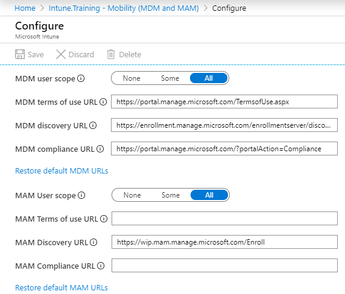
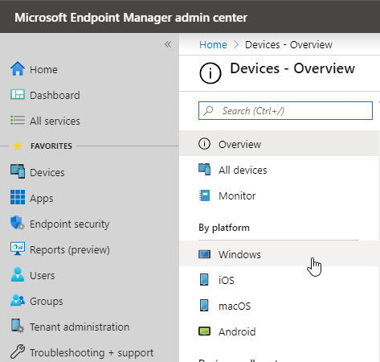

## Purpose

The following blog posts will be a companion guide to Steve and Adam's Intune training videos found at [intune.training](https://intune.training) (this covers Episode 1 and 2) and will help you get Autopilot going in your environment. This guide assumes that you already have office 365 and azure configured. By the end of this guide you will have a working bare bones Autopilot configuration. This has been a major request from several people in the [WinAdmins](https://aka.ms/winadmins) community. I strongly recommend joining if you are not already a member!

## Why?

Why would you want to setup Intune? The benefit of setting up and deploying machines via Intune are quiet simple. You get a true zero touch deployment where your IT staff will no longer need to ever touch a device in order to get it configured. You can manage those devices from anywhere using the M365 Device Management Portal. Wipe, reset, and fresh start options are also available. You'll find a common theme throughout Intune is that if a device is having an issue simply reset it and be on your marry way. 

## Requirements

Who doesn't love trying to understand Microsoft Licensing? Here are the basic requirements you will need at least one of the following to get Intune started:

  * M365 Business 
  * M365 F1 
  * M365 A1-A3-A5 
  * M365 E3-E5 
  * Enterprise Mobility and Security E3-E5 
  * Intune for Education 
  * Azure Active Directory Premium (Required for Dynamic membership rules) 

## How does the process work?

I'm a big fan of pictures and I believe this one encapsulates the process quiet well.<figure class="wp-block-image size-large">

 </figure> 

## Configuration

  Now before you go moving sliders and configuring things I want to stress that <strong>you should do this in a dev environment</strong> to begin with. I am not responsible for you messing your production environment up!

### Company Branding

The first thing we are going to tackle is is branding.  
Navigate to [portal.azure.com](http://portal.azure.com) and open up your Azure Active Directory resource. Company branding can be found under the Manage section on the left hand side. If you have never configured Company branding you will see a Configure option, select it. Fill in the desired fields. In our case we filled in Banner Logo, Username hint, Square logo image, and Square logo image dark theme. You will notice almost every option has a tooltip if you are curious what each option does. The below is our current configuration:<figure class="wp-block-image size-large">

 </figure> 

### Mobility (MDM and MAM)

If we look back at the left hand side of our Azure Active Directory blade you'll see Mobility (MDM and MAM) two steps above Company branding. You should see one application that being Microsoft Intune: 

 

  
Select Microsoft Intune all your sliders should be currently set to None. In order to get Intune and Autopilot working we need to at the very least move the MDM slider to either Some or All. If you want to test with a specific set of users/devices select Some and select a group. In our environment we have ours set to All. For the vast majority of people setting All will not cause an issue as this just tells Intune which users/devices are allowed to register a device via the MDM.  
The MAM policy is not required but if you have any plans on ever using Azure Information Protection or BYOD (Bring your own device) in your environment you'll want to have this enabled. Again set to a specific set of users or all based on your preference.  
The following is our completed Configuration. 

 

### Device Enrollment

Navigate to the [MEM admin center](http://devicemanagement.microsoft.com) and login with your azure credentials if prompted. On the left hand side select Devices under Favorites. A new blade will pop out and you'll want to select Windows. <figure class="wp-block-image size-large">

 </figure> 

Next select Windows Enrollment under Windows Devices.<figure class="wp-block-image size-large">

 </figure> 

The first time you select this you will need to choose an MDM Authority. Since we are using Intune we will select the first option Intune MDM Authority. Once we have this configured we can create a Deployment Profile Located under Windows Autopilot Deployment Program.<figure class="wp-block-image size-large">

 </figure> 

  1. Select + Create Profile at the top
  2. Give it a unique name and description so you won't forget what this specific profile is for 
  3. I leave convert all targeted devices to Autopilot ticked in the NO position
  4. Select Next  
    Intune will have several options already pre-configured. Depending on how you'd like your Autopilot configured I'd recommend hovering over the info icon for each step, however I will go over my current selections. 
  5. In this case it's going to be a standard User-Driven deployment 
  6. Azure AD Joined (If you're worried about not being able to access on-prem resources IE files and printers I will have a blog post up at some point on how to setup hybrid key trust otherwise visit [Adam and Steve's video](https://www.youtube.com/watch?v=GfYOyFMc8vA&t=2769s) on how to set it up)
  7. MS License Terms set to Hide
  8. Privacy settings set to Hide
  9. Hide change account options set to Hide
 10. User account type set to Standard
 11. Allow White Glove OOBE set to YES (I will go over this in another blog post)
 12. Language Region set to English
 13. Automatically configure keyboard set to NO
 14. Apply device name template set to No  
 
 15. Select Next
 16. Assign a group that this should be applied to in my case I have a group called Intune-Prod
 17. Select Next
 18. Review your options and select Create

### **Testing the Configuration** 

Now that we have the above complete we can actually test Autopilot! First we need to download the profile we created. To do so we will have to do a few quick powershell commands 

  <pre class="CodeMirror" data-setting="{&quot;mode&quot;:&quot;powershell&quot;,&quot;mime&quot;:&quot;application/x-powershell&quot;,&quot;theme&quot;:&quot;default&quot;,&quot;lineNumbers&quot;:true,&quot;styleActiveLine&quot;:true,&quot;lineWrapping&quot;:true,&quot;readOnly&quot;:false,&quot;language&quot;:&quot;PowerShell&quot;,&quot;modeName&quot;:&quot;powershell&quot;}">Install-Module -name WindowsAutoPilotIntune
Connect-MSGraph</pre>

You will be prompted to specify your UPN. Supply the UPN and signin. You will be prompted with a Permissions requested screen (This ties in with the Microsoft Graph). Check the Consent on behalf of my organization box and select Accept.

  <pre class="CodeMirror" data-setting="{&quot;mode&quot;:&quot;powershell&quot;,&quot;mime&quot;:&quot;application/x-powershell&quot;,&quot;theme&quot;:&quot;default&quot;,&quot;lineNumbers&quot;:true,&quot;styleActiveLine&quot;:true,&quot;lineWrapping&quot;:true,&quot;readOnly&quot;:false,&quot;language&quot;:&quot;PowerShell&quot;,&quot;modeName&quot;:&quot;powershell&quot;}">$apppolicies = Get-AutoPilotProfile
$apppolicies | ConvertTo-AutoPilotConfigurationJSON | Out-File "C:\AutopilotConfigurationFile.json" -Encoding ascii</pre>

This will export the JSON file to your C directory. Please be aware if you have multiple policies all of them will be in the JSON file and you'll have to remove the ones you do not need otherwise you can specify which one to export via powershell. The filename must also be AutopilotConfigurationFile.json or it will not work in deployment. However at this point you should only have one profile. Once you have the JSON file you can test a deployment. In the example below you can see I have two deployment profiles:<figure class="wp-block-image size-large">

 </figure> 

To setup the deployment for testing I strongly suggest reading [Michael Niehaus's blog](https://blogs.technet.microsoft.com/mniehaus/2018/10/25/speeding-up-windows-autopilot-for-existing-devices/) on deploying via a task sequence he even includes a download for said task sequence. 

## **Congrats you have a bare bones Autopilot configuration!!!**

  

 
