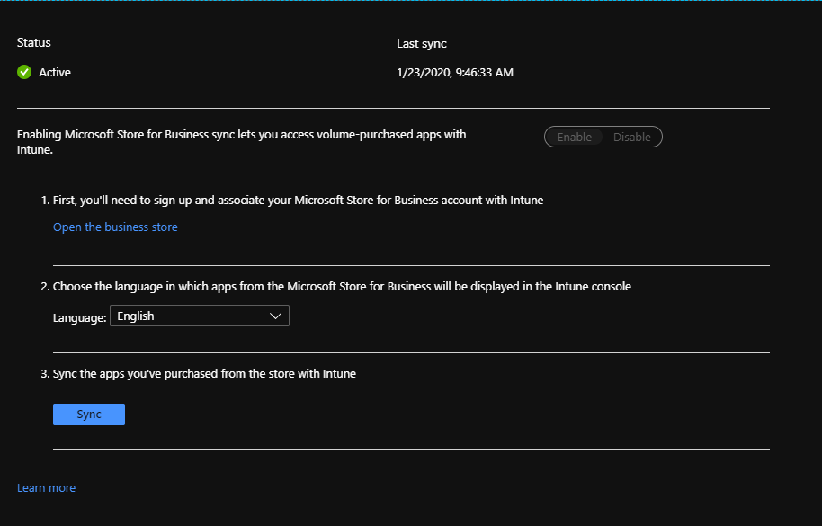
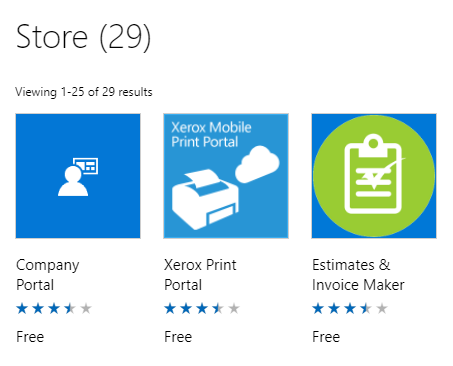

## Purpose

The following blog posts will be a companion guide to Steve and Adam’s Intune training videos found at [Intune.Training](https://intune.training/) (this covers Episode 3) and will help you get the Windows Store for Business (WSfB, also known as Microsoft Store for Business) setup in your environment. This guide assumes that you already have followed [Part 1](https://sysmansquad.com/2019/12/18/intune-autopilot-setup-companion-guide-part-1/) of this series and already have a working deployment profile. By the end of this guide you will have access to the Company Portal app and other apps of your choosing. This has been a major request from several people in the [WinAdmins](https://aka.ms/winadmins) community. I strongly recommend joining if you are not already a member! 

## Why?

Why do you need the WSfB? You need the WSfB in order to deploy the company portal app which is required in order to make other applications available for install. Please bear in mind if all you're going to do is deploy REQUIRED applications then you do not have to setup the Store for Business. However in this day and age we want our users to have a choice on what they want to install on demand and this integration allows us to make applications AVAILABLE for install.

## Enabling Windows Store for Business

Navigate to the[MEM admin center](https://devicemanagement.microsoft.com/) and login with your azure credentials if prompted.

  1. Select **Tenant Administration** on the left hand side
  2. Select **Connectors and tokens**
  3. The **Microsoft Store for Business** should be up by default
  4. Slide the slider to **Enable**
  5. Select **Open the business store**
  6. You will be brought to [Business Store](https://businessstore.microsoft.com/)
  7. Select **Sign in** in the upper right hand corner
  8. Select **Manage** at the top
  9. Select **Settings** on the left
 10. Select **Distribute**
 11. Scroll down to the Tool selection and select **Active** on the Microsoft Intune tool
 12. On the same page you can change the Private Store name if desired (You will not be able to do this until you have completed step 14)
 13. Click on **Private store** at the top (If you renamed your private store it will be that display name)
 14. A new page will load stating you need to activate the Store for Business, you can activate it by ticking the **check box** and hitting **activate**
 15. Navigate back to the **Connectors and tokens** tab
 16. Select your **Language**
 17. Select **Save**
 18. Hit **Sync**
 19. It should look similar to the image below<figure class="wp-block-image size-large">

 </figure> 

## What about the actual applications?

Now that we have a working WSfB connector lets add some applications! Please note the WSfB will periodically sync and grab the latest versions of the applications you've added. The manual sync button will force a sync. I'll walk you through getting the Company Portal app and PowerBI Desktop.

  1. Navigate to the **Business Store** tab
  2. Select **Shop** for my group
  3. On the right hand side in the **Search** the store type in Company Portal
  4. Select **Company Portal** from the list of available apps  
 
  5. Select **Get the app**
  6. A prompt will appear letting you know the app has been purchased and added to your inventory
  7. In the search bar type in PowerBI
  8. Select the **PowerBI Desktop app**
  9. Select **Get the app**
 10. Navigate back to the **Connectors and tokens** page
 11. Select **Sync**

Congrats you now have apps in your tenant!

 

## Okay, so now I have some applications but how do I deploy them?

Navigating back to the [MEM admin center](https://devicemanagement.microsoft.com/) you will see **Apps** listed on the left hand side. I'm going to walk you through getting those apps we just added deployed to users as well as some options.

  1. Select **Apps** on the left hand side
  2. Select **Windows**
  3. Select **Company Portal (Online)**
  4. Select **Assignments**
  5. Select **Add group**
  6. Change the assignment type to **Required**
  7. Select the desired group
  8. Select **OK**
  9. Hit **Save**
 10. Go back to Apps on the left hand side
 11. Select **Windows**
 12. Select **Power BI Desktop (Online)**
 13. Select **Assignments**
 14. Select **Add group**
 15. Change the assignment type to **Available for enrolled devices**
 16. Select the desired group
 17. Select **OK**
 18. Hit **Save**

Well that was pretty easy wasn't it? Now that we have the company portal deployed as Required every user in the group we selected will get the application. You'll notice for Power BI we only set it as Available for enrolled devices. In order to install this, a user would open the Company Portal app we deployed and under the Apps section they will see all the available apps, which at this point is most likely only Power BI Desktop. From this menu they can install the app.

## BONUS SECTION - Deploying the newest version of Edge

Who doesn't love a little extra icing on the cake? In this section I'll walk you through how to deploy the latest stable version of Edge. I highly recommend it! Please bear in mind this will replace the existing Microsoft Edge, and by replace I mean it will do a bunch of fancy redirects in the background. 

  1. Navigate to [MEM admin center](https://devicemanagement.microsoft.com/)
  2. Select **Apps** on the left hand side
  3. Select **Windows**
  4. Select **Add**
  5. The App type will be **Windows 10 (preview)** Located under Microsoft Edge, version 77 and later
  6. Click **App information**
  7. Give the app a name and description  
 
  8. Select **OK**
  9. Click **App settings**
 10. Change the Channel to **Stable**
 11. Select **OK**
 12. Select **Add**
 13. Navigate to the application
 14. Select **Assignments**
 15. Select **add a group**
 16. Select your **assignment type** (Required in my case)
 17. Select Include Groups
 18. Select the group or turn the sliders for **All users and devices** to YES

With that set you now have the new Edge! As always if you have questions or concerns please head over to the [WinAdmins][2] discord. The next post will go over Configuration Profiles and potentially PowerShell scripts!<figure class="wp-block-image size-large">

 </figure>

