 

This post is intended to help others who might want to better understand why their Operating System Deployment (OSD) task sequence (TS) is failing during the **Setup Windows and Configuration Manager** step with an error code of **[0x80004005](https://twitter.com/TheNotoriousDRR/status/1163132463843106818)** and how to identify the unsigned drivers in your driver package that might be causing it. Maybe my google-fu was failing me, but I didn't see anything else out there that was a guided tour with pictures through the old [Microsoft article](https://support.microsoft.com/help/2012889/configmgr-2007-windows-setup-fails-when-installing-drivers-during-an-c) on this issue. Admit it - sometimes picture guides are just easier, especially if you can ~~pass the task~~ _present a growth opportunity_ to a junior member of your team.

> _YES - Before you mention it - I recognize that I should be using[DART](https://github.com/AdamGrossTX/PowershellScripts/tree/master/ConfigMgr/BootImage)in my boot image so I can capture screenshots and not have to crop cell phone pictures, but I just haven't yet and I wanted to get this process documented_...  
> 
> 
> _[If I wait for perfectionism, then my procrastination and paralysis will kick in.](http://www.ravishly.com/you-arent-lazy-youre-just-terrified-paralysis-and-perfectionism-mental-health)_ 
> 
> **I reserve the right to revisit the post and replace images in the future.** 

## The Error

Okay ... your OSD task sequence just failed and the timer is started. You have 15 minutes, by default, to read the logs and find the bad driver before all of the OEM inf files are wiped from the x: drive! You could always click the link in the image caption below and learn how to extend the default timeout (courtesy of [Ami Arwidmark](https://twitter.com/AArwidmark)), but where is the fun in that?!

[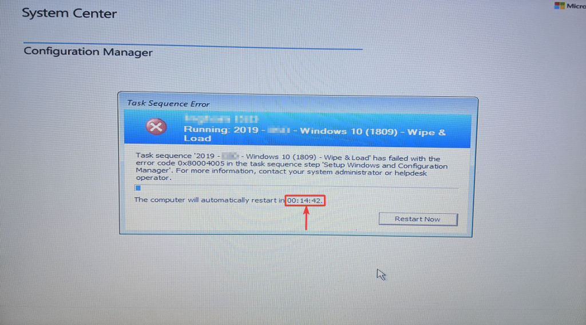](osd-fail-01-obs.png)
>"Hey Chris, you know you can [Extend the ConfigMgr Task Sequence Error Dialogue Timeout](https://deploymentresearch.com/extend-the-configmgr-task-sequence-error-dialogue-timeout/), right?"  
**Ooh, shiny! I should do that!**

## Ready, Set, Go

* You'll want to quickly open the Windows Setup logs from **x:\windows\panther\setupact.log**.

[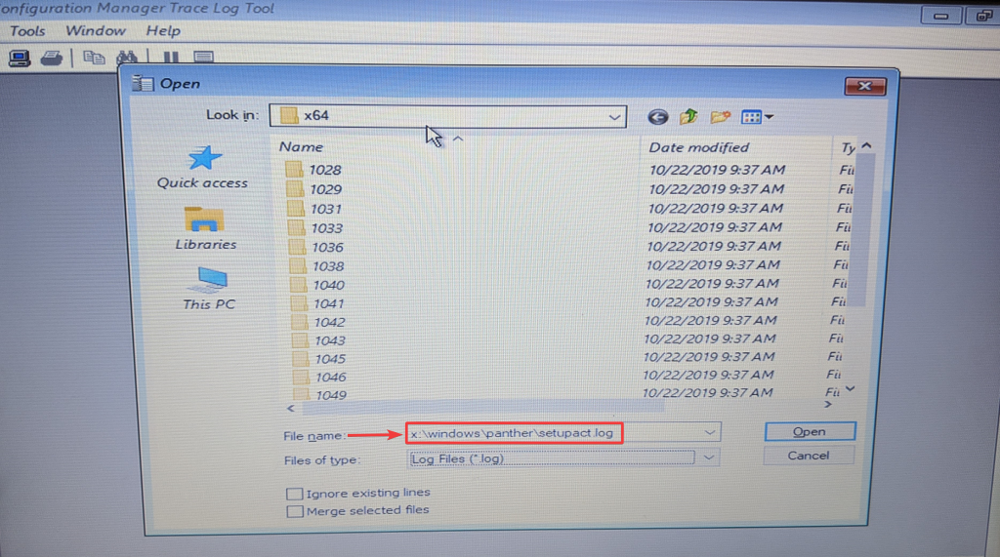](osd-fail-02-obs.png) This whole post is under the assumption that your boot image has [command support](https://docs.microsoft.com/configmgr/osd/get-started/manage-boot-images) enabled so that you can access the command prompt and run **CMTrace.exe**.

* Now, you'll want to scroll through the **x:\windows\panther\setupact.log** file until you reach the red section and a white line saying _"Windows Setup could not install one or more boot-critical drivers"_ and right above that you will see the last driver that Window Setup was trying to install. In this case it was **X:\WINDOWS\INF\oem184.inf**.

[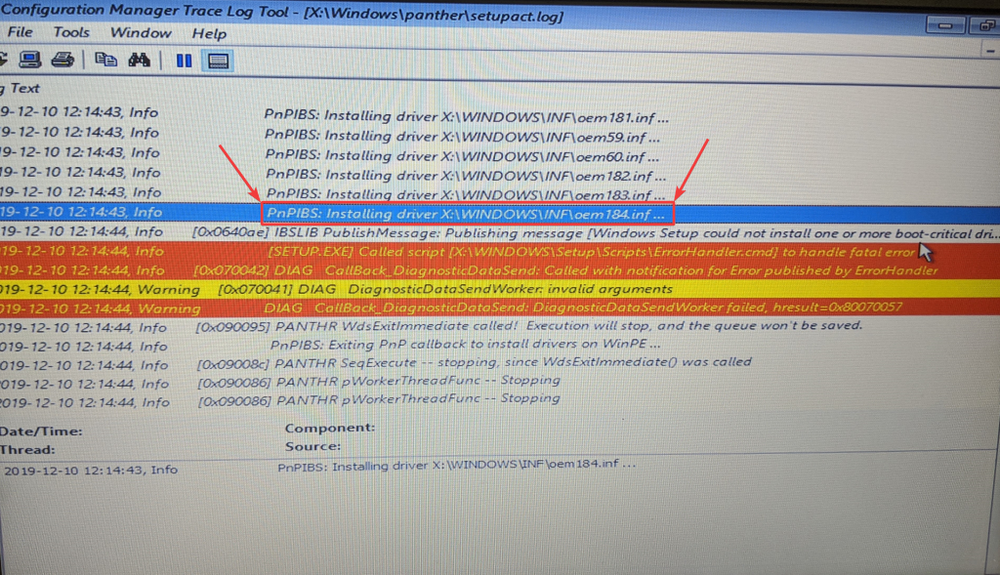](osd-fail-03-obs.png)_Stupid oem184.inf wasting my time..._

* Sweet! **CTRL-O** and type that path of **X:\WINDOWS\INF\oem184.inf** (using whatever oemxxx.inf file you found in your situation) to open the driver inf file and figure out what is causing you to go through this trouble...

[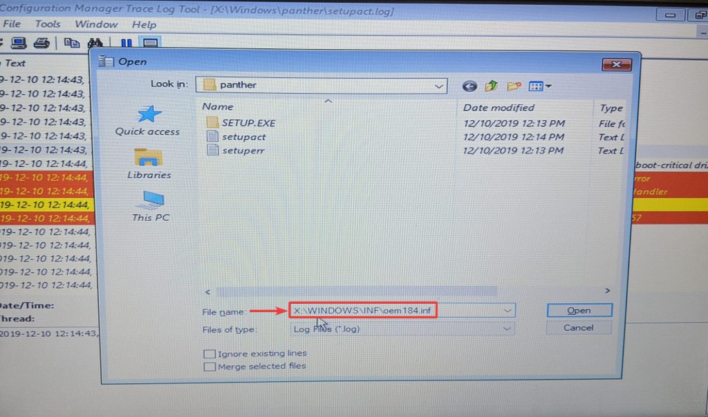](osd-fail-04-obs.png)</figure> 

* Now you could look for the driver name, but I've had the most luck looking for the **DriverVer** and in this case I was looking at a problem driver with a version of **8.3.1027.5567**. Off to the #MEMCM console so we can yank this thing out of the driver package...

[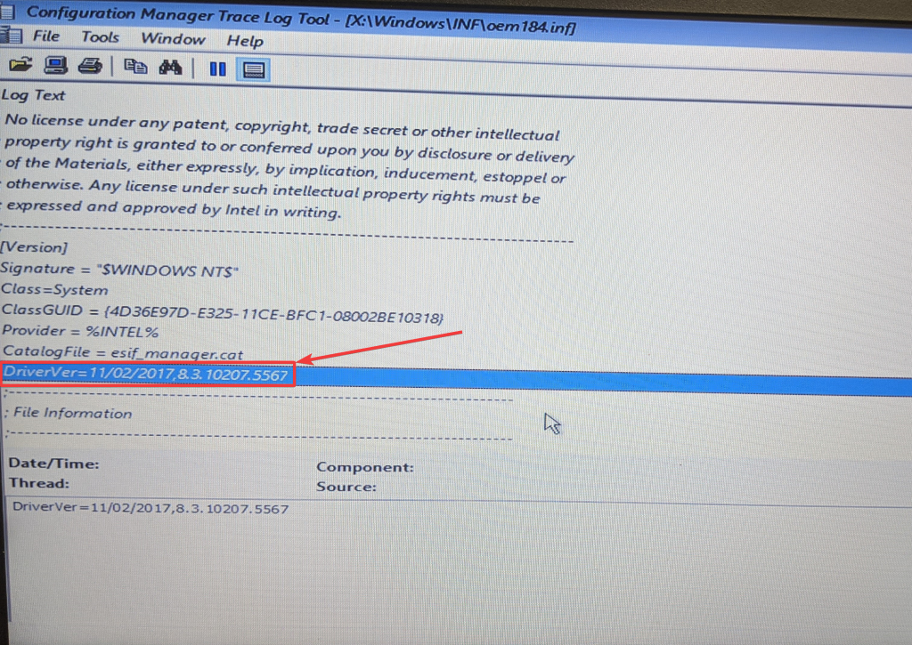](osd-fail-05-obs.png)

## To The Console

1. Open the driver package for the model of machine you're working with and search on the **DriverVer** you found in your **setupact.log** file. In my case it was **8.3.1027.5567**.  

2. I right click and disable the drivers before I remove them from the driver package, because ... honestly I'm not sure if they would get picked up later in Auto Apply. Generally I add a WMI query to the Auto Apply phase to exclude all models that I have a driver package for. However, as I expand the rights for driver management out to more than just myself, as I present growth opportunities to my colleagues, I can't say that will always be the case so I just disable it until I can look into it some more.

3. Then I will edit it out of the driver package.
[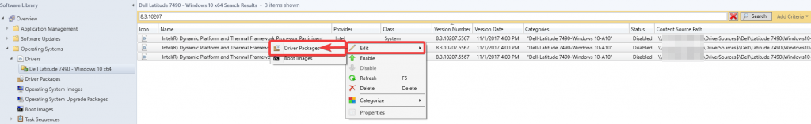](driver-removal-03-1.png)
4. Wait for it to load and scroll down until you see the driver package it's attached to, clear the checkbox and click OK.
[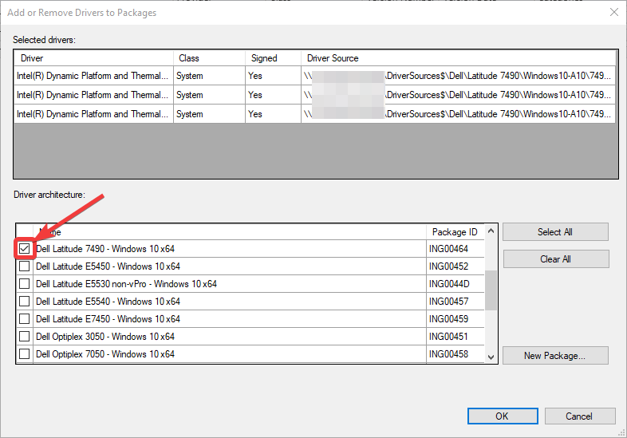](driver-removal-04-obs-1.png)
5. Allow the system to update your driver package for you.
[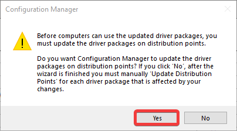](driver-removal-05-1.png)
6. Make note of the time you start this. No sense testing OSD again until you're sure the package is ready.

7. Once the driver package is updated (pay no attention to the time stamp I got distracted at work) test OSD and hopefully you'll be back in business on that model.
[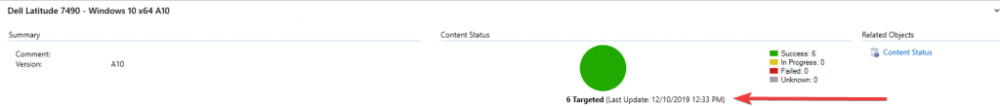](driver-removal-07-1.png)

## Woot - We Can Image Again

Now ... I was already planning this post in my head - I had all the screenshots, but hadn't made time to put it all together - then my friend [Chris Buck](https://twitter.com/SCCMF12TWICE) who runs [https://sccmf12twice.com/our-blog/](https://sccmf12twice.com/our-blog/) (_go check out all the cool things our community is sharing!_) made this comment below on Twitter and I felt compelled to get this out before I lose my enthusiasm. This post is out later than I planned, but Cub Scout Pinewood Derby and Blue & Gold prep took priority. Speaking of which ... I love my new Leader and his analytical mind ([https://www.joshuastevens.net/blog/pinewood-nerdy-statistics/](https://www.joshuastevens.net/blog/pinewood-nerdy-statistics/))!

There are many different ways that people choose to handle drivers - like standard packages as Chris Buck mentions and we see examples of that in [Mike Terrill](https://twitter.com/miketerrill)'s **[Dynamic Drivers and BIOS Management](https://miketerrill.net/2017/09/10/configuration-manager-dynamic-drivers-bios-management-with-total-control-part-1/)** solution and then there is [Maurice Daly](https://twitter.com/modaly_it) and [Nickolaj Andersen](https://twitter.com/NickolajA)'s **[Modern Driver Management](https://www.scconfigmgr.com/modern-driver-management/)** solution which is what I'm working toward. There is also a very vocal person in the [#WinAdmins](https://www.winadmins.chat/) discord that insists Auto Apply is the only way to go, but I still have little trust. Do what works well for you and your organization.

Personally, I work in K-12 public education and in particular my organization currently has contracts to support several other local school districts for full IT services. With this comes the challenge of what many private sector admins take for granted ... this mythical creature I've heard people refer to as "standardization" and "lifecycle replacement". That's why I created ... [http://tiny.cc/WhyIDrink](http://tiny.cc/WhyIDrink) and went and used [Ebag333](https://twitter.com/Ebag333)'s [BurnDriverDatabaseWithFire](https://github.com/winadminsdotorg/SystemCenterConfigMgr/blob/master/Scripts/Drivers/BurnDriverDatabaseWithFire.ps1) script out of the [#WinAdmins](https://www.winadmins.chat/) community [github repo](https://github.com/winadminsdotorg/SystemCenterConfigMgr/) to start fresh. If someone needs to image a machine we will evaluate if it still is of value to the schools and add drivers back as appropriate. I'm hoping this will allow me to focus on only doing 'modern management' on models that are necessary.

[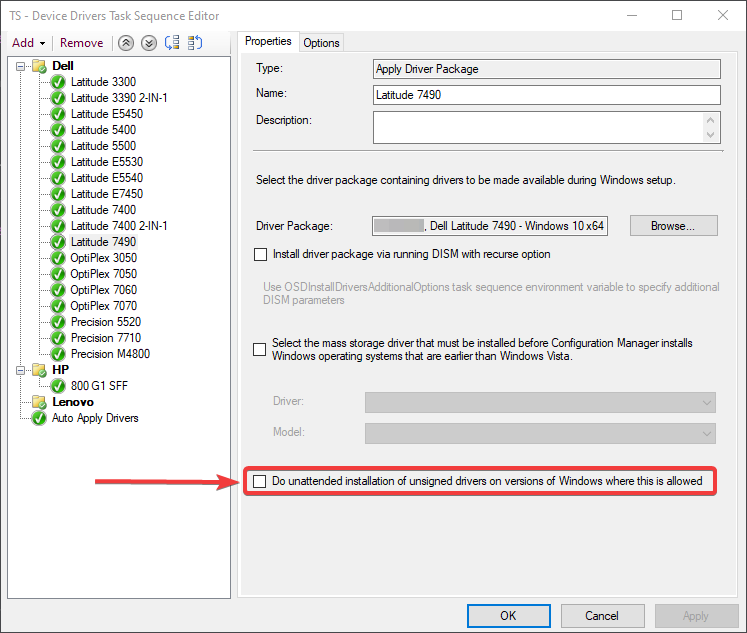](ts-driver-package-step-obs.png)_"Chris, you know they have a **[Do unattended installation of unsigned drivers on version of Windows where this is allowed](https://docs.microsoft.com/configmgr/osd/understand/task-sequence-steps)** option for driver packages, right? It's literally just a checkbox and you wouldn't have to do any of this..."_  
**I know ... but I don't want to check it. Why isn't it signed?!**</figcaption></figure> 

[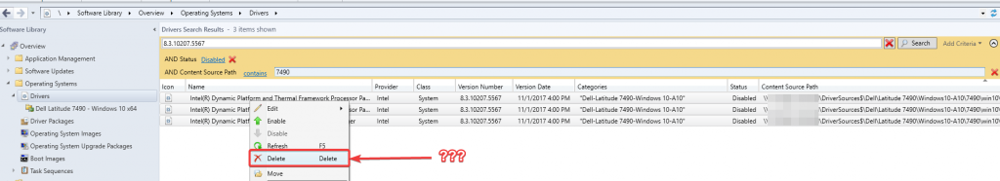](driver-delete-obs.png) *"Why don't you just delete the drivers, Chris?"*

In the words of, newly minted MVP, [Bryan Dam](https://twitter.com/bdam555) - "[If I was a better person...](https://damgoodadmin.com/2017/11/05/fully-automate-software-update-maintenance-in-cm/)" and had a _**growth mindset**_ (_my sons 5th grade teacher would be so happy to hear me parroting her words_) I would like to believe I may revisit this at some point to understand if these drivers are necessary or not. The realist inside tells me I probably won't though. In our testing it appears the devices work just fine and no drivers are reported missing in Device Manager. Good enough for now, we have tons of other work to get to. If we start receiving a spike in tickets for a particular model I can at least look at that list of disabled drivers to look for an OEM version. Sometimes that has to be enough, but I would love to get better and welcome any feedback on process improvement through email or Twitter. I hope this is helpful to someone in the future.

-Chris ([@AutomateMyStuff](https://twitter.com/AutomateMyStuff))
