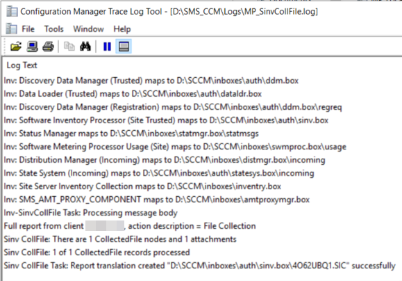
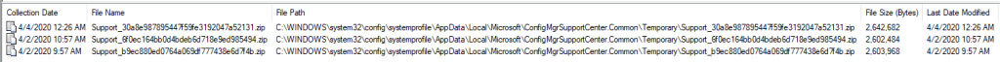
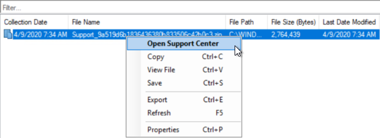
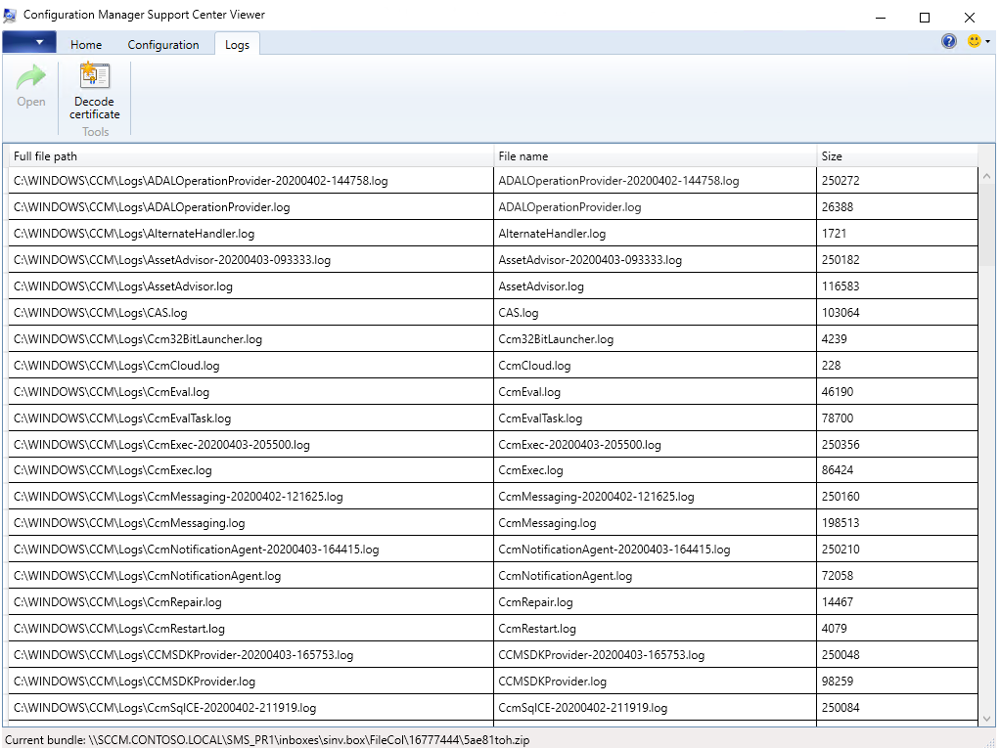

## What's New?

Starting in [MEMCM 2002](https://docs.microsoft.com/en-us/configmgr/core/plan-design/changes/whats-new-in-version-2002) there is an incredible new tool in the Client Notification tool bag. [Client log collection!](https://docs.microsoft.com/en-us/configmgr/core/plan-design/changes/whats-new-in-version-2002#client-log-collection)

This is a vital addition to the console. At first glance I thought... <figure class="wp-block-image size-full">

 </figure> 

But then the features full value was realized!

## Collecting Logs Over CMG

**Scenario:** Increasing remote workforce, no VPN, but that nifty CMG thing is in place. What does that imply? There is no SMB access to the client. WinRM is not going to work either. I kindly asked the user to zip up the c:\windows\ccm\logs directory, but instead I received a picture from their cellphone of the desktop with Software Center open. 

**Solution:** <figure class="wp-block-image size-large">

 </figure> 

## I Did It!!! I Clicked the Button!

But where the heck are the log files?? How do I even know that anything happened. WHEN is it going to happen?

Thankfully this tool uses the 'Fast Channel' within MEMCM. The action can expect to be started very quickly. Whether anything at all is even happening can be verified by checking the 'Diagnostics.log' on the client. Doesn't help us in the 'remote' scenario, but it is good to see in the proof of concept.<figure class="wp-block-image size-large">

</figure> 

What sticks out here is the MP_SinvCollFileEndpoint! Software Inventory??  
  
But, I'm sure we want to see this from the server side right? At least a glimpse into what is going on! Let's follow this to the Management Point. We can see the MP_SinvCollFile.log on the MP. <figure class="wp-block-image size-large">

 </figure> 

It looks like the Software Inventory components of MEMCM have been reworked a bit, and are being leveraged to collect log files! <figure class="wp-block-image size-large">

</figure> 

The bgbmgr.log, and bgbserver.log files, located on the Site Server will provide some insight into what is going on as well. Feel free to enable verbose logging to really dig in, but at a base level we do see our request being processed.  

The log files reveal that our request has started processing. A push request was processed, meaning the server put a note out there that this specific client has some work to do. From there, we end up with a file in our bgb.box inbox after the client does the work, and sends that note of 'work complete' up through an MP/CMG. The task was initiated, the client acted on it, and we have an inbox file. Worth noting, this happened in under a minute!

## When?!?

Soon enough... Real time in MEMCM time is like, a few minutes or less. Go grab a beer, or a smoothie. We work from home now folks. In the lab environment, this was pretty fast. Hopefully, in production it is NOT this fast. You shouldn't go drink a beer in under a minute. 

## Where?!?

Resource Explorer! It has an entire new section, labeled 'Diagnostic Files.' 

Pop open Resource Explorer on the client which logs were requested from, and there are some new options outlined below. <figure class="wp-block-image size-large">

 </figure> 

To expand on the 'where' question, we can see the 'File Path' column stating this data is being stored in the 'systemprofile' which is typically on the C: drive. That can't be where they really store all this!! <figure class="wp-block-image size-large">

</figure> 

It isn't... This is a temporary location, where the files will be accessible for you to interact with. The ACTUAL location of the file, as stored on the Site Server can be found by click the 'View File' context menu option.<figure class="wp-block-image size-large">

 </figure> 

What the 'View File' option reveals, is that these files are actually stored in your Inboxes on your Site Server. Specifically, <ConfigMgrInstallPath>\inboxes\sinv.box\FileCol\<ResourceID>. Each resource ID that has collected files will show up here as a subfolder, and you'll find zip files for each diagnostic file collection request. 

## Ahhh!!! That's Going To Fill Up The Site Server!

Yes... it absolutely could if left unchecked. This new feature prompts us to review a maintenance task that has likely been paid little mind if you aren't using Software Inventory in your environment, with file collection. This defaults to **90 days!!!** I can imagine 90 days of diagnostic log files, even when zipped, could get a bit large. You may want to review this maintenance task, and the disk space available on the drive that contains your inboxes.<figure class="wp-block-image size-large">

 </figure> 

Thanks to [@KrisTiteca](https://twitter.com/KrisTiteca) for pointing out that the files are store in the inbox!!

## Viewing The Log Files

What all this is for though is to actually _view_ the log files. There is a context menu option for 'Open Support Center' if you right click any of these new 'Diagnostic Files.'<figure class="wp-block-image size-large">

 </figure> 

From there, the sky is the limit. You now have the entire CCM\Logs directory from a remote computer that potentially never touched your domain. You can ignore the weird text message with a pixelated picture of the users screen. <figure class="wp-block-image size-large">

 </figure> 

Go support those people working from home!!!

[@CodyMathis123](https://twitter.com/CodyMathis123)

