- - -

* TL;DR:
  * Classroom-Meet integrated meeting links are safe.
  * Nickname Meet meeting links are safe.
  * Blank/Non-Nickname Meet meeting links **ARE NOT** safe.
  * Calendar generated Meet meeting links **ARE NOT** safe.

- - -

I'll start by saying that I recognize COVID-19 and it's impact on technology use in K-12 public education put many of us in a position of building the airplane as we're flying on it. Administration, Curriculum and Technology have been working hard in school districts around the world to quickly train and support staff and faculty using systems they may never have heard of before this situation. It can also be difficult to communicate expectations and best practices with teachers as the companies themselves are making changes while we're actively using their products.  
  
In addition, when the scope of the project continues to shift as we're building our airplane it can be hard to regain that focus on the overall situation. I took time this weekend to try and go over the recent changes and document how each different method of generating a Meet meeting link can interact with a student GSuite account.

  
  _Likely reaction of many teachers as they read this post..._

My hope is this post can serve as a reference when working with Tech Directors, Curriculum Directors or Teachers to help them understand the situation through screenshots. I'm also holding onto a slight hope that someone at Google will see this and find a way to protect 'blank, non-nicknamed or Calendar generated Meet meeting links' in the same manner that they have for all 'nicknamed and Classroom-Meet integrated Meet meeting links' which prevent students from joining a voice/video chat without a teacher present.

- - -

## Okay, I'm Intrigued, What's The Deal? 

**Scenario:** Teachers want the ability to engage their students in voice and video chat through Google Meet while under stay-at-home orders, but still want to keep their students protected from potential inappropriateness and cyber-bullying on school-approved systems while unsupervised.  
  
**Solution:** Communicate to your teachers on how to properly share Google Meet meeting links and/or bug your Google representative and ask them to please protect all teacher generated Meet meeting links regardless of the method used to create the link.

- - -

## Just Email The Teachers, What's The Problem?

I serve as the Desktop Engineer for an organization that supports 7 different school districts through contract and each of those school districts have their own politics and communication plans. All of them have a Google presence, even if they primarily use Office 365 for their email system.  
  
With this sudden shift to online learning the majority of our schools moved toward Google Classroom / Google Meet for all student-based interactions and that brought a whole lot more folks into using a tool that has been available for years, but rarely used by many depending on which school district you're working with.  
  
In a general sense we've had schools using Google Classroom for years and our Instructional Tech Coaches, Help Desk Technicians and Technical Support Specialists are all pretty comfortable being able to support Google Classroom, but we've never had requests for Meet so it's been off in all the districts until now.

- - -

## Let's Do Our Due Diligence And Set Up Google Meet Properly

As soon as Google Meet was requested and vetted - we enabled the service and read the Google recommendations for the '[Education IT administrator](https://support.google.com/meet/answer/9760270)':

Hey! That's me! I'm an Education IT administrator. 

In the "[Set up Meet for distance learning](https://support.google.com/a/answer/9784550)" guide, Google recommends only allowing 'Video calling' for staff and faculty.

[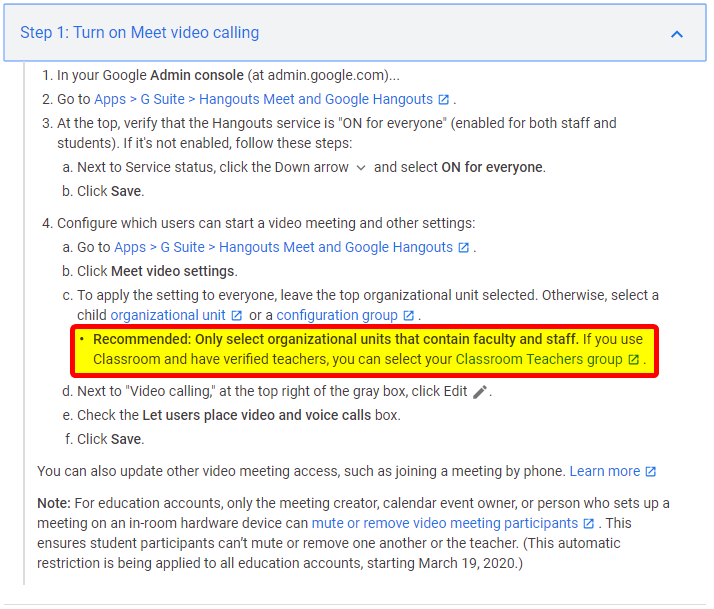](https://support.google.com/a/answer/9784550) 

Staff and faculty can now place voice and video calls. **Check!**

 

Students cannot place voice and video calls. **Check!**

 

- - -

## I Don't See A Problem, Chris. Students Can't Create Meet Meetings, What's The Concern?

True, students cannot create Meet meetings now that we've configured that setting. However, what about the links for Meet meetings that teachers share with students?  
  
Below I'm going to illustrate the issue as I understand it in the style of "[ImaNewbie](http://www.imanewbie.com/)" comics of my Ultima Online youth and at the end of the article you'll have access to a PDF version of this illustration that you can feel free to use if you want. Here's the thing though ... I'm so nerdy to pull that UO reference out and yet understanding how Google Meet links interact with student accounts based on how it was created has confused ME! I feel bad for all those teachers out there.

- - -

## First A Bit Of History

**March 19, 2020:**  
Google gives us an update over at the [GSuite Update Blog](https://gsuiteupdates.googleblog.com/2020/03/hangouts-meet-edu-updates.html) and they finally give us some educational protection on nicknamed meetings where participants (read: underage students) will not be able to re-join the meeting once the final participant has left. Prior to March 19th, students were able to re-join meetings without their teacher present.  
  
This was welcome news, but should be read carefully because words matter.

[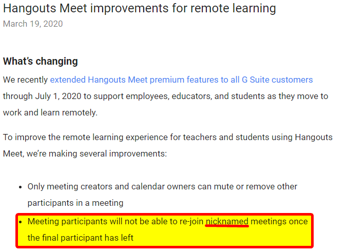](https://gsuiteupdates.googleblog.com/2020/03/hangouts-meet-edu-updates.html) 

If we read a little further they clarify: "_This means if the teacher is the last person to leave these types of meetings, students cannot join later without a teacher._"

[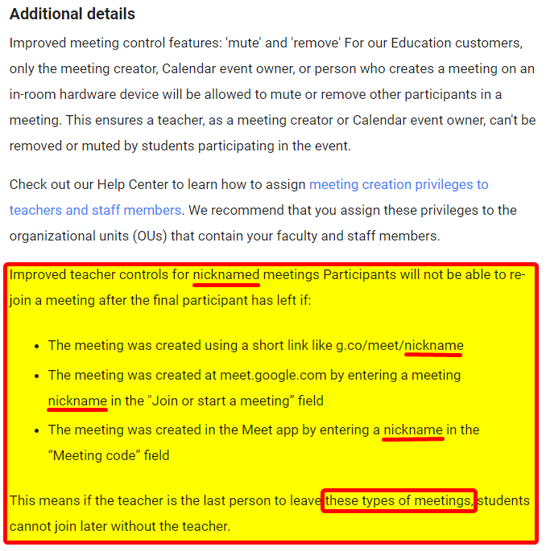](https://gsuiteupdates.googleblog.com/2020/03/hangouts-meet-edu-updates.html) 

**April 19, 2020:**  
Google gives another update over at the [Education Outreach Blog](https://www.blog.google/outreach-initiatives/education/meet-for-edu/) that they are integrating Meet inside Classroom with a nickname-like link with all the educational protections from March 19th.  
  
Awesome! One less thing to worry about!

 

If a teacher makes their way over to [Classroom Help](https://support.google.com/edu/classroom/answer/9776888) support site at some point there is a "_Manage participants in a video meeting_" section with a "_Prevent students from rejoining a meeting_" drop-down with guidance on removing students before ending a meeting.

[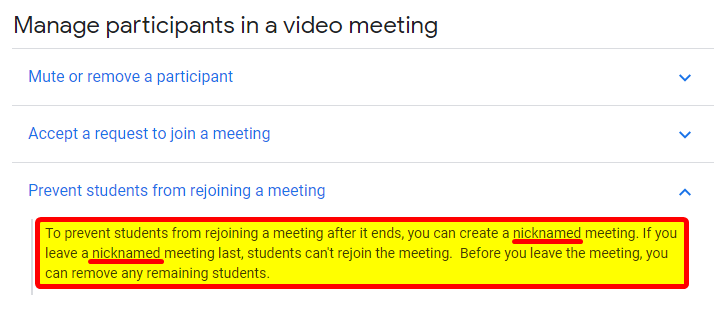](https://support.google.com/edu/classroom/answer/9776888) 

Wait ... what did they mean back there on March 19th with "these types of meetings"? What types of meetings?  
  
I guess it's time to [hack](https://twitter.com/NathanMcNulty/status/1253397931656241152)! (tag: [@NathanMcNulty](https://twitter.com/NathanMcNulty)) 

- - -

## Let's Meet The Cast

This is Demo Teacher who will be leading us through this exercise.

[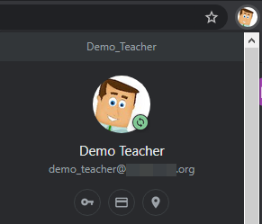](DEMO_TEACHER.png) 

When Demo Teacher is working with his students he has to be careful not to use his personal account. Even if you set aside the [FERPA](https://www2.ed.gov/policy/gen/guid/fpco/ferpa/index.html) concerns with personal account usage you only have the option to add a Google Hangout video conference which has a different feature-set than Google Meet.

 

If Demo Teacher doesn't already use [separate Google Chrome profiles](https://support.google.com/chrome/answer/2364824) for each email address, they should do that now! Then Demo Teacher can simply change profiles to keep his school account bookmarks, history, passwords and other settings separate from those of his personal account.

 

Demo Teacher has invited Demo Student to his Google Classroom. This is Demo Student.

 

- - -

## Let's Set The Scene

First things, first. Demo Teacher goes to his Class settings by way of the gear icon in the upper-right corner.

 

Demo Teacher clicks the "**Generate Meet link**".

 

This will generate a unique nickname-style link with educational protections that prevent students from rejoining the meeting after all participants have left. Demo Teacher is also going to make this link visible to students to ease their access to the service.

[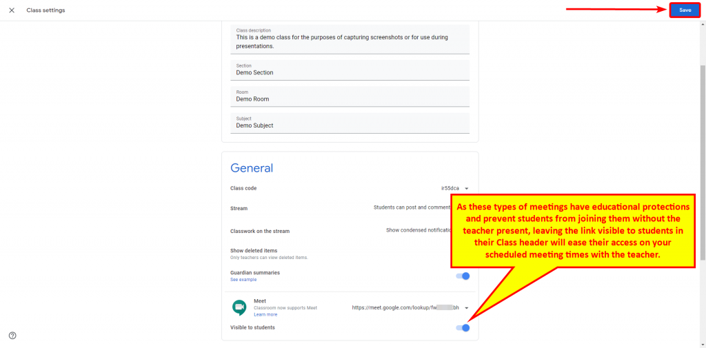](Classroom_Setup_03.png) 

Now Demo Teacher has a unique Meet link in his Demo Class header for all students to access when he is present in the Meet meeting room.

[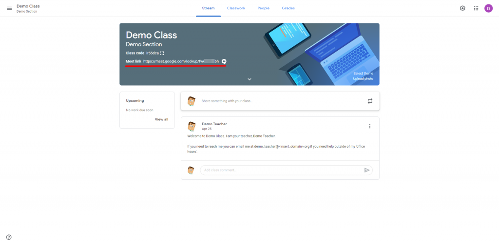](Classroom_Setup_04.png) 

- - -

## ... And Action!

Demo Student comes along and joins Demo Class and has a Classroom-Meet integrated nickname-like link visible in his class header.

[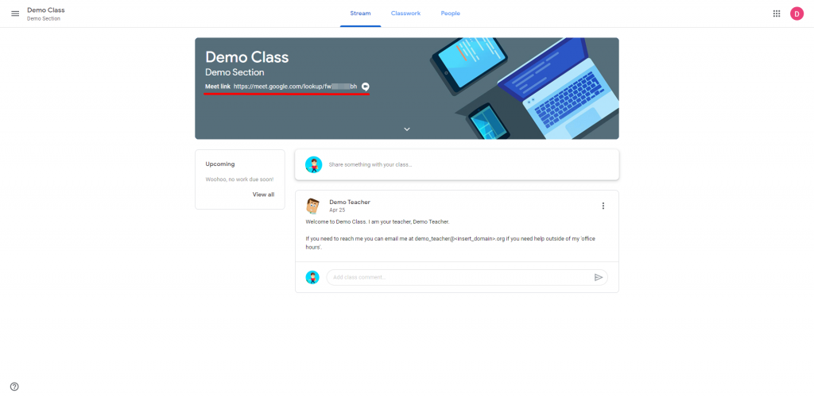](Classroom_Student_View_01.png) 

If Demo Student attempts to use that Classroom-Meet integrated meeting link when the teacher is not present in the Google Meet meeting space, they will be presented with the error message below encouraging them to reload when their teacher is present.

[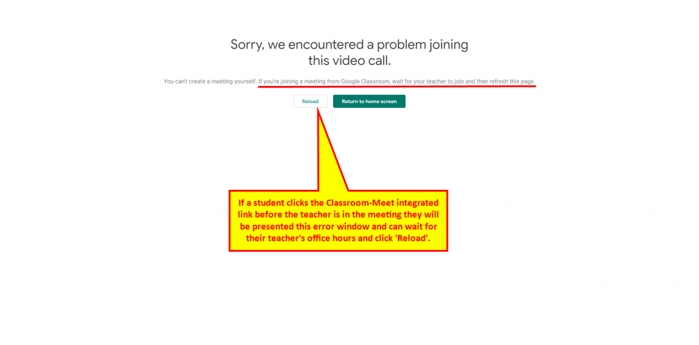](Classroom_Student_View_02.png) 

If the student clicks 'Reload' once their teacher joins the meeting they will be presented with the window below and they can join the meeting as well.

 

If the student decides to join the Meet while the teacher is present, then they can engage in voice and video chat with their teacher and other classmates.

[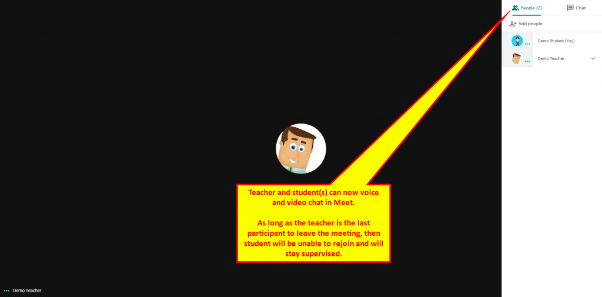](Classroom_Student_View_04.png) 

As long as the teacher is the last participant to leave, then the students will not be able to rejoin this type of meeting link without the teacher present. However, if the teacher leaves early while students still remain ... then students can stay in the space with voice and video chat unsupervised.  
  
Teachers should be vigilant about ensuring no participants remain before they exit a Meet meeting.

 

As soon as the last participant leaves, whether it's the teacher or a student, future students will be presented with the error below that they "_can't join this video call_".

[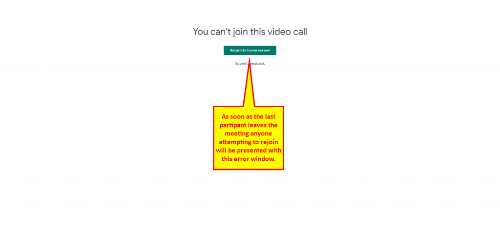](Classroom_Student_View_06.png) 

If Demo Teacher didn't want the Classroom-Meet integrated meeting link to be visible to students in the header they could instead post it to the classroom feed as shown below. It will function just the same as the link being in the header.

[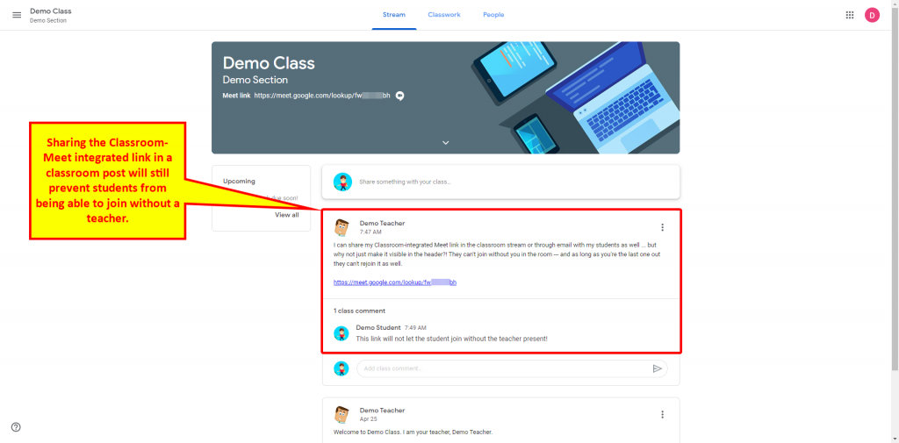](Classroom_Student_View_07.png) 

If Demo Teacher shares an impromptu or planned 'nickname' meeting they can share that 'nickname' with his students and they will not be able to join the meeting before he is present.

 

If Demo Teacher forgets his 'nickname' he used to create the meeting he could share the web address (URL) in the classroom feed as a post or in an email to students and they will not be able to join the meeting before he is present.

[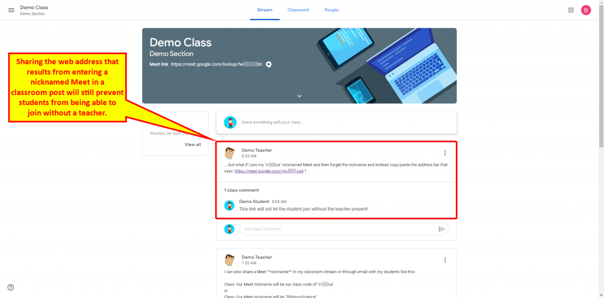](Classroom_Student_View_09.png) 

However, if Demo Teacher creates a blank, non-nickname Meet and shares that link with students they will be able to join the Meet link before the teacher is present and use voice and video unsupervised.

 

In addition, if Demo Teacher makes a Google Calendar appointment in an effort to keep themselves organized and adds a video conference option ...

 

... and then shares that Calendar generated link with students - those students will be able to join the meeting without their teacher present and use voice and video unsupervised.

[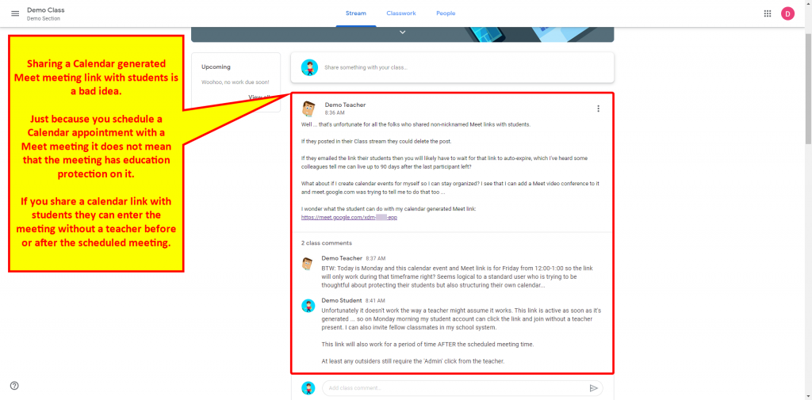](Classroom_Student_View_11.png) 

So, to reiterate and prove it with screenshots too ... If a teacher shares a blank/non-nicknamed or Calendar generated Meet meeting link with students then they will be able to join at any hour or day as long as that link is active with a participant.  
  
Students are smart and will often create bots for this need (see: [https://beulr.com/](https://beulr.com/) ).

[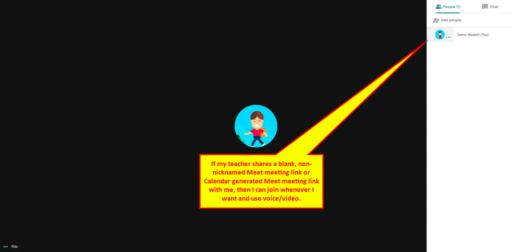](Classroom_Student_View_12.png) 

Not only that ... the student can share that link with other students in their same organization.  
  
They will. They will even try to share it outside their school system, but at least the teacher/creator is the only one who can click 'Admit' for external users. I assume most teachers will want to click 'Deny' unless they truly plan on having external users joining their session.

 

Moral of the story?  
  
Do not share blank, non-nicknamed or Calendar generated Meet meeting links with students.  
  
Only share nicknamed or Classroom-Meet integration Meet meeting links to protect the students and your school system.

[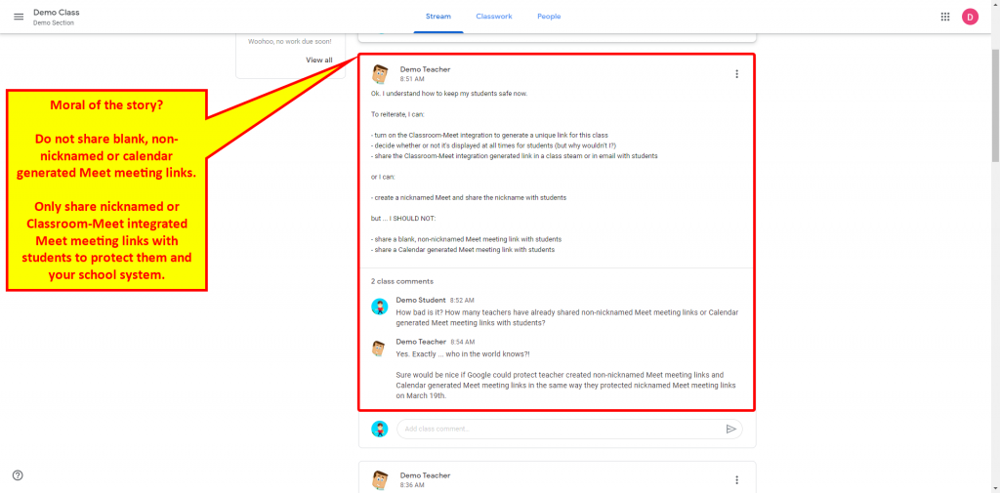](Classroom_Student_View_14.png) 

As promised, I made a PDF of the images along the way and it's over on [my github repo](https://github.com/chrisATautomatemystuff/Presentations/blob/master/UsingGoogleMeetSafelyWithStudents.pdf) if you want to use it.

-Chris ([@AutomateMyStuff](https://twitter.com/AutomateMyStuff))
