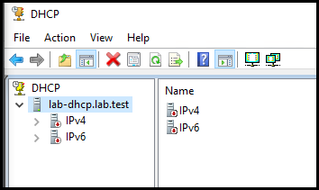

In [previous articles](https://www.sysmansquad.com/2020/01/23/net-102-build-your-lab/), we've built the basic services you need without getting too far in the weeds. Now we're going to layer in a central identity service.

It's also hopefully going to be a lot shorter than previous articles, though I can't make any promises - these things tend to all start small, then balloon rapidly.

If you're continuing from NET-102 you'll already have the following machines:

| Machine     | Description                                                 |
| ----------- | ----------------------------------------------------------- |
| gateway     | pfsense gateway functioning as a firewall & router          |
| lab-dns     | dns server                                                  |
| lab-dhcp    | dhcp server                                                 |
| workstation | windows 10 workstation with all of the RSAT tools installed |

Pretty simple so far, we just have the bare bones of a network. New devices placed on the network will get an address and be able to resolve hostnames. Now we'll want to expand on this to allow you to have a centralized set of credentials. This enables you to use the same user name and password across many machines without needing to create them on each machine.

At the moment, you don't really have a good way to just look at your configuration other than powershell commands if you followed instructions from NET-102. This obviously isn't optimal when you just need a quick look around, or need to get something done quickly. Some things like the DNS server console might connect OK from your admin workstation, but it's likely that nothing works quite right. If anything does work at all it may be because you've got the same username and password configured across all machines in your lab.

Warning: Before you continue, if you have given your admin workstation vm a network adapter on your real network, **make sure that it has NO default gateway and NO dns servers specified**. It should have a static address configuration, and look similar to the following:

```terminal
C:\Users\User1>ipconfig /all
Ethernet adapter Ethernet0:
   Connection-specific DNS Suffix  . :
   Description . . . . . . . . . . . : hardware description>
   Physical Address. . . . . . . . . : 00-00-00-00-00-00
   DHCP Enabled. . . . . . . . . . . : No
   Autoconfiguration Enabled . . . . : Yes
   IPv4 Address. . . . . . . . . . . : 192.168.0.40(Preferred)
   Subnet Mask . . . . . . . . . . . : 255.255.255.0
   Default Gateway . . . . . . . . . : <this should be blank>
   NetBIOS over Tcpip. . . . . . . . : Enabled
```

## Planning your AD environment

For an environment this small, it's going to be pretty simple. You merely need to decide on the AD domain name and set the IP addressing of the controller. In a larger network and environment you'd have to plan things like AD Sites & Services topology, scaling the number of controllers to the number of clients, redundancy, etc.

### **AD Information**

| Item | Value |
|------|-------|
| AD Domain Name | ad |
|AD FQDN | ad.lab.test |
|ADC IPv4 | 10.248.100.4 |
|ADC IPv6 | fdda:f6d4:f5a2:f1e6::4/64 |

Keep in mind that the AD domain name isn't changeable later without causing a large amount of headache for yourself. Keep it reasonably generic. You can certainly name it CONTOSOAD or whatever your company is named but keep in mind - company names change on occasion. Your company could rebrand, be acquired or acquire another company. This name will stick with you a long time, and is **always visible to all staff**, so don't try to be cute with it. You'll also probably find yourself typing it many times, so shorter is better.

It is also VERY important to make sure the fully qualified domain name is something your company OWNS. Even if you've set up your internal services to properly resolve that domain name, your machines will sometimes leave your network and spray authentication traffic toward whatever servers that name resolves to on the Internet. Obviously we're not following this good practice here, but it's a lab. Do better for production.

## Installing your first AD controller

Create a VM with ~2048MB RAM and a minimum 60GB disk space. By now you're acquainted with how to install a VM and choose a core install. You should also have a functioning DHCP server now, so your AD controller will start out with a valid DHCP-Provided IPv4 address. Use `sconfig` to configure the basic details like the hostname, IPv4 static address, patching, etc.

Set the IP address:

```powershell
# Change these to match the config in your documentation
$IPv6Address='fdda:f6d4:f5a2:f1e6::4'
$IPv6PrefixLength='64'
$IPv6Gateway='fdda:f6d4:f5a2:f1e6::1'
$IPv6DNSServer='fdda:f6d4:f5a2:f1e6::2'
$IPv4Gateway='10.248.100.1'
$IPv4DNSServer='10.248.100.2'
$FQDN='lab.test'

# Use our DNS server, then fall back to the gateway if the DNS server is offline
$DnsServerAddresses=($IPv4DNSServer,$IPv4Gateway,$IPv6DNSServer,$IPv6Gateway)

# Get the adapter 
$Adapter=(Get-NetAdapter)[0]
Set-DnsClient -InterfaceIndex $Adapter.ifIndex -ConnectionSpecificSuffix $FQDN
# turn off DHCP
Set-NetIPInterface -Dhcp Disabled -InterfaceIndex $Adapter.ifIndex
# configure DNS client
Set-DnsClientServerAddress -InterfaceIndex $Adapter.ifIndex -ServerAddresses $DnsServerAddresses

# Create the IPv6 config, create the address
$IPv6Arguments =@{
    InterfaceIndex = $Adapter.ifIndex
    PrefixLength = $IPv6PrefixLength
    IPAddress = $IPv6Address
    DefaultGateway = $IPv6Gateway
    AddressFamily = 'IPv6'
    Type = 'Unicast'
}
New-NetIPAddress @IPv6Arguments
```

Then you'll need to install the domain controller.

```powershell
$SafeModeAdminPassword='P@ssw0rd2' # Change this. 
$DomainName = 'ad.lab.test
Install-WindowsFeature AD-Domain-Services -IncludeManagementTools
# Install the domain with a very bad password for the safe-mode administrator
Install-ADDSForest -DomainName $DomainName -SafeModeAdministratorPassword ($SafeModeAdminPassword|ConvertTo-SecureString -AsPlainText -Force) -installDNS -Force
```

For bonus points, spot the obvious error I've left in this script to help you brush up on your powershell skills before you run it.

Obviously, you'll want to change the safe mode administrator password. Your AD controller will immediately reboot without asking when it's finished installing. You'll notice that this reboot takes a long time. This is expected behavior - there's a lot of work an AD controller does on first boot, and it'll pause at "Applying computer settings". You now have a functioning domain, but there's a little bit more to do. All of your clients are configured to use your main stand-alone dns server now, and it doesn't know how to tell them how to find your new AD domain so they can join.

Since your `dns` server is _authoritative_ for `lab.test`, you will create a "delegation" for the subdomain `ad.lab.test` to authorize your new AD controller to handle it's own dns records.

```powershell
#######################################################################################################
# Run this from your existing DNS server, not your AD controller, even though it too is a DNS server. #
#######################################################################################################
$ParentZone='lab.test'
$AdcShortname='adc'
$ChildZone='ad'
$IPv4Address = '10.248.100.4'
$IPv6Address = 'fdda:f6d4:f5a2:f1e6::4'

Add-DnsServerZoneDelegation -Name $ParentZone -ChildZoneName $ChildZone -IPAddress $IPv4Address -NameServer $AdcShortname -PassThru -Verbose
Add-DnsServerZoneDelegation -Name $ParentZone -ChildZoneName $ChildZone -IPAddress $IPv6Address -NameServer $AdcShortname -PassThru -Verbose

```

The delegation records now exist that will help your clients find your AD domain to join it. Now, using your `ad\administrator` credentials, you can join your new domain on each of your core installs through powershell:

```powershell
Add-Computer –DomainName 'ad.lab.test' -restart –force
```

After joining, you will be able to use your `ad\administrator` credentials to sign into any of your machines. If you don't already have the RSAT tools installed on your windows 10 workstation, you'll want to get that done before proceeding.

## Administrating a domain-joined DHCP server

Now, log into your windows 10 workstation using the `ad\administrator` credentials. You'll be able to use the dns console to connect over to the DNS servers and look through your zones. Next, open the dhcp console and let's take a quick look at the state of the DHCP service.



Windows DHCP servers that are NOT in a domain operate normally. Windows DHCP servers that are or have become joined to a domain do not operate until they have been **authorized**. Right click on the server name and authorize the server to allow it to continue to provide DHCP service.


After you have authorized the DHCP server to continue, refreshing will show that the DHCP server is now returned to service. If you expand the IPv4 and IPv6 nodes, you'll see the scopes we created earlier through powershell. given that everything in your lab so far should have a static address at the moment, you aren't likely to see any leases.

## User Management

You can use the "Active Directory Users and Computers" or "Active Directory Administrative Center" to create users inside your domain. Once the accounts are created, you'll be able to use any account you create to sign into your workstation and try out what you can do with a regular domain account vs. your `ad\administrator` account.

There are a number of security experts around that can give you a better run down of basic Active Directory security, but generally speaking you'll want to do your day-to-day activity as an account with **no special privileges**, and have a separate account that has privileges on workstations, servers, and domain controllers. Some companies mandate that you have one workstation admin account, one server admin account, and one domain administrator account.

## Summary

Now you have a workstation with all of the admin tools installed, dns and dhcp services, and a central identity server. You can look around under the Windows Administrative Tools folder on the start menu to see what else is possible.

Thanks for reading, and I hope you find it useful.
