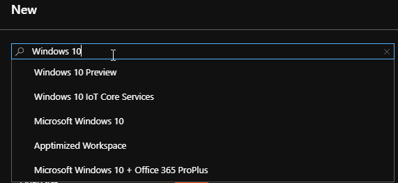
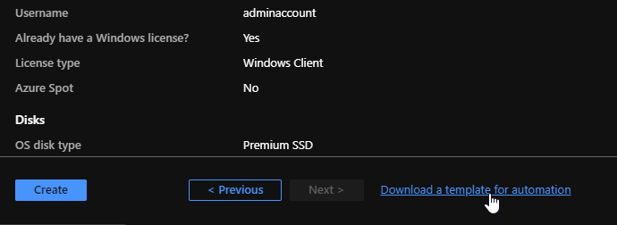

### Why would I use ARM templating, isn't the default Image Gallery fine?

Well first off, what is ARM Templating? According to Microsoft "_You can automate deployments and use the practice of infrastructure as code. In code, you define the infrastructure that needs to be deployed. The infrastructure code becomes part of your project. Just like application code, you store the infrastructure code in a source repository and version it..._" 

What does all that mean? You can go through the manual creation process of a resource, then at the end you have an option to create an ARM template based on all the settings you picked. You can then use this template to deploy the exact same resource in the future with the same settings. (Don't worry we can make it more dynamic and less rigid).

If you want zero customization aside from potential Group Policy, and all your applications will work with MSIX app attach, then the default Windows 10 multi-user image potentially is just fine for your needs!

### My original goal

I have an absolutely **horrible** java based application we have to support for a customer. The installation consists of downloading 5 files (10GB total) from an FTP site and running two installation files with very specific commands and the removal of a line in a properties file (HTTP port so that it can be used in multi-user mode). That all doesn't sound so horrible right? Well did I mention the update process involves uninstalling the program and doing it all over again, every two weeks none the less? 

Well I don't know about you - but creating a new azure VM, downloading the data files, installing the app, setting my customization options, and generalizing the image would take about 2-3 hours of manual work. So I did what any sane person would do, and figured out how to automate it!

This automation process involves using an ARM Template that deploys a new VM, installs "Horrible Java app", sets registry settings, and turns the VM into an image we can use for WVD deployments and then deletes the VM so all you're left with is a ready-to-go image that costs pennies to store!

### Lets get cracking

<span style="text-decoration: underline;">Before we start, I'd like to suggest you do this in a lab and not production (like I did</span>), and before you ask - this is, in essence, build and capture. Yes I know it's 2020 but sadly this is the reality we live in. 

We are going to have to create a few **resource groups**, a **key vault**, and a **storage account** to store all our info. (I should mention this is going to be a good old step by step with explanations on things scattered throughout)

### Creating our resource groups, key vault, and storage account

We are going to open Powershell as an Admin and install the required module to connect to Azure. Then we'll create a few resource groups to store our images, our secure passwords in a keyvault, and a storage account for our powershell scripts and other items we may need. Feel free to change the names and location as you see fit (Remember to keep location the same throughout).


```powershell
Install-module azaccount -force
Connect-azaccount
#Change to your desired location
$location = "centralus"
#Change to your desired name
$storageaccount = "contosokeystorage"
$keyVaultName  = ($storageaccount + ' vault')
$storageName = ($storageaccount + ' storage')
$upn = Read-Host -Prompt "Enter your user principal name (email address) used to sign in to Azure"
$secretValue = Read-Host -Prompt "Enter the desired virtual machine administrator password" -AsSecureString
$adUserId = (Get-AzADUser -UserPrincipalName $upn).Id
#Change to your desired resource group name
New-AzResourceGroup -Name "Contoso-MyImages" -Location $location
New-AzResourceGroup -Name $storageaccount -Location $location
#Creation of a storage account, we make this a standard drive as it's just for storage of files
New-AzStorageAccount -ResourceGroupName $storageaccount -Name $storagename -Location $location -Kind "storageV2" -SkuName "Standard_LRS"
#ARM template for creating a keyvault provided by Microsoft
$templateUri = "https://raw.githubusercontent.com/Azure/azure-docs-json-samples/master/tutorials-use-key-vault/CreateKeyVault.json"
#Creates keyvault and stores $secretvalue
New-AzResourceGroupDeployment -ResourceGroupName $storageaccount -TemplateUri $templateUri -keyVaultName $keyVaultName -adUserId $adUserId -secretValue $secretValue
```


After the last line you should see some output, you'll want to copy the value called _keyVaultId_ for later, it should look similar to this: 

`/subscriptions/<SubscriptionID>/resourceGroups/mykeyvaultdeploymentrg/providers/Microsoft.KeyVault/vaults/<KeyVaultName>`

### Adding files to our storage account

You might be wondering what we need a storage account for. We are going to be storing our powershell scripts in a secure fashion so they can be accessed during our deployment and we do that via a **SAS token**.

At this point you'll want to have your powershell scripts that you want to execute ready. You will need at least two, the first one is specifically for installing the modules you'll need. Why can't you just put it all into one script you might ask? During the process the machine will parse your entire script and verify it has all the resources and even though your first line has Install-Module "somemodule" it'll see farther down your script you have Something-somemodule "Do something" and say that it won't execute and fail.

Below is an example of the module install script I have. 


```powershell
Install-PackageProvider -Name NuGet -MinimumVersion 2.8.5.201 -Force
Install-Module -Name PSFTP -Force

./config.ps1
```


The next script is an example of my configuration script. 


```powershell
Try{
#DO ALL THE FANCY THINGS here like your reg changes, or whatever else.
#You can upload the FSLogix.exe to the storage account which we will go over below
#Start-Process -Wait -FilePath ./FSLogixAppsSetup.exe -ArgumentList "/quiet" -PassThru
#Reg add "HKLM\Software\FSLogix\Profiles" /v Enabled /t REG_DWORD /d 1 
#Reg add "HKLM\Software\FSLogix\Profiles" /v VHDLocations /t REG_MULTI_SZ /d \\server\share

}
catch {
    $ErrorMessage = $_.Exception.Message | Out-File -FilePath .\ErrorMessage.txt -NoClobber
    $FailedItem = $_.Exception.ItemName | Out-File -FilePath .\FailedItem.txt -NoClobber
}
finally {
    Write-Host "Success?"
}
#This will sysprep the machine, make sure it's the last step
Start-Process -FilePath C:\Windows\System32\Sysprep\Sysprep.exe -ArgumentList '/generalize /oobe /quiet /quit'  -Wait 
Stop-Computer -ComputerName localhost -Force
```


### Using the storage account

Now that our two scripts are ready lets upload them! Navigate to the resource group we created earlier in this case "Contoso-Key-Storage"

  1. Select the storage account
  2. Select **Containers**  
     ****
  3. Select **+ Container**
  4. Give your Container a name
  5. Leave Public access as Private
  6. Select **Create**
  7. Go into your new container
  8. Select **Upload**
  9. Select your two script files
 10. Select **Upload**
 11. Select the first file you uploaded
 12. Select **Generate SAS**
 13. For testing purposes I set an Expiry date a year from the current date
 14. Select **Generate SAS token and URL** 
 15. **Blob SAS URL** will appear below, copy this for later
 16. Repeat starting from Step 11 on the other file and any other files you might need such as FSLogix install exe

### Creating our ARM Template

  1. Login to <https://portal.azure.com/>
  2. Select a desired resource group or create a new one (Note nothing will actually get created in the group)
  3. Select **Add** 
  4. Type in "**Windows 10**" and select **Microsoft Windows 10 + Office 365 ProPlus**
  5. Select **Create** 
  6. Add a **Virtual Machine Name**
  7. Change **size** to desired VM (I recommend **Standard B2ms**)
  8. Add **Username, Password, Confirm Password**
  9. Change "Already have a Windows 10 Enterprise E3/E5 license or Window Virtual Desktop license?" to **Yes**
 10. Tick off the checkbox that appears
 11. Select **Next : Disks >**
 12. Select **Next : Networking >**
 13. This section can be adjusted as you see fit. I apply a Network Security Group but it's not necessary 
 14. Select **Next : Management >** 
 15. Change Boot Diagnostics to **Off**
 16. Select **Review + Create**
 17. Select **Download a template for automation** 
 18. Select **Download** in the top left

You should now have a template.zip with two files named parameters.json and tempalte.json you will want to extract these to a folder and open them both with a text editor. I recommend Visual Studio Code.

### Editing the template and adding PowerShell functionality

Now we are going to add all the extras to this template that let us dynamically change values and run powershell scripts from our storage account as well as pull our password from keyvault.

  1. Open both parameters.json and template.json
  2. In parameters.json change the "adminPassword" from  
    <span class="has-inline-color has-vivid-cyan-blue-color"><code>"adminPassword":{"value":null}</code></span>  
    to  
    <span class="has-inline-color has-vivid-cyan-blue-color"><code>"adminPassword": {br>"reference": {br>"keyVault": {br>"id": "THE KEYVAULTID ID YOU COPIED EARLIER"br>},br>"secretName": "vmAdminPassword"br>}</code></span>
  3. Change the id to the KeyVaultID you copied earlier
  4. The rest of parameters.json can be left as is, you can override these values later in our execution script if desired
  5. Open template.json
  6. Do a search for **enableAutomaticUpdates** change the value to **false**  
    `"enableAutomaticUpdates":false,`
  7. A few lines down you will see `"licenseType":"Windows_Client"`  
    `}`  
    add the following after (Make sure it's after the bracket)


```powershell
        },
        {
  "type": "Microsoft.Compute/virtualMachines/extensions",
  "apiVersion": "2019-12-01",
  "name": "[concat(parameters('virtualMachineName'),'/', 'InstallNavigate')]",
  "location": "[parameters('location')]",
  "dependsOn": [
      "[concat('Microsoft.Compute/virtualMachines/',parameters('virtualMachineName'))]"
  ],
  "properties": {
      "publisher": "Microsoft.Compute",
      "type": "CustomScriptExtension",
      "typeHandlerVersion": "1.7",
      "autoUpgradeMinorVersion":true,
      "settings": {
        "fileUris": [
          "URLTOCHANGELATER",
          "URLTOCHANGELATER2"
        ],
        "commandToExecute": "powershell.exe -ExecutionPolicy Unrestricted -File moduleinstall.ps1"
      }
  }
```


You will notice under fileUris we have two URLTOCHANGELATER items on lines 17 and 18, we are going to change that to the two SAS token URLs you copied earlier. You can add more URLs with a comma for things like the FSLogix installation exe. On line 20 you will want to change the -File to match the name of your moduleinstall script.

So what exactly does adding those URLs do? Well they download the files from the respective URL. In this case we are downloading the moduleInstall.ps1 and config.ps1. After that we are executing a command to run moduleInstall.ps1.

### Lets recap

I want you to take a deep breathe as you've done a lot so far.

You created a few resource groups, a key vault, storage account, an ARM template file, and two powershell scripts and that's awesome!

### Making the magic happen

Below I will be posting the script I use to make the magic happen. It will connect to azure, ask you for an image name, the destination resourcegroup which in this case is "Contoso-MyImages" if you've copied word for word. The script creates a temporary resource group, creates our VM, converts it to an image, and cleans up the temporary resource group which includes our VM. The result is a new Image located in Contoso-MyImages. You can then use this image to create a WVD Host Pool.

This can be changed to meet your preferences. You'll notice on lines 16-18 I specified a virtualMachineName, networkInferfaceName, publicIpAddressName, all three of these items have a default, and can be found in our parameters.json - however by defining them in our script I'm overwriting the default values to give us a bit more flexibility. 


```powershell
Connect-azaccount
$vmName = "TempMachine"
$imagename = Read-Host -Prompt 'Input a unique image name'
Do {
  $imageLocation = Read-Host -Prompt 'Input the destination resourcegroup NOTE: must exist'
}
Until (Get-AzResourceGroup -Name $imageLocation)
$location = "centralus"
$resourceGroupName = "TempResourceGroup"
New-AzResourceGroup -Name $resourceGroupName -Location $location
$filePath = "CHANGE TO YOUR PATH THAT CONTAINS THE TEMPLATE AND PARAMETERS FILE"
New-AzResourceGroupDeployment `
    -ResourceGroupName $resourceGroupName `
    -TemplateFile "$filePath\template.json" `
    -TemplateParameterFile "$filePath\parameters.json" `
    -virtualMachineName $vmName `
    -networkInterfaceName ($vmName + 'Nic') `
    -publicIpAddressName ($vmName + 'ip')

$vm = Get-AzVM -ResourceGroupName $resourceGroupName
Stop-AzVM -ResourceGroupName $resourceGroupName -Name $vm.name -Force
Set-AzVM  -ResourceGroupName $resourceGroupName -Name $vm.name -Generalized
$image = New-AzImageConfig -Location $location -SourceVirtualMachineId $vm.Id
New-AzImage -Image $image -ImageName $imagename -ResourceGroupName $imageLocation

Get-AzResourceGroup -Name $resourceGroupName | Remove-AzResourceGroup  -Force
```


Resources:  
<https://docs.microsoft.com/en-us/azure/azure-resource-manager/templates/template-tutorial-use-key-vault>  
<https://docs.microsoft.com/en-us/azure/storage/common/storage-account-create?tabs=azure-powershell>  
<https://docs.microsoft.com/en-us/fslogix/install-ht>
