
 

  

    

      Table Of Contents
    

  

  
  

    <ol class="uagb-toc__list">
      <li class="uagb-toc__list">
        [Update 2021-02-16](#update-2021-02-16)<li class="uagb-toc__list">
          [1) Start menu search does not work](#1-start-menu-search-does-not-work)<li class="uagb-toc__list">
            [2) The "InstallLanguage" issue](#2-the-installlanguage-issue)<li class="uagb-toc__list">
              [3) Not enough translation](#3-not-enough-translation)<li class="uagb-toc__list">
                [Update 2020-07-29](#update-2020-07-29)</ol> 
 
 
 

                
                

                  For a while I have been curious on how to do Windows OSD with multiple languages "the proper way" using Configuration Manager. Whenever I have approached the subject I have always felt overwhelmed.
                

                
                

                  Googling the topic is just a hot mess. You're faced with information that's old, lacking real detail or generally misunderstood. My aim here is to demystify the topic and show you a solid way to do Windows 10 multi language OSD with ConfigMgr along with sound reasoning.
                

                
                

                  I'll also touch on how to deploy languages via the Software Center and discuss what's improved in Windows 10 version 2004.
                
<section class="wp-block-uagb-section uagb-section__wrap uagb-section__background-undefined uagb-block-ba570ddf">
                
                

                

                
                

                  <h4>
                    Update 2021-02-16
                  </h4>
                  
                  

                    I've written a new post [Multilingual Windows 10 20H2 OSD with ConfigMgr](https://sysmansquad.com/2021/02/16/multilingual-windows-10-20h2-osd-with-configmgr/) which walks you through the detail on how to do this with Windows 10 2004 and onwards.
                  

                  
                  

                    The new improvements negate the InstallLanguage issue. If you haven't read this post yet, it's still recommended to read it as it breaks down what Language Packs, Language Experience Packs, Language Interface Packs, and Features on Demands are. It also discusses what the InstallLanguage issue was.
                  

                  
                  

                  

                
</section> 
                
                

                

                
                

                  While researching I had questions like:
                

                
                <ul>
                  <li>
                    How and when do I install Language Experience Packs? What are they?
                  </li>
                  <li>
                    To change a system's language I need a Language Pack. So what's the difference between a Language Experience Pack and Language Interface Pack?
                  </li>
                  <li>
                    Why should I use one over the other?
                  </li>
                  <li>
                    If a Language Pack does the job, why do Language Experience Packs exist?
                  </li>
                  <li>
                    Why don't Language Experience Packs localise everything?
                  </li>
                  <li>
                    What are language specific Features on Demand and do I need them?
                  </li>
                  <li>
                    <strong>What on earth do I need to do to deploy Windows 10 as another language (completely localised for a user in their most comfortable language), without a million different ISOs on my Distribution Points and in my task sequence, and not screw with the InstallLanguage / default system language? (if you're not familiar with the "InstallLanguage" issue, you will be after you've read this)</strong>
                  </li>
                </ul>
                
                

                  That last question was my main driver for needing to learn this topic. I've spent many hours reading docs, blogs, messing around in my lab and putting this post together. I really hope it is useful!
                

                
                

                  Throughout examples I'll assume your OS media is something like en-us, the target language is fr-fr and we're deploying Windows 10 1909.
                

                
                <h2>
                  Difference between LP, LXP, LIP and FoDs
                </h2>
                
                

                  Language Pack (LP), Language Experience Pack (LXP), Language Interface Pack (LIP) and Features on Demand (FoD). For simplicity I'm just going to use acronyms from here on out.
                

                
                <h3>
                  Language Packs
                </h3>
                
                

                  These apparently used to come as <code>lp.cab</code> files in the "good ol' days". However more recently the naming convention is something like <code>Microsoft-Windows-Client-Language-Pack_x64_fr-fr.cab</code>. These are grabbed from VLSC or MSDN / Visual Studio Subscription in an ISO.
                

                
                

                  You'll see you can also download media for LXPs too, but these items are included just the "Language Packs" media too. For Windows 10 2004, there's no separate download in Visual Studio Subscription for LXP - all is included in one "Language Packs" media ISO.
                

                
                

                  <figure class="aligncenter size-large">[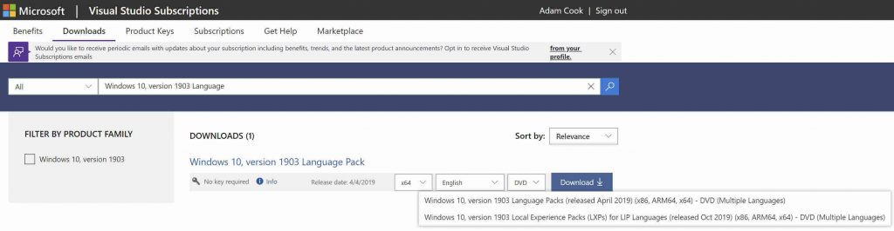](languagepackdownloadmsdn-scaled.jpg)</figure>
                

                
                

                  Microsoft offer 38 base / primary languages to choose from, so in other words you can get 38 ISOs of Windows 10 in 38 languages, and also 38 LP <code>.cab</code> files. Click the below to see what these 38 base / primary languages are:
                

                
                <ul>
                  <li>
                    [https://docs.microsoft.com/en-us/windows-hardware/manufacture/desktop/available-language-packs-for-windows#language-packs](https://docs.microsoft.com/en-us/windows-hardware/manufacture/desktop/available-language-packs-for-windows#language-packs)
                  </li>
                </ul>
                
                

                  It's good to know that Windows 10 supports 110 languages. 38 are possible via just LPs whereas the rest are achievable via LXPs (ignore the fact the table further down in that page reads Language Interface Packs and not Language Experience Packs, I'll get on to that later.)
                

                
                

                  To achieve full localisation of our target language during OSD, generally we install LP <code>.cab</code> files in WinPE (aka "offline") using <code>dism.exe</code> or <code>Add-WindowsPackage</code>. This step normally occurs after the <code>Apply Operating System</code> step and before the <code>Apply Windows Settings</code> step. An example command below:
                

                
                
                  <pre class="CodeMirror" data-setting="{"mode":"null","mime":"text/plain","theme":"default","lineNumbers":false,"styleActiveLine":false,"lineWrapping":true,"readOnly":true,"showPanel":false,"languageLabel":"no","language":"Plain Text","modeName":"text"}">dism.exe /Image:"%OSDTargetSystemDrive%" /ScratchDir:%OSDTargetSystemDrive%WindowsTemp /Add-Package /PackagePath=".Microsoft-Windows-Client-Language-Pack_x64_fr-fr.cab"</pre>
                
                
                

                  <figure class="aligncenter size-medium"><figcaption>Example step to install LP using dism.exe</figcaption></figure>
                

                
                

                  At this point, this isn't enough to localise the system as fr-fr. The next key bit is to configure the locale dropdown settings in the <code>Apply Windows settings</code> step as French.
                

                
                

                  <figure class="aligncenter size-medium"><figcaption>Example Apply Windows Settings step to adjust locale after LP install</figcaption></figure>
                

                
                

                  You have two options with the&nbsp;<code>Apply Windows settings</code>&nbsp;step. Either:
                

                
                <ul>
                  <li>
                    Use the new-ish&nbsp;[OSDWindowsSettings* task sequence variables](https://docs.microsoft.com/en-us/mem/configmgr/osd/understand/task-sequence-steps#BKMK_ApplyWindowsSettings). These set what you would otherwise select from the dropdown settings in the <code>Apply Windows settings</code> step.
                  </li>
                </ul>
                
                

                  <strong>OR</strong>
                

                
                <ul>
                  <li>
                    Have as many&nbsp;<code>Apply Windows settings</code>&nbsp;steps as you do languages and select the locale options you want in the dropdown settings, then condition each step based on some criteria.
                  </li>
                </ul>
                
                

                  Either way, it's this <code>Apply Windows settings</code> step which populates elements in the unattend.xml answer file on the fly.
                

                
                

                  Configuring this step will give you a completely localised system as fr-fr. Windows startup, the logon UI, input locale, format, everything. Every element in the UI possible is localised to French.
                

                
                

                  Here is what the system will look like:
                

                
                

                  <figure class="aligncenter size-medium"><figcaption>Click me</figcaption></figure>
                

                
                

                  Looks good, right? Well, sadly not. Let's discuss the 3 drawbacks with this approach:
                

                
                <h4>
                  1) Start menu search does not work
                </h4>
                
                

                  You will find that the start menu search, and perhaps other things, just don't work unless you (re)install the latest cumulative update.
                

                
                

                  It is a [known documented fact](https://docs.microsoft.com/en-us/windows-hardware/manufacture/desktop/add-language-packs-to-windows#considerations) that if you install anything that is language specific, such as a LP, then the latest cumulative update will want to reinstall again.
                

                
                

                  Perhaps an option here might to be use an RTM ISO/WIM of Windows 1909, or at least one that's serviced to be n-1, with the anticipation that you will install the latest cumulative update in your task sequence. Of course this will increase build time, although if you're installing software updates during OSD anyway then it might not be a big deal for you to do that.
                

                
                

                  [The order of install matters](https://docs.microsoft.com/en-us/windows-hardware/manufacture/desktop/features-on-demand-v2--capabilities). First add LPs, FoDs and then apps in that order. If you install a cumulative update before any of those, then the update will want reinstalling.
                

                
                <h4>
                  2) The "InstallLanguage" issue
                </h4>
                
                

                  If you're not familiar with the InstallLanguage issue, then it's well explained in the below Ignite 2019 session at around 7:45:
                

                
                <ul>
                  <li>
                    [Solving&nbsp;Windows&nbsp;10&nbsp;feature&nbsp;updates&nbsp;in&nbsp;a&nbsp;multilingual&nbsp;deployment](https://www.youtube.com/watch?v=ZhL0AO8Cnig&ab_channel=MicrosoftIgnite) - Sudhagar Thirumoolan ([@sudhagart](https://twitter.com/sudhagart?lang=en))
                  </li>
                </ul>
                
                

                  In summary, the InstallLanguage issue is caused by what we just did by using en-us install media, installing fr-fr LP and then setting the System Locale to be fr-fr during Windows Setup (via unattend.xml / <code>Apply Windows Settings</code> step). It's symptoms are visible when you try to feature update Windows 10 using installation media which does not match the system language.
                

                
                

                  To reclarify exactly what causes the InstallLanguage install: take the scenario where if we install Windows, apply an LP to the image and change the System Locale to different langauge via configuring the <code>Apply Windows Settings</code> step like I've shown you, this will change the system language and create the InstallLanguage issue.
                

                
                

                  To identify a system which suffers with the InstallLanguage issue, you will find the <code>InstallLanguage</code> registry value in key <code>HKLM:SYSTEM\CurrentControlSet\Control\Nls\Language</code> set to <code>040c</code> (fr-fr) and not <code>0409</code> (en-us). Remember, my scenario throughout this post is to use en-us base install media, and attempt to localise the system as fr-fr.
                

                
                

                  After we've built a system like this, if we attempt to feature update it using en-us media <code>setupact.log</code> and [SetupDiag.exe](https://docs.microsoft.com/en-us/windows/deployment/upgrade/setupdiag) will both tell you:
                

                
                <pre class="wp-block-code"><code>Target language en-US is not compatible with the host language</code></pre>
                
                

                  Now what? Well your options are:
                

                
                <ul>
                  <li>
                    Use all the Windows medias in your in-place upgrade task sequence that match the InstallLanguage on machines in your estate. This could get bulky very quick, but it'll work.
                  </li>
                  <li>
                    Stop using in-place upgrade task sequences and use feature updates instead. This way you simply download, distribute and deploy all the feature updates in the languages that match the InstallLanguage on machines in your estate. This could also get bulky in storage as you'll need to download as many feature updates as you have languages in your estate.
                  </li>
                  <li>
                    Point your clients to Windows Update / Windows Update for Business instead, because it "just works". If your remote offices have their own leg out on the Internet, or WAN link speed isn't a concern, then I recommend you seriously consider this option.
                  </li>
                  <li>
                    This is most probably unsupported, but change the InstallLanguage registry value back to <code>0409</code> (en-us) and Windows will upgrade using en-us media. Just make sure en-us LP is definitely installed. Look in <code>HKLM:\SYSTEM\CurrentControlSet\Control\MUI\UILanguages</code> or check out <code>dism.exe /online /get-intl</code> (hey, don't shoot me, I'm just the messenger.)
                  </li>
                </ul>
                
                

                  Some of the above could be costly one way or another. It could mean more storage server side, more steps in your task sequence or saturated links. Take your pick. But maybe you're not happy with the options and you're convinced that there's got to be another way. Or maybe you need a little more translation than what's currently offered. In which case keep reading...
                

                
                <h4>
                  3) Not enough translation
                </h4>
                
                

                  Another problem with installing _only_ LPs is the limited translation support compared to the supposedly 110 languages available in Windows 10.
                

                
                

                  I know I said LP offers complete translation of the whole UI, which is true, however there are scenarios when you need further translation.
                

                
                

                  A good example of this is [this Twitter thread I had with Manel Rodero](https://twitter.com/manelrodero/status/1261359938481410048). Manel needs Windows 10 with Catalan language. The only Spanish options as far as base / primary languages go are es-mk (Mexico) or es-es (Spain).
                

                
                

                  This is where LXPs come in and why there is the concept of primary and secondary languages with Windows 10. Manel achieves Windows 10 localisation to Catalan using es-es base / primary language and then installs LXPs for Catalan which "tops up" the user experience with further, more specific, translations.
                

                
                

                  So let's move on to LXPs, but first let's briefly mention LIPs.
                

                
                <h3>
                  Language Interface Packs
                </h3>
                
                

                  Not much to be said about these. Essentially all there is to it: LIPs are out, LXPs are in.
                

                
                

                  Starting with Windows 10 1803 LXPs were introduced and LIPs were deprecated. I think starting from 1809 you can no longer source LIPs, only LXPs.
                

                
                

                  All you do need to know is that LIPs provided partial translations to popular / common areas of the UI where LPs fell short.
                

                
                <h3>
                  Language Experience Packs
                </h3>
                
                

                  LXPs serve the same purpose as LIPs; they still provided partial translations where the LP fell short.
                

                
                

                  They are in <code>.appx</code> form and are continuously updated by Microsoft via the Store. You can download them for your task sequence from VLSC or your Visual Studio Subscription download portal. I think you can also export them from your Store for Business? But I don't know enough about that, sorry.
                

                
                

                  Since they're serviced via the Store, it means you get continuous delivery of translation improvements and beautiful peer caching with Delivery Optimization.
                

                
                

                  If you block the Store then you prohibit your devices and users from receiving translation improvements.
                

                
                

                  Users can also submit translation feedback via the Feedback Hub:
                

                
                

                  <figure class="aligncenter size-medium">[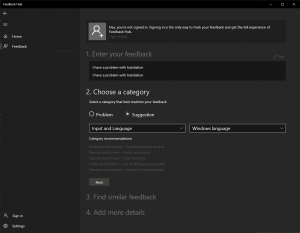](feedbackhubexample.png)<figcaption>Feedback hub where users can submit translation feedback to Microsoft, which Microsoft can quickly patch and deliver via the store</figcaption></figure>
                

                
                

                  You may think it's not a big deal if you block the Store, however when I built a task sequence to use LXP instead of LP, I observed some noticeable differences around Windows in testing before and after applying Store updates after OSD. I'll show you in a moment.
                

                
                

                  The process I followed to use LXP instead of LP in my task sequence was the same as demonstrated in a recent Microsoft PFE blog post:
                

                
                <ul>
                  <li>
                    [Windows&nbsp;10&nbsp;Multilanguage&nbsp;Deployment&nbsp;with&nbsp;MEMCM](https://techcommunity.microsoft.com/t5/premier-field-engineering/windows-10-multilanguage-deployment-with-memcm/ba-p/1347144)
                  </li>
                </ul>
                
                

                  The post is OK. I couldn't quite understand why we were only installing LXP, especially since LXP provides only partial translation. It makes sense if you're trying to get to Catalan from es-es base language, but from en-us to fr-fr or de-de, or any other, it's not ideal.
                

                
                

                  I was also disappointed and confused to see what it felt like a hack being used to set the default language to that of the LXP using <code>control.exe intl.cpl</code> and some weird undocumented parameters.
                

                
                

                  <strong>Note:</strong> this is not a dig at the author. I am hugely grateful for the community contribution. It offers excellent insight with examples. At this point I'm mostly expressing my frustration toward Microsoft for making the task seem like magic or voodoo, when it should be clear and logical.
                

                
                

                  The post suggests there's PowerShell cmdlets you can use instead to do the same as the <code>control.exe</code> method but on a per-user basis instead. [You can find them here](https://docs.microsoft.com/en-gb/powershell/module/internationalcmdlets).
                

                
                

                  If you're interested in pursuing the LXP and <code>control.exe</code> method then it might useful for you to know all the [Geo IDs](https://docs.microsoft.com/en-gb/windows/win32/intl/table-of-geographical-locations) and [language / region IDs](https://docs.microsoft.com/en-us/windows-hardware/manufacture/desktop/available-language-packs-for-windows#language-packs) too, which sadly were also not mentioned in the blog. These are needed for modifying the XML.
                

                
                

                  Nonetheless the post gives you an example on how to install LXP during OSD and make it the default language for new users.
                

                
                

                  Let me show you what a system looks like after OSD installing only LXP.
                

                
                

                  To clarify what I did in my task sequence: I followed the process in the aforementioned Microsoft PFE blog by installing only LXP and kept the <code>Apply Windows settings</code> locale options to en-us and used the <code>control.exe intl.cpl</code> method to change the users' default language.
                

                
                

                  When you see the screenshots of the TS at the end of this section, you may notice some minor differences e.g. local admin account instead of domain user account, and content-less scripts used instead of script files, etc. But generally, it's the same.
                

                
                

                  This is what it gave me:
                

                
                

                  <figure class="aligncenter size-medium"><figcaption>Click me</figcaption></figure>
                

                
                

                  I'll list the notables:
                

                
                <ul>
                  <li>
                    Start up, logon UI and first logon experience looks completely localised as fr-fr which is nice.
                  </li>
                  <li>
                    Some parts of the Windows UI <strong>are not</strong> localised: start menu app shortcuts, the pre-populated text in the start menu search, and the text in the calendar pane.
                  </li>
                  <li>
                    The Windows settings UI is partially localised. It may seem not localised in the image but in other areas of the settings I did see some translations, not many though. Also, you can see that the user can change back to "English (United States)" display language if they wanted to, which is nice.
                  </li>
                  <li>
                    The InstallLanguage registry value remained unchanged as en-us! Score!
                  </li>
                  <li>
                    PowerShell doesn't seem to be localised and <code>dism.exe</code> is a bit weird: some parts are English some parts are French.
                  </li>
                  <li>
                    The Microsoft Store is not localised at all, but <strong>there are a boat load of updates...</strong>
                  </li>
                </ul>
                
                

                  Remember when I mentioned I'll get to it about noticing a difference in translations before and after Store updates? OK so here's the difference of the exact same system as before, but I installed those boat load of updates from the Store:
                

                
                

                  <figure class="aligncenter size-medium">[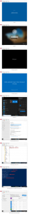](StoryBoard-LanguageExperiencePackUserExperience-afterstoreupdates.png)<figcaption>Click me</figcaption></figure>
                

                
                <ul>
                  <li>
                    Start up, logon UI and first logon experience looks no different: still localised.
                  </li>
                  <li>
                    Several improvements to the Windows UI in the start menu and calendar pane.
                  </li>
                  <li>
                    More or less the same mix of translations in the Windows settings UI.
                  </li>
                  <li>
                    As expected, no change to the InstallLanguage registry value.
                  </li>
                  <li>
                    Same experience with PowerShell and <code>dism.exe</code>.
                  </li>
                  <li>
                    The Microsoft Store is now completely localised.
                  </li>
                </ul>
                
                

                  After all that, it's clear that LXPs live up to their expectation: partial translation.
                

                
                

                  Two big bonuses with using LXPs instead of LPs are:
                

                
                <ul>
                  <li>
                    No InstallLanguage issue
                  </li>
                  <li>
                    No issue at any point with the start menu search or any other general functions of Windows that I noticed
                  </li>
                </ul>
                
                

                  Looking at the previous image, if this level of localisation is good for you and your users, then 100% the LXP-only solution is for you. I totally recommend it and Microsoft do too. Microsoft want us to stop using LPs and start using LXPs.
                

                
                

                  However there's a problem if your users don't know the language of your base / primary language from install media (en-us in this scenario). For that reason, I can't quite understand how or why Microsoft want us to stop using LP and use LXP exclusively.
                

                
                

                  Then I thought, "maybe I need to install LP _and_ LXP, keep the <code>Apply Windows settings</code> locale option to match the language of the install media (en-us in this scenario, because we don't want the InstallLanguage issue) and then use the <code>control.exe intl.cpl</code> method to change the default user language. What happens then?"
                

                
                

                  <figure class="aligncenter size-medium"><figcaption>Click me</figcaption></figure>
                

                
                

                  Bingo. Everything is completely localised and we don't have the InstallLanguage issue! As a sanity check, I managed to IPU to 2004 using en-us media with no issues.
                

                
                

                  My task sequence steps in lab for that looks like the below. As I mentioned earlier, I tweaked some of the steps for the group "Set Default Language" compared to the PFE blog post.
                
<figure class="wp-block-gallery aligncenter columns-4 is-cropped">
                
                <ul class="blocks-gallery-grid">
                  <li class="blocks-gallery-item">
                    <figure></figure>
                  </li>
                  <li class="blocks-gallery-item">
                    <figure></figure>
                  </li>
                  <li class="blocks-gallery-item">
                    <figure>[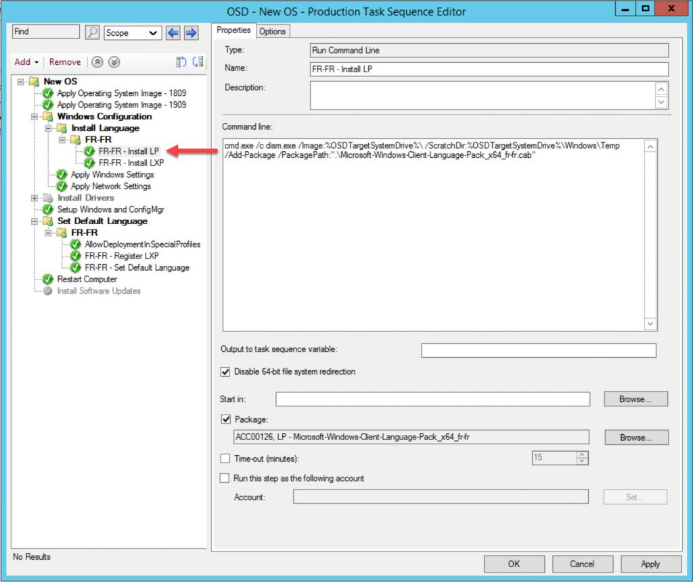](finalts-3.jpg)</figure>
                  </li>
                  <li class="blocks-gallery-item">
                    <figure>[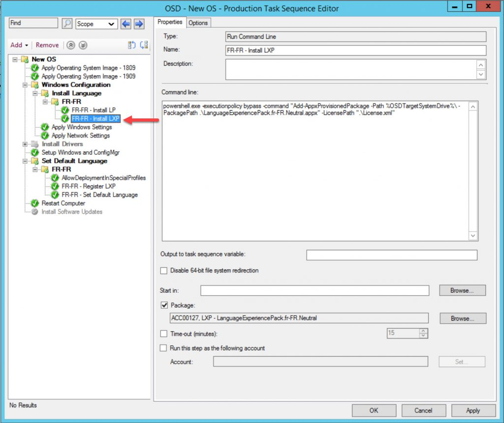](finalts-4.jpg)</figure>
                  </li>
                  <li class="blocks-gallery-item">
                    <figure>[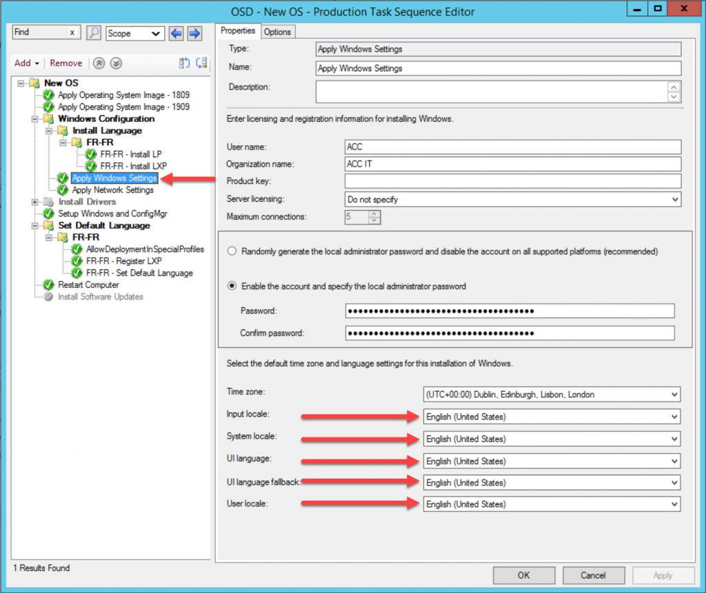](finalts-5.jpg)</figure>
                  </li>
                  <li class="blocks-gallery-item">
                    <figure>[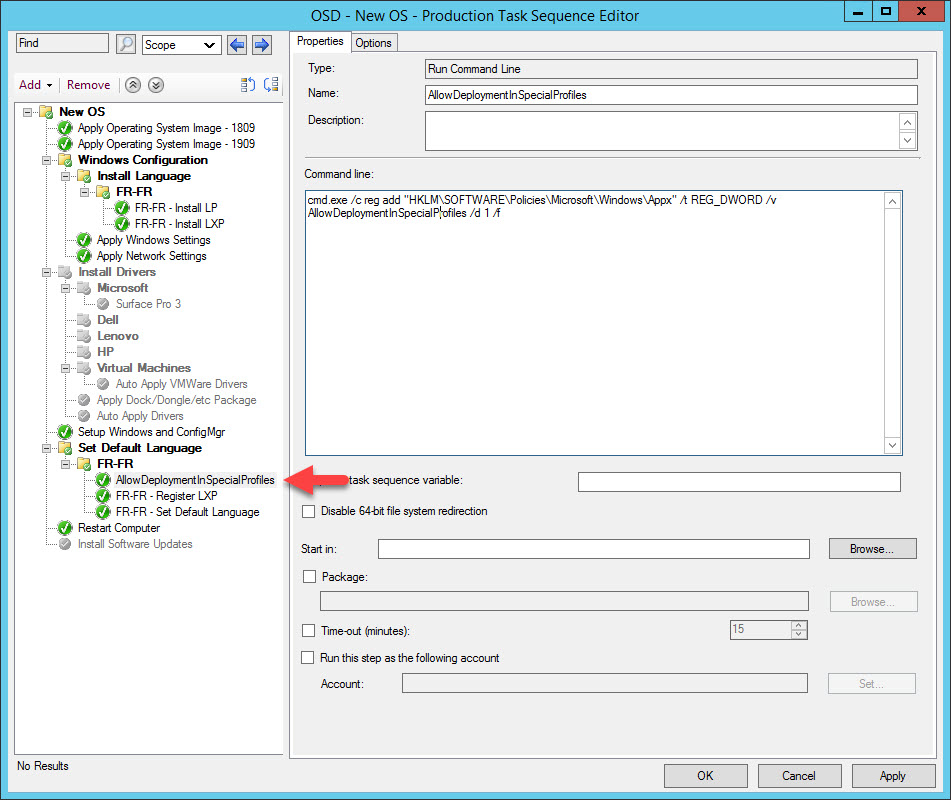](finalts-6.jpg)</figure>
                  </li>
                  <li class="blocks-gallery-item">
                    <figure>[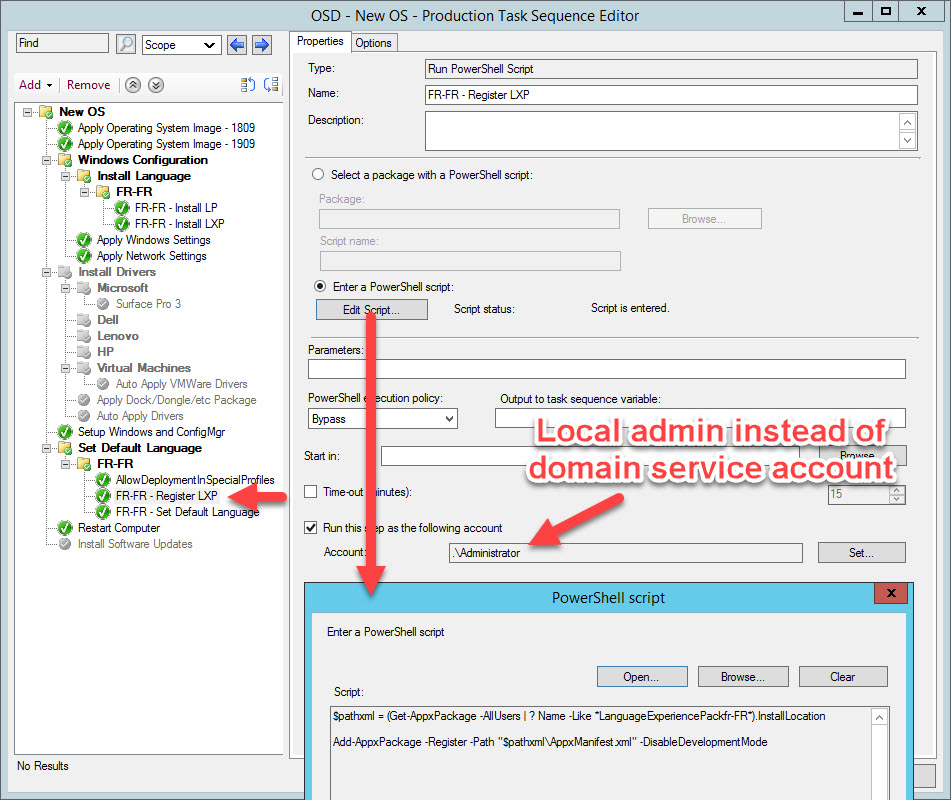](finalts-7.jpg)</figure>
                  </li>
                  <li class="blocks-gallery-item">
                    <figure>[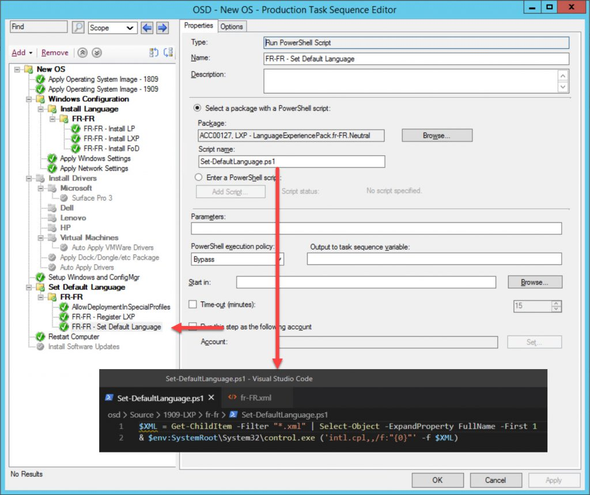](finalts-8.jpg)</figure>
                  </li>
                </ul></figure> 
                
                

                  Make sure that you set the local options of the <code>Apply Windows Settings</code> step to match that of the install media (en-us in this case). Equally the same is true if you use any of the [OSDWindowsSetings* task sequence variables](https://docs.microsoft.com/en-us/mem/configmgr/osd/understand/task-sequence-steps#BKMK_ApplyWindowsSettings).
                

                
                

                  The only drawback with this approach is that because we've installed a LP, we still need to reinstall the latest cumulative update because the start menu search is broken until you do that.
                

                
                

                  Again, if you run software updates step during OSD in your task sequence then this isn't going to be a big deal for you. I think this is a reasonable compromise if we get a fully localised system that doesn't cause us problems down the line when it comes to upgrading Windows 10. It also keeps the content capacity requirements low, since there's no need for an ISO for each language we want to support in our task sequence and therefore on your Distribution Points.
                

                
                

                  However if build time is important to you, or you just don't/can't install software updates during OSD, then your only option is offline servicing. This enables you to inject all languages items (LP, LXP and FoD, which we will get on to next) directly in to the WIM. Once complete, you load the new Operating System Image into ConfigMgr.
                

                
                

                  Something like [David Segura](https://twitter.com/seguraosd)'s fantastic [OSDBuilder](https://osdbuilder.osdeploy.com/) is a great example of a community tool for servicing WIMs offline. His posts on building a [Windows 10 MultiLang baseline with OSDBuilder](https://osdbuilder.osdeploy.com/docs/advanced/multilang-baseline) highlights the importance of not applying updates to your WIM before you install the LPs or LXPs. I recommend using the RTM version of any Windows 10 you're looking to service.
                

                
                

                <section class="wp-block-uagb-section uagb-section__wrap uagb-section__background-undefined uagb-block-abcdd797">
                

                

                
                

                  <h4>
                    Update 2020-07-29
                  </h4>
                  
                  

                    I've been able to reproduce a reported issue where if we install en-gb (LP + LXP) over en-us (as base language) using the guidelines in this blog post. You will see strange things immediately after OSD:
                  

                  
                  

                    <figure class="aligncenter size-large">[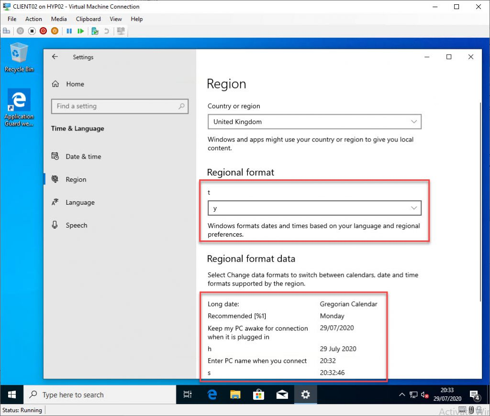](2020-07-29_21-37-56.jpg)</figure>
                  

                  
                  

                    For me, this was cleared up after I prompted an update for the en-gb LXP from the Microsoft Store. Immediately too, no reboot necessary. This shouldn't be too much of a surprise because I have detailed this quirk in the post already. LXPs are serviced via the store and odd translation issues were resolved after applying updates for the LXP(s) from the Store.
                  

                  
                  

                    However this is a little different because it's clearly broken.
                  

                  
                  

                    Perhaps this might be an issue with the RTM version of the en-gb LXP in the ISO from MSDN/Visual Studio downloads. None the less it's addressed in updates from the Store.
                  

                  
                  

                    This might be a good opportunity to at least explore the idea of trying to export an updated LXP from Microsoft Store for Business. I haven't tested this.
                  

                  
                  

                    Failing that, maybe you would be happy with force installing Store updates at the end of OSD using this tidbit [I found on Reddit](https://www.reddit.com/r/PowerShell/comments/94ikpc/any_way_to_update_windows_store_apps_via/):
                  

                  
                  
                    <pre class="CodeMirror" data-setting="{"mode":"powershell","mime":"application/x-powershell","theme":"default","lineNumbers":true,"styleActiveLine":true,"lineWrapping":true,"readOnly":false,"showPanel":false,"fileName":"shell.ps1","language":"PowerShell","modeName":"powershell"}">Get-CimInstance -Namespace "Rootcimv2mdmdmmap" -ClassName "MDM_EnterpriseModernAppManagement_AppManagement01" | Invoke-CimMethod -MethodName UpdateScanMethod</pre>
                  
                  
                  

                  

                
</section> 
                
                

                
                

                  OK, we now have a task sequence which resolves most of the biggest issues with Windows 10 multi language OSD. What else should you be interested about? FoDs!
                

                
                <h3>
                  Features on Demand
                </h3>
                
                

                  FoDs complete the user experience for languages on Windows 10. They give users Windows 10 features such as handwriting recognition, speech recognition, fonts, OCR and text to speech (and many more) in their desired language.
                

                
                

                  [Following the order of installation advice](https://docs.microsoft.com/en-us/windows-hardware/manufacture/desktop/features-on-demand-language-fod), remember FoDs must be installed after a LP.
                

                
                

                  Like LPs and LXPs, you can grab an ISO of FoDs for Windows 10 from VLSC or your MSDN / Visual Studio Subscription download page.
                

                
                

                  <figure class="aligncenter size-large">[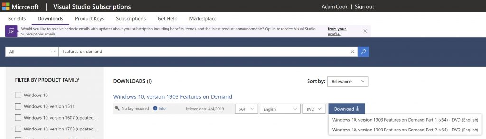](foddownloadmsdn-1-scaled.jpg)</figure>
                

                
                

                  Part 1 is what you want, Part 2 contains content for retail store demo units.
                

                
                

                  It's worth pointing out that Microsoft don't offer FoDs for every language and weirdly provide a spreadsheet detailing which FoDs you should use for your desired target language. [Here's the link to the page](https://docs.microsoft.com/en-us/windows-hardware/manufacture/desktop/features-on-demand-language-fod) which links to the spreadsheet, and [here's the direct link to the spreadsheet](https://download.microsoft.com/download/7/6/0/7600F9DC-C296-4CF8-B92A-2D85BAFBD5D2/Windows-10-1809-FOD-to-LP-Mapping-Table.xlsx) which works at the time of writing this.
                

                
                

                  FoDs come in two types: with satellite packages and without satellite packages.
                

                
                

                  <strong>FoDs with satellite packages: </strong>come with language and architecture elements in independent packages.
                

                
                

                  <strong>FoDs without satellite packages:</strong> come with language and architecture elements bundled into one package.
                

                
                

                  Looking at the below screenshot which are the contents of the Part 1 FoD ISO, you can see how satellite and non-satellite FoDs differ by looking at them on disk based on naming convention and file size.
                

                
                

                  <figure class="aligncenter size-large"><figcaption>Showing satellite and non-satellite FoD differences on disk</figcaption></figure>
                

                
                

                  After OSD using the method I shared last (with LP + LXP but keeping <code>Apply Windows settings</code> the same as the install media), even the most "basic" language-focused FoDs are not installed.
                

                
                

                  The basic language-focused FoDs I'm referring to are the following:
                

                
                <ul>
                  <li>
                    Microsoft-Windows-LanguageFeatures-Basic-*
                  </li>
                  <li>
                    Microsoft-Windows-LanguageFeatures-Handwriting-*
                  </li>
                  <li>
                    Microsoft-Windows-LanguageFeatures-OCR-*
                  </li>
                  <li>
                    Microsoft-Windows-LanguageFeatures-Speech-*
                  </li>
                  <li>
                    Microsoft-Windows-LanguageFeatures-TextToSpeech-*
                  </li>
                </ul>
                
                

                  I recommend you at least install these FoDs in your task sequence too.
                

                
                

                  You'll quickly get fed up with the process of downloading the ISO and grabbing all the FoDs you need for each new version of Windows 10, though. You've got to walk through a dozen folders, twice, for both LXP and FoD ISOs.
                

                
                

                  To help with that, I wrote some functions included in the [PSCMWin10Language](https://github.com/codaamok/PSCMWin10Language) module.
                

                
                

                  For more information on how to use these functions to build out LP, LXP and FoD repositories, [check out this blog post I also wrote](https://sysmansquad.com/2020/06/08/deploy-languages-via-software-center-with-pscmwin10language/).
                

                
                <ul>
                  <li>
                    <code>New-LPRepository</code><ul>
                      <li>
                        Copy out only the Language Packs you want from the Language Pack ISO
                      </li>
                    </ul>
                  </li>
                  
                  <li>
                    <code>New-LXPRepository</code><ul>
                      <li>
                        Copy out only the folders of the languages you want from the Language Experience Pack ISO
                      </li>
                    </ul>
                  </li>
                  
                  <li>
                    <code>New-FoDLanguageFeaturesRepository</code><ul>
                      <li>
                        Copy&nbsp;out&nbsp;only&nbsp;the&nbsp;languages&nbsp;you&nbsp;want&nbsp;of&nbsp;the&nbsp;Features&nbsp;on&nbsp;Demand&nbsp;LanguageFeatures&nbsp;Basic,&nbsp;Handwriting,&nbsp;OCR,&nbsp;Speech&nbsp;and&nbsp;TextToSpeech&nbsp;from&nbsp;Features&nbsp;on&nbsp;Demand&nbsp;ISO
                      </li>
                    </ul>
                  </li>
                </ul>
                
                

                  In my task sequence, I added the install FoD step to look like this:
                

                
                

                  <figure class="aligncenter size-medium">[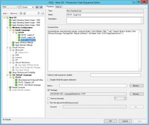](finalts-fodstep.jpg)<figcaption>Example step to install FoD</figcaption></figure>
                

                
                <h2>
                  Make new languages available via the Software Center
                </h2>
                
                

                  Take the scenario where you have a built machine already given to a user, however some time later that user (or another user) wants to change language. What are your options to change localisation after OSD?
                

                
                

                  You've probably noticed a user can install their own languages from the Settings UI or from the Store. However in both cases these are just LXPs - the user will only have a partially localised experienced after applying this.
                

                
                

                  [Check out this blog post I wrote](https://sysmansquad.com/2020/06/08/deploy-languages-via-software-center-with-pscmwin10language/), where I show you how to use my PowerShell module [PSCMWin10Language](https://github.com/codaamok/PSCMWin10Language) to create LP, LXP and FoD repositories and create ConfigMgr Applications using those repositories to deploy via the Software Center.
                

                
                <h2>
                  Windows 10 2004 improvements to languages
                </h2>
                
                

                  I keep bringing up this Ignite session but it truly was amazing.
                

                
                <ul>
                  <li>
                    [Solving&nbsp;Windows&nbsp;10&nbsp;feature&nbsp;updates&nbsp;in&nbsp;a&nbsp;multilingual&nbsp;deployment](https://www.youtube.com/watch?v=ZhL0AO8Cnig&ab_channel=MicrosoftIgnite) - Sudhagar Thirumoolan ([@sudhagart](https://twitter.com/sudhagart?lang=en))
                  </li>
                </ul>
                
                

                  We're promised some very key changes in Windows 10 2004: being able to configure system and user preferred languages. This gives us the completely localised experience on Windows 10, without being fussy with what we populate in the unattend.xml answer file other than the target language. And most importantly, no more InstallLanguage issue!
                

                
                

                  Timing is perfect because Michael Niehaus (former Principal Program Manager at Microsoft) [just posted an excellent blog](https://oofhours.com/2020/06/01/new-in-windows-10-2004-better-language-handling/) which discusses these new 2004 changes in more detail.
                

                
                

                  The upshot of the new changes in 2004 is: you can use en-us installation media, apply (for example) fr-fr LP, and update <code>Apply Windows Settings</code> to be French instead of English. Lo and behold, a French system with no more InstallLanguage issue!
                

                
                

                  This way, we can ditch the hacky <code>control.exe intl.cpl</code> method to change default user language.
                

                
                

                  I recommend you to still consider including LXPs in your task sequence, though, even if your target language is one of the 38 base languages. Just in case Microsoft push out some improved translations to UI.
                

                
                

                  My only gripe, still, is that there's still a remark in there about pushing to use LXP instead of LP, which I still don't understand or agree with. However, nonetheless, this is a hugely welcomed improvement.
                

                
                <h2>
                  Closing thoughts
                </h2>
                
                

                  As I've mentioned, Microsoft want us to get away from using LP and instead use LXP, but I don't see how that's possible. If the partial translation of LXPs is good enough for your users, then I totally agree with that recommendation. But I'd imagine most users might need a totally translated experience for Windows 10, in which case you still need the LP in there.
                

                
                

                  Before Microsoft announced the 2004 improvements to the system and user default languages, the tone of this blog post would have been very different. However they've finally delivered on a solution by listening to our pain, which is excellent.
                

                
                

                  If you have any questions about any of this, don't hesitate to comment or ping me on Twitter ([@codaamok](https://twitter.com/codaamok)). Thanks for reading if you made it this far!
                

