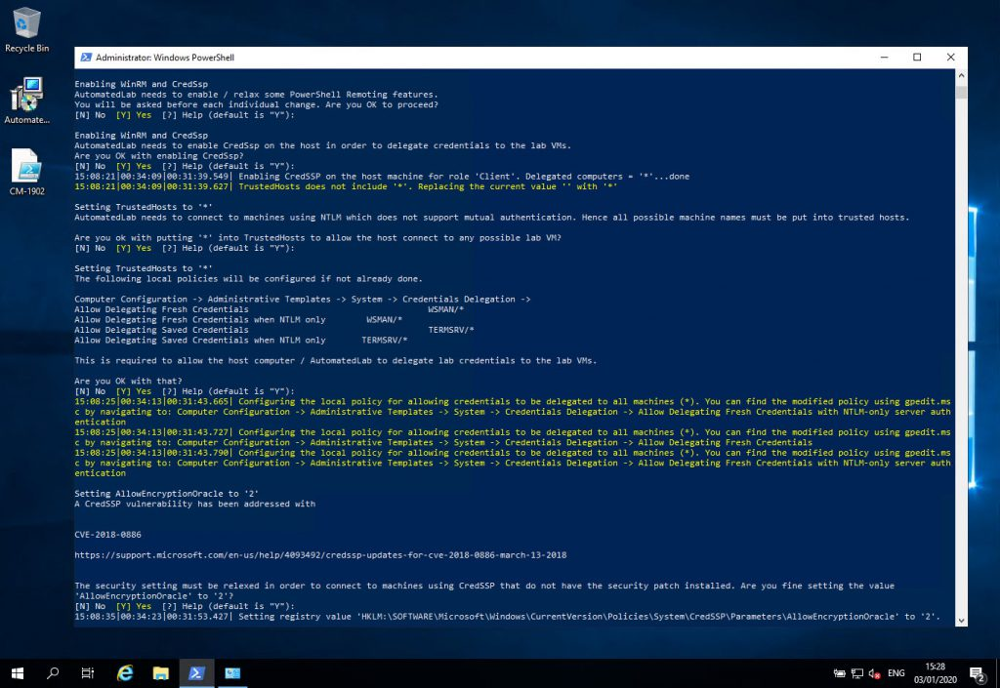
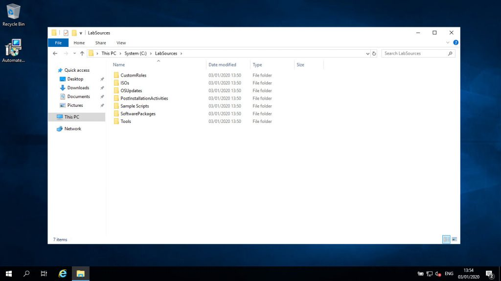

 

  

    

      Table Of Contents
    

  

  
  

    <ol class="uagb-toc__list">
      <li class="uagb-toc__list">
        [What is AutomatedLab?](#what-is-automatedlab)<li class="uagb-toc__list">
          [Support](#support)<li class="uagb-toc__list">
            [Prerequisites](#prerequisites)<ul class="uagb-toc__list">
              <li class="uagb-toc__list">
                [Telemetry](#telemetry)<li class="uagb-toc__list">
                  <li class="uagb-toc__list">
                    [Security warning](#security-warning)<ul class="uagb-toc__list">
                      <li class="uagb-toc__list">
                        [Enabling WinRM CredSSP](#enabling-winrm-credssp)<li class="uagb-toc__list">
                          <li class="uagb-toc__list">
                            [Enters a wildcard in your system's TrustedHosts file](#enters-a-wildcard-in-your-systems-trustedhosts-file)<li class="uagb-toc__list">
                              <li class="uagb-toc__list">
                                [Allow credential delegation via local group policy settings](#allow-credential-delegation-via-local-group-policy-settings)<li class="uagb-toc__list">
                                  <li class="uagb-toc__list">
                                    [Relaxes a setting for CredSSP patch CVE-2019-0886](#relaxes-a-setting-for-credssp-patch-cve-2019-0886)
                                  </li></ul>
                                </li></ul>
                              </li>
                              <li class="uagb-toc__list">
                                [Installing AutomatedLab](#installing-automatedlab)<ul class="uagb-toc__list">
                                  <li class="uagb-toc__list">
                                    [Folders](#folders)<ul class="uagb-toc__list">
                                      <li class="uagb-toc__list">
                                        [LabSourcesCustomRoles](#labsourcescustomroles)<li class="uagb-toc__list">
                                          <li class="uagb-toc__list">
                                            [LabSourcesISOs](#labsourcesisos)<li class="uagb-toc__list">
                                              <li class="uagb-toc__list">
                                                [LabSourcesOSUpdates](#labsourcesosupdates)<li class="uagb-toc__list">
                                                  <li class="uagb-toc__list">
                                                    [LabSourcesPostInstallationActivities](#labsourcespostinstallationactivities)<li class="uagb-toc__list">
                                                      <li class="uagb-toc__list">
                                                        [LabSourcesSampleScripts](#labsourcessamplescripts)<li class="uagb-toc__list">
                                                          <li class="uagb-toc__list">
                                                            [LabSourcesSoftwarePackages](#labsourcessoftwarepackages)<li class="uagb-toc__list">
                                                              <li class="uagb-toc__list">
                                                                [LabSourcesTools](#labsourcestools)
                                                              </li></ul>
                                                            </li></ul>
                                                          </li></ul>
                                                        </li></ul>
                                                      </li>
                                                      <li class="uagb-toc__list">
                                                        [Creating a simple lab](#creating-a-simple-lab)<li class="uagb-toc__list">
                                                          [Adding or removing lab machines](#adding-or-removing-lab-machines)<li class="uagb-toc__list">
                                                            [Build a ConfigMgr lab with AutomatedLab](#build-a-configmgr-lab-with-automatedlab)
                                                          </li></ul>
                                                        </li></ul>
                                                      </li></ul>
                                                    </li></ul></ol> 
 
 
 
                                                    <h2>
                                                      What is AutomatedLab?
                                                    </h2>
                                                    
                                                    

                                                      [AutomatedLab](https://github.com/automatedlab/automatedlab) is simply PowerShell module. In some ways it’s a framework because it encourages a particular workflow for managing named labs consisting of VMs with prefined applications / “roles” or custom roles.
                                                    

                                                    
                                                    

                                                      The benefit using AutomatedLab is the simplicity it offers to quickly fire up and throw away environments, and rebuild again. It also offers a huge range of functions to build out whatever you want.
                                                    

                                                    
                                                    

                                                      Generally, the workflow goes something like:
                                                    

                                                    
                                                    <ol>
                                                      <li>
                                                        <code>strong>New-LabDefinition/strong></code>
                                                      </li>
                                                      <li>
                                                        <code>strong>Add-LabMachineDefinition/strong></code>
                                                      </li>
                                                      <li>
                                                        <code>strong>Install-Lab/strong></code>
                                                      </li>
                                                    </ol>
                                                    
                                                    

                                                      Those commands have a bunch of different parameters to further configure your lab. But generally, you 1) define your lab, 2) define the VMs and 3) initiate the build.
                                                    

                                                    
                                                    <h2>
                                                      Support
                                                    </h2>
                                                    
                                                    

                                                      Resources for AutomatedLab aren’t hard to find. I personally found everything I needed by looking at the[wiki](https://github.com/AutomatedLab/AutomatedLab/wiki)on[GitHub](https://github.com/AutomatedLab/AutomatedLab), reviewing the documentation on their[website](https://automatedlab.org/), and checking out the[sample scripts folder](https://github.com/AutomatedLab/AutomatedLab/tree/master/LabSources/SampleScripts).
                                                    

                                                    
                                                    

                                                      In my experience so far the support by the developers in GitHub issues have been very helpful and proactive. At the time of writing this it’s in active development and has been for years.
                                                    

                                                    
                                                    <h2>
                                                      Prerequisites
                                                    </h2>
                                                    
                                                    

                                                      As per the[documentation](http://automatedlab.org/en/latest/#requirements), at the time of writing this, the requirements are:
                                                    

                                                    
                                                    <ul>
                                                      <li>
                                                        Windows Management Framework 5+
                                                      </li>
                                                      <li>
                                                        Windows Server 2012 R2+/Windows 8.1+
                                                      </li>
                                                      <li>
                                                        Recommended OS language is en-us
                                                      </li>
                                                      <li>
                                                        Admin privileges are required
                                                      </li>
                                                      <li>
                                                        ISO files for all operating systems and roles to be deployed
                                                      </li>
                                                      <li>
                                                        Intel VT-x or AMD/V capable CPU
                                                      </li>
                                                      <li>
                                                        A decent amount of RAM
                                                      </li>
                                                      <li>
                                                        An SSD for your machines is highly recommended as many issues arise from slow HDDs
                                                      </li>
                                                    </ul>
                                                    
                                                    <h3>
                                                      Telemetry
                                                    </h3>
                                                    
                                                    

                                                      AutomatedLab operates on an<strong>opt-out</strong>telemetry system. The[documentation](http://automatedlab.org/en/latest/#requirements)on this heavily suggests no personal identifiable information is collected and it’s used purely for supportability and usage statistics. Snippets of json data which is sent back are included in the docs to give you insight to the amount of detail shared.
                                                    

                                                    
                                                    

                                                      To opt out, you either set environment variable<strong><code>AUTOMATEDLAB_TELEMETRY_OPTIN</code></strong>to<code>strong>false/strong></code>,<strong><code>no</code></strong>or<code>strong>0/strong></code>. Or simply use<code>strong>Disable-LabTelemetry/strong></code>after installing.
                                                    

                                                    
                                                    

                                                      They even share the [PowerBi dashboard of the data collected](https://msit.powerbi.com/view?r=eyJrIjoiN2Q3ZTU5Y2QtMjUyMi00YmFhLTkxNTMtZDBmYTA3MzcyYWQxIiwidCI6IjcyZjk4OGJmLTg2ZjEtNDFhZi05MWFiLTJkN2NkMDExZGI0NyIsImMiOjV9&pageName=ReportSection67b5abc401bbec55e899).
                                                    

                                                    
                                                    <h3>
                                                      Security warning
                                                    </h3>
                                                    
                                                    

                                                      Before you get started, you should know about some changes AutomatedLab wants to make to your computer when you first call an AutomatedLab script.
                                                    

                                                    
                                                    

                                                      You’re prompted yes/no to a series of questions which will likely dictate whether you want to use this in a production network or not:
                                                    

                                                    
                                                    

                                                      <figure class="aligncenter size-large"><figcaption>AutomatedLab security warning prompts</figcaption></figure>
                                                    

                                                    
                                                    

                                                      Below I’ll lay out what those changes are and the commands/options it sets.
                                                    

                                                    
                                                    <h4>
                                                      Enabling WinRM CredSSP
                                                    </h4>
                                                    
                                                    `Enable-WSManCredSSP -Role Client -DelegateComputer * -Force`
                                                    
                                                    

                                                      The[documentation](http://automatedlab.org/en/latest/Wiki/invokelabcommand/#double-hop-authentication-and-credssp)on this gives the following reason for this change:
                                                    

                                                    
                                                    

                                                      <em>“Every machine deployed with AL has CredSsp enabled as a CredSsp server. This is like running “Enable-WSManCredSSP -Role Server”. Invoke-LabCommand always tries to make a connection with CredSsp. If this does not work you will see a warning and a connection without CredSsp is tried. This is definitely not a best practice for a production environment but makes life much easier in a lab. Using CredSsp you can create a remote session from a remote session which is extremely helpful when installing or setting up a lab. For example, reading an AD user account from a remote session does not work without CredSsp as reading data from Active Directory requires and authentication from the remote machine to a domain controller. Inside an AL lab the following code works out of the box.”</em>
                                                    

                                                    
                                                    <h4>
                                                      Enters a wildcard in your system's TrustedHosts file
                                                    </h4>
                                                    
                                                    `Set-Item -Path Microsoft.WSMan.Management\WSMan::localhost\Client\TrustedHosts -Value '*' -Force`
                                                    
                                                    

                                                      The[exception message](https://github.com/AutomatedLab/AutomatedLab/blob/d1c5f04096c8bdef4ad29b4c495de05d25ca5a0a/AutomatedLab/AutomatedLab.psm1#L72)thrown if you choose not to accept reads:
                                                    

                                                    
                                                    

                                                      “<em>AutomatedLab requires the host to connect to any possible lab machine using NTLM.</em>.. “
                                                    

                                                    
                                                    

                                                      If a remote system is not part of a domain, or is part of an untrusted domain, an attempt to connect using remoting may fail. The remote system must either be listed in trusted hosts or must use SSL.
                                                    

                                                    
                                                    

                                                      Putting a wild card in your TrustedHosts file will effectively mean your computer trusts all and any remote systems to make connections to, not from. In other words, this wildcard is not the config for allowing all and any remote systems to connect to your computer.
                                                    

                                                    
                                                    <h4>
                                                      Allow credential delegation via local group policy settings
                                                    </h4>
                                                    
                                                    

                                                      The following settings are configured with a link to their description:
                                                    

                                                    
                                                    <ul>
                                                      <li>
                                                        Allow Delegating Fresh Credentials<ul>
                                                          <li>
                                                            [https://gpsearch.azurewebsites.net/#116](https://gpsearch.azurewebsites.net/#116)
                                                          </li>
                                                        </ul>
                                                      </li>
                                                      
                                                      <li>
                                                        Allow Delegating Fresh Credentials when NTLM only<ul>
                                                          <li>
                                                            [https://gpsearch.azurewebsites.net/#117](https://gpsearch.azurewebsites.net/#117)
                                                          </li>
                                                        </ul>
                                                      </li>
                                                      
                                                      <li>
                                                        Allow Delegating Saved Credentials<ul>
                                                          <li>
                                                            [https://gpsearch.azurewebsites.net/#118](https://gpsearch.azurewebsites.net/#118)
                                                          </li>
                                                        </ul>
                                                      </li>
                                                      
                                                      <li>
                                                        Allow Delegating Saved Credentials when NTLM only<ul>
                                                          <li>
                                                            [https://gpsearch.azurewebsites.net/#119](https://gpsearch.azurewebsites.net/#119)
                                                          </li>
                                                        </ul>
                                                      </li>
                                                    </ul>
                                                    
                                                    

                                                      These settings are relevant to allowing use of CredSSP; letting you feed “fresh” and “saved” credentials to remote systems in your lab.
                                                    

                                                    
                                                    <h4>
                                                      Relaxes a setting for CredSSP patch CVE-2019-0886
                                                    </h4>
                                                    
                                                    

                                                      The setting it changes for CVE-2018-0886 /[KB4093492](https://support.microsoft.com/en-us/help/4093492/credssp-updates-for-cve-2018-0886-march-13-2018)is<code>strong>AllowEncryptionOracle/strong></code>=<strong><code>2</code></strong>:
                                                    

                                                    
                                                    <pre class="wp-block-code"><code>New-Item -Path HKLM:\SOFTWARE\Microsoft\Windows\CurrentVersion\Policies\System\CredSSP\Parameters -Force | Out-Null
Set-ItemProperty -Path HKLM:\SOFTWARE\Microsoft\Windows\CurrentVersion\Policies\System\CredSSP\Parameters -Name AllowEncryptionOracle -Value 2 -Force</code></pre>
                                                    
                                                    

                                                      This workaround enables you to connect to lab machines that may not have the CredSSP patch installed.
                                                    

                                                    
                                                    

                                                      With all of the the above in mind I encourage you to make an informed decision as to whether you can use AutomatedLab or not.
                                                    

                                                    
                                                    

                                                      These are the resources I used to help me understand what I needed to know the risks were, explaining things like Kerberos authentication, CredSSP and double-hopping with PowerShell:
                                                    

                                                    
                                                    <ul>
                                                      <li>
                                                        [PowerShell Remoting Kerberos Double Hop Solved Securely](https://blogs.technet.microsoft.com/ashleymcglone/2016/08/30/powershell-remoting-kerberos-double-hop-solved-securely/)
                                                      </li>
                                                      <li>
                                                        [Understanding Kerberos Double Hop](https://blogs.technet.microsoft.com/askds/2008/06/13/understanding-kerberos-double-hop/)
                                                      </li>
                                                      <li>
                                                        [Kerberos for the Busy Admin](https://blogs.technet.microsoft.com/askds/2008/03/06/kerberos-for-the-busy-admin/)
                                                      </li>
                                                      <li>
                                                        [Accidental Sabotage: Beware of CredSSP](https://www.powershellmagazine.com/2014/03/06/accidental-sabotage-beware-of-credssp/)
                                                      </li>
                                                    </ul>
                                                    
                                                    <h2>
                                                      Installing AutomatedLab
                                                    </h2>
                                                    
                                                    

                                                      Decided to use it still? Great! I personally use it in my home lab.
                                                    

                                                    
                                                    

                                                      I’m not going to reinvent the wheel. The[Installation docs](https://automatedlab.org/en/latest/Wiki/Basic/install/)are good enough!
                                                    

                                                    
                                                    <h3>
                                                      Folders
                                                    </h3>
                                                    
                                                    

                                                      Once installed, you’ll see C:\LabSources folder. During installation you can configure where to store LabSources if you don’t want to save it on C.
                                                    

                                                    
                                                    

                                                      LabSources is not the directory where VMs are stored. It’s where installation media / sources and scripts are kept. By default, VMs are stored in in a directory named AutomatedLab-VMs but this is also configurable on a per lab basis using[-VmPath](http://automatedlab.org/en/latest/AutomatedLabDefinition/en-us/New-LabDefinition/#-vmpath)parameter.
                                                    

                                                    
                                                    

                                                      If you don’t explicitly define -VmPath then the fastest available drive on your computer will be used for the AutomatedLab-VMs folder.
                                                    

                                                    
                                                    

                                                      <figure class="aligncenter size-large"><figcaption>AutomatedLab LabSources folder contents</figcaption></figure>
                                                    

                                                    
                                                    

                                                      Within each folder for LabSources you’ll have some description detailed within a README.md but I’ll offer some more insight.
                                                    

                                                    
                                                    <h4>
                                                      LabSources\CustomRoles
                                                    </h4>
                                                    
                                                    

                                                      AutomatedLab has a concept of “roles” that are installed after a VM OS is installed.[Here are a list](http://automatedlab.org/en/latest/Wiki/roles/)of predefined / “built in” roles. Associating a role with a VM will install applications such as Exchange, Active Directory, SharePoint, SQL, lots of good stuff and more. You associate a role with a VM using the<code>strong>-Roles/strong></code>parameter with the<code>strong>Add-LabMachineDefinition/strong></code>command.
                                                    

                                                    
                                                    

                                                      Custom roles is the ability to create your own role. Your custom role’s name is the name of the directory you save in LabSources\CustomRoles and AutomatedLab calls LabSources\CustomRoles\MyCustomRole\HostStart.ps1 once the VM’s OS is installed. From there, your imagination is the limit.
                                                    

                                                    
                                                    <h4>
                                                      LabSources\ISOs
                                                    </h4>
                                                    
                                                    

                                                      VMs need ISO media for operating system installs and some applications sources for roles such as SQL. This is where you must store ISOs. This directory is scanned at runtime when initiating a build and an error will be thrown if what’s required isn’t present.
                                                    

                                                    
                                                    <h4>
                                                      LabSources\OSUpdates
                                                    </h4>
                                                    
                                                    

                                                      See the README.md for more information, but essentially, it’s a folder to store updates for you to then trigger regeneration of a new ISO for your lab’s operating systems.
                                                    

                                                    
                                                    <h4>
                                                      LabSources\PostInstallationActivities
                                                    </h4>
                                                    
                                                    

                                                      A folder that you shouldn’t need to touch. It’s used internally by AutomatedLab to achieve some customisations for some predefined / “builtin” roles.
                                                    

                                                    
                                                    <h4>
                                                      LabSources\SampleScripts
                                                    </h4>
                                                    
                                                    

                                                      A nice folder containing lots of examples where you can glean insight on how to build your own AutomatedLab scripts.
                                                    

                                                    
                                                    <h4>
                                                      LabSources\SoftwarePackages
                                                    </h4>
                                                    
                                                    

                                                      Software to-be-installed on VMs in your lab download to this folder and copied to the VMs. In your scripts, if you need to do any similar type of functions of downloading and installing, use this directory.
                                                    

                                                    
                                                    <h4>
                                                      LabSources\Tools
                                                    </h4>
                                                    
                                                    

                                                      This folder can be copied to all VMs in a lab so if there’s files/folders you want in common, populate this folder with what you want and use the<code>strong>-ToolsPath/strong></code>parameter with the<code>strong>Add-LabMachineDefinition/strong></code>command.
                                                    

                                                    
                                                    <h2>
                                                      Creating a simple lab
                                                    </h2>
                                                    
                                                    

                                                      Before you save the below script and execute it, ensure you have a Windows Server 2019 ISO saved in your LabSources\ISOs folder.
                                                    

                                                    
                                                    [https://gist.github.com/codaamok/ed8cef3cad671ddee05a984e48d05f5f](https://gist.github.com/codaamok/ed8cef3cad671ddee05a984e48d05f5f) 

                                                      The above will create:
                                                    

                                                    
                                                    <ul>
                                                      <li>
                                                        Create an AutomatedLab named whatever you passed for the<strong><code>-LabName</code></strong>parameter
                                                      </li>
                                                      <li>
                                                        Create a three VM lab all running Windows Server 2019 Datacenter (Desktop Experience)
                                                      </li>
                                                      <li>
                                                        The domain will be whatever you passed for the<code>strong>-Domain/strong></code>parameter
                                                      </li>
                                                      <li>
                                                        All VMs will be networked only with each other using 192.168.123.0/24 address space
                                                      </li>
                                                      <li>
                                                        DC name will be “DC01” and other 2 non-role servers will be named “GENSRV-01” and “GENSRV-02”
                                                      </li>
                                                      <li>
                                                        Each server has just 1 vCPU but dynamic memory configured (min 1GB max 4GB)
                                                      </li>
                                                    </ul>
                                                    
                                                    <h2>
                                                      Adding or removing lab machines
                                                    </h2>
                                                    
                                                    

                                                      While you can delete the Hyper-V virtual machines from the VMM service and vhdx/vmcx files off disk, AutomatedLab will still think they exist. AutomatedLab keeps track of what’s where within the realm of AutomatedLab via XML files which can be found in<strong><code>C:\ProgramData\AutomatedLab\Labs</code></strong>.
                                                    

                                                    
                                                    

                                                      To delete individual VMs, use<strong><code>a href="http://automatedlab.org/en/latest/AutomatedLab/en-us/Remove-LabVM/">Remove-LabVM/a></code></strong>. To remove all VMs associated with a lab, use<strong><code>a href="http://automatedlab.org/en/latest/AutomatedLab/en-us/Remove-Lab/">Remove-Lab/a></code></strong>.
                                                    

                                                    
                                                    

                                                      Using these functions is important because not only does it take care of tidying up for you, it also does extra things like removes lab VMs from your hosts file.
                                                    

                                                    
                                                    

                                                      As for adding machines to an existing lab, at the time of writing this, there’s no function available within AutomatedLab to specifically add a new VM to an existing lab. It’s only achievable by modifying or creating a new AutomatedLab script with the same properties (e.g. domain, address space etc) and calling<code>strong>Install-Lab -NoValidation/strong></code>.
                                                    

                                                    
                                                    

                                                      It seems more appropriate functionality to add machines to an existing lab or domain created from AutomatedLab is incoming in[version 6 of AutomatedLab](https://github.com/AutomatedLab/AutomatedLab/milestone/5)!
                                                    

                                                    
                                                    <h2>
                                                      Build a ConfigMgr lab with AutomatedLab
                                                    </h2>
                                                    
                                                    

                                                      [Check out this post to build a ConfIgMgr lab using AutomatedLab](https://sysmansquad.com/2020/06/15/build-a-configrmgr-lab-with-automatedlab/)!
                                                    

