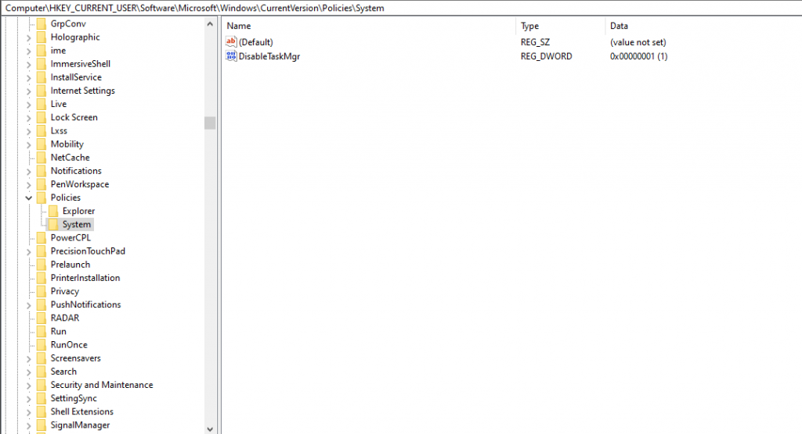
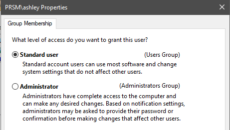

Recently I had case where a we had to deploy computers that required Kiosk mode. Trouble was, I couldn't run Windows Kiosk mode for the auto start of the application I wanted the Kiosk users to operate.  
  
I discovered these registry settings to allow me to functionally create a Kiosk environment.

These registry edits will result in the following:

  * Any time the user logs into this computer. The chosen application will launch.
  * The taskbar will be hidden
  * Ctrl+Alt+Del wont work once the user is logged in (If you opt in for that registry edit.)
  * The user will login automatically when the computer turns on (If you opt in for that registry edit.)

First enter Registry Editor:  
Win+R<figure class="wp-block-image size-large is-resized">

 </figure> 

<pre class="wp-block-code"><code># Add startup application:

    [HKEY_CURRENT_USER\Software\Microsoft\Windows\CurrentVersion\Policies\System]
    "Shell"="C:\\full\\path\\to\\your\\application.exe>"

# Autologin for kiosk user (Optional):
  
    [HKEY_LOCAL_MACHINE\Software\Microsoft\Windows NT\CurrentVersion\Winlogon] 
    "AutoAdminLogon"="1"
    "ForceAutoLogon"="1"
    "DefaultUserName"="kiosk"
    "DefaultDomainName"="&lt;place here pc hostname>"
    "DefaultPassword"=""

# If you need to disable Ctrl+Alt+Del

    Computer\HKEY_CURRENT_USER\Software\Microsoft\Windows\CurrentVersion\Policies\System
     ## the registry key "System" may not exist. In that situation just create       a new key called System.
    "DisableTaskMgr "="1"</code></pre><figure class="wp-block-image size-large">

 </figure> 

  
  
I also suggest downgrading that user to a "Standard User" so they can't make changes to the computer without admin privileges.  
<figure class="wp-block-image size-large">

 </figure> 

Using these simple Registry settings you will be up and running with a Kiosk that runs any application you need as well as locking down the interface of the Windows 10 computer.
