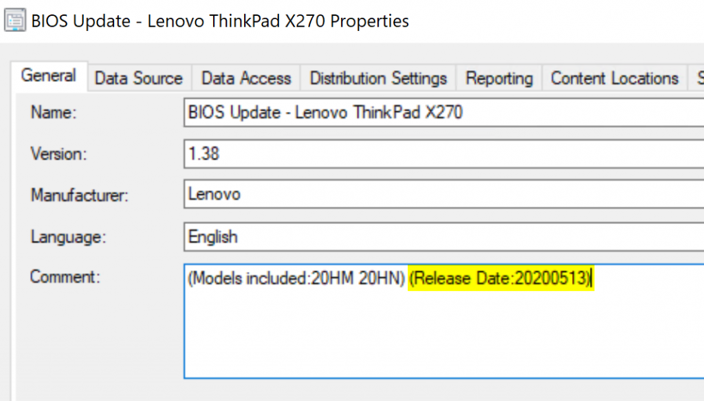
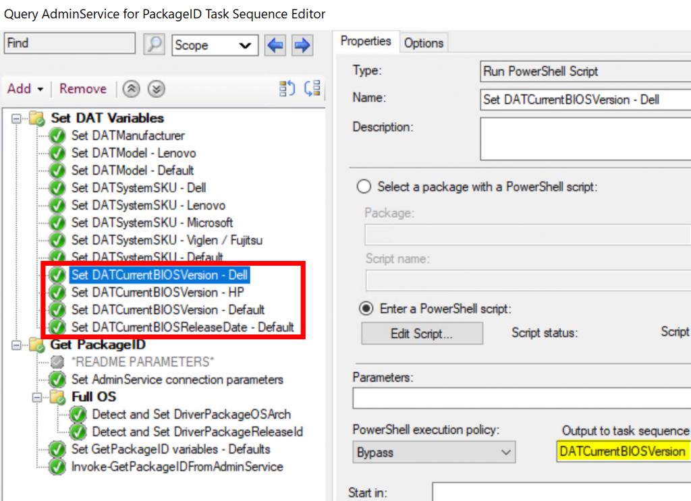

**2021-04-27 update: The solution now works over CMG. Please see this [post](https://sysmansquad.com/2021/04/27/updated-modern-driver-bios-management-with-cmg-support/) for details.**

If you haven't seen my first blog post about [modern driver management](https://www.sysmansquad.com/2020/05/15/modern-driver-management-with-the-administration-service/), the quick summary is that the solution uses packages created with the [Driver Automation Tool][2] and the [administration service](https://docs.microsoft.com/en-us/mem/configmgr/develop/adminservice/overview) to retrieve information on these packages and identify the most suitable driver package to apply in a task sequence.

In this second part, I'll be discussing the changes and improvements done to the existing solution to also dynamically retrieve and filter and apply BIOS updates.

Note: Download link for the task sequence exports is located at the end of the blog post.

### Invoke-GetPackageIDFromAdminService improvements

When I initially wrote the script that queries the AdminService, I wanted to make sure I could reuse the same script to return both BIOS and Driver packages. But when it was time to actually design the task sequence for applying BIOS packages, I found out that I forgot something to determine the system's current BIOS version and filter out any BIOS packages which were not an upgrade to the current system.

#### New parameters for BIOS information

I needed to provide more information to the script as a parameter regarding the system BIOS. The 2 following parameters were added to the script:

  * CurrentBIOSVersion
  * CurrentBIOSReleaseDate

**_Why do you need the release date of the BIOS?_**  
Good question! The original solution by the Nickolaj Andersen and Maurice Daly of [MSEndPointMgr](https://msendpointmgr.com/modern-bios-management/) uses the BIOS release date for Lenovo systems to determine if the BIOS package is an update or not. Now why exactly? I'm guessing Lenovo was not very good at keeping some sort of standard naming or versioning for their BIOS versions.<figure class="wp-block-image size-large">

 <figcaption>Example of a Lenovo BIOS package created with the Driver Automation Tool</figcaption></figure> 

#### BIOS filtering

Now that we have the current BIOS version and release date, we need to evaluate and filter out older BIOS package versions. We only want the script to return a package ID if the package is actually an upgrade for the device.

For this part, I had to dig into the [Invoke-CMDownloadBIOSPackage.ps1](https://github.com/MSEndpointMgr/ConfigMgr/blob/master/Operating%20System%20Deployment/BIOS/Invoke-CMDownloadBIOSPackage.ps1) script and in the script of the [Driver Automation Tool](https://github.com/maurice-daly/DriverAutomationTool/blob/master/Content/DriverAutomationTool.ps1) to see how they were filtering and extracting version information for the different vendors. I ended up with the following code to compare BIOS versions.

  <pre class="CodeMirror" data-setting="{&quot;mode&quot;:&quot;powershell&quot;,&quot;mime&quot;:&quot;application/x-powershell&quot;,&quot;theme&quot;:&quot;default&quot;,&quot;lineNumbers&quot;:true,&quot;styleActiveLine&quot;:true,&quot;lineWrapping&quot;:false,&quot;readOnly&quot;:false,&quot;languageLabel&quot;:&quot;language&quot;,&quot;language&quot;:&quot;PowerShell&quot;,&quot;modeName&quot;:&quot;powershell&quot;}">Add-TextToCMLog $LogFile  "Filtering package results to only BIOS packages that would be an upgrade to the current BIOS." $component 1
$ApplicableBIOSPackages = New-Object System.Collections.ArrayList
If($Manufacturer -ne "Lenovo"){
	#Check if any of the packages has a BIOS version higher than the current BIOS version
	If($CurrentBIOSVersion -and $CurrentBIOSVersion -ne "Unknown"){
		Add-TextToCMLog $LogFile  "Filtering package results to only packages that have a BIOS version higher than  `"$($CurrentBIOSVersion)`"" $component 1

		foreach($package in $Packages){
			switch($Manufacturer){
				"Dell"{
					If($package.Version -as [Version]){
						If($CurrentBIOSVersion -as [Version]){
							If(([Version]$Package.Version) -gt [Version]$CurrentBIOSVersion){
								[void]$ApplicableBIOSPackages.Add($package)
							}
						}ElseIf($CurrentBIOSVersion -like "A*"){
							#Moving from A__ version to a proper version number is considered an upgrade for Dell systems
							[void]$ApplicableBIOSPackages.Add($package)
						}
					}ElseIf(($Package.Version -like "A*") -and ($CurrentBIOSVersion -like "A*")){
						If(([Int32]::Parse(($Package.Version).TrimStart("A"))) -gt ([Int32]::Parse(($CurrentBIOSVersion).TrimStart("A")))){
							[void]$ApplicableBIOSPackages.Add($package)
						}
					}
				}
				"Hewlett-Packard"{
					$packageVersion = ($package.Version).TrimEnd(".")
					$packageVersion = $packageVersion.Split(" ")[0] #Example: 02.02.03 A 1 --&gt; Will only use 02.02.03 for evaluating
					If($packageVersion -as [Version]){
						If($CurrentBIOSVersion -as [Version]){
							If([Version]$packageVersion -gt [Version]$CurrentBIOSVersion){
								[void]$ApplicableBIOSPackages.Add($package)
							}
						}Else{#Attempting to extract a version number from the current BIOS version provided
							$CleanBIOSVersion = $CurrentBIOSVersion.TrimEnd(".")
							$CleanBIOSVersion = $CleanBIOSVersion.Split(" ")[0]
							If($CleanBIOSVersion -as [Version]){
								If([Version]$packageVersion -gt [Version]$CleanBIOSVersion){
									[void]$ApplicableBIOSPackages.Add($package)
								}
							}
						}
					}ElseIf($packageVersion -match ".*F\.(\d+)$"){
						$packageVersion = $matches[1]
						If($CurrentBIOSVersion -match ".*F\.(\d+)$"){
							If([int32]$packageVersion -gt [int32]$matches[1]){
								[void]$ApplicableBIOSPackages.add($package)
							}
						}
					}
				}
				"Microsoft"{
					Add-TextToCMLog $LogFile  "No BIOS package will be returned, Microsoft provides firmware updates as part of their driver packages." $component 2
				}
				default{
					#Any other manufacturer: Compare versions only if they both parse as [Version] objects
					If(($package.Version -as [Version]) -and ($CurrentBIOSVersion -as [Version])){
						If([Version]($package.Version) -gt [Version]$CurrentBIOSVersion){
							[void]$ApplicableBIOSPackages.Add($package)
						}
					}
				}
			}
		}
	}Else{
		Add-TextToCMLog $LogFile  "No current BIOS version specified, cannot compare BIOS version." $component 3
	}
}Else{
	#Lenovo Only: Check if any of the remaining packages have a BIOS Release Date newer than the current BIOS Release Date
	Add-TextToCMLog $LogFile  "Filtering package results to only packages that have a BIOS release date newer than `"$($CurrentBIOSReleaseDate)`"." $component 1
	$BIOSReleaseDate = [datetime]::ParseExact($CurrentBIOSReleaseDate,"yyyyMMdd",$null)
	foreach($package in $Packages){
		If($package.Description -match "\(Models included:(.*)\) \(Release Date:(.*)\)"){
			Try{
				$ReleaseDate = [datetime]::ParseExact($matches[2],"yyyyMMdd",$null)
				If($ReleaseDate -gt $BIOSReleaseDate){
					[void]$ApplicableBIOSPackages.Add($package)
				}
			}Catch{
				Add-TextToCMLog $LogFile  "Failed to parse `"$matches[2]`" as a BIOS release date for package `"$($package.Name)`", skipping..." $component 2
			}
		}
	}
}</pre>

<figure class="wp-block-image size-large">

 <figcaption>Example of the log file created when querying for a BIOS package</figcaption></figure> 

With these enhancements done on the script, we are now ready to use a task sequence to dynamically apply BIOS packages.

### Task Sequences modifications

#### Modify the "Query AdminService for PackageID" TS

We need to provide the current BIOS version and release date to the script in the task sequence.<figure class="wp-block-image size-large">

 <figcaption>New TS variables used for BIOS packages</figcaption></figure> 

Then we pass this information as a parameter to the Invoke-GetPackageIDFromAdminService script.<figure class="wp-block-image size-large">

 </figure> 

#### Create the "Apply BIOS package" task sequence

The task sequence is similar to the one I had created for drivers. For applying the actual BIOS update, I've reused the scripts by the guys at [MSEndpointMgr](https://msendpointmgr.com/).<figure class="wp-block-image size-large">

 </figure> 

#### Regarding HP BIOS updates

If your HP devices have a BIOS password set (I hope you do), then you'll need to specify 2 more variables:

  * PasswordBinFilename: Name of the .bin file to use when applying BIOS update
  * PasswordBinPackageID: PackageID of the package containing the .bin file.

I had to modify the original [Invoke-HPBIOSUpdate](https://github.com/MSEndpointMgr/ConfigMgr/blob/master/Operating%20System%20Deployment/BIOS/Invoke-HPBIOSUpdate.ps1) script to add a new parameter to specify the path to the .bin file because the original script would expect the .bin file to be in the same folder as the script.

I also did not like the fact that the HP BIOS utility writes a log file in whatever directory it's located in with no options to specify a different log path, so I added a step to move the log file to _SMSTSLogPath.

### Download

[Direct link to the task sequences](https://github.com/CharlesNRU/mdm-adminservice/raw/master/MDM-TS.zip)

[Link to the github repository](https://github.com/CharlesNRU/mdm-adminservice/raw/master/MDM-TS.zip)

As always, feel free to contact me if you have any suggestions for improvements.

Thank you.

