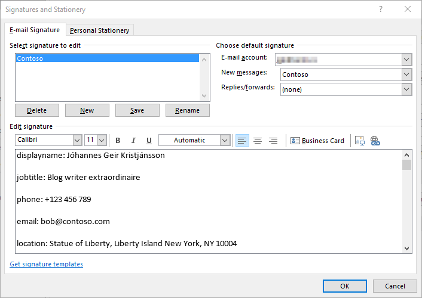

Howdy y'all!

Since you have already read [señor Shackelfords blog post](https://sysmansquad.com/2020/07/07/intune-autopilot-proactive-remediation/) on setting up Endpoint Analytics Proactive remediations, we can skip the intro and dive right in.

In this blog post we will be get familiar with a somewhat novel idea that proactive remediation's can be used for. Which, as the title of this post suggests, is the creation of a dynamic email signature in the form of a .html file using Microsoft Graph.

## Getting Started

To get started you need to familiarize your self with how to connect to the Microsoft Graph and query for data. Luckily [Brad Wyatt ](https://www.thelazyadministrator.com)has made an [excellent blog post](https://www.thelazyadministrator.com/2019/07/22/connect-and-navigate-the-microsoft-graph-api-with-powershell/) on the subject, so go read it before you read the rest of this post. Follow the steps he lists to create a new Azure application. When you get to the Client Credentials section, see below.

Welcome back. Now that we are on the same page, let's continue. The application we create in Azure needs to be granted the User.Read.All permission. don't forget to grant consent if prompted.

  <figure class="aligncenter size-full is-resized"></figure>

  <em>Note: Setting permissions properly is essential to prevent Azure applications from being exploited. Only grant the minimum rights needed for the app.</em>

## Discovery

Now on to the fun part. We need a discovery script that will checks if the Outlook signature file exists, how old it is and if no file exists, report non-compliance. If the file is older than current day, its also non compliant. 

Note the `$signatureFileName` variable on line 2, you need to decide on the signature name. It can be anything you want.

  <pre class="CodeMirror" data-setting="{&quot;mode&quot;:&quot;powershell&quot;,&quot;mime&quot;:&quot;application/x-powershell&quot;,&quot;theme&quot;:&quot;default&quot;,&quot;lineNumbers&quot;:true,&quot;styleActiveLine&quot;:true,&quot;lineWrapping&quot;:true,&quot;readOnly&quot;:false,&quot;fileName&quot;:&quot;Discovery.ps1&quot;,&quot;language&quot;:&quot;PowerShell&quot;,&quot;modeName&quot;:&quot;powershell&quot;}"># must be the same name as the file that is generated by the Remediation script
$signatureFileName = "contoso.htm"

# check if signaturefile even exists
try {
    if ( (Test-Path $env:APPDATA\microsoft\signatures\$signatureFileName -ErrorAction stop) -eq $false) {

        Write-Host "$signatureFileName does not exist"
        exit 1

    }
}

catch {
    $errmeg = $_.exception.message
    Write-Error $errmeg
    exit 1
}

# check if the file is out of date
try {
    # check date
    $lastwritetimeday = (Get-ItemProperty -Path "$env:APPDATA\microsoft\signatures\$signatureFileName").LastWriteTime.DayOfYear
    $today = (Get-Date).DayOfYear

    if ($lastwritetimeday -lt $today) {
        Write-Host "signature is out of date"
        exit 1
    }
}

catch {
    $errmeg = $_.exception.message
    Write-Error $errmeg
    exit 1
}</pre>

## Remediation

Now on to the remediation part. You will need to populate a few variables.  
  
`$signatureFileName` (same as in the discovery script)  
  
The information required for these can be found in Azure AD in the app properties, as detailed in Brads blog:  
`$clientId`  
`$tenantName`  
`$clientSecret`

  <em>Pro Tip: the v1.0 graph will only return a few basic attributes about the user, the beta graph returns a whole lot more. </em>

  <pre class="CodeMirror" data-setting="{&quot;mode&quot;:&quot;powershell&quot;,&quot;mime&quot;:&quot;application/x-powershell&quot;,&quot;theme&quot;:&quot;default&quot;,&quot;lineNumbers&quot;:true,&quot;styleActiveLine&quot;:true,&quot;lineWrapping&quot;:true,&quot;readOnly&quot;:false,&quot;fileName&quot;:&quot;Remediation.ps1&quot;,&quot;language&quot;:&quot;PowerShell&quot;,&quot;modeName&quot;:&quot;powershell&quot;}">#Region Microsoft Graph
# must be the same name as specified in the discovery script
$signatureFileName = "Contoso.htm"

# Application (client) ID, tenant Name and secret
$clientId = ""
$tenantName = "contoso.onmicrosoft.com"
$clientSecret = "Hunter2"
$resource = "https://graph.microsoft.com/"
  
$ReqTokenBody = @{
    Grant_Type    = "client_credentials"
    Scope         = "https://graph.microsoft.com/.default"
    client_Id     = $clientID
    Client_Secret = $clientSecret
} 
 
$TokenResponse = Invoke-RestMethod -Uri "https://login.microsoftonline.com/$TenantName/oauth2/v2.0/token" -Method POST -Body $ReqTokenBody

# $apiUrl = 'https://graph.microsoft.com/beta/users/7b613445-d1b8-4af3-938b-c08a4e5b1160'

# who is currently logged on to the system
$upn = whoami /upn
$apiUrl = 'https://graph.microsoft.com/v1.0/users/{0}' -f $upn

$Data = Invoke-RestMethod -Headers @{Authorization = "Bearer $($Tokenresponse.access_token)" } -Uri $apiUrl -Method Get

#EndRegion Microsoft Graph

#Region Variables
# lets put the data into variables so easier placement in the HTML
$displayname = $data.displayName
$jobtitle = $data.jobTitle
$businessphone = $data.businessPhones
$mail = $data.mail
$officelocation = $data.officeLocation
#EndRegion Variables

#Region HTML

# keep in mind that if you use CSS, you need to put it its own here string, as the {} in CSS don't mix well with the -f format operator

$HTML = @' 
&lt;p&gt;displayname: {0} &lt;/p&gt;
&lt;p&gt;jobtitle: {1} &lt;/p&gt;
&lt;p&gt;phone: {2} &lt;/p&gt;
&lt;p&gt;email: {3} &lt;/p&gt;
&lt;p&gt;location: {4} &lt;/p&gt;
'@ -f $displayname, $jobtitle, $($businessphone), $mail, $officelocation
#EndRegion HTML

#Region Output
# check if the signatures directory exists, if not, create it
if ((Test-Path $env:APPDATA\microsoft\signatures) -eq $false) {new-item -ItemType directory -Name "signatures" -Path $env:APPDATA\microsoft\}

# output the .htm signature file

$html | out-file $env:APPDATA\microsoft\signatures\$signatureFileName -Force

#EndRegion Output</pre>

## Deployment

Now you just need to deploy the script package to a group, make sure its set to run with the logged-on credentials and use 64-bit PowerShell. Follow the steps in Jake's post to create a new script and deploy it.

Once the script package is on a client, the signature will appear in Outlook, though Outlook will not configure it as a default on its own. (perhaps an idea for another blog post).

  <figure class="aligncenter size-full is-resized"></figure>

### Questions/Issues?

If you run into any issues or have questions about anything Intune head over to the&nbsp;[WinAdmins discord community](https://aka.ms/winadmins)&nbsp;and go to the `#Intune` channel, and ask Jake to help you.
