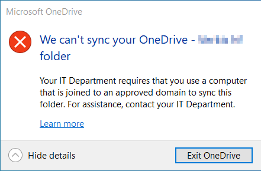

## The Problem

So I was walking on the beach and noticed that OneDrive wasn't syncing anymore on my AzureAD joined laptop. I later learned that my endpoint administrator, Adam Gross, had enabled [Allow syncing only on computers joined to specific domains](https://docs.microsoft.com/en-us/onedrive/allow-syncing-only-on-specific-domains) in the OneDrive admin portal. which effectively blocked my AzureAD device 🙁<figure class="wp-block-image size-large">

 </figure> 

Which resulted in this message on my corporate device<figure class="wp-block-image size-large">

 </figure> 

Our Legacy AD joined devices were fine, but all of our Azure AD joined devices got the above error.

Needless to say this was worrying since we were knee deep in migrating all new devices to AzureAD

## The Solution

But lo and behold, a golden savior appeared on the [windows admins discord](http://aka.ms/winadmins), a swell fellow called Configmatt commented:

<blockquote class="wp-block-quote">
  <p>
    Here are instructions for how to add Azure AD Join devices to your OneDrive for Business tenant restrictions.<br />• Ensure build 19.192+ of Sync client is installed <strong>(which was released in november 13, 2019)</strong><br />• Set the GUID for policy AADJMachineDomainGuid under HKEY_LOCAL_MACHINE\Software\Policies\Microsoft\OneDrive and apply it to the test AADJ machine. GUID can be any string.
  </p>
  
  <p>
    • Add the same GUID to SPOTenantSyncClientRestriction / OneDrive admin center to allow the test machine for SPO
  </p>
  
  <p>
    • Sync a SPO site on the test AADJ machine, the test machine should be able to sync
  </p>
  
  <p>
    I do have to point out that there are security concerns with this reg key: the domain GUID on the device and in the SharePoint service must match, but effectively the device is allowed to create the domain GUID and is allowed to sync if it matches
  </p>
</blockquote>

Now before we celebrate, we need to make a note that ideally you should be using conditional access and compliance policies to control access to corporate data. The method described in this blog post is a nice stop-gap until you can set those up.

## Implementation

While this might sound like a perfect use case for Endpoint analytics Proactive Remediations, you will run into a chicken-egg problem when a user starts up a brand new device, namely that the user has most likely logged into to a new device before the proactive remediation has run.

To solve this, you should wrap up the script as a win32 app, deploy it as a required app to a relevant device group and [make it required as part of the autopilot ESP](https://docs.microsoft.com/en-us/mem/intune/enrollment/windows-enrollment-status#block-access-to-a-device-until-a-specific-application-is-installed).

Here is a dead simple example code you can use, just change the $DomainGUID to your own


```powershell
$DomainGUID = "a2936ecb-ea97-4854-a494-82a39a3195be"
new-item -itemtype directory -path "hklm:\Software\Policies\Microsoft\OneDrive" -force
Set-ItemProperty -Path "hklm:\Software\Policies\Microsoft\OneDrive" -Name "AADJMachineDomainGuid" -Value $DomainGUID -Force
```


## Final words

Now keep in mind that you need to deploy this registry key to your Azure AD joined devices before you restrict the sync in the OneDrive Admin Center - otherwise your users will need to sign in to OneDrive again.
