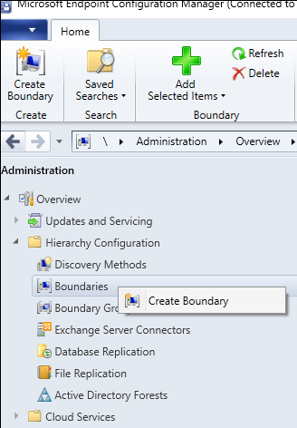
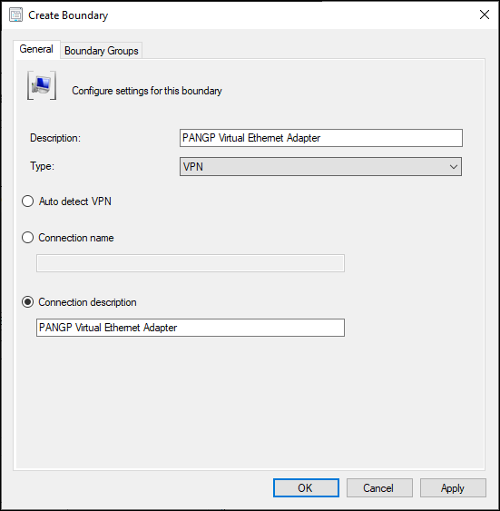
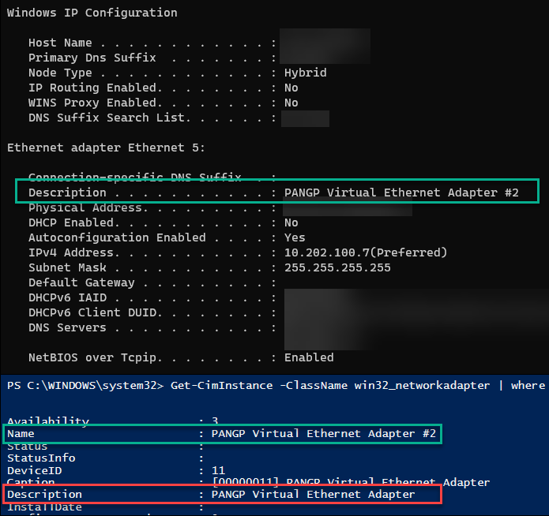
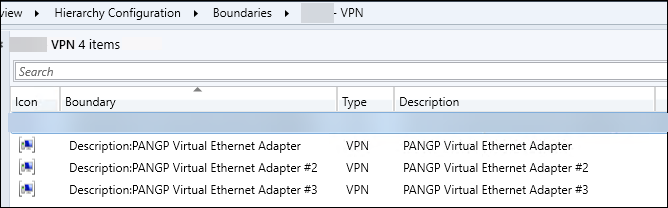

Like many, I was _very_ excited that the new [Configuration Manager 2006](https://docs.microsoft.com/mem/configmgr/core/plan-design/changes/whats-new-in-version-2006#vpn-boundary-type) release included a huge improvement for remote devices by adding a new [VPN Boundary type](https://docs.microsoft.com/mem/configmgr/core/servers/deploy/configure/boundaries#vpn).

> _"Finally! I don't have to constantly bug my Network Engineers as to which IP pools are being used for which VPN appliances."_

## Create A New Boundary

In the Admin Console, navigate to the Administration Node and open up Hierarchy Configuration and right-click on Boundaries

 

Select the new VPN option in the Type drop-down

 

## Exploring the VPN Type Options

### Types Defined

From the [Define boundaries - Configuration Manager | Microsoft Docs](https://docs.microsoft.com/mem/configmgr/core/servers/deploy/configure/boundaries#vpn), these are the type options:

* **Auto detect VPN**: Configuration Manager detects any VPN solution that uses the point-to-point tunneling protocol (PPTP). If it doesn't detect your VPN, use one of the other options. The boundary value in the console list will beAuto:On.
* **Connection name**: Specify the name of the VPN connection on the device. It's the name of the network adapter in Windows for the VPN connection. Configuration Manager matches the first 250 characters of the string, but doesn't support wildcard characters or partial strings. The boundary value in the console list will beName:&lt;name&gt;, where&lt;name&gt;is the connection name that you specify.  
  For example, you run theipconfigcommand on the device, and one of the sections starts with:PPP adapter ContosoVPN:. Use the stringContosoVPNas the**Connection name**. It displays in the list asName:CONTOSOVPN.
* **Connection description**: Specify the description of the VPN connection. Configuration Manager matches the first 243 characters of the string, **but doesn't support wildcard characters or partial strings**. The boundary value in the console list will be Description: &lt;description&gt;, where&lt;description&gt;is the connection description that you specify.  

For example, you run the `ipconfig /all` command on the device, and one of the connections includes the following line: 

> Description . . . . . . . . . . . : Contoso MainVPN. 

Use the string `Contoso MainVPN` as the **Connection description**. It displays in the list as `Description:CONTOSOMAINVPN`.

### Finding the Best Fit

|**Type**|**Decision**|**Selected**|
|--------|------------|------------|
|**Auto detect VPN**|We don't use PPTP| |
|**Connection name**|This won't work as our VPN client doesn't create a "section" with a title like `PPP adapter ContosoVPN`| |
|**Connection description**|Just need to copy the Description value from ipconfig/all and we're done!|X|

Obviously that didn't work, otherwise I'd be enjoying a low-ball of Macallan 12 year instead of typing this blog post. (Who am I kidding, I still made the drink.)

## To test, I followed the instructions

On a machine connected to our VPN solution, Palo Alto Global Protect, I capture the specified information from the documentation.

[][2]

Next, I went back to the Admin Console and my open Create Boundary window, and pasted the description from `ipconfig /all` into the Connection Description field.

 

Then I added the new Boundary to my VPN Boundary Group.

## Test Results

What happened next confused me. After forcing a few clients to update their Machine Policy, I saw VPN-connected devices drop _out_ of the VPN Boundary Group that I added my newly-created Boundary to. I double-checked my own machine:

```powershell
Get-CimInstance -Namespace "rootccmLocationServices" -ClassName "BoundaryGroupCache"
```

The output revealed that my machine was no longer in my VPN Boundary Group, and instead was merely in the fallback Default Boundary Group.  
But WHY?

Taking to Twitter, I posted a message...

> can you screenshot IPCONFIG /ALL on a device that is connected to that VPN
> &mdash; Rob York (@robdotyork) 
> [August 27, 2020](https://twitter.com/robdotyork/status/1298788226606329858?ref_src=twsrc%5Etfw)
  
and none other than Rob York responded, inadvertently leading me to answer my own question

> don’t know the answer to your specific question. Someone in the community likely will though. But what you saw is expected. This is evaluated client side. the info in the database is not used.
> &mdash; Rob York (@robdotyork) 
> [August 27, 2020](https://twitter.com/robdotyork/status/1298807830867111938?ref_src=twsrc%5Etfw)

## My mistakes were two-fold:

  1. Some of you may have noticed above that the output from `ipconfig/all` in my image did not match what I typed into the `Connection Description` field in the Boundary properties window.
      1. The [docs](https://docs.microsoft.com/mem/configmgr/core/servers/deploy/configure/boundaries#vpn) clearly state that the string must be exact and that wildcards are not supported (see red text in type definitions above).
  2. The second mistake I made was attempting to have forethought while also assuming I knew what I was doing.
      1. When I opened the Admin Console, I thought, "Hey, there's a chance that there could be slight variations in the Description value among the 1k+ devices I have. Let's check the database first."
      2. I ran this query and got the results shown in my Tweet above

```sql
select Distinct
Description0
FROM v_GS_NETWORK_ADAPTER
WHERE Description0 LIKE 'PANGP Virtual Ethernet Adapter%'
ORDER BY Description0
```

I assumed that the `Description` field populated in `win32_networkadapter` matched the `Description` field from `ipconfig/all`, but you already know that wasn't the case.

 

## The Solution

Once I re-read Rob York's response, I realized I was looking at the wrong property and ninja-edited my SQL query:

> _"But what you saw is expected"_
> 
> **Rob york**

```sql
select Distinct
Name0 AS 'VPN Boundary Description'
,Description0 AS 'win32_networkadapter description'

FROM v_GS_NETWORK_ADAPTER
WHERE Name0 LIKE 'PANGP Virtual Ethernet Adapter%'
ORDER BY Description0
```

This gave me more results and made me realize I needed a Boundary for each of these adapter Descriptions. Er... _Name0_

 

And now my VPN Boundary Group looks like this and devices are where they need to be.

 

[2]: https://www.sysmansquad.com/?attachment_id=1747
