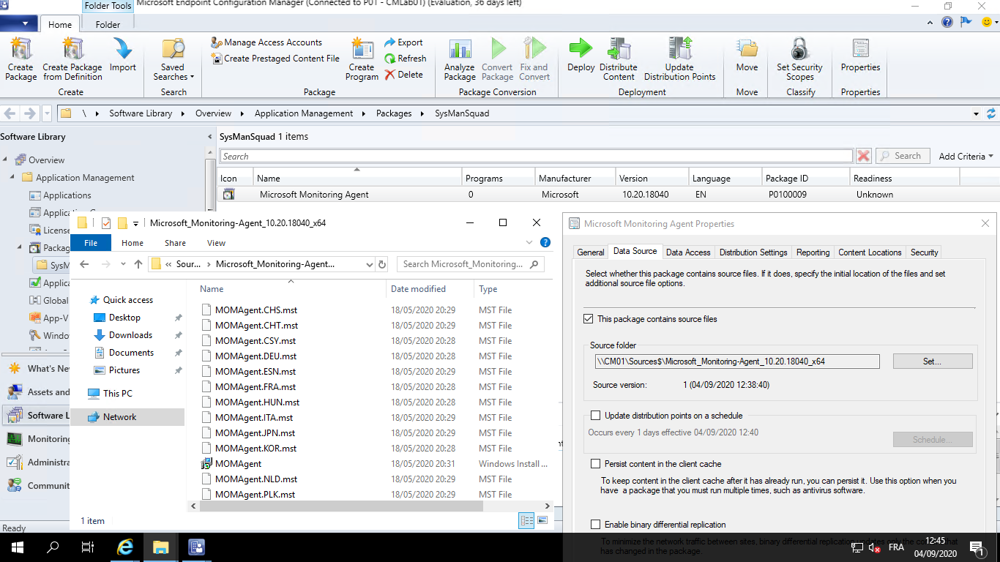
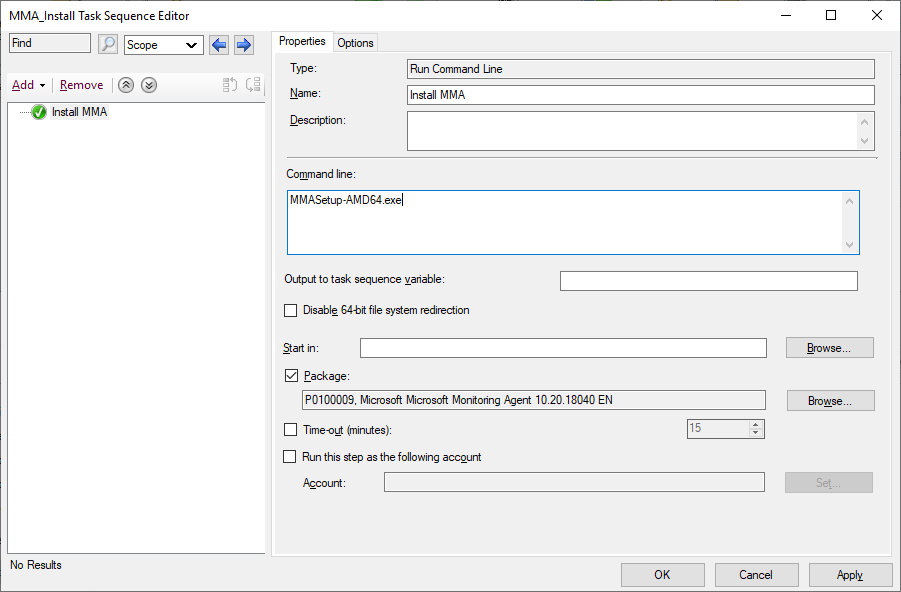

## Introduction

[Introduced with ConfigMgr 2002](https://docs.microsoft.com/mem/configmgr/core/plan-design/changes/whats-new-in-version-2002#task-sequence-as-an-app-model-deployment-type), the "**Task Sequence as an application deployment type**" feature is available in pre-release. That means it is still in active development and can contains bugs. Using a Task Sequence (TS) as a deployment type allows for more complex installation process that can even contains reboot. And as it is a Task Sequence, you can also benefit from many other feature like the use of TS variables. This will be the focus of this post.

Indeed, some applications require that you provide a password or other sensitive information during the installation process. With a standard application deployment, it often means these information must be stored in clear text (which is not the best way to keep them secret). With the Task Sequence model, you can use TS variables that can be hidden. Though not 100% safe, it is harder to get access to the information that you want to hide.

## Prerequisites and limitations

To use the "Task sequence as an app model deployment type" feature, you need to have at least Configuration Manager Current Branch 2002 installed. You also have [enable the pre-release feature](https://docs.microsoft.com/mem/configmgr/core/servers/manage/pre-release-features#enable-pre-release-features). Once this is done, you are all good.

It is also important to note that there are [some limitations](https://docs.microsoft.com/mem/configmgr/apps/get-started/creating-windows-applications#prerequisites-for-a-task-sequence-deployment-type) inherent to the Task Sequence deployment type:

* You can only use **non-OS deployment TS steps** (Like Install Package, Run Command Line or Run PowerShell Script);
* You can’t select the option for a **high-impact TS** in the User Notification tab.

There are also some [known issues](https://docs.microsoft.com/mem/configmgr/apps/get-started/creating-windows-applications#known-issues-for-a-task-sequence-deployment-type) (Remember the feature is still in pre-release):

* In version 2006 and earlier, you can’t deploy an application using a Task Sequence deployment type to a **user collection**;
* You can’t use the **Install Application** step.

## How to create an application with a Task Sequence deployment type

Before beginning with the use case, here is a quick How-to that will explain how to create an application that is using a Task Sequence as a deployment type in a few easy steps.

1. Create a package that will contains the source for the application you want to install but do not create a program associated to it;
1. Create a Task Sequence that will execute all the actions needed to install your application (Including a step that will use the package previously created);
1. Create an application and chose the **Custom deployment** setting. When you are at the deployment type creation, select Task Sequence and pick your TS. You can also select a Task Sequence for the un-installation of the application;
1. Deploy the application like any other.

 Package overview
 Task Sequence
 Deployment type selection
 Task sequence selection</

> **Note:** if you can’t find the TS in the drop-down menu, check your **RBAC** permissions. To be able to add a TS deployment type, you need to have the **Read Task Sequence permission**. It can be done by giving your account the Read-Only Analyst role (Which allows view on all Configuration Manager objects) or by creating a custom role with the sufficient permissions. If the permissions are good, double-check that the TS doesn't include the **OS deployment or OS upgrade step** and that you have not marked it as a **high-impact** Task Sequence.

## Use case: installation of the Microsoft Monitoring Agent to report to Microsoft Defender ATP

After this (long) introduction, let's move to a real world use case and see how the Microsoft Monitoring Agent (MMA) can be installed and set up to report to Microsoft Defender ATP without ever showing the workspace information in clear (Whether it be in logs or application settings).

Indeed, when you want to set up the Microsoft Monitoring Agent to report to an Azure Log Analytics service (The component used by MD ATP to collect data from other OS than Windows 10 or Windows Server 2019), you will be required to add a Workspace ID and a Workspace Key. It is best if these two values are not visible in an installation script, some command lines, or logs so we are going to hide them.

### 1. Package creation

The first step is to **create a package with the MMA source** (Remember you can’t use applications in a TS used as an application deployment type). This time, create a package with only the source and no program. Once it is created, **distribute the package** to your target Distribution Point(s).

Note that there is a particularity with the MMA executable. When you get the sources [from this page](https://docs.microsoft.com/azure/azure-monitor/platform/agent-windows#install-agent-using-dsc-in-azure-automation), you need to extract them because the MMA-Setup_AMD64.exe file can't be used for a silent installation. Instead, use the following command to extract its content and use this extracted content as the source of your package.

`MMASetup-AMD64.exe /c /t:Full Extraction Path>`

Package overview 

### 2. Task Sequence creation

Once it is done, you can start working on the Task Sequence. It will need only a few steps here.

First, set two **Task Sequence variables** to store the Workspace ID and the Workspace key that you can find in the MD-ATP portal. Then, set a third TS variable named [OSDDoNotLogCommand](https://docs.microsoft.com/mem/configmgr/osd/understand/task-sequence-variables#OSDDoNotLogCommand) to **True** to hide the command line in the log. Alternatively, you can also set [OSDLogPowerShellParameters](https://docs.microsoft.com/mem/configmgr/osd/understand/task-sequence-variables#OSDLogPowerShellParameters) to **False** to hide PowerShell parameters in smsts.log (If you are using PowerShell rather than CMD to install your application).

The next step is the **installation of the application** itself. Use the “**Run Command Line**” step and select the package you previously created and the following command line (Taken from the [online documentation](https://docs.microsoft.com/azure/azure-monitor/platform/agent-windows#install-agent-using-command-line)).

`setup.exe /qn NOAPM=1 ADD_OPINSIGHTS_WORKSPACE=1 OPINSIGHTS_WORKSPACE_AZURE_CLOUD_TYPE=0 OPINSIGHTS_WORKSPACE_ID="%WorkspaceID%" OPINSIGHTS_WORKSPACE_KEY="%WorkspaceKey%" AcceptEndUserLicenseAgreement=1`

Note that in place of the Workspace ID and key, you need to call the two TS variables that you have defined in the previous step. That is done by surrounding the variable name with the **% character**.

And voila! The Task Sequence is ready and as you can see, it is fairly simple.

*  Use the command line to install the application
*  Declaration of a secret TS variable

An alternative to the first step is to use **Collection variables**. This way, you can have different pairs of variables if you want to report to different workspaces. In the screenshot above, you may note another variable named MMA_ProxyURL is used. This one is set using collection variables because depending on the server location, the proxy URL is not the same.

### 3. Application creation

The last step is the creation of the application itself. **Create a new application** and select Custom deployment type. When you need to select your deployment type, chose **Task Sequence**. This will lead you to a screen that allows the selection of two TS. One for the installation (Mandatory) and one for the uninstallation (Optional) of the application.

Task Sequence Selection 

### 4. Testing the result

Now that the application is ready, **deploy it to a device collection** to install the agent on a server. Once it is installed, give a look at the logs. You need to look at the **smsts.log** file as the installation is executed with a Task Sequence. As you can notice below, the Workspace ID and key are never shown (Look at the yellow line).

smsts.log 
If you log onto your server and you start the Microsoft Monitoring Agent, you can see it is registered with the **Azure Logs Analytic** space, so everything worked as expected.

 

## Conclusion

**Task Sequence as an application deployment type** can help you deploy applications that require a complex installation process. But they can also be used to deploy simple application that requires password or other sensitive information that need to be hid with the help of TS variables though all the steps involved (Creating a package, a TS and finally an application) will add a little overhead to the complete process of creating and deploying an application.
