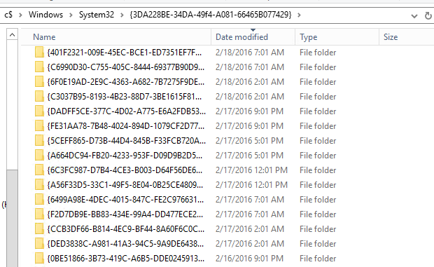

Over the weekend I ran into a weird issue that I hadn't seen before. I was upgrading half of the Distribution Points for a client who's ConfigMgr was in need of some TLC. I've been working on getting their overall infrastructure healthy and that includes upgrading their DPs from Windows Server 2012 to Windows Server 2016 (and eventually 2019). 

Once I started the upgrades I worked on other things while checking in on them periodically. After a few hours I discovered that they were all still offline and I could only access them via the `C$` admin share (C**-Money** as [Ben Reader](https://twitter.com/powers_hell) calls it). I checked the `setupact.log` and found that each server was stuck doing the same thing - recursively migrating folders from the old OS `<strong>C:\Windows.old\Windows\System32\{3DA228BE-34DA-49f4-A081-66465B077429}</strong>` to the new OS `<strong>C:\Windows\System32\{3DA228BE-34DA-49f4-A081-66465B077429}</strong>`. 

  <figure class="aligncenter size-full is-resized"><figcaption><strong>C:\Windows\System32\{3DA228BE-34DA-49f4-A081-66465B077429}</strong></figcaption></figure>

After over 12 hours of waiting for setup to complete, my contact at the client company rebooted the servers in VMWare and the servers rolled back to Server 2012. After deleting the folder contents, the upgrades all completed fine.

During this process, I checked all of the hung servers and found that the each had 60,000-100,000+ `{GUID}` folders, each with a sub folder called `badmifs`. ConfigMgr uses **`mif`** files (I thought mif meant - **Machine Inventory File**, but [according to Garth, it means <strong>Management Information File</strong>](https://www.enhansoft.com/what-is-a-management-information-format-mif-file/). Garth knows everything.) so I at least had a starting point for finding the source of the folders. The issue here was that the migration process was crawling - copying 1 folder every 2 seconds with an expected completion of sometime next Tuesday! After remotely running `rmdir /q/s` for several hours on several of them, which was working, just slowly, I realized that I could just relocate the entire folder to the root of `c:\` in a few seconds and delete them after the upgrade was complete, which is what I did using the aptly named `move` command.

This morning, I reached out the the ConfigMgr team to file a bug and already heard back that they found the source and ultimately that this folder is linked to some legacy code and can safely be deleted (Thank you for the help on this!!). 

Even though this will likely be fixed in a future release, I was curious about the source still. After searching all through the registry, started checking the client install logs the log I was looking for. It confirmed that the root folder `C:\Windows\System32\{3DA228BE-34DA-49f4-A081-66465B077429}` is created as a backup folder by the ConfigMgr installer `client.msi` where it's backing up old settings/inventory data to a new `{GUID}` folder before upgrading the client, then it restores the data back, but seems to be leaving the backup folders behind. Check out this excerpt from `C:\Windows\ccmsetup\Logs`\`client.msi.log` file from one of my production workstations.

  <pre class="CodeMirror" data-setting="{"mode":"null","mime":"text/plain","theme":"default","lineNumbers":true,"styleActiveLine":true,"lineWrapping":true,"readOnly":false,"fileName":"client.msi.log","language":"Plain Text","modeName":"text"}">MSI (s) (CC:3C) [11:03:21:957]: Executing op: ActionStart(Name=SmsDeinstallDesktopClient,Description=This custom action uninstalls the desktop client with following steps-
1. Makes sure there are no desktop client installations in progress and prevents any new instance of intallation.
2. Checks the desktop client version and gets the installation directory.
3. Stops remote control and other desktop components.
4. Kills the following client processes - clisvc1.exe, pea32.exe, smsapm32.exe, smsmon32.exe and sms_reen.exe.
5. Saves information needed for migration and uninstalls the desktop components followed by clean up.,Template=[1])
...
MSI (s) (CC!40) [11:03:22:299]: Creating MSIHANDLE (13311) of type 790531 for thread 39744
[11:03:22] Backed up directory C:\Windows\CCM\Inventory\idmifs\badmifs to {3DA228BE-34DA-49f4-A081-66465B077429}\{F661685D-0D28-463B-A87C-70F5D1736700}\badmifs
MSI (s) (CC!40) [11:03:22:300]: Closing MSIHANDLE (13311) of type 790531 for thread 39744
MSI (s) (CC!40) [11:03:22:301]: Creating MSIHANDLE (13312) of type 790531 for thread 39744
[11:03:22] Backed up directory C:\Windows\CCM\Inventory\idmifs to {3DA228BE-34DA-49f4-A081-66465B077429}\{F661685D-0D28-463B-A87C-70F5D1736700}
MSI (s) (CC!40) [11:03:22:301]: Closing MSIHANDLE (13312) of type 790531 for thread 39744
MSI (s) (CC!40) [11:03:22:301]: Creating MSIHANDLE (13313) of type 790531 for thread 39744
[11:03:22] Backed up directory C:\Windows\CCM\Inventory\noidmifs\badmifs to {3DA228BE-34DA-49f4-A081-66465B077429}\{38F7D84E-8A58-480E-9B90-3A3CAA761D3D}\badmifs
MSI (s) (CC!40) [11:03:22:302]: Closing MSIHANDLE (13313) of type 790531 for thread 39744
MSI (s) (CC!40) [11:03:22:302]: Creating MSIHANDLE (13314) of type 790531 for thread 39744
[11:03:22] Backed up directory C:\Windows\CCM\Inventory\noidmifs to {3DA228BE-34DA-49f4-A081-66465B077429}\{38F7D84E-8A58-480E-9B90-3A3CAA761D3D}
... 
MSI (s) (CC:3C) [11:03:55:701]: Executing op: ActionStart(Name=SmsMigrateInventory,Description=Migrating SMS Legacy Client inventory settings,)
[11:03:55] Custom action complete.
MSI (s) (CC:3C) [11:03:55:702]: Executing op: CustomActionSchedule(Action=SmsMigrateInventory,ActionType=3073,Source=BinaryData,Target=SmsMigrateInventory,CustomActionData=C:\Windows\CCM\Inventory\idmifs
C:\Windows\CCM\Inventory\noidmifs)
MSI (s) (CC:3C) [11:03:55:704]: Creating MSIHANDLE (20844) of type 790536 for thread 45372
MSI (s) (CC:08) [11:03:55:705]: Invoking remote custom action. DLL: C:\WINDOWS\Installer\MSIA2A.tmp, Entrypoint: SmsMigrateInventory
MSI (s) (CC!24) [11:03:55:710]: Creating MSIHANDLE (20845) of type 790531 for thread 52772
MSI (s) (CC!24) [11:03:55:711]: Closing MSIHANDLE (20845) of type 790531 for thread 52772
MSI (s) (CC!24) [11:03:55:711]: Creating MSIHANDLE (20846) of type 790531 for thread 52772
[11:03:55] Backed up directory {3DA228BE-34DA-49f4-A081-66465B077429}\{F661685D-0D28-463B-A87C-70F5D1736700}\badmifs to C:\Windows\CCM\Inventory\idmifs\badmifs
MSI (s) (CC!24) [11:03:55:711]: Closing MSIHANDLE (20846) of type 790531 for thread 52772
MSI (s) (CC!24) [11:03:55:711]: Creating MSIHANDLE (20847) of type 790531 for thread 52772
[11:03:55] Backed up directory {3DA228BE-34DA-49f4-A081-66465B077429}\{F661685D-0D28-463B-A87C-70F5D1736700} to C:\Windows\CCM\Inventory\idmifs
MSI (s) (CC!24) [11:03:55:712]: Closing MSIHANDLE (20847) of type 790531 for thread 52772
MSI (s) (CC!24) [11:03:55:712]: Creating MSIHANDLE (20848) of type 790531 for thread 52772
[11:03:55] Backed up directory {3DA228BE-34DA-49f4-A081-66465B077429}\{38F7D84E-8A58-480E-9B90-3A3CAA761D3D}\badmifs to C:\Windows\CCM\Inventory\noidmifs\badmifs
MSI (s) (CC!24) [11:03:55:712]: Closing MSIHANDLE (20848) of type 790531 for thread 52772
MSI (s) (CC!24) [11:03:55:712]: Creating MSIHANDLE (20849) of type 790531 for thread 52772
[11:03:55] Backed up directory {3DA228BE-34DA-49f4-A081-66465B077429}\{38F7D84E-8A58-480E-9B90-3A3CAA761D3D} to C:\Windows\CCM\Inventory\noidmifs
MSI (s) (CC!24) [11:03:55:713]: Closing MSIHANDLE (20849) of type 790531 for thread 52772</pre>

In my client's environment, the number of folders seemed to be quite excessive so I checked my production environment to compare by using Run Scripts to run a small PowerShell script to output the count of folders found (see below for code). I found that on average, my machines have about empty 24 folders in this location with the largest number hitting ~600 folders. When I checked the workstation with ~600 folders, I found that a majority of them were created on the same day and had the same timestamp which feels like it could be caused by a client install that is failing in some catastrophic way - just a guess though. I also did the same check in my client's environment and found that there may have been a client health service that was attempting a repair every 5 hours, ever day, FOREVER!

  <figure class="aligncenter is-resized"></figure>

Ultimately, I was instructed that the folders weren't needed and could be safely deleted. So I updated my discovery script to check for the folders and delete them where necessary. Since the deletion of a large number of folders was taking hours, I tested out using `robocopy` with the `/mir` command to copy over a blank folder and overwrite the existing folder. This improved performance drastically! My lab is giving me issues tonight, but I will try to get the script added to the ConfigMgr Community Hub for easier downloading. In the meantime, I've included a link to the script in my Github repo as well as included it below.

I should mention, I am not concerned about a small number of folders, even a few thousand likely won't slow down an OS upgrade enough to worry about. This is about ensuring that we don't have other machines hang during upgrades as we roll out Windows 10 Feature Updates and other servers are upgraded.

  CAUTION - This script can wipe out folders if used incorrectly. Proceed with great care and test before running it.

[PowershellScripts/CleanupFoldersWithRoboCopy.ps1 at master · AdamGrossTX/PowershellScripts (github.com)](https://github.com/AdamGrossTX/PowershellScripts/blob/master/ConfigMgr/Troubleshooting/CleanupFoldersWithRoboCopy.ps1)

  <pre class="CodeMirror" data-setting="{"mode":"powershell","mime":"application/x-powershell","theme":"default","lineNumbers":true,"styleActiveLine":true,"lineWrapping":true,"readOnly":false,"fileName":"<a href=\"https://github.com/AdamGrossTX/PowershellScripts/commit/58b32c71fb3755430754d476b2324c365061245b\">CleanupFoldersWithRoboCopy.ps1</a>","language":"PowerShell","modeName":"powershell"}">[cmdletbinding()]
param(
    $incoming,
    $Folder = "{3DA228BE-34DA-49f4-A081-66465B077429}",
    $DestinationRoot = "C:\Windows\System32",
    [switch]$remediate #1 or 0
)

try {
    $DestPath = Join-Path -Path $DestinationRoot -ChildPath $Folder
    $DestinationFolder = Get-Item -Path $DestPath -ErrorAction SilentlyContinue
    if ($DestinationFolder) {
        $TempFolder = New-Item -Path "$($env:TEMP)\$($Folder)" -ItemType Directory -Force
        $StartCount = ($DestinationFolder | Get-ChildItem).Count
        if ($remediate.IsPresent -and $TempFolder) {
            & robocopy "$($TempFolder.FullName)" "$($DestinationFolder.FullName.ToString())" /mir /r:0 /w:0 /e | Out-Null
            $TempFolder | Remove-Item -Force #-ErrorAction SilentlyContinue
            $EndCount = ($DestinationFolder | Get-ChildItem).Count
            return $EndCount
        }
        else {
            return $StartCount
        }
    }
    else {
        return 0
    }
}
catch {
    throw $_
}</pre>

## Summary

This was a very interesting challenge that let me learn several new things.

  * Items within `C:\Windows` will migrate during a Feature Update or OS Upgrade as long as they aren't in default locations that are excluded by the default migration mapping engine. I had previously thought this wasn't the case. It means I may be able to move my feature update scripts into a more secure location.
  * Robocopy is faster than other file/folder deletion options. The included script can easily be re-used to rapidly clear out large folder structures
  * The ConfigMgr client has a storied history and still holds many secrets 🙂

Special thanks to the some of folks over at the [WinAdmins Discord ](http://aka.ms/WinAdmins)server who helped me validate my findings and the ConfigMgr team taking a look at the issue so quickly.

