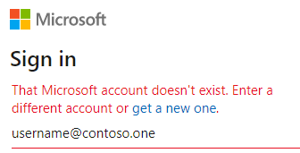
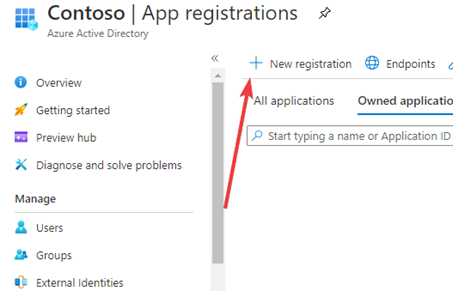
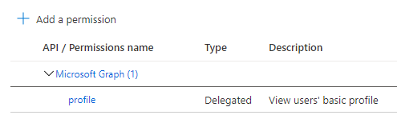
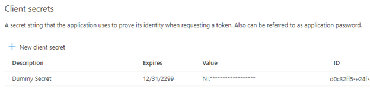
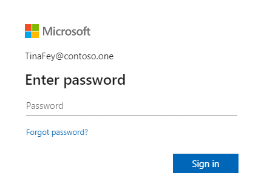
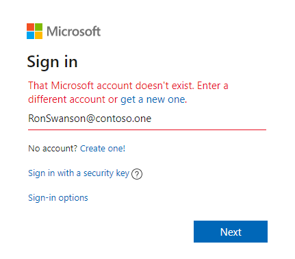
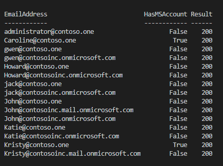
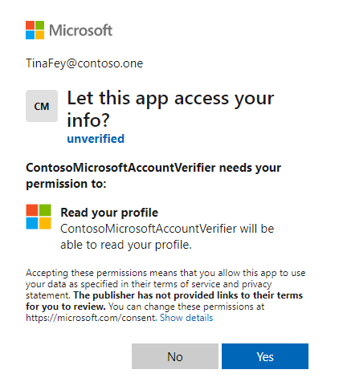

The other day I was helping someone over in the [WinAdmins Discord](https://aka.ms/WinAdmins). Their users kept getting confused about what their passwords were, and it was causing a lot of HelpDesk tickets. Let's find out what users have Microsoft accounts on the company domain so we can help move those accounts elsewhere to streamline the user experience.

## Update on Prevention:

> Microsoft has introduced some changes that at least seem to prevent *NEW* Microsoft Accounts on Company Domains. I added more details in the [Preventing](#preventing) section if you want to read more about this. If you just want to find the accounts, jump to [Identifying the Problem](#identifying-the-problem).

### Preventing new registration

Microsoft has introduced some changes that at least seem to prevent *NEW* Microsoft Accounts on Company Domains. I haven't been able to find any specific announcement about this feature/capability, but supposedly all you need to do is have the relevant domain in your Office 365 Domains as Managed.

### What the blocking looks like

So far, it seems that the blocking will prevent them from Registering a new account with a validated work email domain, or from adding that email as an alias.

Blocked from registering from a new Microsoft Account with Company Email
Blocked from adding the company email as an alias on a current account
Seems to work off Domain, not specific Email Addresses

## Identifying the Problem

This prompt is the main source of the user’s confusion; the email address is the same for the user’s Work/School account and a Microsoft account. When an app supports signing in with both a Work/School and Personal account, it prompts the user for which type of account they want to use. Most users don't know what the difference is, or where the Microsoft account came from.


As that link in the screenshot says, you can [Rename the personal Microsoft account](https://go.microsoft.com/fwlink/p/?LinkID=733247), but how can you know which users have a conflicting Microsoft account?

## Designing a Solution

To find these conflicting Microsoft accounts, we can ... abuse... an Azure App Registrations capabilities. We create a custom application that we register to only accept Microsoft accounts, not AzureAD/Work/School accounts. – if you try to use an email for your domain that doesn’t have a Microsoft account, it will just throw back an error that no Microsoft account could be found.



Even better! We can leverage this, along with **[login hints](https://docs.microsoft.com/azure/active-directory/develop/active-directory-optional-claims#:~:text=app%2Buser%20token.-,login_hint,-Login%20hint)**, to scale this up and make a scriptable solution to find any domain emails that have a Microsoft account conflicting with their Work account.

At this time, I don’t know of a way to prevent Microsoft accounts on the company domain, or automatically move them - but we can at least find the conflicts. This will allow the Help Desk to contact the end-user and help them relocate the personal account.

## Setting up your App Registration

To set this up, we need to head to the [Azure Portal](https://portal.azure.com/#blade/Microsoft_AAD_IAM/ActiveDirectoryMenuBlade/RegisteredApps) and create a new **app registration**

 We need a name for the consumers to see if they authorize our test application. I used: `ContosoMicrosoftAccountVerifier`

For supported account types, we cannot use the first three options because they all support tenant/company logins, but the fourth type will serve our purposes.

 We do not need a redirect URL for this setup.

Next, we need to setup a few aspects of the application, to use for dummy information.

Under **API Permissions**, we need to add a permission of some sort for it to request access to. The least amount of permissions was just the **Profile** permission.

 Even though people should not be logging into our App, we need to setup some sort of Authentication for the App to theoretically use, even though we won't use it.

Under **Certificates and Secrets**, I created a New Client Secret. You do not need to save the key values

 

## Constructing our App Authorization URL

Next, we need to gather the information for our authentication URL.

* Authentication endpoints
* Application ID (Client ID in the URL)
* Email Addresses to check
* Scope for our API Permissions

We get most of these from our App’s Overview page, from the API Permissions tab, and combine those with some other parameters from the [OAuth 2.0 code flow](https://docs.microsoft.com/azure/active-directory/develop/v2-oauth2-auth-code-flow#request-an-authorization-code) to get a URL similar to the one below

`https://login.microsoftonline.com/consumers/oauth2/v2.0/authorize?client_id=bd53bb89-0cc1-4eb3-90b7-ba008b1f2a2c&scope=user.read&response_type=code&state=23424&login_hint=TinaFey@contoso.one`

You can test this URL above live for yourself, or use your own app created with the process above. Just adjust the **Client_ID** to match your **Application ID**, and adjust the **login_hint** to match your user.

### **Valid Microsoft Account**

 Note: the email address is recognized, and the prompt has switched to “Enter password” 

### **No Valid Microsoft Account**

 Note: the email address is not recognized, and the prompt still shows “That Microsoft account doesn’t exist” 

## Scripting the verification Process

Below is a quick script I made to build a list of all the company emails and iterate through checking them.

```powershell
#$emailAddresses = 'tinafey@contoso.one','username@domain.com','ronswanson@contoso.one'
$emailAddresses = Get-EXORecipient -RecipientTypeDetails UserMailbox -PropertySets Minimum | select -ExpandProperty Emailaddresses | where {$_ -match "SMTP:"} | foreach {$_ -replace '^smtp:'} 

$ApplicationID  = 'bd53bb89-0cc1-4eb3-90b7-ba008b1f2a2c'
$scope          = 'user.read'

$results = [System.Collections.ArrayList]::new()
$emailAddresses | foreach -Begin { $i = 1} -Process {
Write-Progress -Activity 'Checking Email Addresses for Microsoft Accounts' -CurrentOperation ("Checking {0} - {1}/{2}" -f $_,$i,$emailAddresses.Count) -PercentComplete ($i/($emailAddresses.count)*100)
$UserURL  = 'https://login.microsoftonline.com/consumers/oauth2/v2.0/authorize?client_id={0}&scope={1}&response_type=code&state=23424&login_hint={2}' -f $ApplicationID,$scope,$_
$response = Invoke-WebRequest -Uri $UserURL 

$results.Add( 
[psCustomobject]@{
EmailAddress = $_
HasMSAccount = $response -match '"HasPassword":1' 
Result       = $response.StatusCode
}
) | Out-Null
$i++
} 
$results

```



## User Consent Prompt

Our app doesn’t have any server code. We only need to get to the pre-login experience to confirm whether an email address has a Microsoft account associated with it. This means that users don’t need to finish logging in and authorize the app, but if they do finish logging in, they will get a consent prompt like this.

 Note: **Unverified** is the default state, but you can verify your tenant to show your company’s name instead. Details [here](https://go.microsoft.com/fwlink/?linkid=2121525&clcid=0x9)

## Wrap up

With this app we made, we can verify whether any email address has a Microsoft account associated with it with an automated method that we can script against.

To test any email address manually, just remove the **login_hint** parameter from the URL and you can enter any email address to check it, even without their password.

[https://login.microsoftonline.com/consumers/oauth2/v2.0/authorize?client_id=**bd53bb89-0cc1-4eb3-90b7-ba008b1f2a2c**&scope=user.read&response_type=code&state=23424](https://login.microsoftonline.com/consumers/oauth2/v2.0/authorize?client_id=bd53bb89-0cc1-4eb3-90b7-ba008b1f2a2c&scope=user.read&response_type=code&state=23424&login_hint=TinaFey@contoso.one)
