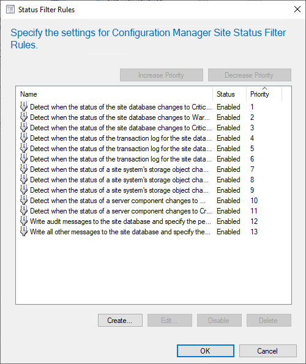
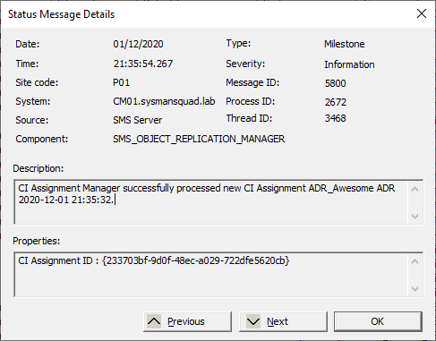
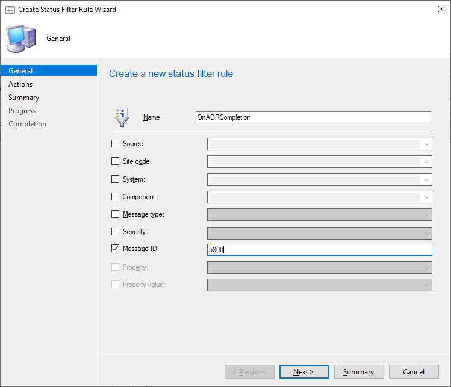
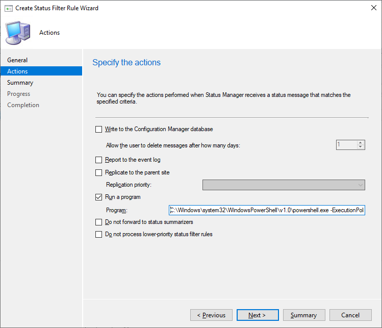
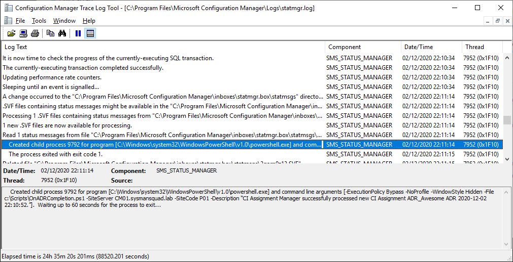

## Introduction

MEMCM already offers a lot of features to help SysAdmins automate many processes and save them a lot of time to ~~drink more coffee☕~~ work on less mundane and more interesting tasks.

Among them, there are **Automatic Deployment Rules** (ADR) that let you automate patch management for your Windows devices. There are also **Status Filter Rules** that allow you to execute actions (Launch a program, execute a script…) when specific status messages are processed by the site server.

If we mix them and add a bit of **PowerShell** scripting on top of that, we can get even more done. So, let’s go and give your ADR a little boost with Status Filter Rules and PowerShell!

## Status Messages and Status Filter Rules, what are they?

### Status Messages

Before looking at Status Filter Rules, it’s good to know what [Status Messages](https://docs.microsoft.com/mem/configmgr/develop/core/servers/manage/about-configuration-manager-status-messages) are in Configuration Manager. Status Messages are informational messages generated by the various MEMCM components to inform the administrator about their health and actions. They are similar to Windows events as they also have different attributes like a severity classification, an ID or a description.

For example, when a new application is created, a status message is generated. If a Distribution Point has failed to process some content, a status message is generated. Or if a collection has been deleted by someone, a status message is also generated. There are a few hundred different status message that can be generated in a MEMCM environment when something happens. To help you find the one you desire, a big list of the different status messages is available on [GitHub](https://github.com/KlausBilger/SCCM_MsgID).

### Status Filter Rules

Status Filter Rules allow you to trigger an action each time a status message meets defined criteria that you have set with filters. Simple, yet really effective.

They are created from **Administration > Overview > Site Configuration > Sites**. Right click on the desired site and select Status Filter Rules to open the list of pre-existing rules and create, edit, or delete your own rules.



From there, you need to give your rule a name and you can select different filters criteria that, when met, will trigger the rule's actions that you can select on the next window of the wizard. More on that later.

There are also many PowerShell cmdlets available to work with Status Filter rules. You can find more about them on the [Microsoft Docs site](https://docs.microsoft.com/search/?terms=CMStatusFilterRules&category=Reference).

The last important bit of information is that Status Filter Rules allow you to use variable that you can pass as parameters when calling your program. For a complete list of all the existing variables, you can take a look at [this page](https://github.com/SysManSquad/BlogFiles/blob/master/mdebona/List%20of%20Status%20Filter%20Rules%20variables.md).

## Getting more from ADR with PowerShell

Now that we have basic knowledge on status messages and Status Filter Rules, we can start to use them to get more from our Automatic Deployment Rules. To achieve this goal, we will do the following with PowerShell:

* Rename the created Software Update Group (SUG) to remove the time of execution (The date is enough);
* Change the maximum allowed installation time for each update in the SUG if the updates are aimed at servers;
* Generate an HTML report which contains some basic information on each updates that are part of the SUG.

These are just examples of what can be done once the PowerShell script is kicking in action and you can come up with many other ideas. The complete script that will be shown in this post can be found in our [GitHub repository](https://github.com/SysManSquad/BlogFiles/blob/master/mdebona/OnADRCompletion.ps1). Below is a breakdown of its main sections.

Note that the script presented in this example assumes that the ADR is creating a new Software Update Group each time it is executed.

### Prerequisites

The script will start with some kind of prerequisites. This is a part that could be common to many scripts used in Status Filter Rules and that will let the script kick into action by gathering a few needed variables and loading the mandatory PowerShell module.

First, we get two parameters that will be used to connect to the good MEMCM site. The third parameter is the text of the status message that has been trapped by the Status Filter Rule. Next, the ConfigurationManager PowerShell module is imported and the PSDrive linked to the MEMCM site is created if it has not been automatically when the module was imported (It happens sometimes). With all of that in place, the script is ready to execute some actions.

```powershell
[CmdletBinding()]
param(
# Name of the site server returned by the Status Filter Rule
[Parameter(Mandatory = $true)]
[String] $SiteServer,
# Site code returned by the Status Filter Rule
[Parameter(Mandatory = $true)]
[String] $SiteCode,
# Description of the Status Message returned by the Status Filter Rule
[Parameter(Mandatory = $true)]
[String] $Description
)

# Import the ConfigurationManager.psd1 module
if (-not(Get-Module ConfigurationManager)) {
try {
Import-Module ("{0}\..\ConfigurationManager.psd1" -f $ENV:SMS_ADMIN_UI_PATH)
}
catch {
Exit 1
}
}

# Create the site PSDrive if it has not been created automatically during the module importation
If(-not(Get-PSDrive $SiteCode)) {
try {
New-PSDrive -Name $SiteCode -PSProvider "AdminUI.PS.Provider\CMSite" -Root $SiteServer | Out-Null
}
catch {
Exit 1
}
}

# Set the location to the Configuration Manager PSDrive to be able to use MEMCM Powershell commands
Set-Location "$($SiteCode):"
```

### Actions

For the next part, it is important to know what's the trapped message looking like because that will be the content of the **Description** variable. When an ADR is executed and a new Software Update Group is created, a status message with **ID 5800** is generated.



The exact value of the Description field is the following:

> CI Assignment Manager successfully processed new CI Assignment %1.

In this message, the **%1** variable will take the following pattern :

* "**ADR Name yyyy-MM-dd HH:mm:ss**" if the ADR is set to create a new Software Update Group upon each execution.
* "**ADR Name**" if it is set to reuse the same SUG.

Be careful with the renaming of your Software Update Group. If your ADR runs more than once a day, the second time it will run, the script will fail because the second SUG would have the same name as the first one. Indeed, each SUG needs to have a unique name.

With this new knowledge in mind, the next part of the script identifies if a Software Update Group exists with the name and creation date that have been extracted from the status message. If one is found (Hint: it should or you have a serious problem!) and that it's not a SUG containing Windows Defender definitions, then the SUG is renamed (To remove the time part of the complete name). Next, the maximum execution time for each update in the Software Update Group is changed to 120 minutes if it is aimed at servers.

**Note on maximum execution time:** Be careful when changing the maximum execution time of your updates if you are using Maintenance Windows for updates deployment. If the cumulative execution time is longer than the length of the Maintenance Window, the updates won't apply. You will even get a status message to let you know that. 😉

```powershell
# Regex to capture the name of the created SUG and the creation date
[regex]$Regex = "CI Assignment Manager successfully processed new CI Assignment\s+(?Name>.*)\s(?Date>\d{4}-\d{2}-\d{2})"

# Use the Regex on the Description variable to extract the SUG's name and creation date. Store the values in variables
$Description | Select-String -Pattern $Regex -AllMatches | ForEach-Object {
[string]$DeploymentName = $_.Matches.Groups[$Regex.GroupNumberFromName("Name")].Value
[string]$DeploymentDate = $_.Matches.Groups[$Regex.GroupNumberFromName("Date")].Value
}

# Check the SUG name. If it contains the word "Definition", it is a SUG containing the Windows Defender definitionsso the script stops
# Can be changeg to whatever fits best your environment
If ($DeploymentName -notlike "*Definition*") {
# Look for a SUG with the same name and creation date. If it exists, the script continues. Otherwise, it stops.
If ($SUG = Get-CMSoftwareUpdateGroup -Name "$($DeploymentName)*" | Where-Object {(Get-Date $_.DateCreated -Format 'yyyy-MM-dd') -eq (Get-Date $DeploymentDate -Format 'yyyy-MM-dd')}) {
# Create a new name without the SUG's creation time, keeping only the name and creation date. Then, rename the SUG
$NewSUGName = "$DeploymentName $DeploymentDate"
Set-CMSoftwareUpdateGroup -InputObject $SUG -NewName $NewSUGName

# If the SUG name matches a specific name, set the maximum execution time of each updates in the SUG to 120 minutes
If($DeploymentName -match '^ADR_WinServ') {
ForEach ($Update in (Get-CMSoftwareUpdate -UpdateGroupID $SUG.CI_ID -Fast)) {
Set-CMSoftwareUpdate -InputObject $Update -MaximumExecutionMins 120
}
}
}
}
```

#### Reporting

The following block of code should be placed within the two If blocks of the previous code block. It has been moved outside for the sole purpose of cutting the whole code in different sections.

Once all these actions are done, it's time for some reporting. There are multiple options available, from sending a mail to posting a message to Teams. For this example, I have decided to generate a simple HTML file that will look the same way an email would look.

First, a bit of CSS is added to make the HTML look prettier. Then, a table is created which contains some information on each updates that are part of the Software Update Group. Finally, the different pieces are stitched together and an HTML file is generated.

```powershell
# Define some CSS style that will be added to the HTML report header
$HtmlHeader = @"
style>
body {
font-size: 12px;
font-family: Arial, Helvetica, sans-serif;
}
table {
font-size: 12px;
border: 0px;
font-family: Arial, Helvetica, sans-serif;
}

td {
padding: 4px;
margin: 0px;
border: 0;
}

th {
background: #395870;
background: linear-gradient(#49708f, #293f50);
color: #fff;
font-size: 11px;
text-transform: uppercase;
padding: 10px 15px;
vertical-align: middle;
}

tbody tr:nth-child(even) {
background: #f0f0f2;
}
/style>
"@

# Define the text that will be part of the HTML report in a herestring. Be careful with "@
$PreContent = @"
Hello, br/>br/>

The $NewSUGName Software Update Group has been created. It contains the following updates:br/>br/>
"@

# Build an array of PS Objects each containing the KB ID, KB Name and execution time
$Info = @()
ForEach ($Update in (Get-CMSoftwareUpdate -UpdateGroupID $SUG.CI_ID -Fast))
{
$UpdateProperties = [PSCustomObject]@{
KB = $Update.ArticleID
Titre = $Update.LocalizedDisplayName
# Though it's set in minutes, the execution time is stored in seconds so we need to divide it by 60 to display the value in minutes
"Max execution time (mins)" = $Update.MaxExecutionTime / 60
}
$Info += $UpdateProperties
}

# Build an HTML table out of the previous array and add the header and precontent text
$Info | ConvertTo-Html -As Table -PreContent $PreContent -Head $HtmlHeader | Out-File "C:\Temp\$NewSUGName.html"
```

## Using Status Filter Rule to execute the script automatically

Now that the script is ready, let's hook it to a Status Filter Rule to automate its execution. Let's go back to **Administration > Overview > Site Configuration > Sites** and right click on the desired site where the Status Filter Rule should be created.

In the new window, follow this steps:

* Click the **Create** button and chose a name for your rule;
* Check the **Message ID** box and type **5800** in the field next to it;
* Click on the **Next** button.

That's it for the filter, we don't need anything else. On the **Actions** page, check the **Run a program** checkbox and enter the following command line (See below). Then click **Next** to review your Status Filter Rule and complete the wizard.

This command line will call the PowerShell script with three parameters. As you can see, they are Status Filter Rules variables.

`C:\Windows\system32\WindowsPowerShell\v1.0\powershell.exe -ExecutionPolicy Bypass -NoProfile -WindowStyle Hidden -File C:\Scripts\OnADRCompletion.ps1 -SiteServer %sitesvr -SiteCode %sc -Description "%msgdesc"`

[](SFR-Creation_Part-1.png) Selecting filters</figcaption></figure>
[](SFR-Creation_Part-2.png) Setting actions</figcaption></figure>

Your Status Filter Rule is now ready to work. All you have to do is to wait for your ADR to hit the next scheduled execution and see the result. Or if you don't want to wait, you can force one of your ADR to run.

## Final verification

Once it's completed, the Status Filter Rule should trap the status message corresponding to the Software Update Group creation and start the PowerShell script.

To check if anything was wrong, you can take a look at the **statmgr.log**. There should be a log line stating that the PowerShell process has been started with the arguments that you have set in the Status Filter Rule.

</figure>
