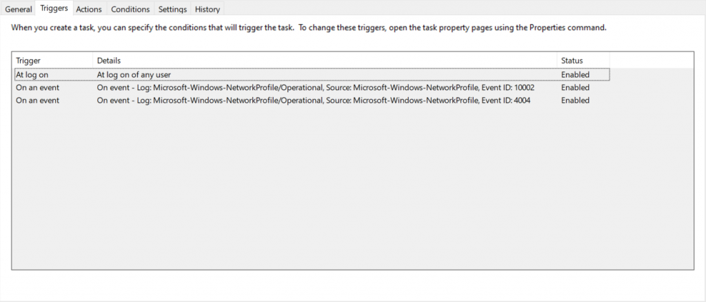

 

This guide is part of a video series companion guide on setting up mapped drives on Intune devices - you can watch the video here [S02E18 How to Map Network Drives on Microsoft Intune Devices - (I.T)](https://www.youtube.com/watch?v=hHtXFeuHkC4)! This is rather simple but I will be adding some useful bits of code for people who do not have an always on VPN solution for all those Work From Home scenarios. 

## Creating the script

Before we get started let me explain how this process works. We are going to create a script that we deploy via intune, which in turn will create a scheduled task to map the network drives at login. We will then be adding a few lines of code to also have it map on any network changes.

1. Go to [https://intunedrivemapping.azurewebsites.net/DriveMapping](https://intunedrivemapping.azurewebsites.net/DriveMapping)
2. Follow the onscreen options to add/remove mapped drives as needed
3. Select **Download Powershell Script**
4. Edit the powershell script, near the bottom you will see the following line  
  `$trigger=New-ScheduledTaskTrigger-AtLogOn`
5. Remove everything below that point and add the following

```powershell
$trigger = New-ScheduledTaskTrigger -AtLogOn

$class = cimclass MSFT_TaskEventTrigger root/Microsoft/Windows/TaskScheduler
$trigger2 = $class | New-CimInstance -ClientOnly
$trigger2.Enabled = $True
$trigger2.Subscription = 'QueryList>Query Id="0" Path="Microsoft-Windows-NetworkProfile/Operational">Select Path="Microsoft-Windows-NetworkProfile/Operational">*[System[Provider[@Name=''Microsoft-Windows-NetworkProfile''] and EventID=10002]]/Select>/Query>/QueryList>'

$trigger3 = $class | New-CimInstance -ClientOnly
$trigger3.Enabled = $True
$trigger3.Subscription = 'QueryList>Query Id="0" Path="Microsoft-Windows-NetworkProfile/Operational">Select Path="Microsoft-Windows-NetworkProfile/Operational">*[System[Provider[@Name=''Microsoft-Windows-NetworkProfile''] and EventID=4004]]/Select>/Query>/QueryList>'

#Execute task in users context
$principal= New-ScheduledTaskPrincipal -GroupId "S-1-5-32-545" -Id "Author"

#call the vbscript helper and pass the PosH script as argument
$action = New-ScheduledTaskAction -Execute $wscriptPath -Argument "`"$dummyScriptPath`" `"$scriptPath`""

$settings= New-ScheduledTaskSettingsSet -AllowStartIfOnBatteries -DontStopIfGoingOnBatteries

$null=Register-ScheduledTask -TaskName $schtaskName -Trigger $trigger,$trigger2,$trigger3 -Action $action  -Principal $principal -Settings $settings -Description $schtaskDescription -Force

Start-ScheduledTask -TaskName $schtaskName
stop-Transcript
}
```

## Upload to Intune

  1. Navigate to [https://endpoint.microsoft.com/](https://endpoint.microsoft.com/)
  2. Select **Devices**
  3. Select **Scripts**
  4. Select **Add - Windows 10**
  5. Give it a Name and select **Next**
  6. Select your script file and **Next**
  7. Assign to the desired user group and **Next**
  8. Select **Add**

## Verify the Scheduled Task Exists

Once you have deployed the script to the selected group, you can sync Intune policies through Company Portal. Remember it can take up to 8 hours for this to appear. You should see a scheduled Task named `IntuneDriveMapping` and the triggers should look like the below.

 
