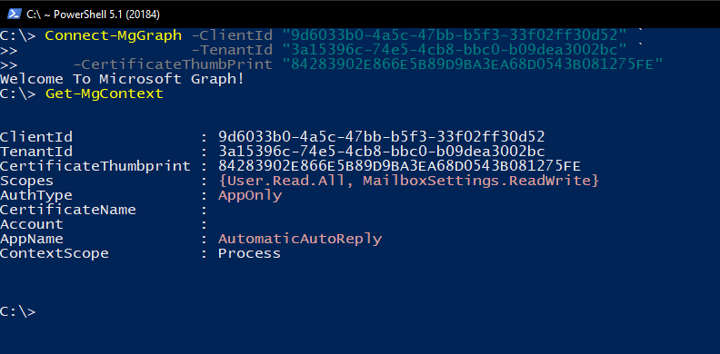
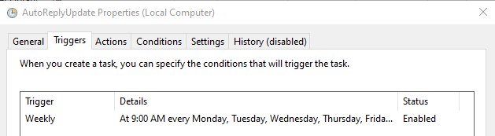
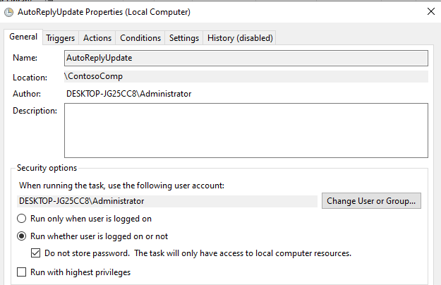
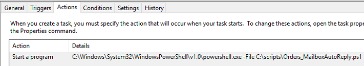

Have you ever had customers emailing in outside of hours? In this post we will setup some scripted automatic maintenance of Auto-Reply responses on a user account. 

We considered several possibilities but the customer did not have an Azure Subscription yet, we ended up using **PowerShell**, **Microsoft Graph**, **App Authentication**, and a **Scheduled Task**. 

<!--more-->

Our customer will be moving to Azure later so we will probably revisit this as Azure Functions, or possibly Power Automate later on. For now, we went through a few options for these responses: 

  * Ticketing system responses
  * Outlook rules
  * Out-of-office responses
  * Some tool or process to receive and process emails and respond at appropriate times
 

  

    

      Table Of Contents
    

  

  
  

    <ol class="uagb-toc__list">
      <li class="uagb-toc__list">
        [Create our App Registration](#create-our-app-registration)<li class="uagb-toc__list">
          [Using our App Auth Certificate](#using-our-app-auth-certificate)<li class="uagb-toc__list">
            [Assembling our Update Script](#assembling-our-update-script)<li class="uagb-toc__list">
              [Scheduling the Script](#scheduling-the-script)<li class="uagb-toc__list">
                [Conclusion](#conclusion)<ul class="uagb-toc__list">
                  <li class="uagb-toc__list">
                    [Where to find me](#where-to-find-me)
                  </li>
                </ul></ol> 
 
 
 
                
                

                  We chose to use the <strong>out-of-office responses</strong> for our setup, because they would not need a separate server/service to run them, a running copy of Outlook to process them, and this customer did not have a current Azure Subscription to charge against for a more server-less solution like Azure Automation, Functions, or Power Automate.
                

                
                

                  So, since Microsoft doesn't have a way to set up multiple sets of responses ahead of time, we need to create:
                

                
                <ul>
                  <li>
                    something to make the changes <ul>
                      <li>
                        our script below will use <strong>Microsoft Graph</strong> to update the user's <strong>Auto-Reply</strong> settings
                      </li>
                    </ul>
                  </li>
                  
                  <li>
                    a way for our script to log in without a user present<ul>
                      <li>
                        we set up <strong>Certificate Authentication</strong> so that we can have this working securely, without a password or token to compromise
                      </li>
                    </ul>
                  </li>
                  
                  <li>
                    and an automated way to run our script<ul>
                      <li>
                        we opted for a <strong>Scheduled Task</strong> just as a simple way to schedule the update script to run regularly and access the certificate we will use to authenticate to <strong>MS Graph</strong>
                      </li>
                    </ul>
                  </li>
                </ul>
                
                <h2>
                  Create our App Registration
                </h2>
                
                

                  First, we need to create an App to use for authentication, so that a user or administrator doesn't have to log in every time to run this. Just like my last post, where we created an app registration to [Find Microsoft Accounts on your company domain](https://sysmansquad.com/2020/11/23/find-microsoft-accounts/#setting-up-your-app-registration), we need to register an App for our script to authenticate and be granted permissions.
                

                
                

                  This time, for our setup process we will:
                

                
                <ul>
                  <li>
                    create a <strong>single tenant</strong> app
                  </li>
                  <li>
                    add API Permissions to <strong>ReadWrite </strong>all <strong>MailboxSettings</strong><ul>
                      <li>
                        in my example, I am requesting ReadWrite to all, but you should be able to [scope it to specific users](https://docs.microsoft.com/en-us/graph/auth-limit-mailbox-access) for a more secure implementation
                      </li>
                    </ul>
                  </li>
                  
                  <li>
                    create a <strong>certificate</strong> for authentication
                  </li>
                  <li>
                    upload the authentication <strong>certificate</strong> to the new <strong>App</strong>
                  </li>
                  <li>
                    export local copies of the <strong>Public cert</strong> and <strong>PFX </strong>to C:\Temp<ul>
                      <li>
                        if you need to set this Script up on another machine, you will need to import the <strong>PFX</strong> into the <strong>user store</strong> on that <strong>machine</strong>
                      </li>
                    </ul>
                  </li>
                  
                  <li>
                    grant <strong>Admin Consent</strong> for the <strong>app permissions</strong>
                  </li>
                  <li>
                    Generate our <strong>Connect-MGGraph</strong> Command to use in the out-of-office automation script
                  </li>
                </ul>
                
                

                  This is a long list of tasks, and for more details and a more GUI-based walkthrough, I recommend you check out [this post](https://laurakokkarinen.com/authenticating-to-office-365-apis-with-a-certificate-step-by-step/#creating-the-certificate). For the ease of my setup (and to keep this a reasonable length) I included a script below to set everything up.
                

                
                

                  Just setup the first few variables on lines 2-4 with your options
                

                
                

                  <pre class="CodeMirror" data-setting="{"mode":"powershell","mime":"application/x-powershell","theme":"default","lineNumbers":true,"styleActiveLine":true,"lineWrapping":true,"readOnly":false,"fileName":"Create_Certificate_And_App.ps1","align":"wide","language":"PowerShell","modeName":"powershell"}"># --- config start
$appName = "AutomaticAutoReply"
$password = "Come up with something secure!" # Certificate password
$folderPath = "C:\temp" # Where do you want the certificate files to get saved to? The folder needs to exist.

#region Graph permissions & constants
$graphResourceId = "00000003-0000-0000-c000-000000000000"
$UserReadAll = @{
    Id   = "df021288-bdef-4463-88db-98f22de89214"
    Type = "Role"
}
$MailboxSettingsReadWriteAll = @{
    Id   = "6931bccd-447a-43d1-b442-00a195474933"
    Type = "Role"
} 
#endregion

#region Create Certificate
$certStoreLocation = "cert:\CurrentUser\My"
$certificate = New-SelfSignedCertificate -Subject $appName  -CertStoreLocation $certStoreLocation -NotBefore (Get-Date).AddDays(-1) -NotAfter (Get-Date).AddYears(10) -KeyExportPolicy Exportable -KeySpec Signature

$certificatePath = $certStoreLocation + '\' + $certificate.Thumbprint
$filePath = $folderPath + '\' + $appName
$securePassword = ConvertTo-SecureString -String $password -Force -AsPlainText
Export-Certificate -Cert $certificatePath -FilePath ($filePath + '.cer')
Export-PfxCertificate -Cert $certificatePath -FilePath ($filePath + '.pfx') -Password $securePassword
#endregion

# Requires an Global Admin for the rights to the Application ReadWrite scopes to register the app
#region Create App Registration
Connect-MgGraph -Scopes "Application.ReadWrite.All User.Read"
Select-MgProfile beta 
# Get context for access to tenant ID
$context = Get-MgContext

$appRegistration = New-MgApplication -DisplayName $AppName -SignInAudience "AzureADMyOrg" `
    -RequiredResourceAccess @{ ResourceAppId = $graphResourceId; ResourceAccess = $UserReadAll, $MailboxSettingsReadWriteAll } `
    -AdditionalProperties @{} -KeyCredentials @(@{ Type = "AsymmetricX509Cert"; Usage = "Verify"; Key = $certificate.RawData })

#Add convenience RedirectURLs to the app
$redirectURIPatch = '{"web":{"redirectUris":[' + "`"https://portal.azure.com/#blade/Microsoft_AAD_RegisteredApps/ApplicationMenuBlade/CallAnAPI/appId/$($appRegistration.AppId)/isMSAApp/`"" + ']}}'
Invoke-GraphRequest -Uri "https://graph.microsoft.com/v1.0/applications/$($appRegistration.Id)" -Method PATCH -Body $redirectURIPatch -ContentType 'application/json'

# Create corresponding service principal
New-MgServicePrincipal -AppId $appRegistration.AppId -AdditionalProperties @{} | Out-Null
#endregion

#Write Out Admin Consent URL
$adminConsentUrl = "https://login.microsoftonline.com/{0}/adminconsent?client_id={1}" -f $context.TenantId,$appRegistration.AppId
Write-Host -ForeGroundColor Yellow "Please go to the following URL in your browser to provide admin consent"
Write-Host $adminConsentUrl 
Pause ; Write-Host 

#Generate Connect-MgGraph App W/ Cert Auth command
$connectGraph = "Connect-MgGraph -ClientId `"{0}`" -TenantId `"{1}`" -CertificateThumbPrint `"{2}`"" -f $appRegistration.AppId, $context.TenantId, $certificate.Thumbprint 
Write-Host -ForeGroundColor Cyan "After providing admin consent, you can use the following values with Connect-MgGraph for app-only:"
Write-Host $connectGraph
$connectGraph + "`n Get-MgContext" | Set-Clipboard 
Write-Host -ForeGroundColor Cyan "Copied to ClipBoard"
</pre>
                

                
                <h2 id="Using-auth-cert">
                  Using our App Auth Certificate
                </h2>
                
                

                  To use the App auth Certificate is fairly simple, and the script above outputs the command to use. For my app it came out to the <strong>Connect-mgGraph</strong> command shown below.
                
<figure class="wp-block-image size-large" id="AppAuthExampleImage">
                
                <figcaption>Sample <strong>Connect-mgGraph</strong> command shown above Connected with Certificate based, AppOnly login. </figcaption></figure> 

                  You can use the <strong>Get-mgContext</strong> to verify you are connected <strong>AppOnly</strong>/non-interactive login, as well as the <strong>app name </strong>and your <strong>permissions scopes</strong>.
                

                
                

                  For a comparison, here is a screenshot of what this looks like connected as my Global Admin during the app registration - [Screenshot](https://i.imgur.com/cEi2DNy.png)
                

                
                <h2>
                  Assembling our Update Script
                </h2>
                
                

                  Now that we can authenticate to the Graph API, we need to make a script to update the Out-of-office messages, which are part of the [MailboxSettings](https://docs.microsoft.com/en-us/graph/api/user-get-mailboxsettings?view=graph-rest-1.0&tabs=http) resource.
                

                
                

                  Using those variables from the previous app we created above, it provided out several variables we will need in the top of the script below. You can see them in the [previous screenshot](#AppAuthExampleImage). Pull those variables into Lines 3-6 below.
                

                
                

                  We can select our User to update the Automatic Out-of-office responses on, and even setup a Teams WebHook notification for failures or errors, like they did for this post [Teams Channel Notification when OSD Fails](https://sysmansquad.com/2020/04/22/teams-channel-notification-when-osd-fails/#step-1). Just update <code>$WebHookURL</code> on line 12 with your WebHookURL and set the user you want to maintain on line 9.
                

                
                

                  In the script below, I set up Out-Of-Office replies scheduled from 5PM until 8AM the following workday morning.
                

                
                

                  Next, on lines 58-75, I assemble a <strong>patch JSON</strong>, and use Invoke-GraphRequest to patch it onto our user and change the settings.
                

                
                

                  <pre class="CodeMirror" data-setting="{"mode":"powershell","mime":"application/x-powershell","theme":"default","lineNumbers":true,"styleActiveLine":true,"lineWrapping":true,"readOnly":false,"fileName":"Update-AutoReply.ps1","align":"wide","language":"PowerShell","modeName":"powershell"}">#Region Variables
#Vars for Graph Connection
$ClientID   = '9d6033b0-XXXX-XXXX-XXXX-33f02ff30d52'
#$tenant    = 'Contoso.one'    #Domain Name for a tenant also works here in my testing, just as Tenant GUID does
$tenant     = '3a15396c-YYYY-YYYY-YYYY-b09dea3002bc' 
$thumbPrint = '84283902E8ZZZZZZZZZZZZZZZZZZZZZZ081275FE'

#User to Update AutomaticReply settings on 
$updateUser = 'orders@contoso.one'

#Vars for Error Reporting - Teams WebHook URL
$WebHookUrl = "https://outlook.office.com/webhook/4e19076a-7be4-4a07-a7ab-7ba839f6d29b@ca5590ff-9078-4e3c-bd01-54e9ef648e8f/IncomingWebhook/xxxxxxxx-xxxx-xxxx-xxxx-xxxxxxxxxxx/be9d78f9-d8f2-4932-8246-64ae2aa11f8a"
#EndRegion

#Function to Assemble Error into text and send it to a Teams Channel for alerting on errors
function Fail() { 
param (
    $ErrorRecord,
    $WebHookUrl
)
    
    $body = ConvertTo-JSON -Depth 2 @{
        title = "Mailbox Auto Reply Maintenance Failed"
        text  =  $ErrorRecord | Out-String
    }

    Invoke-RestMethod -Uri $WebHookUrl -Method Post -Body $body -ContentType 'application/json'
}

$Message = "Thank you, we have received your email and will respond the following business day. &lt;br /&gt; &lt;br /&gt; Our regular business hours are Monday - Friday, 8AM - 5PM, EST."

#Get today's date
$Today = (Get-Date)
#Test Other Dates - Cannot be in the past!
#$Today = [datetime]'2021-11-20'

#Get day of week
$Day = $Today.DayOfWeek.ToString()

#format today to normal date
$sTime = $Today.ToString('MM/dd/yyyy')
#format tomorrow to normal date
$eTime = $Today.AddDays(1).ToString('MM/dd/yyyy')

#combine date and time to start reply
$StartTime = "$sTime 17:00:00"
#combine date and time to end reply 
$EndTime = "$eTime 08:00:00"

#if Friday set from Friday 5pm to Monday 8am
if ($Day -eq "Friday") {
    #format weekend dates 
    $wTime = $Today.AddDays(3).ToString('MM/dd/yyyy')
    #combine weekend and time 
    $weekendTime = "$wTime 08:00:00"
}

$patch = @"
{
    "automaticRepliesSetting": {
        "status": "Scheduled",
        "externalAudience": "all",
        "internalReplyMessage": "$Message",
        "externalReplyMessage": "$Message",
        "scheduledStartDateTime": {
            "dateTime": "$($StartTime.ToUniversalTime().ToString("s"))",
            "timeZone": "UTC"
        },
        "scheduledEndDateTime": {
            "dateTime": "$($EndTime.ToUniversalTime().ToString("s"))",
            "timeZone": "UTC"
        }
    }   
}
"@
try {
    Connect-MgGraph -ClientId $ClientID -CertificateThumbprint ($Thumbprint ) -TenantId $tenant -Verbose 
    Select-MgProfile -Name beta

    Invoke-GraphRequest -Uri "https://graph.microsoft.com/beta/users/$($updateUser)/mailboxsettings"  -Method PATCH $patch  -Verbose -ContentType 'application/json'
}
catch {
    Fail -ErrorRecord $_ -WebHookUrl $WebHookUrl
}
</pre>
                

                
                <h2>
                  Scheduling the Script
                </h2>
                
                

                  Since this script is scheduling the out-of-office messages, but not setting them directly, it can run any time after the previous out-of-office scheduled time has finished.
                

                
                

                  Since my schedule was 5PM to 8AM Monday-Friday, I made a scheduled task and set it up to run Weekly - Monday-Friday at 9AM.
                
<figure class="wp-block-image size-large">
                
                </figure> 

                  In my testing, since it was only accessing the Current User's profile, and did not need access to other networked resources, you can skip storing the password to increase security.
                
<figure class="wp-block-image size-large">
                
                </figure> 

                  For the program to run, we just need to specify to run the file with powershell.exe. On my system, it was trying to default opening the .ps1 in notepad, so I switched to directly running powershell.exe to bypass that.
                
<figure class="wp-block-image size-large">
                
                </figure> <h2>
                  Conclusion
                </h2>
                
                

                  With this setup, we have an automated flow to update the Out-Of-Office replies outside of business hours. To recap, we have:
                

                
                <ul>
                  <li>
                    Made an app registration to grant the needed API Permissions to.
                  </li>
                  <li>
                    Setup and used an authentication certificate for our script to connect without a user logging in.
                  </li>
                  <li>
                    Made a script to invoke the Microsoft Graph API and make our change.
                  </li>
                  <li>
                    Used a simple scheduled task that could run on any machine with access to the certificate to make the changes. Mostly just for a scheduling and recurrence mechanism.
                  </li>
                </ul>
                
                

                  This was just one small example of using the tools at hand, within our current constraints of this customer that doesn't currently have an Azure Subscription to charge against, but it can be used with any tenant.
                

                
                

                  What processes are you looking at automating? You could dump a report of user sign-ins every week, fetch email statistics every hour, schedule removing licenses from users who are inactive, run a report of all newly created Teams and Groups in your Tenant and email those out to your admin team, or any number of other things.
                

                
                

                  Next time, maybe we can go over some of the serverless options that we could run this on if we have an active subscription, like Azure Functions, or possibly Power Automate.
                

                
                <h4>
                  Where to find me
                </h4>
                
                

                  If you have questions, are having problems, or just want to chat over something, you can leave a comment below or reach me on the [WinAdmins Discord](https://discord.com/invite/winadmins) at [@PsychoData](https://discordapp.com/users/264652399824601088)
                

