A request came in from my System Admin group to push certain policies only to VMs hosted in Azure. Currently, they had a naming convention being used (well, _supposed_ to be used) to simply prefix the hostname with `AZ-`, but they came across a couple Domain Controllers that hadn't installed Updates in 7+ months, and of course the names didn't follow the accepted standard.

So I started looking for ways to identify Azure devices definitively and came across this [Detect Windows Azure Virtual Machine](https://gallery.technet.microsoft.com/scriptcenter/Detect-Windows-Azure-aed06d51) post, which led to reading the [Azure Metadata Service](https://docs.microsoft.com/azure/virtual-machines/linux/instance-metadata-service) docs, and eventually got me to turn this into a Configuration Item / Configuration Baseline and subsequent Device Collections.
                    
# Azure Metadata Service

Officially, the Azure Metadata Service is:

`[...] a REST API that's available at a well-known, non-routable IP address (169.254.169.254). You can only access it from within the VM. Communication between the VM and IMDS never leaves the host. Have your HTTP clients bypass web proxies within the VM when querying IMDS, and treat 169.254.169.254 the same as 168.63.129.16.`

Basically, it's an internal API using APIPA addressing to ensure that it can only be accessed while logged into the OS (or using  `Invoke-Command` ). It allows us to get information about the guest OS. For our purposes today, we only care if it exists and won't be utilizing the actual data, but you can use this as a starting point for whatever's useful for you.

# Detection Script

First, let's convert the Azure Metadata Service documentation Curl command from bash/shell:
                    
```shell
curl -H Metadata:true --noproxy "*" "http://169.254.169.254/metadata/instance?api-version=2020-09-01"
```
                    
to PowerShell:

```powershell
Invoke-RestMethod -Headers @{"Metadata"="true"} -Uri "http://169.254.169.254/metadata/instance/compute?api-version=2018-10-01"
```
                    
Next, we should turn it into a simple Function

```powershell
FUNCTION Test-IsAzureVM {
    IF(Invoke-RestMethod -Headers @{"Metadata"="true"} -URI "http://169.254.169.254/metadata/instance/compute?api-version=2017-08-01"){
      $true
    }ELSE{
      $false
    }
}
```

And test on an Azure VM to make sure it works

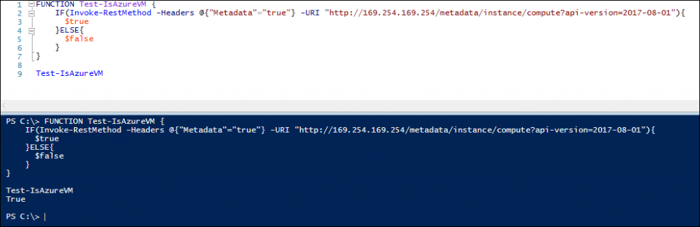
Success!
Now let's make sure it works on a non-Azure VM

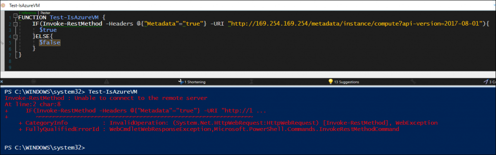
Yikes. Ok, now to handle that error message. We could try adding  `-Erroraction silentlycontinue` 

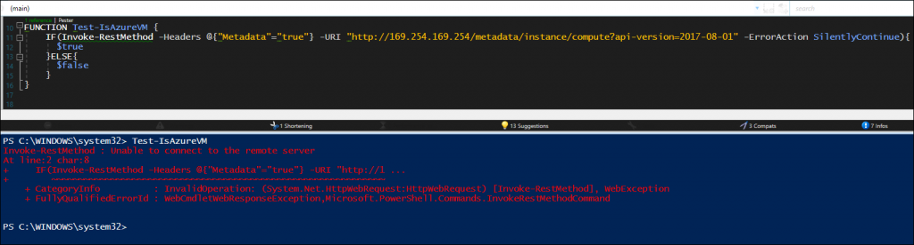
Dang, still isn't suppressing that exception.
Looking up the documentation for [Invoke-WebRequest](https://docs.microsoft.com/powershell/module/microsoft.powershell.utility/invoke-webrequest?view=powershell-7.1#example-7--catch-non-success-messages-from-invoke-webrequest), Microsoft states

> When `Invoke-WebRequest` encounters a non-success HTTP message (404, 500, etc.), it returns no output and throws a terminating error. To catch the error and view the**StatusCode**you can enclose execution in a `try/catch` block.

Ok, let's try adding the Try/Catch

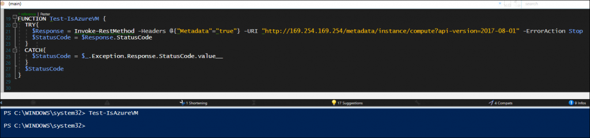
Wait, where's the output??

It looks as though, since the metadata "URI" doesn't exist on non-Azure VMs, there's no response even sent back to the  `$Response`  variable.

> To fix this, we can forcibly set  `Invoke-Webrequest`  to use Boolean instead, since all we're looking for is a True/False output

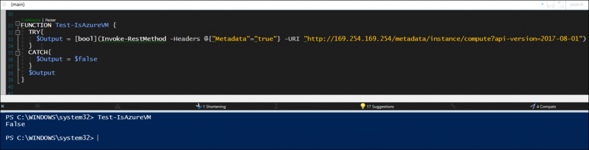
Great! Here's the finished function

```powershell
FUNCTION Test-IsAzureVM {
  TRY{
    $Output = [bool](Invoke-RestMethod -Headers @{"Metadata"="true"} -URI "http://169.254.169.254/metadata/instance/compute?api-version=2017-08-01")
  }
  CATCH{
    $Output = $false
  }
  $Output
}
```
                    
# Create Configuration Baseline
                    
## Configuration Item

In your ConfigMgr Admin Console, navigate to  `\Assets and Compliance\Overview\Compliance Settings\Configuration Items`  and Create a new Configuration Item

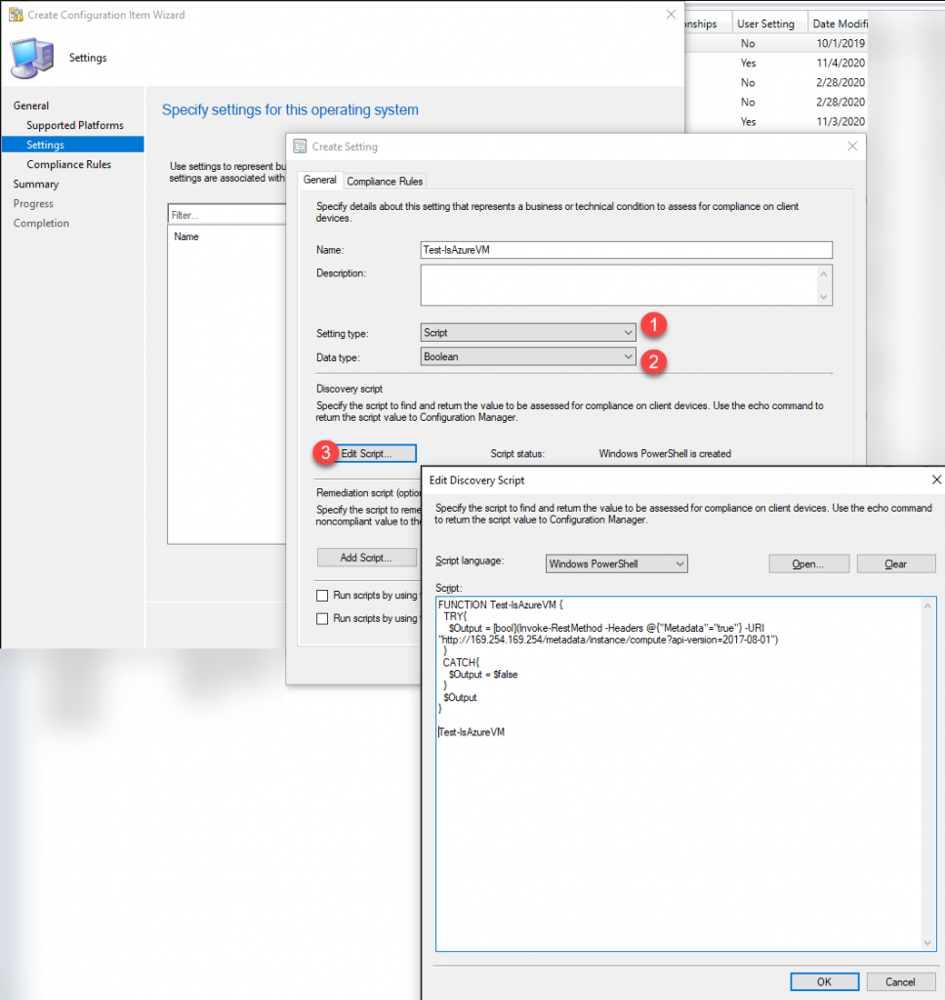

* Setting Type:  `Script` 
* Data Type:  `Boolean` 
* Script: Past the Function in the window and ***don't forget to call the function on the last line!***  
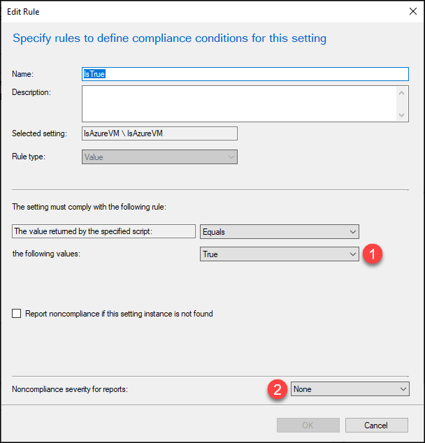
* Values:  `true` 
* Noncompliance severity:  `none`
* This is key so that the non-compliance devices don't throw errors if you add to an existing Configuration Baseline

## Configuration Baseline

In the console, move down to the Configuration Baseline section and create a new Baseline, adding the Configuration Item we previously created

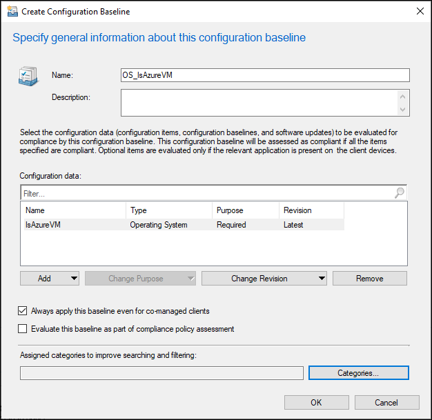

## Deploy Baseline

Now you can Deploy your newly created Baseline to whichever devices you wish. For this example, we're deploying to the *All Systems* collection and we're only going to run the baseline evaluation once per device, but there's no real harm in having it run every month or so (the data we're looking at is static and shouldn't vary at all).

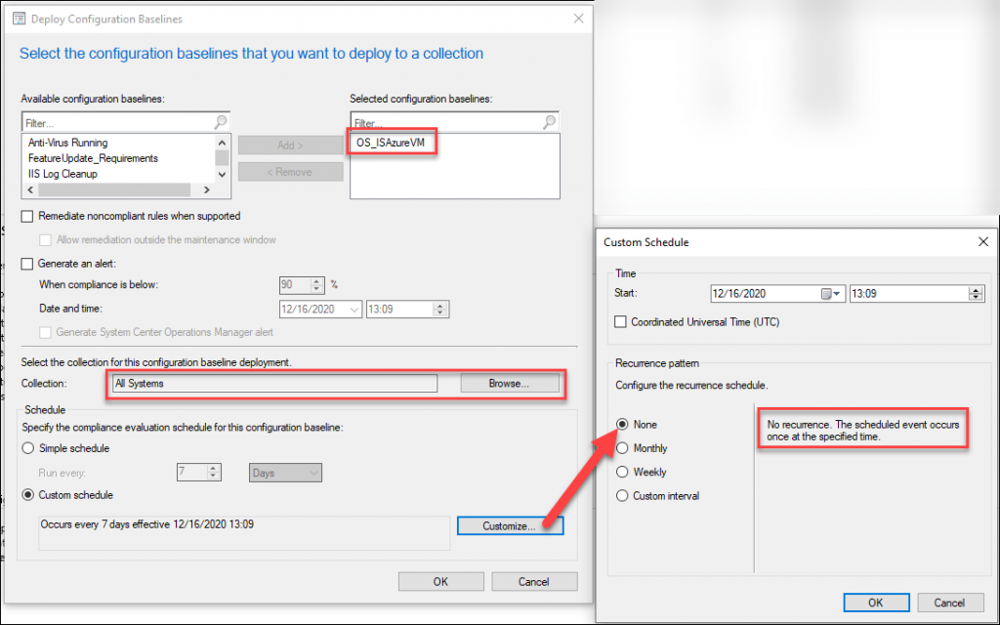

# Create Collections

The only real "required" collection to make is based on Compliant devices with the Baseline we deployed. To do that, click the Baseline, then the Deployments tab at the bottom, and right-click the **Deployment** > **Create New Collection** > **Compliant**, and follow the on-screen prompts to finish the Collection

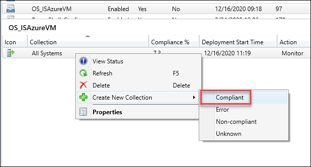
I named my Collection "*All Systems_Azure*"

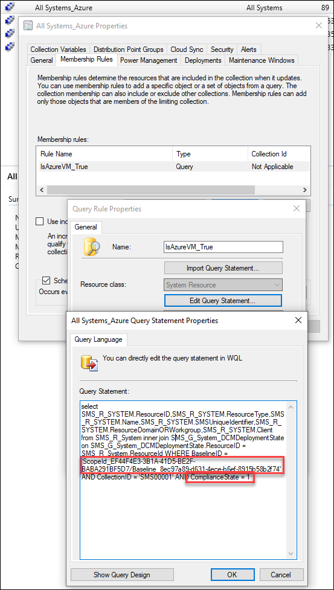
and now you can create collections based on this collection, for example:

* **Collection Name**: *All Windows Workstations in Azure*
  * **Limiting Collection**: *All Systems_Azure*
  * **Include Collection**: *All Windows Workstations*
  * **Result**: Collection of Azure VMs running Windows client OS
* **Collection Name**: *All Windows Servers in Azure*
  * **Limiting Collection**: *All Systems_Azure*
  * **Include Collection**: *All Windows Servers*
  * **Result**: Collection of Azure VMs running Windows server OS

Once I completed this, I found 34 additional Azure VMs that weren't showing up in our previous Collection that was querying based on the hostname prefix.
