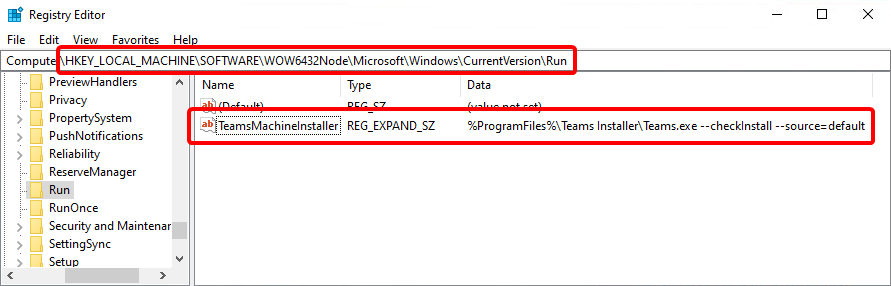
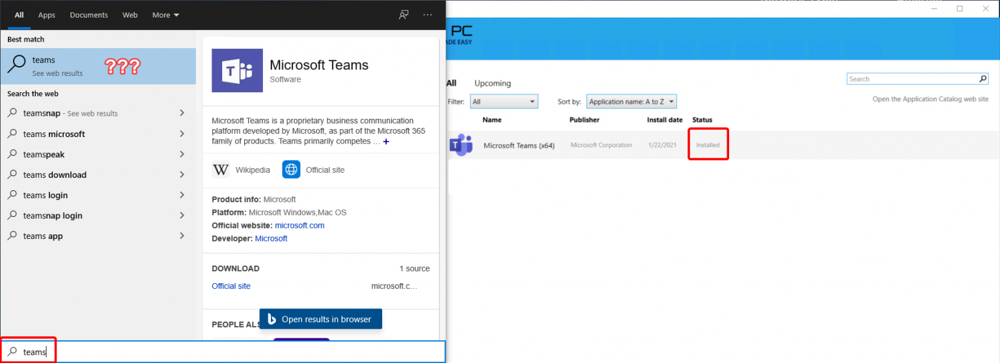
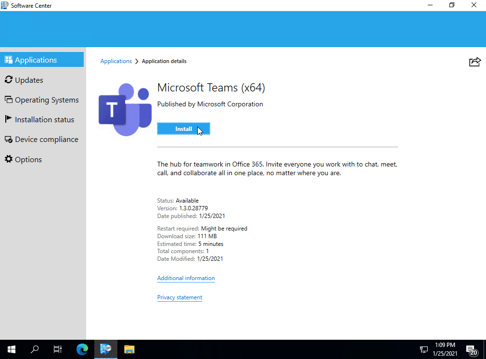
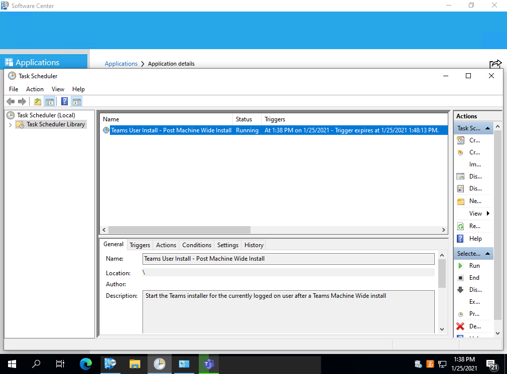

### Outline

  * [The Problem: Teams Machine Wide Installer finishes… Then… Nothing?](#The-Problem)
  * [What's Going On Here?](#Whats-Up)
  * [The Solution: Improve the User Experience](#The-Solution)
  * [Just Give Me The Script - I'll Figure Out the Rest](#The-Script)

### The Problem: Teams Machine Wide Installer finishes... Then... Nothing? {#The-Problem}

Have you or a loved one ever deployed Microsoft Teams in an enterprise environment? Did the users complain? Did project management complain? Management? You? 

I'm sure **someone** was not happy about the overall user experience. In particular when the [Teams Machine Wide installer](https://docs.microsoft.com/en-us/microsoftteams/msi-deployment) is finished, and detected by your application management tool of choice **it does... nothing**. The user is left with a message claiming Teams is '**Installed**' when clearly it is not. 

To solve this we will dig in to...

### What's Going On Here? {#Whats-Up}

The Teams Machine Wide installer is not what the user will 'run' on a day-to-day basis. Instead, it stages the binaries in the 'Program Files (x86)' directory, depending on OS Architecture, where each user will call the installer at a later time. By default, every user will have Teams installed in their own user profile the next time they log in once the machine-wide installer is in place. This is pretty well noted by various people on the internet and Microsoft makes a note of it in their docs [here](https://docs.microsoft.com/en-us/microsoftteams/msi-deployment#pc-installation). For some reason, Microsoft states it a bit strangely, 'Whenever a user signs into a new Windows User Profile...' But really it does not have to be a new user profile. Existing user profiles will receive Teams on their next login as well.

Microsoft is leveraging a [Run Key](https://docs.microsoft.com/en-us/windows/win32/setupapi/run-and-runonce-registry-keys) in order to execute a command line every time a user logs in. This key can be seen below.<figure class="wp-block-image size-full">

 <figcaption>%ProgramFiles%\Teams Installer\Teams.exe -checkInstall -source=default</figcaption></figure> 

The command which is executed is '**%ProgramFiles%\Teams Installer\Teams.exe -checkInstall -source=default**'

Keep in mind this falls under the WOW6432Node section of the registry on a 64-Bit operating system. This causes the %ProgramFiles% environment variable to resolve to 'C:\Program Files (x86)' for example. This would change on a 32-Bit operating system accordingly with the registry key falling under HKLM\Software, and the Teams.exe being found under the C:\Program Files' directory.

An interesting note here is a **Run key runs EVERY time a user logs in**. The command found in the registry has a **-checkInstall** parameter. If you run this binary without the -checkInstall parameter you can see it will perform a Teams installation every time, instead of only when not found.

Alright alright, this is **boring**. How do we improve the user experience where Microsoft has failed?

### Solution: Improve the User Experience {#The-Solution}

As much as I would enjoy writing an essay about how frustrating it is to see many norms of software installation be violated by Microsoft that is not what we are here for! **We care about the users**.

What the user expects is to click '**Install**' in the software distribution platform of choice, such as Software Center, or the Company Portal and once the installation is complete the software should be available for use on the device. This behavior is implied by the feedback of '**Installed**' that is presented in the UI. 

##### Current Behavior

The Teams Machine Wide installer will finish, and the detection of the software will show '**Installed**' based on the MSI having been found. Unfortunately this is _not_ the software which the user cares about. <figure class="wp-block-image size-full">

 </figure> 

##### The New and Improved Experience!

... can be seen below in an excessively long GIF!<figure class="wp-block-image size-large">

 </figure> 

This result is achieved by using a **Windows Scheduled Task**. The PowerShell script that generates this task is found below at the [end of the article](#The-Script), and also on [<strong>GitHub</strong>](https://github.com/CodyMathis123/CM-Ramblings/blob/master/New-PostTeamsMachineWideInstallScheduledTask.ps1).

A scheduled task can be found in Task Scheduler after the script runs as shown below.<figure class="wp-block-image size-full">

 </figure> 

At a high level the improved experience shown is achieved via the following workflow:

  * Microsoft Teams Machine Wide Installer is executed
  * Provided [script](#The-Script) is executed immediately after the Teams installer which creates the **scheduled task** which is set to execute as '**Users**'
      * User is currently logged on:
          * The scheduled task will execute as the logged-on user
          * Teams.exe installer will be launched according to the parameters in the Run key discussed
          * User will see the Teams installer start and receive the login prompt
          * The scheduled task will expire and auto-delete itself after 10 minutes
      * No user is currently logged on:
          * The scheduled task will have no user to execute as and will not trigger
          * The scheduled task will expire and auto-delete itself after 10 minutes

This is **not meant to be used as a standalone script** as it is only useful if ran immediately after a Teams Machine Wide Installer executes. 

You are welcome to package the script alongside the Teams MSI and run them back to back using any mechanism you'd like, whether that be your own cmd file, VB script, PowerShell, PSADT, or any other convoluted mechanism! The end goal is the MSI installs first, and the script runs second.

### Just Give Me The Script - I'll Figure Out the Rest {#The-Script}

  <pre class="CodeMirror" data-setting="{&quot;mode&quot;:&quot;powershell&quot;,&quot;mime&quot;:&quot;application/x-powershell&quot;,&quot;theme&quot;:&quot;default&quot;,&quot;lineNumbers&quot;:true,&quot;styleActiveLine&quot;:true,&quot;lineWrapping&quot;:true,&quot;readOnly&quot;:false,&quot;fileName&quot;:&quot;New-PostTeamsMachineWideInstallScheduledTask.ps1&quot;,&quot;language&quot;:&quot;PowerShell&quot;,&quot;modeName&quot;:&quot;powershell&quot;}">&lt;#
.SYNOPSIS
    Launch the Teams install as the logged in user via a scheduled task
.DESCRIPTION
    This script will create a scheduled task if one is not found which is used to
    install Microsoft Teams as the logged in user. This scheduled task executes
    the Teams.exe found in %ProgramFiles% so that a user can start using Teams
    shortly after the Machine Wide installer completes instead of having to 
    log off and back on.
.NOTES
    Generally used as a script that runs after a Teams Machine Wide Installer completes
#&gt;
if (!(Get-ScheduledTask -TaskName 'Teams User Install - Post Machine Wide Install' -ErrorAction SilentlyContinue)) {
    switch ([System.Environment]::Is64BitOperatingSystem) {
        $true {
            [string]$TeamsMachineInstaller = Get-ItemPropertyValue -Path registry::HKEY_LOCAL_MACHINE\SOFTWARE\WOW6432Node\Microsoft\Windows\CurrentVersion\Run\ -Name TeamsMachineInstaller -ErrorAction Stop
            [string]$Exe = $TeamsMachineInstaller.Substring(0, $TeamsMachineInstaller.IndexOf('.exe') + 4).Trim() -Replace "C:\\Program Files\\", "${env:ProgramFiles(x86)}\"
    
        }
        $false {
            [string]$TeamsMachineInstaller = Get-ItemPropertyValue -Path registry::HKEY_LOCAL_MACHINE\SOFTWARE\Microsoft\Windows\CurrentVersion\Run\ -Name TeamsMachineInstaller -ErrorAction Stop
            [string]$Exe = $TeamsMachineInstaller.Substring(0, $TeamsMachineInstaller.IndexOf('.exe') + 4).Trim()
        }
    }
    [string]$InstallerArgs = $TeamsMachineInstaller.Substring($Exe.Length, $TeamsMachineInstaller.Length - $exe.Length).Trim()
    $newScheduledTaskSplat = @{
        Action      = New-ScheduledTaskAction -Execute $Exe -Argument $InstallerArgs
        Description = 'Start the Teams installer for the currently logged on user after a Teams Machine Wide install'
        Settings    = New-ScheduledTaskSettingsSet -Compatibility Vista -AllowStartIfOnBatteries -MultipleInstances IgnoreNew -ExecutionTimeLimit (New-TimeSpan -Hours 1)
        Trigger     = New-ScheduledTaskTrigger -At ($Start = (Get-Date).AddSeconds(5)) -Once
        Principal   = New-ScheduledTaskPrincipal -GroupId 'S-1-5-32-545' -RunLevel Limited
    }
    
    $ScheduledTask = New-ScheduledTask @newScheduledTaskSplat
    $ScheduledTask.Settings.DeleteExpiredTaskAfter = "PT0S"
    $ScheduledTask.Triggers[0].StartBoundary = $Start.ToString("yyyy-MM-dd'T'HH:mm:ss")
    $ScheduledTask.Triggers[0].EndBoundary = $Start.AddMinutes(10).ToString('s')
    
    Register-ScheduledTask -InputObject $ScheduledTask -TaskName 'Teams User Install - Post Machine Wide Install'
}</pre>

[@CodyMathis123](https://twitter.com/CodyMathis123)

