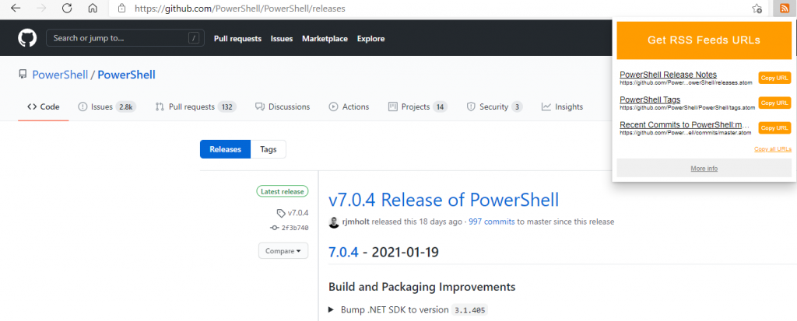
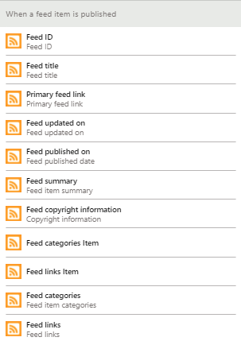
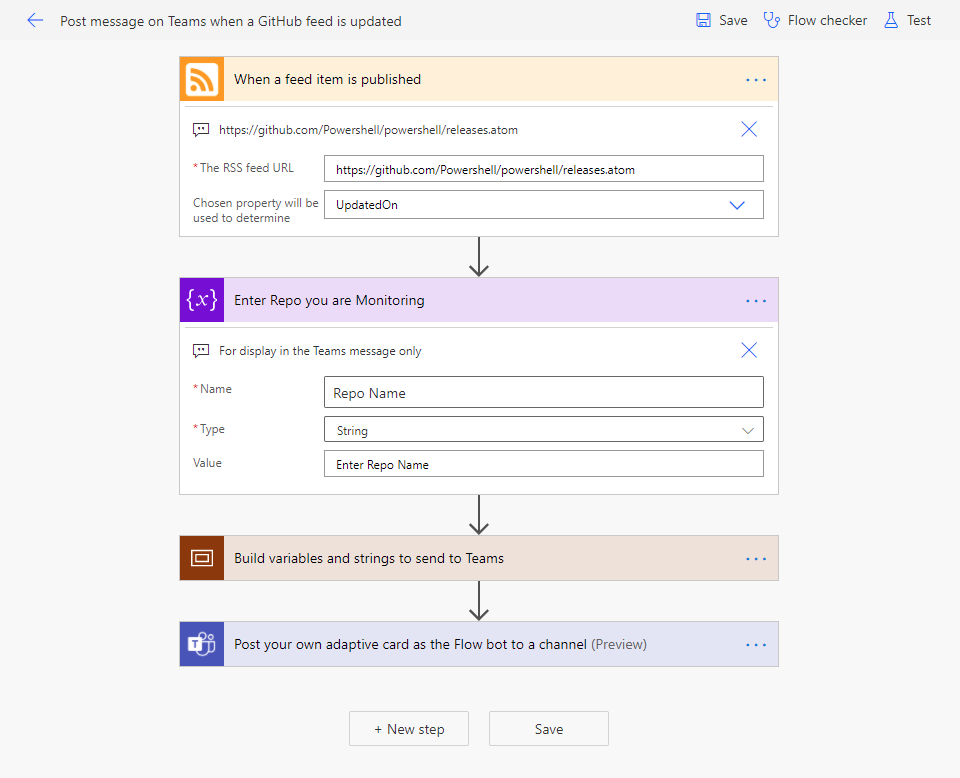

Have you ever wanted to get a simple notification when there is a new Release for your favorite PowerShell Module or other Public Repo on GitHub? In this post we'll talk about how you can use Power Automate to watch for new releases and trigger events on these and send out Teams messages, Emails, or even Kick off an Azure Function or similar automation. 

<!--more-->
 

  

    

      Table Of Contents
    

  

  
  

    <ol class="uagb-toc__list">
      <li class="uagb-toc__list">
        [Introduction](#introduction)<li class="uagb-toc__list">
          [GitHub supports Atom Feeds](#github-supports-atom-feeds)<ul class="uagb-toc__list">
            <li class="uagb-toc__list">
              [Sample URLs](#sample-urls)
            </li>
          </ul>
        </li>
        
        <li class="uagb-toc__list">
          [Discovering & Testing RSS/Atom feeds](#discovering-testing-rssatom-feeds)<li class="uagb-toc__list">
            [Connecting the Connectors](#connecting-the-connectors)<li class="uagb-toc__list">
              [Install Instructions](#install-instructions)<li class="uagb-toc__list">
                [Conclusion](#conclusion)
              </li></ul></ol> 
 
 
 
              <h2>
                Introduction
              </h2>
              
              

                In my [previous post](https://sysmansquad.com/2020/12/30/automating-changing-out-of-business-hours-responses/), we did some automation with client-side scripts and Microsoft Graph to update Outlook Auto-Responses on a schedule. Today we will be going in a different direction for something with almost no code in it at all - Power Automate.
              

              
              

                [Power Automate](https://flow.microsoft.com) is an excellent tool that can monitor for changes, run actions on a schedule, process events, or just run a multi-step process when you hit a button. It does all of this with you having to write no, or minimal, code by using <strong>Service Connectors</strong> and abstracting out <strong>Events</strong> and <strong>Actions</strong> that you might need to take. This post assumes that you are somewhat familiar with Power Automate, for an introduction to Power Automate, check out this [Microsoft Docs Article](https://docs.microsoft.com/en-us/power-automate/getting-started), or this [Microsoft Learn Course](https://go.microsoft.com/fwlink/p/?linkid=2018566) on Automate.
              

              
              

                There are hundreds of [supported app and service connectors](https://flow.microsoft.com/connectors/) including [Twitter](https://flow.microsoft.com/connectors/shared_twitter/twitter/), [Office 365 Outlook](https://flow.microsoft.com/connectors/shared_office365/office-365-outlook/), and the connector that seems like it would help us most for this goal: [GitHub](https://flow.microsoft.com/connectors/shared_github/github/).
              

              
              

                <figure class="aligncenter is-resized"><figcaption>Available triggers for GitHub are based on Issues or Pull Requests</figcaption></figure>
              

              
              

                However, when you look at the GitHub connector, it only supports a few <strong>triggers</strong> related to <strong>Issues </strong>and <strong>Pull Requests</strong>, and if we check the GitHub Connector [triggers documentation](https://docs.microsoft.com/en-us/connectors/github/#triggers), then even those would require an API key. Since these are public repos, instead of repos we own, we won't have any way to get a API key anyway.
              

              
              

                We definitely need some other direction.
              

              
              

                

                  <h2 id="github-atom-feeds">
                    GitHub supports Atom Feeds
                  </h2>
                  
                  

                    

                      

                        After some searching around, I found that GitHub support [Atom Feeds](http://www.atomenabled.org/) by appending <code>.atom</code> to certain URLs.
                      

                      
                      

                        From what I could find, these are supported on <strong>Releases</strong>, <strong>Tags</strong>, and <strong>Commits</strong>. To get the feed, simply take the URL for the feeds and append <code>&lt;strong>.atom&lt;/strong></code> to the end.
                      

                    

                  

                  
                  

                    

                      <h4 id="sample-urls">
                        Sample URLs
                      </h4>
                      
                      

                        <strong>Releases · PowerShell </strong>HTML - [https://github.com/PowerShell/PowerShell/releases](https://github.com/PowerShell/PowerShell/releases) ATOM - [https://github.com/PowerShell/PowerShell/releases.atom](https://github.com/PowerShell/PowerShell/releases.atom)
                      

                      
                      

                        <strong>Tags · PowerShell</strong> HTML - [https://github.com/PowerShell/PowerShell/tags](https://github.com/PowerShell/PowerShell/tags) ATOM - [https://github.com/PowerShell/PowerShell/tags.atom](https://github.com/PowerShell/PowerShell/tags.atom)
                      

                      
                      

                        <strong>Releases · Pester</strong> HTML - [https://github.com/pester/Pester/releases](https://github.com/pester/Pester/releases) ATOM - [https://github](https://github.com/pester/Pester/releases.atom)[.com/pester/Pester/releases.atom](https://github.com/pester/Pester/releases.atom)
                      

                      
                      

                        <strong>Commits · win-acme · Master Branch </strong>HTML - [https://](https://github.com/pester/Pester/releases)[github.com/win-acme/win-acme/commits/master](https://github.com/win-acme/win-acme/commits/master) ATOM - [https://github.com/win-acme/win-acme/commits/master.atom](https://github.com/win-acme/win-acme/commits/master.atom)
                      

                    

                  

                

              

              
              

                

                  

                    

                      <h2 class="alignwide has-text-align-center">
                        Discovering & Testing RSS/Atom feeds
                      </h2>
                      
                      

                        If you are still having a hard time finding the URL, I found this [Edge Extension](https://microsoftedge.microsoft.com/addons/detail/get-rss-feed-url/pgbelohmepchkohpdldadopkblkgbjom) to discover Atom URLs for the current page, and a [Chrome Version](https://chrome.google.com/webstore/detail/get-rss-feed-url/kfghpdldaipanmkhfpdcjglncmilendn) as well.
                      

                    

                  
<figure class="wp-block-image alignwide size-large">
                  
                  </figure> 
                  
                  

                    To test what the content of the feeds was, I used [rssatom.com](https://rssatom.com/) to check I had a valid Atom or RSS feed URL that worked publicly.
                  

                  
                  

                    Now, armed with these feed URLs, we have... no connector for Atom Feeds directly... damn... we were so close...
                  
<figure class="wp-block-image">
                  
                  </figure> 
                  
                  

                    But! Atom Feeds are mostly compatible with RSS Feeds. Compatible enough that we can actually use the [RSS Feed connector](https://flow.microsoft.com/connectors/shared_rss/rss/) to receive the feeds and throw our events! We just won't be able to access all of the fields.
                  

                

              

              
              

                

                  <h2 id="connecting-the-connectors">
                    Connecting the Connectors
                  </h2>
                  
                  

                    The useful fields available to us are below:
                  

                  
                  <ul>
                    <li>
                      Feed Entry Title
                    </li>
                    <li>
                      Feed Entry Primary Link
                    </li>
                    <li>
                      Feed Entry Links <ul>
                        <li>
                          A list of the links in the entry
                        </li>
                      </ul>
                    </li>
                    
                    <li>
                      Feed Entry Summary<ul>
                        <li>
                          Roughly the "text" of the Feed Entry
                        </li>
                      </ul>
                    </li>
                    
                    <li>
                      Feed Entry Update and Published Dates
                    </li>
                  </ul>
                  
                  

                    Here is a full listing and link to the [RSS Feed Connector documentation](https://docs.microsoft.com/connectors/rss/)
                  
<figure class="wp-block-image size-large">
                  
                  </figure> 
                  
                  

                    So from here, we can use the <strong>RSS Feed trigger</strong>, build some variables, and send it to the <strong>Teams Connector</strong>. From this, I refined the formatting a bit, and ended up with this.
                  
<figure class="wp-block-image size-large">
                  
                  </figure> 
                  
                  

                    This sends through notifications to Teams that look like this:
                  
<figure class="wp-block-image">
                  
                  </figure>
                

              

              
              <h2 id="install">
                Install Instructions
              </h2>
              
              

                You can [download this here](https://github.com/SysManSquad/BlogFiles/tree/master/PsychoData/GitHub_to_Teams_Notifications) to import this into your own environment and start getting your own notifications from Public Repos.
              

              
              

                You can also use this as a guide to set up alerts on any other RSS feeds or most Atom feeds as well. Since this is already in Power Automate, you could also use hundreds of different connectors to connect to other services like Azure [Automation](https://flow.microsoft.com/connectors/shared_azureautomation/azure-automation/), [DevOps](https://flow.microsoft.com/connectors/shared_visualstudioteamservices/azure-devops/), [Blob Storage](https://flow.microsoft.com/connectors/shared_azureblob/azure-blob-storage/), [FTP](https://flow.microsoft.com/connectors/shared_ftp/ftp/), [Slack](https://flow.microsoft.com/connectors/shared_slack/slack/), [Todoist](https://flow.microsoft.com/connectors/shared_todoist/todoist/), or even invoke a [Web API](https://docs.microsoft.com/connectors/webcontents/#get-web-resource).
              

              
              <h2 id="build-your-own">
                Conclusion
              </h2>
              
              

                In this post, we found a way to work around some limitations of the GitHub Connector, made a Power Automate flow that can be easily duplicated to subscribe to many feeds, and used Power Automate to post notifications to Teams Channels.
              
<figure class="wp-block-image">
              
              .gif)</figure> 

                <strong>What kind of workflows would you like to automate</strong>? Let me know what kind of things you are doing with <strong>Power Platform</strong> on the [Discord below](#contact). For some ideas of automations you might be able to use, go [Browse Power Automate Templates](https://us.flow.microsoft.com/en-us/templates/), [Search Connectors](https://flow.microsoft.com/connectors/), or check out the Power Automate [Community](https://go.microsoft.com/fwlink/?LinkID=787467).
              

              
              

                If you have questions, are having problems, or just want to chat over something, for the best response you can reach me and several other IT Pros on the [WinAdmins Discord](https://discord.com/invite/winadmins) as [@PsychoData](https://discordapp.com/users/264652399824601088) or you can reach me on [Twitter](https://twitter.com/psychodata).
              

              
              

              

