<div class="wp-block-uagb-table-of-contents uagb-toc\_\_align-left uagb-toc\_\_columns-1 uagb-block-d2123629 " data-scroll= "1" data-offset= "30" data-delay= "800" > 

<div class="uagb-toc__wrap">
  <div class="uagb-toc__title-wrap">
    <div class="uagb-toc__title">
      Table Of Contents
    </div>
  </div>
  
  <div class="uagb-toc__list-wrap">
    <ol class="uagb-toc__list">
      <li class="uagb-toc__list">
        [Notable improvements](#notable-improvements)<li class="uagb-toc__list">
          [Prerequisites to use the solution over CMG](#prerequisites-to-use-the-solution-over-cmg)<ul class="uagb-toc__list">
            <li class="uagb-toc__list">
              [A working CMG](#a-working-cmg)<li class="uagb-toc__list">
                <li class="uagb-toc__list">
                  [Additional configuration to use the AdminService over CMG](#additional-configuration-to-use-the-adminservice-over-cmg)
                </li></ul>
              </li>
              <li class="uagb-toc__list">
                [How to query the AdminService over CMG?](#how-to-query-the-adminservice-over-cmg)<ul class="uagb-toc__list">
                  <li class="uagb-toc__list">
                    [Using the MSAL.PS module](#using-the-msalps-module)
                  </li>
                </ul>
              </li></ul>
            </li>
            
            <li class="uagb-toc__list">
              [Improvements to Invoke-GetPackageIDFromAdminService](#improvements-to-invoke-getpackageidfromadminservice)<ul class="uagb-toc__list">
                <li class="uagb-toc__list">
                  [1) New parameters and ParameterSets](#1-new-parameters-and-parametersets)<li class="uagb-toc__list">
                    <li class="uagb-toc__list">
                      [2) Verify, Install and Import the MSAL.PS module](#2-verify-install-and-import-the-msalps-module)<li class="uagb-toc__list">
                        <li class="uagb-toc__list">
                          [3) Querying the AdminService](#3-querying-the-adminservice)
                        </li></ul>
                      </li></ul>
                    </li></ul>
                  </li>
                  <li class="uagb-toc__list">
                    [Improvements to the task sequence](#improvements-to-the-task-sequence)<ul class="uagb-toc__list">
                      <li class="uagb-toc__list">
                        [1) Is the client on Internet?](#1-is-the-client-on-internet)<li class="uagb-toc__list">
                          <li class="uagb-toc__list">
                            [2) Additional Parameters for Internet clients](#2-additional-parameters-for-internet-clients)<li class="uagb-toc__list">
                              <li class="uagb-toc__list">
                                [3) Running the script with the right parameters](#3-running-the-script-with-the-right-parameters)
                              </li></ul>
                            </li></ul>
                          </li></ul>
                        </li></ul>
                      </li>
                      <li class="uagb-toc__list">
                        [The end result](#the-end-result)<li class="uagb-toc__list">
                          [How do I set this up in my environment?](#how-do-i-set-this-up-in-my-environment)<ul class="uagb-toc__list">
                            <li class="uagb-toc__list">
                              [What if I have multiple CMGs?](#what-if-i-have-multiple-cmgs)
                            </li>
                          </ul>
                        </li></ul>
                      </li>
                    </ul>
                  </li></ul>
                </li>
              </ul>
            </li>
            
            <li class="uagb-toc__list">
              [A note on the task sequence size](#a-note-on-the-task-sequence-size)<li class="uagb-toc__list">
                [Links](#links)
              </li></ul>
            </li>
          </ul>
        </li></ul>
      </li></ul></li></ul>
    </ol>
  </div>
</div></div> 

Hello,

This is a long and overdue update on a solution I started working on last year to allow my organization to use the modern driver management solution without the need of the custom webservice. I also wanted the solution to use the built-in task sequence steps as much as possible to allow other administrators to customize the solution to their need without the need to go modify a big PowerShell script.

You can read the original blog posts here:

**Modern Driver Management with the Administration Service**<figure class="wp-block-embed is-type-wp-embed is-provider-systems-management-squad wp-block-embed-systems-management-squad">

<div class="wp-block-embed__wrapper">
  <div class="x-embed x-is-rich x-is-systems-management-squad">
    <blockquote class="wp-embedded-content" data-secret="jzpz03RRKW">
      [Modern Driver Management with the Administration Service](https://sysmansquad.com/2020/05/15/modern-driver-management-with-the-administration-service/)
    </blockquote>
  </div>
</div></figure> 

**Modern BIOS Management with the Administration Service**<figure class="wp-block-embed is-type-wp-embed is-provider-systems-management-squad wp-block-embed-systems-management-squad">

<div class="wp-block-embed__wrapper">
  <div class="x-embed x-is-rich x-is-systems-management-squad">
    <blockquote class="wp-embedded-content" data-secret="11ToJaBiRO">
      [Modern BIOS Management with the Administration Service](https://sysmansquad.com/2020/06/18/modern-bios-management-with-the-administration-service/)
    </blockquote>
  </div>
</div></figure> 

## Notable improvements

<ol type="1">
  <li>
    The solution now works for clients on the internet by querying the AdminService over a cloud management gateway (CMG)<br />Bonus: It works in WinPE! You can do a complete reinstallation of a device over CMG using this solution to dynamically apply bios updates and drivers at the same time during the task sequence.<br /><br />
  </li>
  <li>
    The solution now supports 7-Zip and Wim driver packages<br />
  </li>
  <li>
    Improvements to handle driver packages using the DisplayVersion property instead of ReleaseId (ex: 20H2 instead of 2009)
  </li>
</ol>

## Prerequisites to use the solution over CMG

### A working CMG

There are multiple blog articles and guides online to help you set up your CMG. Here are some links that helped me:

  * [Official documentation/guidance from Microsoft](https://docs.microsoft.com/en-us/mem/configmgr/core/clients/manage/cmg/setup-cloud-management-gateway)
  * [CMG Guide from System Center Dudes](https://systemcenterdudes.com/setup-and-configure-sccm-cloud-management-gateway-1806/)
  * [CMG Guide from Prajwal Desai](https://www.prajwaldesai.com/setup-sccm-cloud-management-gateway/)

Personally, for my lab, I used the [Let's Encrypt Cloud Management Gateway](https://z-nerd.com/blog/2019/05/20-lets-encrypt-cloud-management-gateway/) blog post by Nathan Ziehnert to set up my CMG.

### Additional configuration to use the AdminService over CMG

There is some additional configuration that is needed to be able to query the AdminService over the cloud management gateway.

Once again, another one of Nathan’s blog post helped me: [Securing Access to the ConfigMgr AdminService Over Cloud Management Gateway](https://z-nerd.com/blog/2019/12/03-adminservice-over-cmg/)

There are 2 things I had to do differently in the Authentication section:

  * Add a platform and select “Mobile and desktop applications” and check the box for : <https://login.microsoftonline.com/common/oauth2/nativeclient>
  * Select “Yes” to Allow public client flows<figure class="wp-block-image size-large">

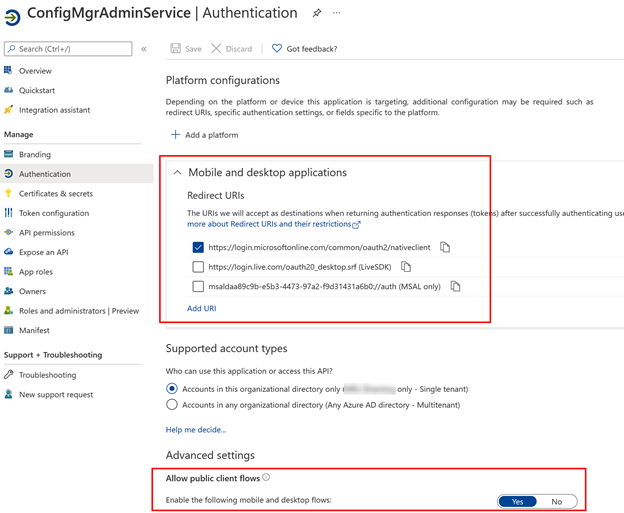 </figure> 

## How to query the AdminService over CMG?

I started my research by reading the blog post from Sandy Zeng here: <https://msendpointmgr.com/2019/07/16/use-configmgr-administration-service-adminservice-over-internet/>

Also, at the same time, when I was looking at my application registration in the Azure Portal I saw this notification:<figure class="wp-block-image size-large">

 </figure> 

After inspecting Sandy’s script, I confirmed that it was using Azure Active Directory Authentication Library (ADAL), so I wanted to make my solution work with MSAL instead of ADAL.

After doing some research, I found the perfect PowerShell module to help me: [MSAL.PS](https://github.com/AzureAD/MSAL.PS/)

With the help of that module, I was easily able to get an access token that is needed to query the AdminService over CMG.

### Using the MSAL.PS module

Here is a sample script I used to test retrieving an access token with the MSAL.PS module:<figure class="wp-block-image size-large">

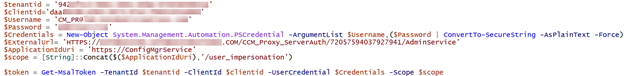 </figure> 

And here is what the result looks like:<figure class="wp-block-image size-large">

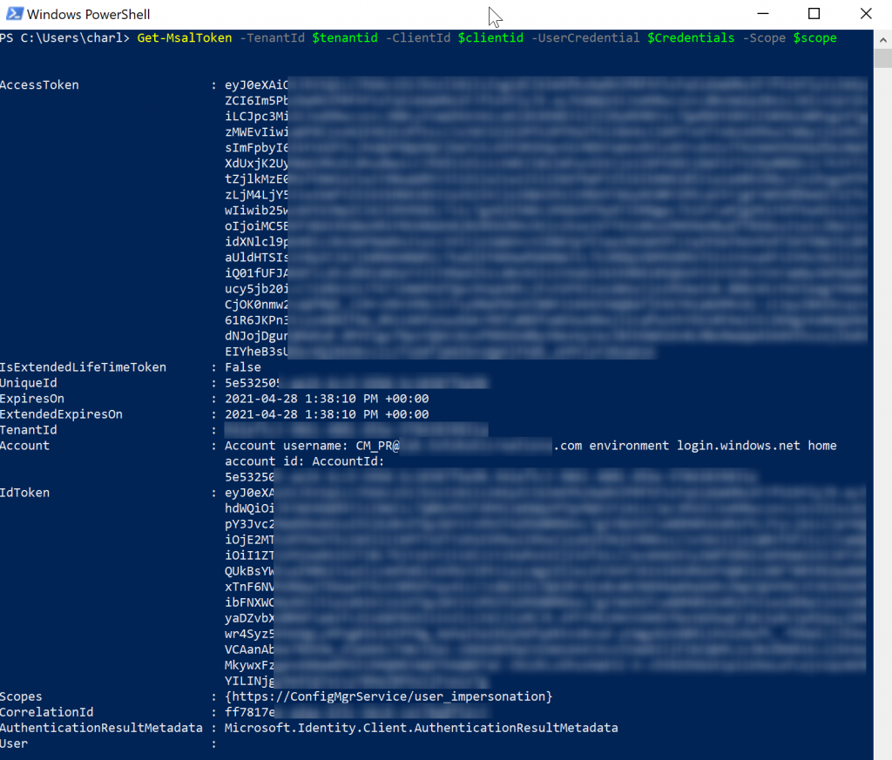 </figure> 

Now that I have an access token, I can easily query the AdminService over CMG. I reused the same part of the code used by Sandy to do this:<figure class="wp-block-image size-large">

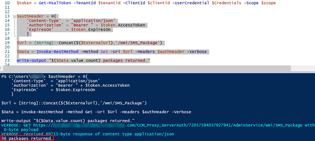 </figure> 

In the example above, I was successfully able to retrieve information for 36 packages from the AdminService over CMG.

## Improvements to Invoke-GetPackageIDFromAdminService

Now that I knew what information I needed to use to query the AdminService over CMG, I was ready to make the necessary modifications to my script.

### 1) New parameters and ParameterSets

Depending on if the client is on the internet or not, my script would require a different set of parameters. This was the perfect opportunity to use [parameter sets](https://docs.microsoft.com/en-us/powershell/module/microsoft.powershell.core/about/about_parameter_sets?view=powershell-7.1).


```powershell
[parameter(Mandatory = $true, ParameterSetName = "Intranet")]
[ValidateNotNullOrEmpty()]
[string]$ServerFQDN,

[parameter(Mandatory = $true, ParameterSetName = "Internet")]
[ValidateNotNullOrEmpty()]
[string]$ExternalUrl,

[parameter(Mandatory = $true, ParameterSetName = "Internet")]
[ValidateNotNullOrEmpty()]
[string]$TenantID,

[parameter(Mandatory = $true, ParameterSetName = "Internet")]
[ValidateNotNullOrEmpty()]
[string]$ClientID,

[parameter(Mandatory = $false, ParameterSetName = "Internet")]
[ValidateNotNullOrEmpty()]
[string]$ApplicationIdUri = 'https://ConfigMgrService',


[parameter(Mandatory = $false, ParameterSetName = "Intranet")]
[parameter(Mandatory = $true, ParameterSetName = "Internet")]
[ValidateNotNullOrEmpty()]
[string]$Username,

[parameter(Mandatory = $false, ParameterSetName = "Intranet")]
[parameter(Mandatory = $true, ParameterSetName = "Internet")]
[ValidateNotNullOrEmpty()]
[string]$Password,

[parameter(Mandatory = $false, ParameterSetName = "Intranet")]
[parameter(Mandatory = $false, ParameterSetName = "Internet")]
[bool]$BypassCertCheck = $false,
```


### 2) Verify, Install and Import the MSAL.PS module

I wrote a function to handle installing & importing the MSAL.PS.

The tricky part here is that the MSAL.PS module requires us to accept the license agreement before we can install the module. There is a parameter **-AcceptLicense** for the Install-Module function but it is only available in the [PowerShellGet module](https://docs.microsoft.com/en-us/powershell/module/powershellget) version 2 or higher.

This function checks for the availability of the MSAL.PS module and if it’s not there it will check for the prerequisites to install before it can import the module.


```powershell
Function Import-MSALPSModule{
    Add-TextToCMLog $LogFile "Checking if MSAL.PS module is available on the device." $component 1
    $MSALModule = Get-Module -ListAvailable MSAL.PS
    If($MSALModule){
        Add-TextToCMLog $LogFile "Module is already available." $component 1
    }Else{
        #Setting PowerShell to use TLS 1.2 for PowerShell Gallery
        [Net.ServicePointManager]::SecurityProtocol = [Net.SecurityProtocolType]::Tls12
        
        Add-TextToCMLog $LogFile "MSAL.PS is not installed, checking for prerequisites before installing module." $component 1
        
        Add-TextToCMLog $LogFile "Checking for NuGet package provider... " $component 1
        If(-not (Get-PackageProvider -Name NuGet -ListAvailable -ErrorAction SilentlyContinue)){
            Add-TextToCMLog $LogFile "NuGet package provider is not installed, installing NuGet..." $component 1
            $NuGetVersion = Install-PackageProvider -Name NuGet -Force -ErrorAction Stop | Select-Object -ExpandProperty Version
            Add-TextToCMLog $LogFile "NuGet package provider version $($NuGetVersion) installed." $component 1
        }
        
        Add-TextToCMLog $LogFile "Checking for PowerShellGet module version 2 or higher " $component 1
        $PowerShellGetLatestVersion = Get-Module -ListAvailable -Name PowerShellGet | Sort-Object -Property Version -Descending | Select-Object -First 1 -ExpandProperty Version       
        If((-not $PowerShellGetLatestVersion)){
            Add-TextToCMLog $LogFile "Could not find any version of PowerShellGet installed." $component 1
        }
        If(($PowerShellGetLatestVersion.Major -lt 2)){
            Add-TextToCMLog $LogFile "Current PowerShellGet version is $($PowerShellGetLatestVersion) and needs to be updated." $component 1
        }
        If((-not $PowerShellGetLatestVersion) -or ($PowerShellGetLatestVersion.Major -lt 2)){
            Add-TextToCMLog $LogFile "Installing latest version of PowerShellGet..." $component 1
            Install-Module -Name PowerShellGet -AllowClobber -Force
            $InstalledVersion = Get-Module -ListAvailable -Name PowerShellGet | Sort-Object -Property Version -Descending | Select-Object -First 1 -ExpandProperty Version
            Add-TextToCMLog $LogFile "PowerShellGet module version $($InstalledVersion) installed." $component 1
        }
        
        Add-TextToCMLog $LogFile "Installing MSAL.PS module..." $component 1
        If((-not $PowerShellGetLatestVersion) -or ($PowerShellGetLatestVersion.Major -lt 2)){
            Add-TextToCMLog $LogFile "Starting another powershell process to install the module..." $component 1
            $result = Start-Process -FilePath powershell.exe -ArgumentList "Install-Module MSAL.PS -AcceptLicense -Force" -PassThru -Wait -NoNewWindow
            If($result.ExitCode -ne 0){
                Add-TextToCMLog $LogFile "Failed to install MSAL.PS module" $component 3
                Throw "Failed to install MSAL.PS module"
            }
        }Else{
            Install-Module MSAL.PS -AcceptLicense -Force
        }
    }
    Add-TextToCMLog $LogFile "Importing MSAL.PS module..." $component 1
    Import-module MSAL.PS -Force
    Add-TextToCMLog $LogFile "MSAL.PS module successfully imported." $component 1
}
```


#### What about WinPE? PowerShell Gallery does not work in WinPE!

You are right, by default PowerShell Gallery does not work in WinPE. To solve this issue, you have 2 options:

<ol type="1">
  <li>
    Add PowerShell Gallery support to your boot image:<ul>
      <li>
        See this post by David Segura on how it can be achieved: [https://www.osdeploy.com/blog/2021/winpe-powershell-gallery](https://www.osdeploy.com/blog/2021/winpe-powershell-gallery)
      </li>
      <li>
        The easiest way to add PowerShellGallery support to your boot image is to use a [Universal WinPE](https://osdcloud.osdeploy.com/concepts/universal-winpe) that can be created with the OSD PowerShell module. Use this as a base for your boot image in Configuration Manager and you will be able to install modules from PSGallery directly in WinPE.
      </li>
    </ul>
  </li>
  
  <li>
    Manually install the MSAL.PS module during the task sequence before you run the script to query the AdminService:
  </li>
</ol>

<div class="wp-block-columns">
  <div class="wp-block-column" style="flex-basis:100%">
    <div class="wp-block-media-text alignwide has-media-on-the-right is-stacked-on-mobile">
      <figure class="wp-block-media-text__media">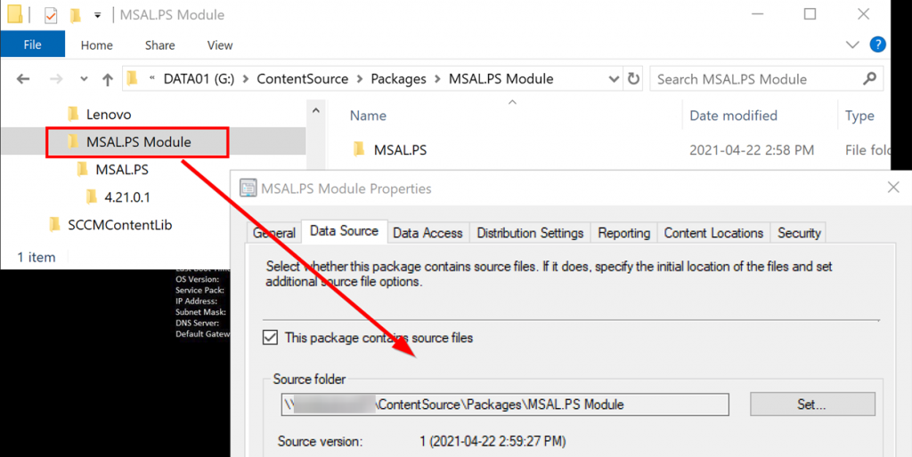</figure>
      
      <div class="wp-block-media-text__content">
        <p>
          a) Create a package with the saved module and distribute it to your CMG
        </p>
      </div>
    </div>
  </div>
</div>

<div class="wp-block-group">
  <div class="wp-block-group__inner-container">
    <div class="wp-block-columns">
      <div class="wp-block-column" style="flex-basis:100%">
        <div class="wp-block-media-text alignwide has-media-on-the-right is-stacked-on-mobile">
          <figure class="wp-block-media-text__media">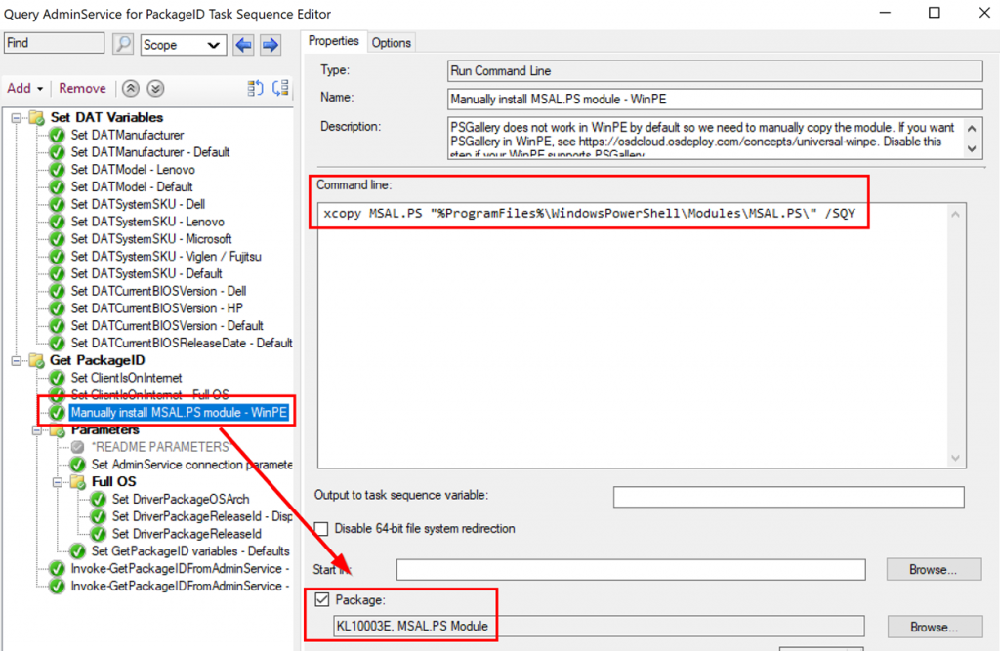</figure>
          
          <div class="wp-block-media-text__content">
            <p>
              b) Edit the package in the “Manually install MSAL.PS module” step:
            </p>
          </div>
        </div>
      </div>
    </div>
  </div>
</div>

Both options will allow you to install and import the MSAL.PS module in WinPE.

If you decide to go with enabling support for PowerShell Gallery in WinPE, you can disable the step to manually install the module in the task sequence.

### 3) Querying the AdminService

Now, depending on what parameters were used, we will query the AdminService locally or via the CMG:


```powershell
switch($PSCmdlet.ParameterSetName){
    'Intranet'{
        $Packages = Invoke-RestMethod -Method Get -Uri $WMIPackageURL -Body $Body @InvokeRestMethodCredential | Select-Object -ExpandProperty value
    }
    'Internet'{
        $authHeader = @{
            'Content-Type'  = 'application/json'
            'Authorization' = "Bearer " + $token.AccessToken
            'ExpiresOn'	    = $token.ExpiresOn
        }
        $Packages = Invoke-RestMethod -Method Get -Uri $WMIPackageURL -Headers $authHeader -Body $Body | Select-Object -ExpandProperty value
    }
} 
```


The rest of the script to filter and select the most suitable package did not change.

## Improvements to the task sequence

Now that the script itself supports querying over CMG, I needed to make some adjustments to the “**Query AdminService for PackageID**” task sequence to properly call the script with the right parameters.

### 1) Is the client on Internet?

We need to determine if the device running the task sequence is on Internet or on the corporate network (intranet).

First, we try using the _SMSTSIsClientOnInternet task sequence variable:<figure class="wp-block-image size-large">

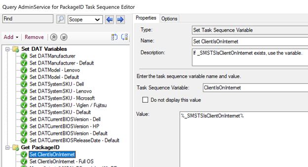 </figure> 

Note: In my limited testing, I found that if a task sequence does not reference any package, this variable may not be set.

If the “ClientIsOnInternet” is still not set after this step and device is not in WinPE, we use the following PowerShell command to determine if the device is on Internet:

```powershell
Get-CimInstance -ClassName "ClientInfo" -Namespace "Root\CCM" | Select-Object -ExpandProperty InInternet
```

<figure class="wp-block-image size-large">

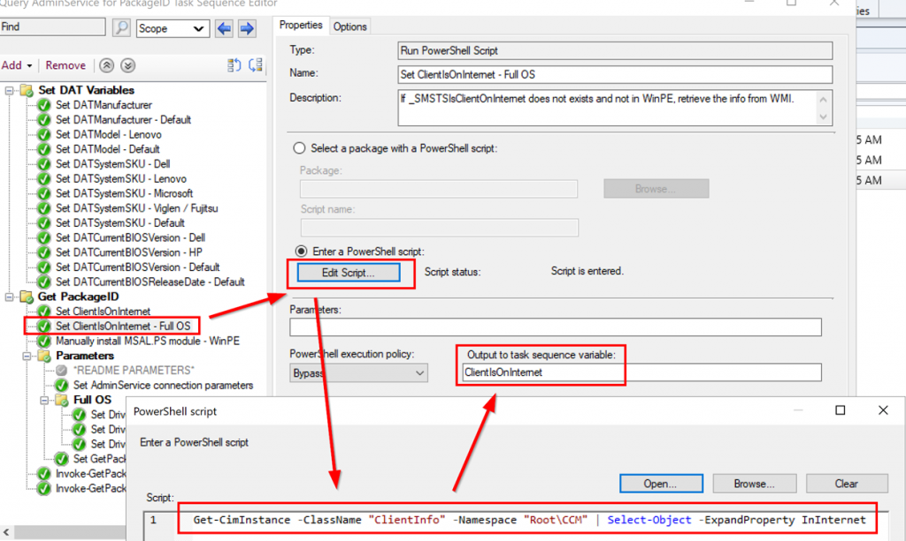 </figure> 

### 2) Additional Parameters for Internet clients

Here you fill out your environment-specific information. The additional parameters needed for CMG support are:

  * ExternalUrl: The ExternalUrl to access the AdminService from your CMG. The following query can be used to find the ExternalUrl:


```sql
SELECT 
ProxyServerName,
ExternalUrl 
FROM [dbo].[vProxy_Routings]
WHERE [dbo].[vProxy_Routings].ExternalEndpointName = 'AdminService'
```


  * TenantId: Your Azure AD Tenant ID
  * ClientId: The Client ID of the application registration that you created to interact with the AdminService. See [additional configuration to use the AdminService over CMG](https://sysmansquad.com/wp-admin/post.php?post=2552&action=edit#additional-configuration-to-use-the-adminservice-over-cmg) for details.
  * ApplicationIdUri: The application ID Uri for your application registration. The default value of "https://ConfigMgrService" will probably be OK for most people.<figure class="wp-block-image size-large">

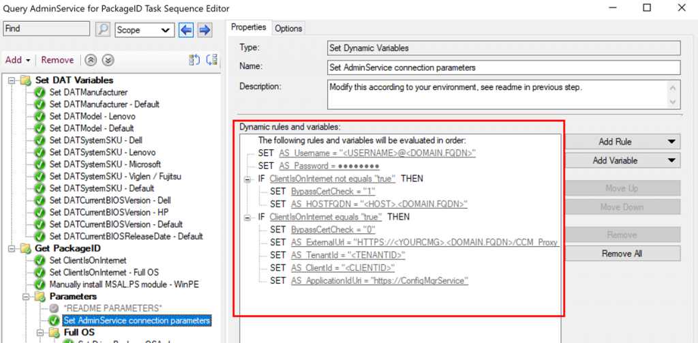 </figure> 

### 3) Running the script with the right parameters

Depending on the value of the “ClientIsOnInternet” variable, we run the script with different parameters.

If the client is determined to be intranet, use the intranet parameters:<figure class="wp-block-image size-large">

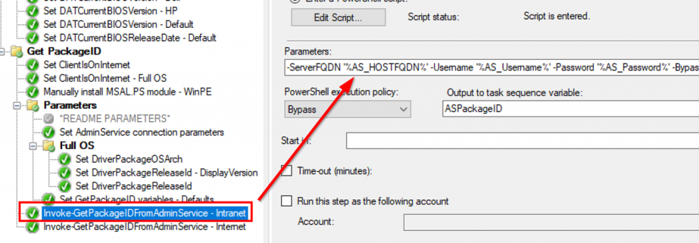 </figure> 

If the client is on Internet, use the internet parameters:<figure class="wp-block-image size-large">

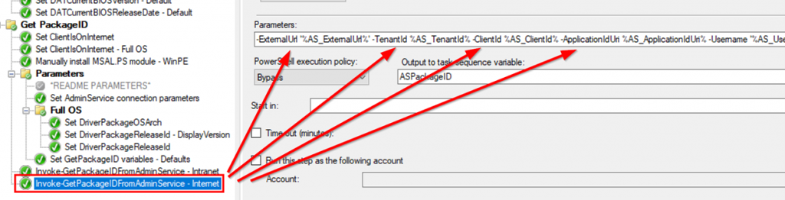 </figure> 

## The end result

You can now use the Modern Driver Management and Modern BIOS Management solution for Internet clients just like you are doing with your intranet clients.

If you are on Current Branch 2010 or later, you can use a boot media to run bare metal deployment on the Internet and still use the Modern Driver/BIOS Management solution.<figure class="wp-block-image size-large">

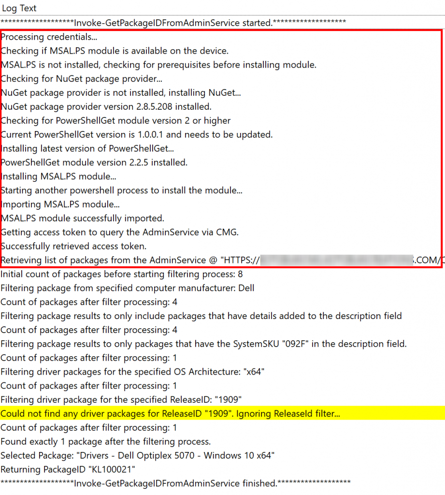 </figure> 

## How do I set this up in my environment?

  1. Download the task sequences [here](https://github.com/CharlesNRU/mdm-adminservice/raw/master/MDM-TS.zip).
  2. Import the task sequences in your environment
  3. Configure the parameters correctly in the “Query AdminService for PackageID” task sequence:<figure class="wp-block-image size-large">

 </figure> 

<ol start="4">
  <li>
    Add the “Apply Driver Package” and/or “Apply BIOS Package” task sequences in your existing task sequences.
  </li>
</ol>

For example on what you can do with these task sequences, see my previous blog posts:

  * <https://sysmansquad.com/2020/05/15/modern-driver-management-with-the-administration-service/>
  * <https://sysmansquad.com/2020/06/18/modern-bios-management-with-the-administration-service/>

### What if I have multiple CMGs?

There is nothing stopping you from writing a small script to detect/check which CMG to use and then set the "AS_ExternalUrl" variable to whatever you want. 

Now you have support for multiple CMGs 🙂

## A note on the task sequence size

Currently, the scripts used in this solution are added directly in the task sequence instead of referencing a package containing the scripts. As you can see below, the task sequence size can be somewhat big:<figure class="wp-block-image size-large">

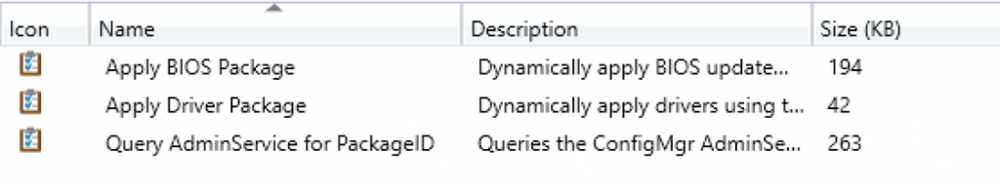 </figure> 

If you are concerned about the total size of the task sequence, you could store the scripts in a package instead and this would greatly reduce the size of the task sequence.

Reference regarding task sequence size: [https://docs.microsoft.com/en-us/mem/configmgr/osd/deploy-use/manage-task-sequences-to-automate-tasks#reduce-the-size-of-task-sequence-policy](https://docs.microsoft.com/en-us/mem/configmgr/osd/deploy-use/manage-task-sequences-to-automate-tasks#reduce-the-size-of-task-sequence-policy)

## Links

[Task Sequence Exports](https://github.com/CharlesNRU/mdm-adminservice/raw/master/MDM-TS.zip)

[MDM-AdminService GitHub repository](https://github.com/CharlesNRU/mdm-adminservice)

