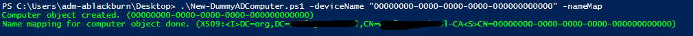
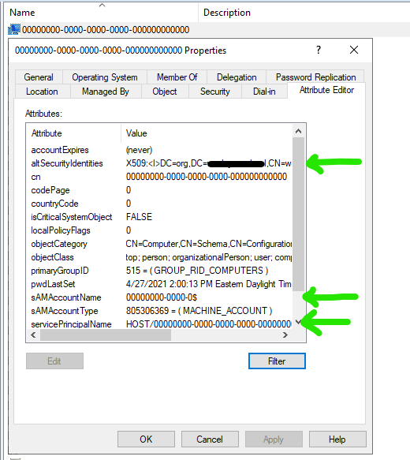
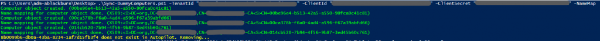
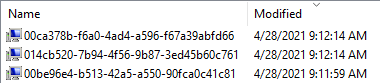

## Introduction

In this post, I'll show you a workaround to get device based wireless authentication working for AADJ Windows devices via NPS. Keep in mind this is a workaround and your mileage may vary.

## Background

NPS does not play nice when it comes to AADJ device authentication. There is a fantastic writeup on this issue [here](https://docs.microsoft.com/answers/questions/57999/device-certificate-scep-based-authentication-again.html).

### **The tl;dr of the issue**

Device based authentication works when there is a computer object in your on-prem. directory that backs up NPS's authentication checks. If the devices are AADJ only (not hybrid), then there is no computer object in the on-prem. directory. NPS sees the device as unknown and authentication fails.

### **Why is device based authentication important?**

Ideally, there should be a connection to the network at the login screen. This isn't a big deal if you're 1:1 because of cached credentials. If you're not 1:1, e.g. shared devices, you will need a network connection at the login screen to ensure the first time login for a user works.

### **Why not just hybrid join your machines?**


More great gifs like this on the [Windows Admins](https://aka.ms/winadmins) Discord server.

## Things I am assuming you have

* Healthy PKI
  * Certificate enrollment configured for the user **and** device via your MDM
* Healthy wireless network
  * 802.1X via an on-prem. NPS
  * WiFi profile(s) pushed out to your devices via your MDM

## The workaround

There are several workarounds discussed in the post I linked above. For me, the easiest method is creating "dummy" computer objects in Active Directory that match the AADJ devices. Once NPS sees the AADJ device in your local AD, authentication works.

I settled on using PowerShell for this workaround. Although tedious, you could do your initial testing via ADUC and the attribute editor.

### Basic version of the script

This basic version of the script lets you create one device at a time (useful for testing):

```powershell
[CmdletBinding(DefaultParameterSetName = 'Default')]
param(
    [Parameter(Mandatory=$False)] [String] $deviceName = "",
    [Parameter(Mandatory=$False)] [Switch] $nameMap
    )

# Set the OU for computer object creation
$orgUnit = "OU=Dummy Devices,OU=Devices,DC=yourdomain,DC=tld" 

# Set the certificate path for name mapping
$certPath = "X509:<I>DC=tld,DC=yourdomain,CN=your-CA<S>CN=" 

# Prepare SAMAccountName based off of length constraints
$SAMAccountName = if ($deviceName.Length -ge 15) {$deviceName.Substring(0,15) + "$"} else {$deviceName + "$"}

# Create the dummy computer object in AD
try {
    New-ADComputer -Name "$deviceName" -SAMAccountName $SAMAccountName -Path $orgUnit -ServicePrincipalNames "HOST/$deviceName"
    Write-Host "Computer object created. ($($deviceName))" -ForegroundColor Green
} catch {
    Write-Host "Skipping AD computer object creation (likely because it already exists in AD)" -ForegroundColor Yellow
}

# Perform name mapping if specified
if ($nameMap) {
    try {
        Set-ADComputer -Identity $SAMAccountName -Add @{'altSecurityIdentities'="$($certPath)$($deviceName)"}
        Write-Host "Name mapping for computer object done. ($($certPath)$($deviceName))" -ForegroundColor Green
    } catch {
        Write-Host "Skipping name mapping (likely because device does not exist in AD)" -ForegroundColor Red
        exit 1
    }
}
```

There are three important things this script does:

1. Creates the computer object
   * Be sure to use the correct device name. Usually this will be what you have mapped to your device certificate. In my case, I used the AAD Device ID for the computer.
1. Adds the service principal name (SPN) to the computer object
   * This is what NPS sees when a device authenticates (HOST/devicename). Again, device name is very important here.
1. Adds a certificate name mapping to the computer object if needed
   * I have heard from others this may not be necessary. This won't work in my environment unless there is a name mapping.

Be sure to run this on a domain computer that has the 'ActiveDirectory' module. Also, the account that the script is running under will need permissions to create and edit computer objects in AD.

Here is an example run command:

> .\New-DummyADComputer.ps1 -deviceName "device-name-here" -nameMap

   After using the script for a test device, you should see the computer object in your AD.



Now, you should be able to perform successful device based 802.1X authentication on your test device. 👍

### More advanced version of the script that works with MS Graph

For my use case, I needed something that I could run on a schedule and forget about. This more advanced version of the script pulls down all of the Autopilot devices from MS Graph using the 'WindowsAutopilotIntune' module. It then uses the 'ActiveDirectory' module to create/prepare matching computer objects in AD.

```powershell
[CmdletBinding(DefaultParameterSetName = 'Default')]
param(
    [Parameter(Mandatory=$True)] [String] $TenantId = "",
    [Parameter(Mandatory=$True)] [String] $ClientId = "",
    [Parameter(Mandatory=$True)] [String] $ClientSecret = "",
    [Parameter(Mandatory=$False)] [Switch] $NameMap
)

# Get NuGet
Get-PackageProvider -Name "NuGet" -Force | Out-Null

# Get WindowsAutopilotIntune module (and dependencies)
$module = Import-Module WindowsAutopilotIntune -PassThru -ErrorAction Ignore
if (-not $module) {
    Write-Output "Installing module WindowsAutopilotIntune"
    Install-Module WindowsAutopilotIntune -Force
}
Import-Module WindowsAutopilotIntune -Scope Global

# Connect to MSGraph with application credentials
Connect-MSGraphApp -Tenant $TenantId -AppId $ClientId -AppSecret $ClientSecret

# Pull latest Autopilot device information
$AutopilotDevices = Get-AutopilotDevice | Select-Object azureActiveDirectoryDeviceId

# Set the OU for computer object creation
$orgUnit = "OU=Dummy Devices,OU=Devices,DC=yourdomain,DC=tld" 

# Set the certificate path for name mapping
$certPath = "X509:<I>DC=tld,DC=yourdomain,CN=your-CA<S>CN="

# Create new Autopilot device objects in AD while skipping already existing computer objects
foreach ($Device in $AutopilotDevices) {
    if (Get-ADComputer -Filter "Name -eq ""$($Device.azureActiveDirectoryDeviceId)""" -SearchBase $orgUnit -ErrorAction SilentlyContinue) {
        #Write-Output "Skipping $($Device.azureActiveDirectoryDeviceId) because it already exists. "
    } else {
        # Create new AD computer object
        try {
            New-ADComputer -Name "$($Device.azureActiveDirectoryDeviceId)" -SAMAccountName "$($Device.azureActiveDirectoryDeviceId.Substring(0,15))`$" -ServicePrincipalNames "HOST/$($Device.azureActiveDirectoryDeviceId)" -Path $orgUnit
            Write-Output "Computer object created. ($($Device.azureActiveDirectoryDeviceId))"
        } catch {
            Write-Error "Error. Skipping computer object creation."
        }
        
        # Perform name mapping
        try {
            Set-ADComputer -Identity "$($Device.azureActiveDirectoryDeviceId.Substring(0,15))" -Add @{'altSecurityIdentities'="$($certPath)$($Device.azureActiveDirectoryDeviceId)"}
            Write-Output "Name mapping for computer object done. ($($certPath)$($Device.azureActiveDirectoryDeviceId))"
        } catch {
            Write-Error "Error. Skipping name mapping."
        }
    }
}

# Reverse the process and remove any dummmy computer objects in AD that are no longer in Autopilot
$DummyDevices = Get-ADComputer -Filter * -SearchBase $orgUnit | Select-Object Name, SAMAccountName
foreach ($DummyDevice in $DummyDevices) {
    if ($AutopilotDevices.azureActiveDirectoryDeviceId -contains $DummyDevice.Name) {
        # Write-Output "$($DummyDevice.Name) exists in Autopilot."
    } else {
        Write-Output "$($DummyDevice.Name) does not exist in Autopilot. Removing..."
        # Remove-ADComputer -Identity $DummyDevice.SAMAccountName -Confirm:$False -WhatIf
        ##Remove -WhatIf once you are comfortable with this workflow and have verified the remove operations are only performed in the OU you specified
    }
} 
```

Here is a play-by-play of the script:

* Connects to MS Graph with application credentials
  * You could change this to perform an interactive login. For my use case, Azure app-based authentication allows me to schedule this script. The Azure app registration only needs API permissions to read Autopilot devices.
* Pulls Autopilot device information from MS Graph
* Creates new dummy computer objects in AD using the Autopilot device information
  * Already existing dummy devices are skipped
* Reverses the process and removes any dummy computer objects in AD that no longer exist in Autopilot
  * **This step is potentially dangerous.** Because of that, I added comments in the script above (line 63) and added *-WhatIf* as further risk control.

Here is an example run command:

```powershell
.\Sync-DummyComputers.ps1 -TenantId "your-tenant-id-here" -ClientId "your-app-id-here" -ClientSecret "your-app-secret-here" -NameMap
```



After running this script for the first time, you should see your new dummy computer objects in the OU you configured.



Now, you should be able to perform successful device based 802.1X authentication on your devices. 👍

### Expected changes for readers

I would expect you need to make changes to the script based off of your needs. Here are a few things I think will vary between readers:

* Device name
* I went with the AAD Device ID in my certificates
* The org. unit where your dummy computer objects will live
* The X509 certificate path used for name mapping
* This is dependent on your CA and other factors. I was able to find this path by performing the name mapping in ADUC and looking at the 'altSecurityIdentities' attribute on the object

## Closing thoughts

It took me several tries to nail this down and I would expect this on your end too. Analyzing NPS logs to see what I was missing was the most helpful troubleshooting step on my end.

I'm not sure why Microsoft hasn't considered this or even followed up to the [linked post above](https://docs.microsoft.com/answers/questions/57999/device-certificate-scep-based-authentication-again.html). In an ideal world, Microsoft might create some sort of connector for on-prem. NPS to check AAD, as well as the local AD, for devices during authentications.

I realize that a solution like ClearPass would completely mitigate the need for a workaround like this. For many reasons, like budget, continuing to use NPS is ideal for my environment.

I hope this gets you to a decent starting point when you are considering device based authentication for your AADJ Windows devices.
