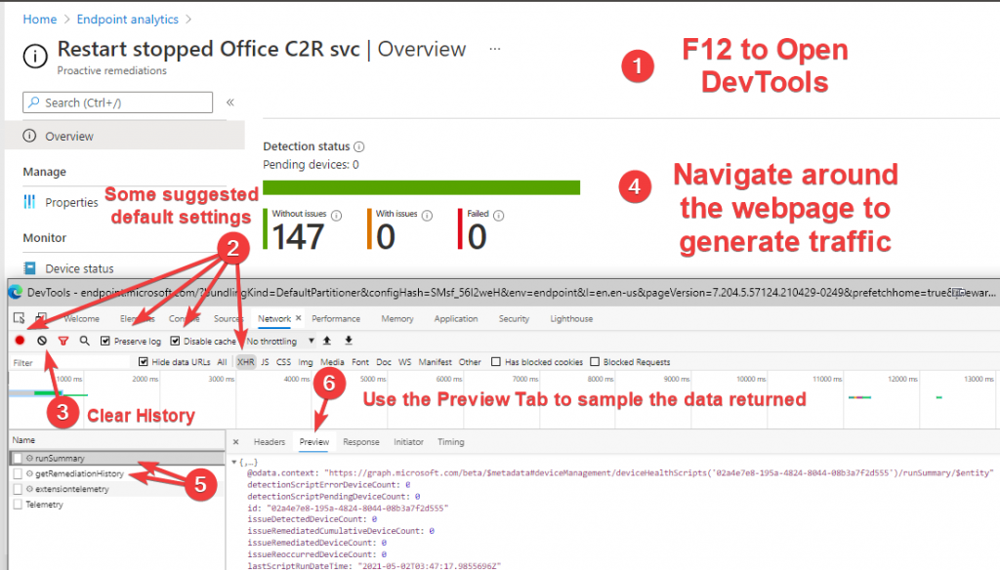
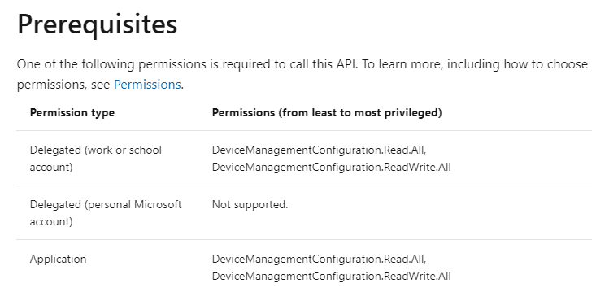
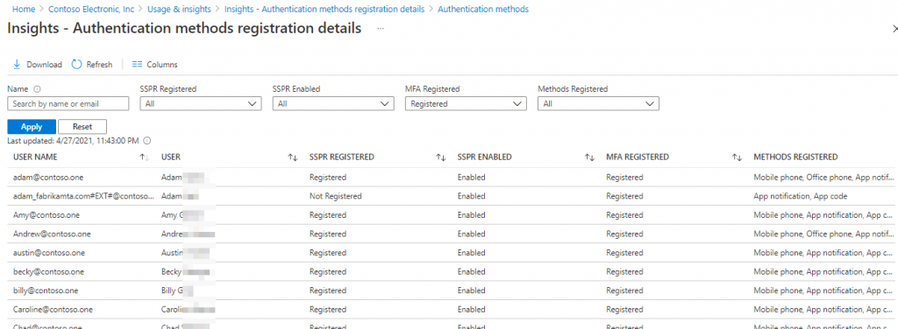
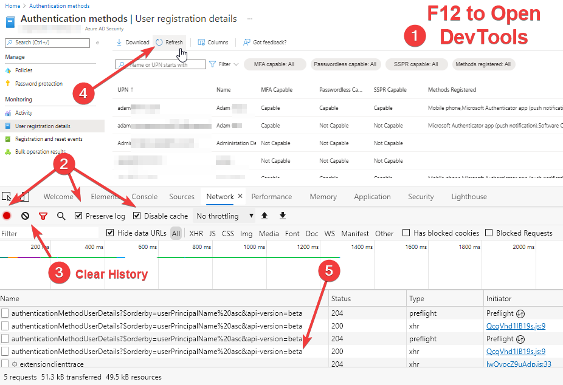
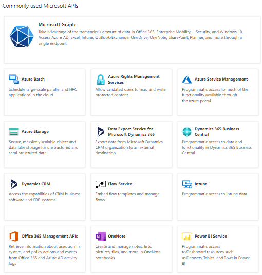
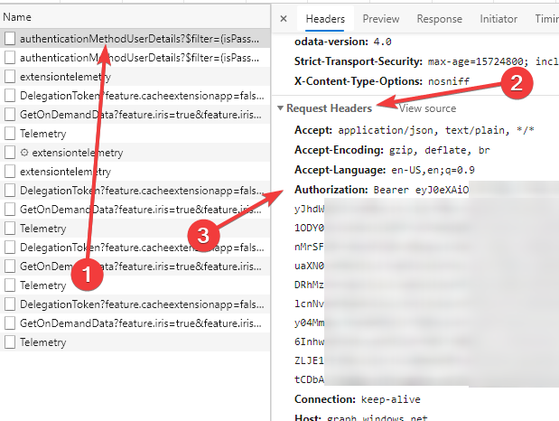
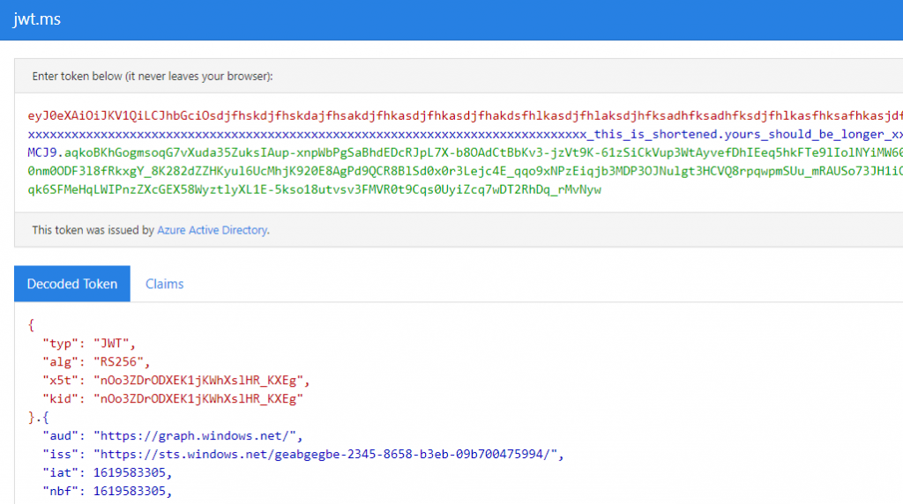
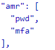

Have you ever looked at a report on a Portal Page and wanted to know just _**WHERE**_ the data just came from? 

Well you can - and finding the information can be so easy. Read on below to see how. 

## Introduction

Take for example this report on a [Proactive Remediation](https://endpoint.microsoft.com/#blade/Microsoft_Intune_Enrollment/UXAnalyticsMenu/proactiveRemediations). I used one of the built in Proactive Remediations for the example, but it could easily be one of our other [Proactive Remediation](https://sysmansquad.com/category/endpoint-management/proactive-remediation/) posts, like [Dynamic Outlook Signatures](https://sysmansquad.com/2020/07/08/dynamic-outlook-email-signature-using-with-intune-endpoint-analytics-proactive-remediations/), [Building VPN Connections](https://sysmansquad.com/2020/07/07/intune-autopilot-proactive-remediation/), or [Repairing Folder permissions](https://sysmansquad.com/2020/07/27/setting-acl-using-intune-endpoint-analytics-proactive-remediations/).
</p>

 

This data is generally all exposed by Graph or a similar Microsoft API, it is just a matter of finding the right endpoints.

## So, wandering API Endpoint Hell?

You could absolutely go through the docs pages for [Microsoft Graph](https://docs.microsoft.com/graph/) or other APIs and find the [Get deviceHealthScriptRunSummary](https://docs.microsoft.com/graph/api/intune-devices-devicehealthscriptrunsummary-get?view=graph-rest-beta) - but the Portal is already fetching the information somehow - a lot of times you can just look at how the Portal fetches the information, and do the same thing yourself.

Instead or blindly wandering the several levels of API Docs, let's use some of the tools built-in to Modern Browsers like Edge and Google Chrome to observe how the Web Portal fetches the information internally.

## Watching how the Portal works

First up, let's open the [Proactive Remediations area](https://endpoint.microsoft.com/#blade/Microsoft_Intune_Enrollment/UXAnalyticsMenu/proactiveRemediations) and navigate down to the **Restart stopped Office C2R svc**.

From there we can follow a few steps to observe what the portal does while we load in some information.

* Press F12 to Open DevTools
  * Open DevTools and switch to the Network tab
* Adjust / Check some settings
  * Make sure you are recording
  * Ensure Preserve Log is enabled
  * Disable Cache
  * If there are still a lot of entries, Filtering to **XHR** type can be useful
* Clear the existing history, which often still shows leftover entries from loading the page
* Refresh the Report
* Report URLs are shown down below in the Log  
 

So, here we can easily see that our URL that the report is referencing is

`https://graph.microsoft.com/beta/deviceManagement/deviceHealthScripts/02a4e7e8-195a-4824-8044-08b3a7f2d555/runSummary`

## Using the Documentation

So, from our URL - we have three key terms to look up

`https://graph.microsoft.com/beta/deviceManagement/deviceHealthScripts/02a4e7e8-195a-4824-8044-08b3a7f2d555/runSummary`

* deviceManagement
* deviceHealthScripts
* runSummary

In general, the further to the right, the more specific area you are looking for. So here we are doing the action **runSummary** on a specific **deviceHealthScripts**. If you search these up, you can find the MS Graph endpoint [Get deviceHealthScriptRunSummary](https://docs.microsoft.com/graph/api/intune-devices-devicehealthscriptrunsummary-get?view=graph-rest-beta).

Now, right at the top of that page, it will tell you what API Permissions you need in the [Prerequisites section](https://docs.microsoft.com/graph/api/intune-devices-devicehealthscriptrunsummary-get?view=graph-rest-beta#prerequisites). A screenshot of this node is below.



## Getting a token for your API calls

Now that we know what Permissions Scopes we need to use, we can work on setting up our access methods to use this information in a script.

For simple testing, it is often convenient to just use the [MS Graph Explorer](https://developer.microsoft.com/graph/graph-explorer) or other [API Explorer Sites](#api-explorer-sites) to test and workshop a query, and you can find more intro to that [here](https://docs.microsoft.com/graph/graph-explorer/graph-explorer-overview), but when you want to automate something with minimal user interaction, a quick and easy way to get a token is through [MSAL](https://docs.microsoft.com/azure/active-directory/develop/msal-overview) or the Microsoft Authentication Library.

Since PowerShell is my language of choice, I reach for [MSAL.PS](https://www.powershellgallery.com/packages/MSAL.PS).

Here is what a full script to implement the above query might look like

```powershell
Install-Module MSAL.PS
$AuthParams =  @{
  ClientID  = $YourAppID
    TenantID  = 'contoso.one' #Also could use the GUID form from decoding your JWT token, like '492d0e46-26b0-475c-82d0-102c962ea477' 
    Scopes    = 'DeviceManagementConfiguration.Read.All'
    LoginHint = 'YourUPN@Contoso.one' 
    }

$Token = Get-MSALToken @AuthParams
    
$QueryParams =  @{
    queryURL = 'https://graph.microsoft.com/beta/deviceManagement/deviceHealthScripts/02a4e7e8-195a-4824-8044-08b3a7f2d555/runSummary'
    Method   = 'GET'
    }
Invoke-RestMethod -Headers @{Authorization = "Bearer $($Token.AccessToken)"} @QueryParams
```

## Another Example with a Less Common API

Let's find the **[Authentication Methods Registration Detail](https://portal.azure.com/#blade/Microsoft_AAD_IAM/AuthenticationMethodsMenuBlade/UserRegistrationDetails/menuId/UserRegistrationDetails)** report data.

 

We go through the same DevTools process that we outlined above in **[Watching How the Portal Works](#watching-the-portal-work)**.

 

This gives us the Query URL below.

```powershell
https://graph.windows.net/myorganization/activities/authenticationMethodUserDetails?$orderby=userPrincipalName%20asc&api-version=beta
```

Voila! Well... somewhat. Most people know of Microsoft Graph, but there are other Microsoft APIs that are available. Some variations include:

* [Microsoft Graph APIs](https://docs.microsoft.com/graph/overview)
* [Microsoft 365 Defender APIs](https://docs.microsoft.com/microsoft-365/security/defender/api-overview)
* [Azure REST APIs](https://docs.microsoft.com/rest/api/azure/)
* [Dynamics APIs](https://docs.microsoft.com/dynamics-nav/fin-graph)
* [Intune API](https://docs.microsoft.com/en-us/mem/intune/developer/intune-graph-apis)
* [Office 365 Management APIs](https://msdn.microsoft.com/office-365/office-365-management-activity-api-reference)
* [Azure Rights Management SDK](https://docs.microsoft.com/azure/information-protection/develop/developers-guide)
* [Azure Storage Resource API](https://docs.microsoft.com/rest/api/storagerp/)
* The list could go on for dozens of entries



In general terms [Microsoft Graph](https://docs.microsoft.com/graph/overview) is the main one and is slowly replacing some of the others to consolidate into one large API.

However, this example above references **graph.windows.net** - which I know means it is using the [Legacy Azure AD Graph](https://docs.microsoft.com/azure/active-directory/develop/active-directory-graph-api). Now this is currently supported, but is actually already recommending to [migrate to Microsoft Graph](https://go.microsoft.com/fwlink/?linkid=2132805). For this example, I am focusing on recreating what the Portal is actively doing, so I won't look at the Microsoft Graph equivalent here (though it looks like this might be fairly similar - [credentialUserRegistrationDetails](https://docs.microsoft.com/graph/api/reportroot-list-credentialuserregistrationdetails))

### OK - so what API *IS* it using?

Well - for the more obscure APIs - this can be a bit hard to find, and so hard to look up documentation for. Sometimes, there just isn't really public documentation for it.

If you are stuck trying to figure out what you are using, some very useful information can be gathered from your **Bearer Token**. But first, we need to get one.

#### Finding your Token

Now, you can get tokens lots of ways, like [MSAL](https://docs.microsoft.com/azure/active-directory/develop/msal-overview), a number of [assorted Authentication Flows](https://docs.microsoft.com/azure/active-directory/develop/authentication-flows-app-scenarios), but we're watching the portal right now, and we already logged in. If we jump back to our F12 DevTools > Network Tab - we can click on the entry we found before in [this section](#watching-the-portal-work), open the **Headers** > Scroll to the **Request Headers** section > **Authorization**

This will give you a big beautiful base64 **Bearer** blob, which is how the Portal authenticates for it's API calls in the background. You just have to de-crumple it into a usable state.



#### Decoding your Token

Now, usually when you get a token for these APIs, it is a **Bearer** token and a **JSON Web Token** or **JWT**. Now JWT's are an excellent and open standard you can read more about [here](https://jwt.io/), but the short version is that inside this big beautiful base64 blob are three parts.

* Header
* Claims/Payload
* Signature

The **Bearer** at the beginning just references the type of token, but everything bolded below is one big chunk with all three parts. Well - if you want you can run it through a [Base64Decoder](https://www.base64decode.org/) - but the Signature part at the end comes out looking like random high ASCII.

```
 Bearer e01lc3NhZ2U6ICJEaWQgeW91IHRoaW5rIHRoaXMgd2FzIGdvaW5nIHRvIGhhdmUgYW4gYWN0dWFsIHJlYWwgdG9rZW4gaW4gaXQ/IEhhISAKV2VsbCBhcyBsb25nIGFzIHlvdSdyZSBoZXJlIC0gV2hhdCBpcyB5b3VyIGZhdm9yaXRlIGNvbG9yPyBPaC4uLiBobW1tLi4uIEkgd29uJ3QgcmVhbGx5IHNlZSB5b3VyIHJlc3BvbnNlIGhlcmUuIERhbW4uIFdlbGwgLSB0aGUgYmVzdCB3YXkgdG8gY2hhdCB3aXRoIG1lIGlzIHRvIGNvbWUgYnkgdGhlIFdpbkFkbWlucyBEaXNjb3JkLiBZb3UgY2FuIGdldCBhbiBpbnZpdGUgb3ZlciBoZXJlIGh0dHBzOi8vd2luYWRtaW5zLmlvL2Rpc2NvcmQgLiBDb21lIG9uIGJ5IHNvbWV0aW1lLCBhbmQgZmVlbCBmcmVlIHRvIHRhZyBtZSBhdCBAUHN5Y2hvRGF0YSBhbmQgdGVsbCBtZSB5b3VyIGZhdm9yaXRlIGNvbG9yISAKCkJldHRlciB5ZXQsIHNvbWV0aGluZyBmdW4uLi4uLiB0ZWxsIG1lIHlvdSBmb3VuZCBteSBsb3N0IHNvY2shIEl0IHdpbGwgY29uZnVzZSBldmVyeW9uZSBlbHNlIGFuZCBiZSBsb3RzIG9mIGdvb2QgZnVuISAKCldlbGwsIEknbSBhYm91dCBvdXQgb2YgdGhpbmdzIHRvIHJhbWJsZSBhYm91dC4uLiBTby4uIHVoaCBibHVyLXBsZT8gTW9udGdvbWVyeS4gVHVybnBpa2UuIFRoYXQncyBhbGwgSSBoYXZlIHNvIGhvcGUgdG8gY2hhdCBpbiBEaXNjb3JkIHNvbWUgdGltZSEiIH0KJeGIadj0TKLmjz_kgjH0byyuyGZA0CSRQDOP3tbP27tGoERHMQcyyWxv1J0ZtCDbAC7OWRQdxsf6YmcgKNmvyWCZDac2p6e2HGf9ZESfOCj6iFIQBR05FvByqudE_tPZlQgQk0wotkr3oQoxJQ
```

However, there are services that know how to gracefully decode all the Microsoft Style bits and bobs. There is one public JWT decoder that you can paste your token into [here](https://jwt.io/#debugger-io), but Microsoft actually runs one of their own, and it will automatically identify the issuer of certain types of the tokens as well.
</div>
</div>

## Useful Tools: Microsoft's JWT Decoder

[jwt.ms](https://jwt.ms)

The tool is very simple to use. Just paste your token (from a [browser session](#finding-your-token) or a token you [fetched yourself](#getting-a-token)) in the top of the page, and it is decoded on the bottom half.

This will also split out the different sections for you, and let you see helpful information like


 

* what scopes (**scp**) you have issued 
* These are roughly equivalent to the permissions that you are requesting to use

* from what issuer (**iss**) 
* This is the authority that issued a token. Most times you will see "STS" which stands for Security Token Service
* This often relates to the tenant that is verifying you for example a issuer of https://sts.windows.net/efff978e-7235-6548-2347-09b768955994/ is issuing the token from tenant ID **efff978e-7235-6548-2347-09b768955994**

* for what site/service or audience (**aud**) 
* The Audience is often related closely to the API or Service that you are signing into, and is often related to the domain-portion of the Query URL you find in the DevTools Network tab.

* what tenant ID you authenticated from (**tid**)
* This often relates to the STS mentioned above

* the authentication methods for this token (**amr**)
* This can sometimes be used to tell if someone has entered a password, or especially if the user's session is verified with MFA

* the expiration timestamp of the token (**exp**)
* If you are testing, particularly if you got a token manually, your token might have expired on you. The error messages will usually help identify this, but you can pop it into the decoder to check
* These are given in Epoch time, and for one-off I would use [EpochConverter.com](https://www.epochconverter.com/) or [in PowerShell](https://www.epoch101.com/Powershell#epoch-to-date-powershell).

A lot of this information can be helpful when you are dealing with some of these [less common APIs](#various-apis) besides common Microsoft Graph and when looking for documentation or troubleshooting.

## Useful Tools: API Explorer websites

Several APIs have explorer websites. Here are several below, and there are probably more, and if you know of some, come by the [WinAdmins Discord](https://winadmins.io/discord), and tag me there [@PsychoData](https://discordapp.com/users/264652399824601088) or on [Twitter @PsychoData](https://twitter.com/psychodata) to let me know!

* [Microsoft Graph Explorer](https://developer.microsoft.com/en-us/graph/graph-explorer)
* [Azure Graph Explorer](https://graphexplorer.azurewebsites.net/#)
* [Azure Resource Explorer](https://resources.azure.com/)

You can search for more API and other resources here on this community listing of various [MS Portals](https://msportals.io/) - here are a couple searches that may be useful - [Explorer Sites](https://msportals.io/?search=explorer) - [Playground sites](https://msportals.io/?search=playground).

## Conclusion

With these processes, we have talked about how you can

* Watch how the Portal is fetching information
* See the tokens that the browser used to fetch the data and
* decode the data in them
* Find what APIs & Scopes you need for these reports
* using the documentation
* using the browser tools
* Authenticate to APIs and get your own Bearer tokens
* Using a token in a script to expand your capabilities

There are thousands of API Endpoints, and they are adding more all the time, with all sorts of detailed information and functions available. What kind of things would you like to find out how the Portal Web-UI does?

### Where to find me

If you have questions, are having problems, or just want to chat over something, you can leave a comment below or reach me on the [WinAdmins Discord](https://discord.com/invite/winadmins)at [@PsychoData](https://discordapp.com/users/264652399824601088)

[WinAdmins Discord](https://discord.com/invite/winadmins)
