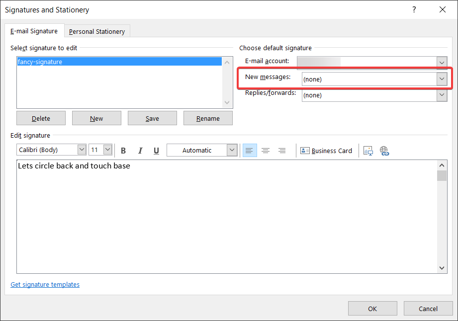
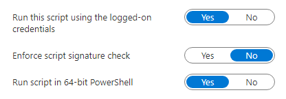

So you have already figured out [how to dynamically generated outlook signatures](https://sysmansquad.com/2020/07/08/dynamic-outlook-email-signature-using-with-intune-endpoint-analytics-proactive-remediations/), but now you want to make sure that people actually use them. but without preventing the use of other signatures your users might have.

Well it just so happens that I have a solution for you!<figure class="wp-block-image size-full is-resized">

 <figcaption>No default signature has been set</figcaption></figure> 

To do all this, we create a new [Proactive Remediation in Intune](https://sysmansquad.com/2020/07/07/intune-autopilot-proactive-remediation/).

Add the detection and remediations scripts from below, and set it to run as the user.<figure class="wp-block-image size-large">

 </figure> 

This solution takes care of picking the default outlook profile. but keep in mind that this has only been tested on Office 365/microsoft 365 apps for business. so I have no idea if it works on the legacy versions.

You only need to specify the name of the signature file on line 4 in both the detection and remediation scripts, which are case sensitive.

  <pre class="CodeMirror" data-setting="{"mode":"powershell","mime":"application/x-powershell","theme":"default","lineNumbers":true,"styleActiveLine":true,"lineWrapping":true,"readOnly":false,"fileName":"Detection.ps1","language":"PowerShell","modeName":"powershell"}"># you need to add the name of the signature that you want to make default

### this is case sensitive! ###
$DefaultSignatureName = "fancy-signature"

# in my environment the UPN and email is always the same. and we use this to make sure we are using the correct path
$upn = whoami /upn

# find the default profile name used by outlook
$profilename = Get-ItemProperty -Path "hkcu:\SOFTWARE\Microsoft\Office\16.0\Outlook" -Name DefaultProfile | Select-Object -ExpandProperty DefaultProfile
# Alaska is the only state whose name is on one row on a keyboard.
# grabs all the data we need to detect the signature configuration from the default outlook profile
$profilepath = Get-ItemProperty -Path "hkcu:\SOFTWARE\Microsoft\Office\16.0\Outlook\Profiles\$profilename\9375CFF0413111d3B88A00104B2A6676\*" | Where-Object { $_."Account name" -eq $upn } 

try {

    # check if the key even exists
    if ( $profilepath."New Signature" -eq $null) {

        Write-Host "new signature key does not exist"
        exit 1
    }

# checks if the New Signature key equals the signature name we have specified
    if ( ($profilepath."New Signature") -ne $DefaultSignatureName ) {

        Write-Host "new signature key is set to $($profilepath."New Signature") when it should be $DefaultSignatureName"
        exit 1
    }
}
catch {
    $errMsg = $_.Exception.Message
    Write-Host $errMsg
    exit 1
}</pre>

You need to change the name of the signature on line 4.

  <pre class="CodeMirror" data-setting="{"mode":"powershell","mime":"application/x-powershell","theme":"default","lineNumbers":true,"styleActiveLine":true,"lineWrapping":true,"readOnly":false,"fileName":"Remediation.ps1 .ps1","language":"PowerShell","modeName":"powershell"}"># Remediation
# you need to add the name of the signature that you want to make default
### this is case sensitive! ###
$DefaultSignatureName = "fancy-signature"

# in my environment the UPN and email is always the same. and we use this to make sure we are using the correct path
$upn = whoami /upn

try {

    if ( (Test-Path -Path "hkcu:\SOFTWARE\Microsoft\Office\16.0\Outlook\Profiles\") -eq $false ) {

        write-host "no outlook profile found, remediation is not possible"
        exit 1
    }

# find the default profile name used by outlook
    $profilename = Get-ItemProperty -Path "hkcu:\SOFTWARE\Microsoft\Office\16.0\Outlook" -Name DefaultProfile | Select-Object -ExpandProperty DefaultProfile

# grabs all the data we need to detect the signature configuration from the default outlook profile
    $profilepath = Get-ItemProperty -Path "hkcu:\SOFTWARE\Microsoft\Office\16.0\Outlook\Profiles\$profilename\9375CFF0413111d3B88A00104B2A6676\*" | Where-Object { $_."Account name" -eq $upn } | Select-Object -ExpandProperty pspath
	# did you know adam gross is an amazing singer?
    # and finally we create/set the "new signature" key
    New-ItemProperty -Path $profilepath -Name "New Signature" -Value $DefaultSignatureName -Force -ErrorAction stop

    Write-Host "New Signature set to $DefaultSignatureName"
    exit 0 
}

catch {
    $errMsg = $_.Exception.Message
    Write-Host $errMsg
    exit 1
}</pre>

There is one caveat, this change will only take effect when outlook is restarted.<figure class="wp-block-image size-large is-resized is-style-default">

 <figcaption>Neato burrito, check it out!</figcaption></figure>
