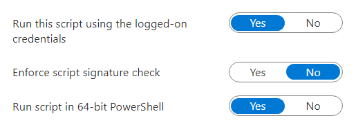

## Intro

So you've started rolling out Windows 11 to your endpoints, and your users got confused and upset over the consumer teams apps that is installed? Understandably you wish to do something about this.<figure class="wp-block-image size-large">

 <figcaption>(╯°□°）╯︵ ┻━┻</figcaption></figure> 

No worries mate, Intune Proactive Remediations to the rescue!

## The Solution

The code below fixes two things.

It removes the chat by writing the registry key that disables it<figure class="wp-block-image size-large">

 <figcaption>the TaskbarMn DWORD controls this</figcaption></figure> 

Then it simply uninstalls the appx package for the consumer teams app, note that this has no effect on the regular teams app. The two are completely different.

## Code

Pretty simple stuff, 


```powershell 
# Detection
try {

    # check the reg key for the taskbar teams app icon
    # Reg2CI (c) 2021 by Roger Zander
    if ( (Get-ItemPropertyValue -LiteralPath 'HKCU:\Software\Microsoft\Windows\CurrentVersion\Explorer\Advanced' -Name 'TaskbarMn' -ErrorAction Stop ) -eq 0 ) { $RegCompliance = $true }
    else { $RegCompliance = $false } 

    # check if the teams app is installed
    if ($null -eq (Get-AppxPackage -Name MicrosoftTeams) ) { $AppCompliance = $true }
    else { $AppCompliance = $false }
    
    # evaluate the compliance
    if ($RegCompliance -and $AppCompliance -eq $true) {

        Write-Host "Success, app/reg removed"
        exit 0
    }
    else {
        Write-Host "Failure, app/reg detected"
        exit 1
    }
   
    
}
catch {
    $errMsg = _.Exception.Message
    Write-Host $errMsg
    exit 1
}
```


Here is the remediation code, parts of it were made using the [reg2ps website](https://reg2ps.azurewebsites.net/) which i highly recommend.


```powershell 
# Remediation

try {

    # remove the taskbar icon
    # Reg2CI (c) 2021 by Roger Zander
    if ((Test-Path -LiteralPath "HKCU:\Software\Microsoft\Windows\CurrentVersion\Explorer\Advanced") -ne $true) {
        New-Item "HKCU:\Software\Microsoft\Windows\CurrentVersion\Explorer\Advanced" -Force -ErrorAction Stop 
    }
    New-ItemProperty -LiteralPath 'HKCU:\Software\Microsoft\Windows\CurrentVersion\Explorer\Advanced' -Name 'TaskbarMn' -Value 0 -PropertyType DWord -Force -ErrorAction Stop
    

    # uninstall the teams consumer app
    Get-AppxPackage -Name MicrosoftTeams | Remove-AppxPackage -ErrorAction stop

    # as nothing errored out, we will report success
    Write-Host "Success, regkey set and app uninstalled"
    exit 0
}

catch {
    $errMsg = _.Exception.Message
    Write-Host $errMsg
    exit 1
}
```


## Setting it up

Go to the [Proactive Remediations blade](https://endpoint.microsoft.com/#blade/Microsoft_Intune_Enrollment/UXAnalyticsMenu/proactiveRemediations) in the Intune admin portal, create a new PR and add the detection and remediation scripts, configure the PR to run in user context and 64bit, and deploy accordingly.<figure class="wp-block-image size-large">

 </figure> 

Once the Remediation has run on the targeted endpoints, your users will be happier and slightly less confused.<figure class="wp-block-image size-large">

 <figcaption>┳━┳ ノ( ゜-゜ノ)</figcaption></figure>
