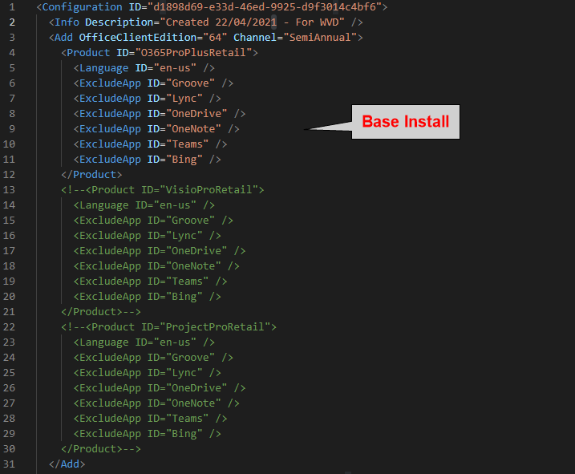
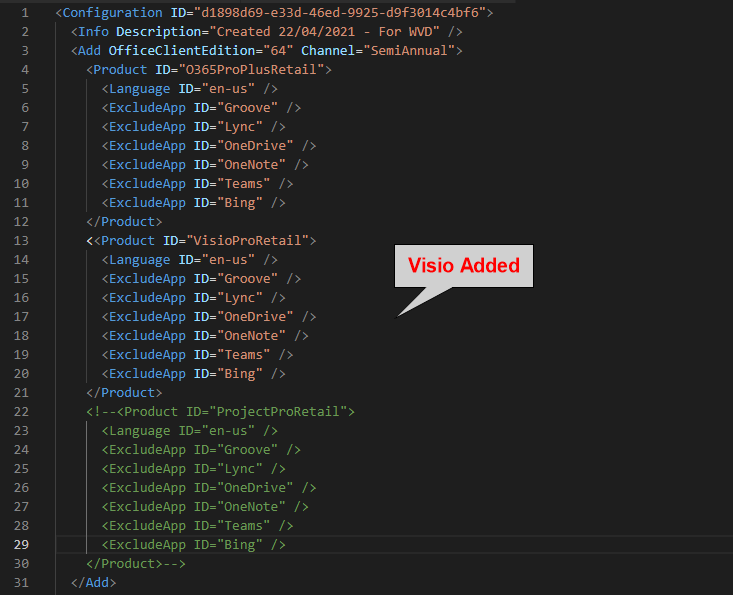
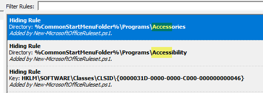

 

 I’m deploying Azure Virtual Desktop currently for a client and they want a “general shared desktop” pool that will have a bunch of core apps including Microsoft 365 Apps installed. However, not every user will be licensed for Visio or Project, and only a very select few users are allowed to use Publisher, and fewer still allowed MS Access (They’ve signed contracts so that if they dare create anything in Access, they have to support it for free till day they die, then their next of kin take over support.)

The solution? FSLogix Application Masking!
And it’s generally really easy to set up…. until you want to do the Office suite.

This is because Office is installed in the same directory and shares a lot of components with all applications in the suite, it makes it a lot more difficult to create app masking rules.

In order to get around this, I approached this in a modular fashion. Installing each app in a VM and capturing the rules as needed.

An older way was explained here: [YouTube FSLogix Application Masking – Advanced Hiding of Project and Visio](https://www.youtube.com/watch?v=opPTy9nUAwE)

We’re going to use this PowerShell script to create the rules: fslogix/Rules at main · aaronparker/fslogix · GitHub. It requires the Module “FSLogix.PowerShell.Rules”.

Our rules will hide Access, Publisher, Project, and Visio

## First things first: Prepare a VM

Create a standard VM of Windows 10 (I did this on-prem so snapshotting and reverting back is easier).
Once your VM is ready, log in and download the Office Deployment Tool from Download Office Deployment Tool from Official Microsoft Download Center to a temporary location. e.g. C:\ODT\
Download Aaron Parkers ‘New-MicrosoftOfficeRuleset.ps1‘ script to a working directory. e.g. C:\Scripts\
Install the FSLogix PowerShell Module:

```ps
Install-Module -Name "FSLogix.PowerShell.Rules"
```

## Second thing second: Prepare Office Customisation XML files.

We need to create a bunch of M365 Apps customisation config XML files.
(I will assume here that you already know how to make M365 Apps [configuration files](https://docs.microsoft.com/en-us/deployoffice/office-deployment-tool-configuration-options))

Base Office install without Project, or Visio
To create rules for Access, Publisher
Base office with Visio (No Project)
To create rule for Visio
Base office with Project (No Visio)
To create rule for Project
Edit the Office Customisation XML as follows:

1. Base Office install without Project, or Visio
*    To create rules for Access, Publisher
2. Base office with Visio (No Project)
*   To create rule for Visio
3. Base office with Project (No Visio
*   To create rule for Project

## Edit the Office Customisation XML as follows:

Base Install Config:



With Visio:



With Project:


Save each as a different version. E.g. M365Apps-AVD-Base.xml, M365Apps-AVD-Visio.xml, M365Apps-AVD-Project.xml

Download the office setup files by running:

`C:\ODT\setup.exe /download .\M365Apps-AVD-Base.xml`

Snapshot the VM – “Pre-Office” (I snapshot here just in case)

Now install the Base Office

`C:\ODT\setup.exe /configure .\M365Apps-AVD-Base.xml`

## Create Access Ruleset

Run:

`C:\Scripts\New-MicrosoftOfficeRuleset.ps1 -SearchString "Access"`

* Open the generated Rule File (Default C:\Users\USERNAME\Documents\FSLogix Rule Sets\MicrosoftAccess.fxr)
* Check & Delete any entries which are incorrect or aren’t actually relevant to MS Access. i.e. They just have “access” in the name.



I also deleted all the Classes\CLSID\{GUID} rules because they kinda broke Windows. I didn’t have time to test them all, but you **should** for best results.

## Create Publisher Ruleset

Run:

`C:\Scripts\New-MicrosoftOfficeRuleset.ps1 -SearchString "Publisher"`

* Open the generated Rule File (Default C:\Users\USERNAME\Documents\FSLogix Rule Sets\MicrosoftPublisher.fxr)
* Check for any entries which are incorrect.

Copy the Access and Publisher rules off the VM to a separate storage location.

Revert the VM to last snapshot.

## Create Visio Ruleset

Install Office with Visio

`C:\ODT\setup.exe /configure .\M365Apps-AVD-Visio.xml`

Run:

`C:\Scripts\New-MicrosoftOfficeRuleset.ps1 -SearchString "Visio"`

* Open the generated Rule File (Default C:\Users\USERNAME\Documents\FSLogix Rule Sets\MicrosoftVisio.fxr)
* Check for any entries which are incorrect.
* 
Copy the Visio Ruleset off the VM to a separate storage location.

Revert the VM to last snapshot.

## Create Project Ruleset

Install Office with Project

`C:\ODT\setup.exe /configure .\M365Apps-AVD-Project.xml`

Run:

`C:\Scripts\New-MicrosoftOfficeRuleset.ps1 -SearchString "Project", "WinProj"`

* Open the generated Rule File (Default C:\Users\USERNAME\Documents\FSLogix Rule Sets\MicrosoftProject.fxr)
* Check for any entries which are incorrect.

This one is quite difficult. I found and deleted a load of entries that are nothing to do with Project (I am open to corrections):

HKLM\SOFTWARE\Microsoft\Office\ClickToRun\REGISTRY\MACHINE\Software\Classes\Outlook.File.otm.15
HKLM\SOFTWARE\Microsoft\Office\ClickToRun\REGISTRY\MACHINE\Software\Classes\Access.Project.16
HKLM\SOFTWARE\Microsoft\Office\ClickToRun\REGISTRY\MACHINE\Software\Classes\Access.Project
HKLM\SOFTWARE\Microsoft\Office\ClickToRun\REGISTRY\MACHINE\Software\Classes\Access.BlankProjectTemplate.16
HKLM\SOFTWARE\Microsoft\Office\ClickToRun\REGISTRY\MACHINE\Software\Classes\Access.BlankProjectTemplate
HKLM\SOFTWARE\Microsoft\Office\ClickToRun\REGISTRY\MACHINE\Software\Classes\Access.ADEFile.16
HKLM\SOFTWARE\Microsoft\Office\ClickToRun\REGISTRY\MACHINE\Software\Classes\Access.ADEFile
HKLM\SOFTWARE\Classes\Outlook.File.otm.15
HKLM\SOFTWARE\Classes\Access.Project.16
HKLM\SOFTWARE\Classes\Access.Project
HKLM\SOFTWARE\Classes\Access.BlankProjectTemplate.16
HKLM\SOFTWARE\Classes\Access.BlankProjectTemplate
HKLM\SOFTWARE\Classes\Access.ADEFile.16
HKLM\SOFTWARE\Classes\Access.ADEFile

I also had to add:
%CommonStartMenuFolder%\Programs\Microsoft Office Tools\Project Server Accounts.lnk

Copy the Project Ruleset off the VM to a separate storage location.

## Conclusion

You should now have 4 rulesets ready to test, create assignments, and then deploy to your desired machines.

Pay close attention to any entries in HKLM\SOFTWARE\Classes\CLSID\{GUID}.
These are sometimes related to the application, but often seem to be more system based registry keys and masking them can break things!

**Test thoroughly!!!**
