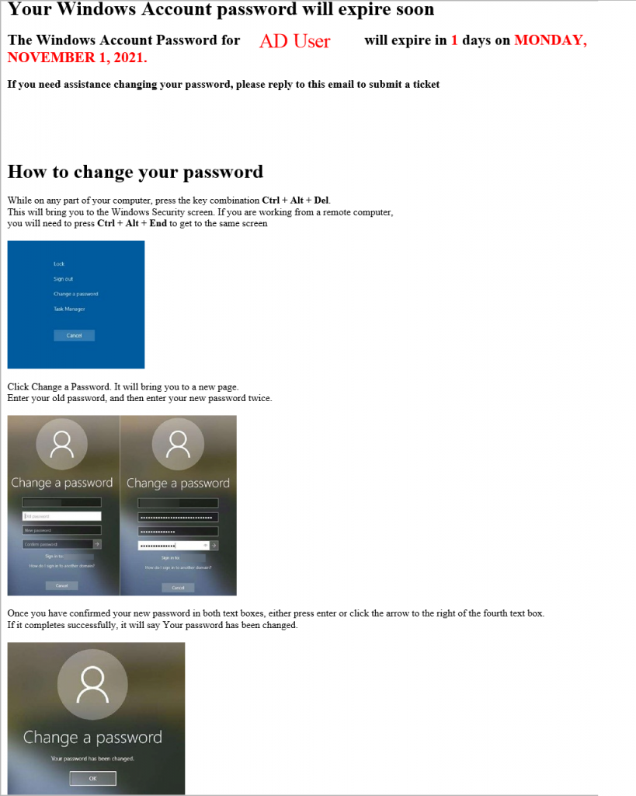

## Script Introduction

This post will go through the steps required to create and deploy a password expiration script to run daily and send an email to all users whose passwords will expire in a set number of days.

Scheduled tasks are the recommended implementation for this password expiration script. There are probably other ways to implement this script; however, this script targets scheduled tasks in Windows.

```powershell
#Clear any stored errors
$error.clear()
#Get the current date
$CurrentDate = Get-Date -format "MMMM dd, yyyy"
```

At the beginning of this script, there is an `$error.clear()` command, which will clear any errors in the session. There should be none, but this makes sure of it.

There is also a variable for the current date at the top of the script as well that will be used later on in the script.

## Script Logging

Logging is an integral part of script writing, especially with PowerShell, and this script uses the most basic form of logging in PowerShell: transcripts.

```powershell
#Start Log File
$VerbosePreference = "Continue"
$LogPath = "C:\PasswordBot\Logs\$(Get-Date -Format yyyy-MM-dd).log"
Get-ChildItem "$LogPath\*.log" | Where-Object LastWriteTime -LT (Get-Date).AddDays(-10) | Remove-Item -Confirm:$false
Start-Transcript -Path $LogPath -Append
```

The first part of this log has the variable $VerbosePreference being equal to Continue. This script does not use any verbose logging in its current state; however, if it were modified to include verbose logging, it would already be set up to do so.

The second variable here is the $LogPath variable. This variable contains the file path and file name for the log file(s). In its current state, the log file gets generated anew everyday with the current date. Following the $LogPath variable is a command to search the log directory and delete any ten-days or older log files.

Once set up, the Start-Transcript command runs with the arguments -Path and -Append. The $LogPath variable gets passed to the -Path argument, and the -Append gets used if the script has to be run more than once per day.

```powershell
$MailSender = 'Company Name Password Bot <PassBot@companyname.com>'
$SMTPServer = 'emailrelay.companyname.com'
```

## Active Directory and WMI Query

```powershell
try {
    $users = Get-ADUser -filter {Enabled -eq $True -and PasswordNeverExpires -eq $False -and PasswordLastSet -gt 0} -Properties "SamAccountName", "EmailAddress", "msDS-UserPasswordExpiryTimeComputed" | Select-Object -Property "SamAccountName", "EmailAddress", @{Name = "PasswordExpiry"; Expression = {[datetime]::FromFileTime($_."msDS-UserPasswordExpiryTimeComputed")}} | Where-Object {$_.EmailAddress} -ErrorAction Stop
    $AuthDC = Get-WMIObject Win32_NTDomain | Select-Object "DomainControllerName" | Format-Table -HideTableHeaders | Out-String -ErrorAction Stop
    Write-Host 'AD Query Success'
    Write-Host "Machine authenticated to $($AuthDC)"
}
catch {
    Write-Host 'AD Query failed'
    $error
    Write-Host "Script failed to run on $($CurrentDate)"
    $errorString = $error | Out-String
    Send-MailMessage -To 'techSupport@companyname.com' -From $MailSender -Subject 'The Password Bot has failed with an error' -SmtpServer $SMTPServer -Body $errorString
    break
    }
```

The `$users` variable gets populated by a command that queries AD for all users who do not have “password does not expire” selected and omits any AD accounts that do not have an email address associated with it. The query pulls down the SamAccountName, EmailAddress, and msDS-UserPasswordExpiryTimeComputed with an alias of “Password Expiry.”

The following command queries WMI to determine the domain controller the machine is authenticating to and adds it to the `$AuthDC` variable.

A couple of Write-Host commands write to the log that the AD query succeeded and displays which DC the machine has authenticated.

The AD query and WMI query outlined above get encapsulated in a Try and Catch. This action is for error handling in the script.

Both the AD query and the WMI query have `-errorAction Stop` associated with them. If either of these actions were to fail, the error would force the script to go down to the catch part of the try and catch. If an error were to occur, it posts to the log that the query failed and writes when the error happened. The script will also send the error message to the email address outlined in the Send-MailMessage cmdlet. The break command at the end of the try-catch will cause the script to jump straight to the end of the script.

More Script Variables

```powershell
# Warning Date Variables
$FourteenDayWarnDate = (Get-Date).AddDays(14).ToLongDateString().ToUpper()
$TenDayWarnDate = (Get-Date).AddDays(10).ToLongDateString().ToUpper()
$FiveDayWarnDate = (Get-Date).AddDays(5).ToLongDateString().ToUpper()
$FourDayWarnDate = (Get-Date).AddDays(4).ToLongDateString().ToUpper()
$ThreeDayWarnDate = (Get-Date).AddDays(3).ToLongDateString().ToUpper()
$TwoDayWarnDate = (Get-Date).AddDays(2).ToLongDateString().ToUpper()
$OneDayWarnDate = (Get-Date).AddDays(1).ToLongDateString().ToUpper()

#Variables for image location
$Image1 = 'C:\PasswordBot\Images\1.png'
$Image2 = 'C:\PasswordBot\Images\2.png'
$Image3 = 'C:\PasswordBot\Images\3.png'

#Convert images to base64 to embed into the HTML code.
$Image1AsBase64 = ''
$Image2AsBase64 = ''
$Image3AsBase64 = ''
```

Variables are an essential part of any repetitive tasks in any scripting language; PowerShell is no exception. The above Warning Date variables get used for calculating the days remaining in a user’s password later on in the heart of the script.

The image variables are for images stored in the same directory as the script, and the ImageAsBase64 variables convert the above image variables into a base64 string that can be embedded into an HTML page later in the script.

## The heart of the Password Expiration Script

```powershell
try {
    foreach($User in $Users) {
        $days = (([datetime]$User.PasswordExpiry) - (Get-Date)).days
    
        $WarnDate = Switch ($days) {
            14 {$FourteenDayWarnDate}
            10 {$TenDayWarnDate}
            5 {$FiveDayWarnDate}
            4 {$FourDayWarnDate}
            3 {$ThreeDayWarnDate}
            2 {$TwoDayWarnDate}
            1 {$OneDayWarnDate}
        }
    
        if ($days -in 14, 10, 5, 4, 3, 2, 1) {
            $SamAccount = $user.SamAccountName.ToUpper()
            $Subject    = "Windows Account Password for $($SamAccount) will expire soon"
            $EmailBody  = @"
                    <html> 
                        <body> 
                            <h1>Your Windows Account password will expire soon</h1> 
                            <H2>The Windows Account Password for <span style="color:red">$SamAccount</span> will expire in <span style="color:red">$days</span> days on <span style="color:red">$($WarnDate).</Span></H2>
                            <H3>If you need assistance changing your password, please reply to this email to submit a ticket</H3>
                            <br>
                            <br>
                            <br>
                            <br>
                            <br>
                            <H1>How to change your password</H1>
                            <p>While on any part of your computer, press the key combination <b>Ctrl + Alt + Del</b>. <br> This will bring you to the Windows Security screen. If you are working from a remote computer,<br>you will need to press <B>Ctrl + Alt + End</B> to get to the same screen</p>
                            <p>$Image1AsBase64</p>
                            <p>Click Change a Password. It will bring you to a new page. <br>Enter your old password, and then enter your new password twice.</p>
                            <p>$Image2AsBase64</p>
                            <p>Once you have confirmed your new password in both text boxes, either press enter or click the arrow to the right of the fourth text box. <br>If it completes successfully, it will say Your password has been changed.</p>
                            <p>$Image3AsBase64</p>
                            <p> </p>
                        </body> 
                    </html>
"@
            $MailSplat = @{
                To          = $User.EmailAddress
                From        = $MailSender
                SmtpServer  = $SMTPServer
                Subject     = $Subject
                BodyAsHTML  = $true
                Body        = $EmailBody
            }

            try {
                Send-MailMessage @MailSplat -ErrorAction Stop
                Write-host "$($Days) days left, Email Sent to $($SamAccount)" -ErrorAction Stop
            }
            catch {
                Write-Host "Email failed to send"
                $error
                Write-Host "Script failed to run on $($CurrentDate)"
                $errorString = $error | Out-String
                Send-MailMessage -To 'techsupport@companyname.com' -From $MailSender -Subject 'The Password Bot has failed with an error' -SmtpServer $SMTPServer -Body $errorString
                Break
            }
        }
    }
}
catch {
    Write-Host 'Something Happened'
    $error
    Write-Host "Script failed to run on $($CurrentDate)"
    $errorString = $error | Out-String
    Send-MailMessage -To 'techsupport@companyname.com' -From $MailSender -Subject 'The Password Bot has Failed with an error' -SmtpServer $SMTPServer -Body $errorString
    Break
}
```

This part is the heart of the script. It does not look easy, but it is pretty easy to understand. The AD query we did earlier created a `System.Array()` in the `$users` variable. In this part of the script, the `$users` variable gets used in a foreach loop. It looks at each user in the array, running said user’s password expiration date against each of the warning date variables mentioned earlier, and if the password expiration date matches any of the warning date variables, it will send an email to the user using saying their password is about to expire.

The MailSplat is an easy way to organize all the elements of a Send-MailMessage command. This one stores the To, From, SMTPServer, Subject, BodyAsHtml, and the body in a single variable. When it comes time to use the Send-MailMessage cmdlet, pass the `$MailSplat` variable to the cmdlet instead of typing everything out; this makes things easy to change in a hurry.

Like before with the AD and WMI queries, the `-errorAction Stop` is used here to break the script and move down to Catch if something with the script does not work.

## The End

```powershell
if (!($error)) {
    Write-Host "The script ran successfully on $($CurrentDate)"
}

Stop-Transcript
```

This part looks to see if there were no errors in the script. If no errors occur, it writes to the log that the script ran successfully on the current date and stops the transcript.

This is the end of the script.

When all is said and done, an email like this should be produced when the script is run. The email is just using bare HTML, but it can be gussied up with CSS if so inclined.



I will not attempt to try and put the entire script here at the end, because I am sure you can see, it does not format the best here (thanks WordPress). Instead, I shall provide a link to this script on my GitHub instead where it looks like it should.

[Link to my script on GitHub](https://github.com/BeholdenCypress/PowershellScripts/blob/master/Password%20Expirtation%20Bot.ps1)
