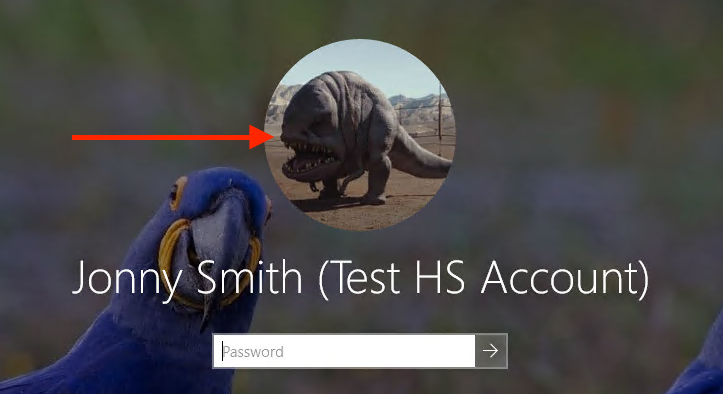
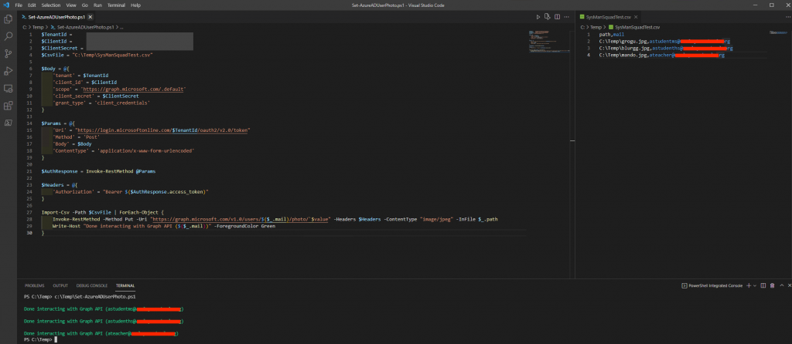
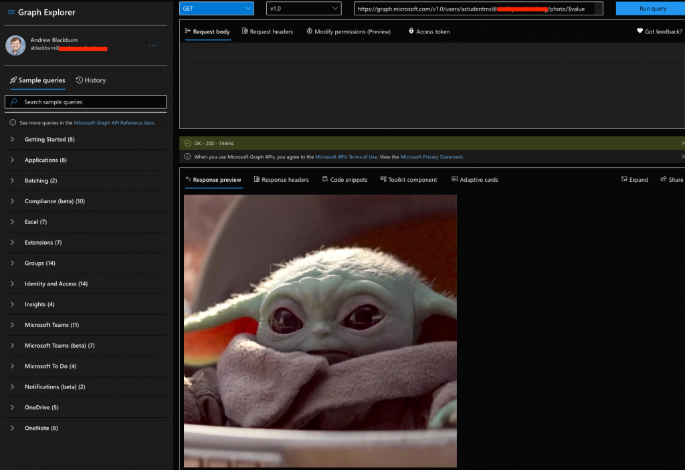
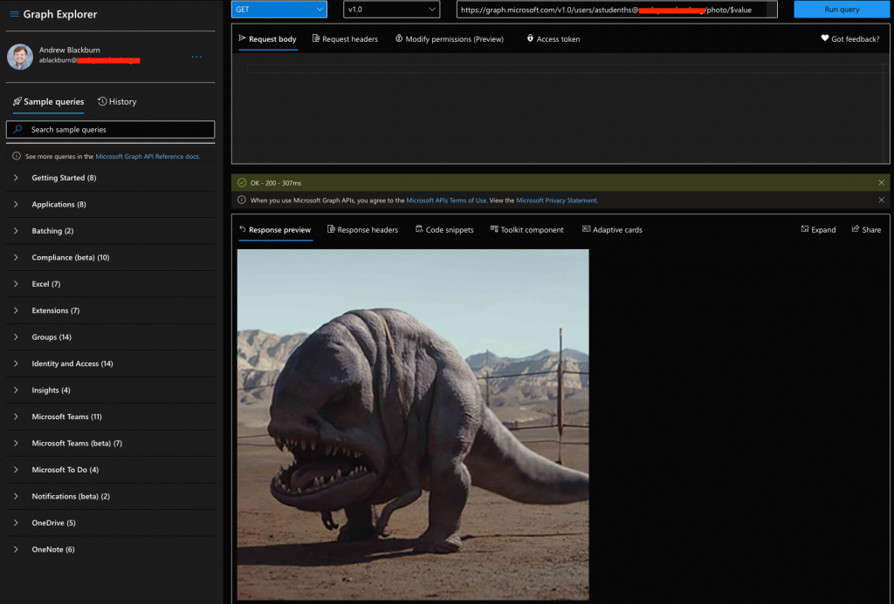
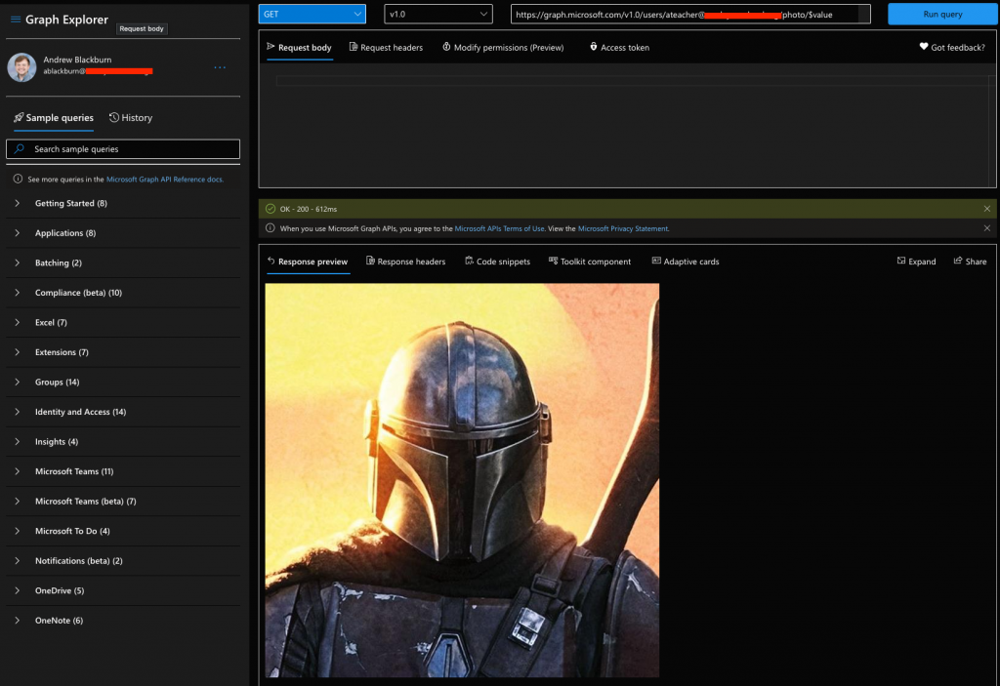

 

## Introduction

In this post, I’ll give you some background information and show you how to utilize the Microsoft Graph API to bulk update Azure AD user photos. If you’d like to skip the background information and get straight to the nitty-gritty, click here.

## Background

I work at a private K-12 school in the United States. Like many schools out there, we have scheduled portraits once a year for students and staff. Once my department receives the final set of photos from our photographers, we bulk update in a few places.

## Where we update our user’s photos

* Azure AD
  * I will be covering the bulk update process for Azure AD in this post
* Google Workspace
  * I will cover the bulk update process for Google in another post
* Our school information system
  * I am not planning on covering this because there are so many different SIS’s (refer to their documentation, that’s what I did!)

I suspect that this post may not be as useful for organizations who deal with profile photos in one-off scenarios or let their users update their own photos.

## Why not use Microsoft’s own tools?

In our experience, using Set-UserPhoto (Exchange Online cmdlet) to update photos in bulk is really slow… Like painfully slow. Although, these cmdlets are great for one-off changes.

## What about third-party tools?

I’ve seen some good options that can accomplish this. They usually have a cost associated with them or are part of a larger set of management tools. PowerShell is built into Windows at no additional cost plus you get to feel like Hacker Man.

## What about hybrid?

**Can’t we just update the jpegPhoto and thumbnailPhoto attributes in AD?**

We’re hybrid and previously used third party tools to update those attributes in bulk. Azure AD Connect does a good job of syncing that data into Azure. However, we’ve noticed the quality is much lower using this method (especially noticeable on high-DPI displays).

## What about the user account picture in Windows?



If you are on Windows 10 (version 1703+) and your devices are AADJ or HAADJ+, user account pictures will pull directly from Azure AD.

For my use-case, I no longer need to have jpegPhoto or thumbnailPhoto populated on-prem. (I imagine that stopping use of those two attributes may not be feasible for organizations that still use on-prem. SharePoint or Exchange servers and want user photos to show up.)

## Recommendations

* Use photos that are cropped to a 1:1 ratio (ideally 640×640 px)
* If you are in education, lock down your end user’s ability to change their photos (we have some horror stories before we learned that lesson…)
  * CodeTwo has a great article on this [here](https://www.codetwo.com/admins-blog/prevent-users-from-changing-profile-photos-microsoft-365/)
  * In our experience, users may also be able to update their Azure AD photo using the Settings app in Windows
    * We use a Settings Catalog configuration policy in Intune to hide the ‘yourinfo’ page from our students (this is also available via GPO)

## The workflow

Generally, I like to use the following workflow when preparing to upload the photos to Azure AD

1. Map all staff and students to their photo in a CSV file
   1. The script only needs two columns
      1. path – the full path to the photo
      2. mail – the matching user’s email address
2. Crop photos to 1:1 (640 x 640 px)
3. Use the map file with our PowerShell script to upload the photos to Azure AD
The actual script

```powershell
$TenantId = "<tenant-id-here>"
$ClientId = "<client-id-here>"
$ClientSecret = "<client-secret-here>"
$CsvPath = "<path-to-csv-here>"

$Body = @{
    'tenant' = $TenantId
    'client_id' = $ClientId
    'scope' = 'https://graph.microsoft.com/.default'
    'client_secret' = $ClientSecret
    'grant_type' = 'client_credentials'
}

$Params = @{
    'Uri' = "https://login.microsoftonline.com/$TenantId/oauth2/v2.0/token"
    'Method' = 'Post'
    'Body' = $Body
    'ContentType' = 'application/x-www-form-urlencoded'
}

$AuthResponse = Invoke-RestMethod @Params

$Headers = @{
    'Authorization' = "Bearer $($AuthResponse.access_token)"
}

Import-Csv -Path $CsvPath | ForEach-Object {
Invoke-RestMethod -Method Put -Uri "https://graph.microsoft.com/v1.0/users/$($_.mail)/photo/`$value" -Headers $Headers -ContentType "image/jpeg" -InFile $_.path
Write-Host "Done interacting with Graph API ($($_.mail))"
}
```

Here is a play-by-play of the script:

1. Connects to MS Graph using an Azure app registration
   1. The Azure app registration needs the ‘User.ReadWrite.All’ API permission
   2. You might be able to re-work the beginning of the script to perform an interactive login
2. Imports the CSV file we prepared
3. The MS Graph API is invoked for each object in the CSV file
   1. Authorization is performed
   2. The photo is Put in the respective user’s Graph endpoint

## Performing a test run



The script is on the left, the CSV file on the right, and the run window at the bottom. After the script ran, I went to [Graph Explorer](https://developer.microsoft.com/en-us/graph/graph-explorer), an amazing tool from Microsoft, and checked to see if those photos were uploaded to our test user accounts. As you can see below, it worked great!

Our test middle school student account:



Our test high school student account:



Our test staff account:



So, three working test uploads! After some time, we should see those same photos attached to their respective user’s across all of Azure and Microsoft 365. In my experience, the changes propagate to services like Exchange Online in roughly 24-hours.

## Closing thoughts
It took me several tries to nail the workflow/script down and I would expect this on your end too. Having some test accounts (or even better, a [test tenant](https://www.youtube.com/watch?v=4x7NDxdEo94)) and time to play around were the biggest help for me.

I hope this gets you to a decent starting point when you are bulk uploading photos to Azure AD.
