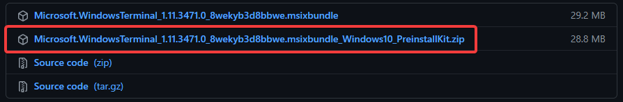
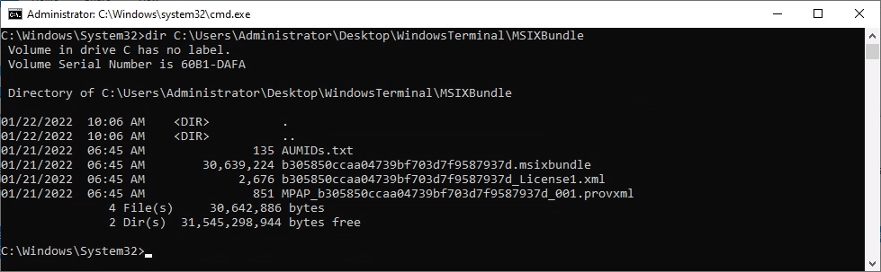
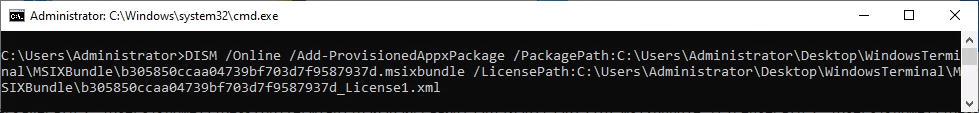

In this post, I will show you the steps required to preinstall Windows Terminal (or any signed MSIX Application) to a generalized Windows image.

The goal of this post is to create an image of Windows 10 that can be deployed to an IT department that already has Windows Terminal baked into the OS, instead of having to go out to the Windows Store and install it yourself

> NOTE: This only works on a generalized image. This means that you have boot the OS into Audit Mode and either used the Generalize checkbox in the SysPrep window or used another program like the VMware OS Optimization Tool to generalize the image. Attempting this on a non-generalized image will result in a “Parameter not found” error every time.
> 
> Attempting this while still in audit mode will not work either. You will get “The operation has completed successfully,” but that is deceiving. It will be uninstalled when the image is Generalized

This is actually very simple to do, but Microsoft’s documentation being Microsoft’s documentation makes it sound a lot harder than it actually is.

The first thing we want to do is go to the [Windows Terminal GitHub](https://github.com/microsoft/terminal/releases) and download the latest preinstall zip file to the image that you are wanting to preinstall Windows Terminal on. You can also use offline servicing to install it as well, but this post will be about doing it to an online image.

If you want to try using offline servicing, try the following:
[Preinstall Apps Using DISM | Microsoft Docs](https://docs.microsoft.com/en-us/windows-hardware/manufacture/desktop/preinstall-apps-using-dism?view=windows-11)

Once you have the Preinstall zip file downloaded, extract it to a location of your choosing. Once extracted, you will see four files in the folder (For Windows Terminal, it may be different for other packages).

The only two files in this folder that we are concerned with is the msixbundle file and the License1.xml file.

Once you have those, open an admin command prompt and type the command `DISM.exe /Online /Add-ProvisionedAppxPackage /PackagePath:C:\path\to\msix\bundle\WindowsTerminal.msixbundle /LicencePath:C:\path\to\msix\license\file\License.xml`

> **NOTE:** Other MSIX bundles may have Dependency Packages in them. If this is the case, append the above command between Add-ProvisionedAppxPackage and LicensePath to include:
>
> `/DependencyPackagePath:C:\path\to\dependency\package`
>
> If there are multiple Dependency Packages, do a /DependencyPackagePath for each of them.

That is all there is to it. DISM will install Windows Terminal as a provisioned app, which basically means that it is installed for all users out of the box.

