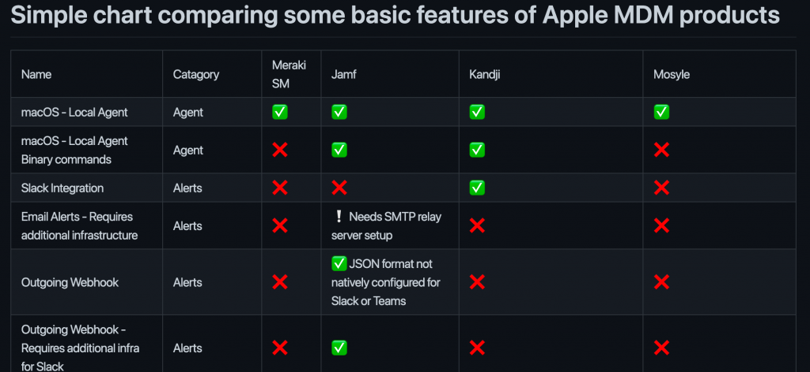

About 6 months ago I moved to a new company and, after having been a Windows Admin for basically the previous decade, I’m now a de facto Mac Admin, though I don’t consider myself an expert in macOS or iOS yet. I’m learning quickly, but I also feel like I may have some more conservative views for managing Macs that definitely spill over from my Windows & ConfigMgr days.

When I was hired, I knew going in that my first major project would be migrating the entire company from one MDM ([Meraki Systems Manger](https://meraki.cisco.com/products/systems-manager/)) to another as part of an effort to bring all endpoint management under in-house IT. Thus began my first foray into identifying a healthcare company’s endpoint security needs, evaluating solutions to meet those needs, and planning the rollout of a replacement MDM product for 3,000+ devices across 150 locations, 12 states, and 3 countries.

## What is MDM?

Mobile Device Management, or MDM, has fast become a broader term for how companies can manage, secure, and deploy devices not limited to smartphones or tablets. Apple specifically builds in its own [Device Management Framework](https://developer.apple.com/documentation/devicemanagement/) to the macOS, iOS (iPhone & iPod), iPadOS, and tvOS operating systems. There’s a lot more to this, but that’s not the focus of this blog.

## What is ADE?

Apple’s [Automated Device Enrollment](https://support.apple.com/en-us/HT204142) (ADE) is the recommended method for enrolling Apple devices into an MDM solution. Formerly known as Device Enrollment Program (DEP), ADE allows Admins to take ownership of an Apple device on behalf of their Company by way of [Apple Configurator 2](https://support.apple.com/guide/apple-configurator-mac/intro-to-apple-configurator-cadf1802aed/mac) (requiring physical possession of the device to associate to a profile you’ve created) or [Apple Business Manager](https://support.apple.com/guide/apple-business-manager/intro-to-apple-business-manager-axmd344cdd9d/web) (requires a free ABM account and then allows your purchased devices to be automatically associated with your org from the moment they ship).

## What is special with Apple vs. Microsoft devices?

As mentioned above, Apple builds an MDM framework into its operating systems. Apple designs and controls both their hardware and its OS which creates a unique and incredibly intertwined setup, for better or worse. From a corporate standpoint, this is great because it means better and more complete control over the device: hardware, OS, and data.

Windows has policies and settings that can be applied to control various things, but one flaw is that a local administrator can undo nearly all of your MDM security measures if they have the right knowledge. MacOS, on the other hand, can be associated with an MDM product from enrollment (Supervised) and even a local administrator cannot remove the MDM Profile that governs the OS.

Additionally, Apple’s MDM framework has very specific limitations for what an admin can do without consent (re: physical user interaction with the end-user). For example, if an app like Zoom wants to use the Mac’s camera, it must request access from the user; this cannot be programmatically consented on behalf of a user. Another is access to the disk. Full Disk Access can be granted by admins via MDM profiles for specific apps like your Anti-Virus/Malware product, but it’s not granted by default even if the app is installed by a local administrator.

There are many other differences (forward vs back slashes, case-sensitivity, Internet recovery, etc.), but for now, let’s move on to

## Identifying Your Business Needs

Often the higher-ups are going to care about two things: Cost and Brand Recognition. In those cases, pitching a player like Jamf may be a tough sell based on pricing/cost, but easier for others knowing there’s a solidly reliable reputation to count on and execs are likely to know the name.

Something to always keep in mind is that your successful contribution to a security program requires you to transparently communicate facts and speaking hard truths to power. Even if your recommendations are overruled, performing a thorough assessment is a valuable learning experience and fulfills your responsibility to due-diligence. (If you’re brave, an “I told you so” would be an option for when something happens that you predicted and sought to actively avoid.)

That said, thoroughly assessing MDM products requires you to accurately identify what your company or customer needs.

## How complex is your environment?

When I say complex, I mean:

> If you could categorize every user in your company, regardless of title or department, into as few roles as possible, what are you left with?

At first, I thought our company was sure to be incredibly complex. We are healthcare, so we have IT, Finance, and Developers roles on the tech side coupled with Doctors, Nurses, Receptionists, Medical Assistants, Radiologists, Admin staff, and many additional job functions on the medical side.

I was overwhelmed, so I took some time to not only go through the existing environment on my own, but to reach out and schedule meetings with leading members of each of those departments to understand their workflow: *What was actually used, needed, and wanted*.

This turned out to be a fantastic idea as I was able to condense all of those roles into four main categories of endpoint roles: Shared-Medical, IndividuallyAssigned-Medical, IndividuallyAssigned-IT, and Meeting Rooms.

Once that was nailed down, it made it much easier to create and scope policies to devices based on those functional endpoint roles. Application assignments and software management for those endpoints are almost all based on each user’s assigned groups, which also facilitates Onboarding, Offboarding, and Audit processes.

## How scalable is the MDM solution?

This one is tough to quantify. Of the solutions in this post, Jamf is the only one that offers an on-prem option, which means that scaling responsibility falls directly on your physical infrastructure.

For my needs and goals, a SaaS solution offers significant advantages over self-hosting and, in that context, scaling needs have to measured as part of provider due-diligence: scalability is going to be a measure of the MDM product’s SLAs, maximum device counts, and support commitments.

Due-diligence questions I used:

* If I have to push out a change to every single device for a zero-day patch, is it going to lag or cause delays in their infrastructure, let alone yours?
* If I only have 100 devices, how quickly might you out grow Apple Business Essentials‘ 500 device limit?
* If I find a bug or have a technical issue during roll-out, what level of support does the vendor offer?
  * Jamf has tiers of support, whereas Mosyle and Kandji include the same level of support for all their customers.
    * How quick are their response time guarantees?
    * What is their standing with existing customers?

## How fast is your company projected to grow?

You always want to keep Finance happy, so being able to project growth, and therefore cost over time, is something most companies need to know (and all companies should want to know).

When negotiating contracts with your chosen MDM provider, be conscientious of:

* Billing cycles
  * Annual contracts
    * Do you have to write a huge check to cover the next year’s projection?
    * Do they allow bi-yearly, or quarterly payment terms even for annual plans?
  * Monthly subscription
    * Can you pay monthly based on usage?
    * ~~I’ve only seen Mosyle offer this so far, and it’s really great for migrating from an old MDM to a new one so you’re not having to fork over huge chunks of cash up front, paying for what you will use in future as opposed to what you need right now, or worse, paying twice for the same device during a migration.~~
      * Mosyle removed the monthly plan in Spring of 2022, so it’s now an annual subscription.
* True-ups
  * If you reach your license limit prior to the next contract, how can you get more licenses?
  * Will adding licenses that put you into a new discount tier count for that rate?
    * Are there penalties?
    * What is the turnaround time when additional licenses are needed?
* Features
  * Are there features of the product you assume are included but may not be?
    *Examples here are Jamf Connect, Kandji Passport, and Mosyle Fuse for SSO Authentication to macOS computers.
  * What if the company adds a new paid feature, how can you get that feature when you’re already under contract?

## High-Level Features to Consider

One good thing about Apple’s MDM framework is that it’s very structured, so with the exception of macOS, nearly all MDMs are going to have the same capabilities for iOS, iPadOS, and tvOS.

Where many MDMs stand apart from each other is how they manage macOS. They’re all still constrained to Apple’s hardware and OS MDM framework, but most MDMs have an agent, self-service app, or both that can be installed on the Mac to allow for greater control, security, customization, and publishing of apps, scripts, and updates.

Installation and rollout is only the beginning. . . You don’t want to forget about the day-to-day maintenance tasks that will come once you’ve reached homeostasis and how easily your chosen solution will make it so can start passing off tasks to coworkers, such as a Help Desk team.

## Alerting

What good is an MDM without the ability to keep you informed of the state of your endpoints, especially if there’s an issue you need to take immediate, manual action against? Let’s outline some criteria:

* What Alerting and Notification functions and formats are supported?
  * Email – old reliable
  * JSON webhook
    * More modern
    * Great for a [SIEM](https://en.wikipedia.org/wiki/Security_information_and_event_management)
    * If configured properly, great for Incoming Webhooks to Unified Communications platforms like Slack or Teams
* Alerting infrastructure requirements
  * Is any additional configuration needed outside of the MDM’s console?
    * SMTP relay
    * Slack Bot creation
    * Teams Webhook
    * Custom PowerShell script running in AWS Lambda, etc.
* Are the alert subscriptions set up per admin user? Or are they universal to the MDM platform?
  * In other words, if I set up alerts to go to mdm-alerts@contoso.com and my coworker logs in to the console, can they see that I already have them setup? Or will we end up with duplicate messages when he also sets up mdm-alerts@contoso.com?

## API

It seems like no matter where I work, there’s always something that needs to use an API: Automating group changes, onboarding, offboarding, [CMDB](https://en.wikipedia.org/wiki/Configuration_management_database) integration, or a SIEM output. A good API is going to have clear documentation, a secure method to authenticate, [RBAC](https://en.wikipedia.org/wiki/Role-based_access_control) to restrict access only to what’s needed, and hopefully a nice [Postman](https://www.postman.com/) template.

## Directory Service vs Directory Integration

One thing I learned when evaluating Jamf is the difference between Directory Services and a Directory Integration. Directory Integration can be a vague term where lookups are done on-demand but no user/group info is stored. Directory Services will sync user/group data into the MDM for use in targeting specific users or groups.

> With Jamf, unless you specifically have Azure Active Directory as your IdP, you won’t be able to actually import your directory into Jamf in order to utilize user or group deployments. Jamf allows an LDAP connection that is on-demand lookup, so there’s no built-in way to create a Smart Group based on a group membership.

Both Mosyle and Kandji have Directory Services integrations for Azure AD and Google Workspace. Kandji offers [Okta SCIM](https://support.kandji.io/okta-scim) provisioning for users. Mosyle offers Active Directory integrations which can be used for syncing on-prem AD or, in my case, the [Okta LDAP Interface](https://help.okta.com/en/prod/Content/Topics/Directory/LDAP-interface-enable.htm)

## UI/UX

Your IT staff are going to spend the majority of their time in the MDM product’s console, especially at the beginning. Even the most savvy of automators will still need to navigate the UI for a while setting it up, experimenting, documenting, and training peers.

When evaluating the UI, spend a lot of time figuring out where things are:

* Apple Push Notification Service certificate
* Apple Business (or School) Manager VPP Token
* Admin Users
  * SSO Authentication
  * RBAC for less privileged users, like purchasing or managers
* Alerts – Email, chat, JSON, SIEM, whatever
* ADE configuration
* Branding
  * Company name
  * Logos, banner images, app icons, etc
* App Installs
  * Custom apps
  * Built-in catalog
* Configuration Profiles
* Support portal

## MDM Product Vendors
We ended up looking at just 3 products: Jamf because it’s the most well-known product in the world (even Apple is rumored to use it in-house), Kandji based on a colleague suggestion from their previous company, and Mosyle at the suggestion of some smart folks in the [Macadmins.org](https://www.macadmins.org/) Slack space.

Let’s look briefly at each. A reminder, these are from my company’s point of view, so you may have different opinions about the weight given to features, positives, and/or drawbacks):

### Jamf

The biggest name in the MDM game when it comes to Apple products, Jamf (pronounced jam-FFF) has built up a giant reputation and an incredibly large customer base (and matching cost). [Smart Groups](https://docs.jamf.com/10.38.0/jamf-pro/documentation/Smart_Groups.html) are the single best feature, in my opinion, coupled with [Extension Attributes](https://docs.jamf.com/10.38.0/jamf-pro/documentation/Computer_Extension_Attributes.html), so if organization is key for your needs, start here. [Jamf Nation](https://www.jamf.com/community/jamf-nation/) is a fantastic and widely-used resource. Though Jamf’s [Feature Request](https://ideas.jamf.com/) platform leaves a lot of popular requests sitting stale (The current Top Request with 1,700+ votes is still sitting at “Reviewed” status after 7 years).

[Jamf Pricing](http://jamf.com/pricing/)

### Kandji

Fairly new to MDM, though exceedingly eager to prove themselves, each new offering from Kandji (pronounced kahn-GEE) has been production-ready on release day. They’re putting out quality from the start. While they’re still building out their API, it’s well-documented and Kandji has the best UI/UX admin portal I’ve seen to date. What makes them stand out in my mind is [Liftoff](https://www.kandji.io/features/liftoff/), their built-in Device Enrollment notification setup (similar to [DEPNotify](https://gitlab.com/Mactroll/DEPNotify), or Microsoft’s [Enrollment Status Page](https://docs.microsoft.com/en-us/mem/autopilot/enrollment-status) for Windows Autopilot). Kandji uses the [Blueprint](https://support.kandji.io/blueprints) model for organizing settings, apps, and restrictions into easy 1-to-many profiles which is great for many use-cases, though it can be challenging for organizations needing more dynamic and complex setups.

[Kandji Pricing](https://www.kandji.io/pricing/)

### Mosyle

Mosyle (pronounced mo-ZUHL) claims to be #2 in Apple MDM solutions behind Jamf, but with their incredibly tight-lipped Privacy Policy, good luck finding out about which of the big players are their customers, although they seem to be widely used in Education. Mosyle offers no nonsense, no price negotiations, and no paying for AppleTV devices ([what up, Jamf?](https://www.jamf.com/pricing/)), Mosyle has a complete offering from alerts, API access, IdP integrations, and ADE customizations to enforce that endpoints logins are managed with Okta, Google, or Azure AD. Recently, they’ve released a beta feature called [Admin On Demand](https://mosyle.com/news-room/mosyle-introduces-admin-on-demand-as-market), which is an amazing tool to demote existing local administrators while still allowing timed admin elevation and a compliance workflow to log a user-inputted justification for the session and ensure any elevated apps are killed as the end of the session (both Terminal and System Preferences apps).

* [Mosyle Business Pricing](https://business.mosyle.com/pricing)
* [Mosyle Education Pricing](https://manager.mosyle.com/pricing)

No price negotiations, Mosyle’s prices are set in stone. They do monthly subscriptions, so no long-term contracts, and billing can be set up in the console with a credit card.

### Fancy Table

Ok, I’ve babbled enough. Please check out this table I made in GitHub for a bunch of features for Jamf, Mosyle, Kandji, and Meraki SM (more may be added when PRs are submitted).

[MDM Comparison Table](https://github.com/hkystar35/MDM/blob/main/Apple/MDM%20Comparison%20Table.md)

I want this table to be a community resource, so please feel free to submit PR’s to add other MDMs or update/change/correct features. Here’s a preview image of the table:

