In cases where an organization does not want to pay the hefty cost of servcenow’s integration hub, there is a way to still be able to import your intune assets into servicenow via the ms service graph api.

In this guide, we will be retrieving Intune assets and importing them into the ServiceNow CMDB.

## Azure Setup

Register an app to use Microsoft Graph API:

* Sign in to the Microsoft Endpoint Manager admin center using administrative credentials. As appropriate, you may use:
  * The tenant admin account.
  * A tenant user account with the **Users can register applications** setting enabled.
* Select **All services > M365 Azure Active Directory > Azure Active Directory > App registrations**.

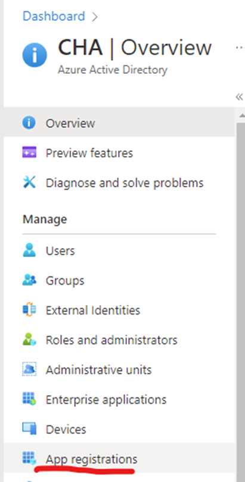

* Either choose **New registration** to create a new application or choose an existing application. (If you choose an existing application, skip the next step.)
* In the **Register an application** pane, specify the following:
  * A **Name** for the application (displayed when users sign in).
  * The **Supported account type**.
  * A **Redirect URI** value. This value is option.
* From the application pane:
  * Note the **Application (client) ID** value.
  * Select **API permissions**.

From the **API permissions** pane, choose Add a permission > Microsoft APIs > Microsoft Graph. Then, select the type of permissions your application requires. For ServiceNow, I have the following permissions:

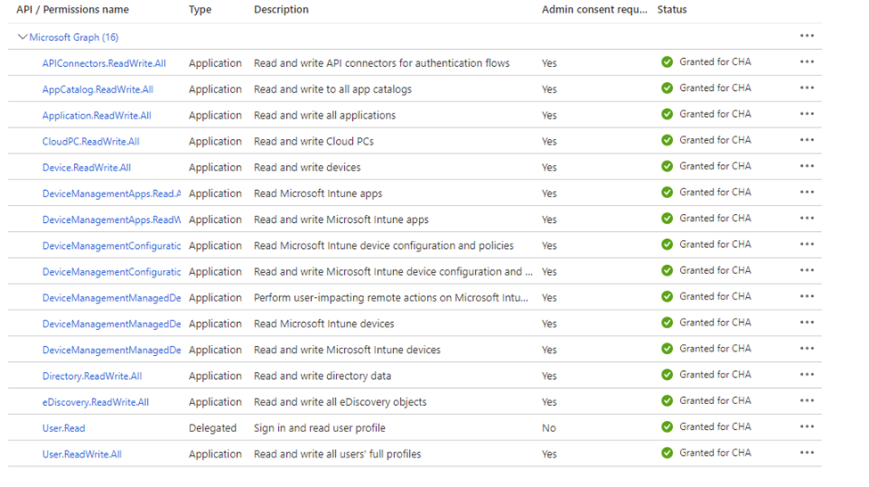

## Create the Application Secret:

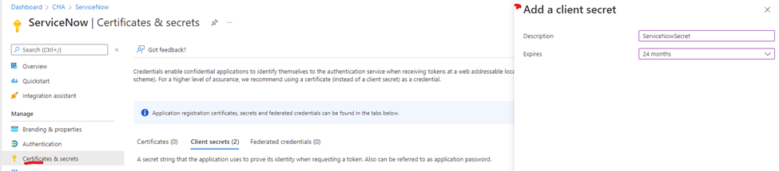

* Once the app is registered in Azure, write down the following information:
Application Secret
  * Tenant ID
  * Client ID

## Authentication

In the Microsoft documentation, they tell us to use OAuth2.0 to authenticate. First, let’s make sure your instance has OAuth2.0 enabled. Go in to your system properties, and make sure `com.snc.platform.security.oauth.is.active` is set to true.

## Procedure

* On the **ServiceNow console**, in the **Filter** navigator, type **sys_properties.list** and press the **Enter** key.
* On the **System Properties** window, search for **com.snc.platform.security.oauth.is.active** and verify if the value is set to true.

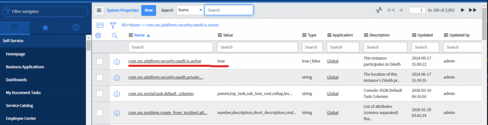

If the entry does not exist:

* Enter **sys_properties.list** in the Workspace filter navigator of ServiceNow and click **New**.
* Fill out the form with the following settings:
  * **Name**: com.snc.platform.security.oauth.is.active
  * **Type**: true | false
  * **Value**: true
* In your ServiceNow instance, lets create an application registry. Navigate to System OAuth > Application Registry. Here are the fields you need to fill out:

| Field | Value |
|-------|-------|
|Name|Azure Authentication (can be anything)|
|Client ID|Azure App client ID|
|Client Secret|Azure App secret|
|Default Grant Type|Client Credentials|
|Token URL|https://login.microsoftonline.com/{tenantID}/oauth2/v2.0/token|
|Redirect URL|https://instance-name.service-now.com/oauth_redirect.do|

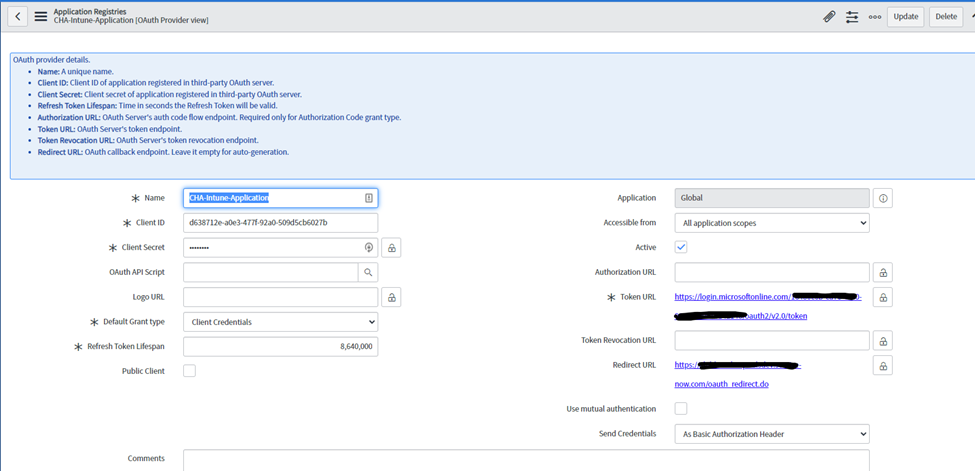

* Now you will have to create an OAuth Entity Profile and choose the provider you just created. Once this is done, you will need to create the OAuth Entity Scope. The OAuth scope is `https://graph.microsoft.com/.default`.

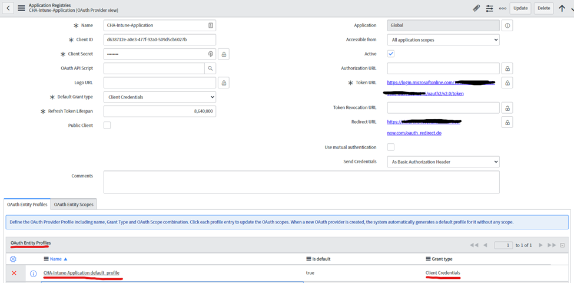

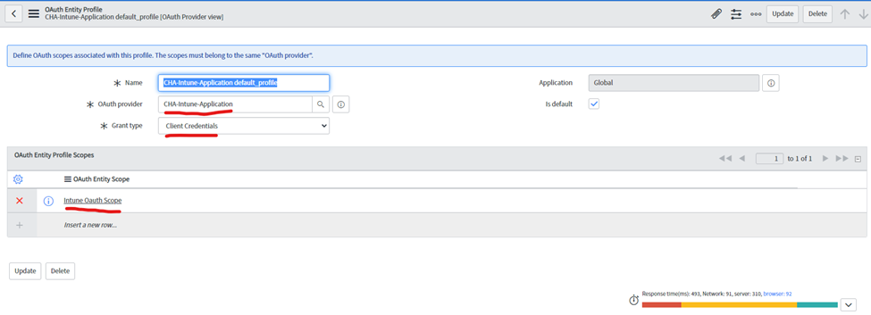

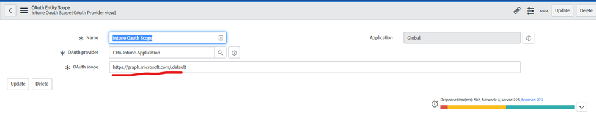

## Get the Payload

We will now test the connection by generating a token with your application registry. Navigate to System Web Services > REST Messages and create a new one. Name the message anything you want, and add a description. The endpoint URL is what you can change depending on what information you need. Follow this link to find more managedDevice methods in the graph API.

For this guide, I want to list all devices in my environment. So the URL I will use is: `https://graph.microsoft.com/beta/deviceManagement/managedDevices`.

* Select OAuth2.0 as the authentication type, and choose your profile you created above. Once complete, click the “Get OAuth Token” related link and make sure the OAuth2.0 flow completes. If it fails, you will need to double check your configuration in the registry you made.
* After you have received the OAuth token, you can now test your REST message. Scroll down to HTTP Methods and open your Default GET record (you shouldn’t have to change anything on this record, but make sure it is a GET request). Scroll down and click the Test related link.

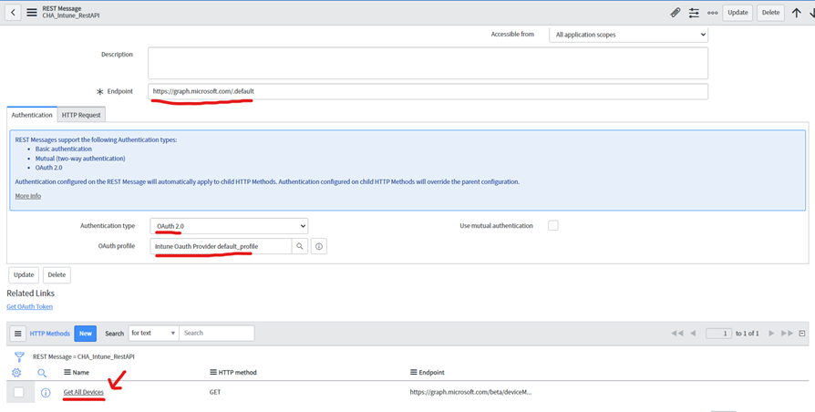
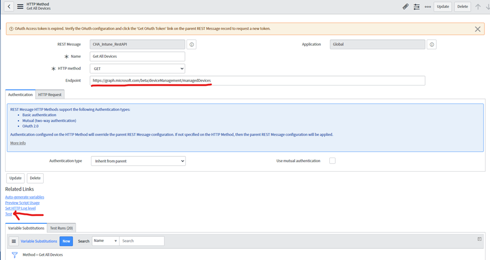

## Prepare for import

Once we have the JSON payload, we will need to create an import set table for these objects to import into. Copy/paste the payload(from the “test” link you just clicked in to any online [JSON beautifier](https://codebeautify.org/jsonviewer) tool, then convert one of the objects in the payload in to a CSV file. Here is an example of what your payload should look like.

```json
{
      "id": "",
      "userId": "",
      "deviceName": "",
      "managedDeviceOwnerType": "",
      "enrolledDateTime": "",
      "lastSyncDateTime": "",
      "operatingSystem": "",
      "complianceState": "",
      "jailBroken": "",
      "managementAgent": "",
      "osVersion": "",
      "easActivated": ,
      "easDeviceId": "",
      "easActivationDateTime": "" 
      ...etc
 }
```

[Intune Import Download](intune_import.csv)

Now we will [convert this to a CSV file](https://json-csv.com/). The point to this step is so the import set table has the correct fields for us to map to.

Once you have the CSV file, go to **Load Data** in the navigator and create a new table. Name it whatever you’d like, but remember it. Upload the CSV file you made and make sure the import set table has all the fields you want to map to from the payload.

## Import the devices

Create a scheduled job to run the REST message.

You can decide on how you want to classify your CI’s in your CMDB. In my payload, I only have one class (Windows) however if you have more than one class,  you will need to create additional jobs to those respectful classes. There are alternative ways of classifying your devices into ServiceNow, this is just the way I went about it.

Go to **System Definition > Scheduled Jobs** and create a new scheduled job. I have it set to run daily and I’ve named it “Get Windows devices from Intune”. Here is the script for the scheduled job:

```js
try {
    var machines = [];

    function getMachines(endpoint, machines) {
        gs.info('in getMachines with endpoint: ' + endpoint);
        var pagedR = new sn_ws.RESTMessageV2('CHA_Intune_RestAPI', 'Get All Devices'); // Replace the first parameter with the name of your REST message.
        if (endpoint !== null) {
            pagedR.setEndpoint(endpoint);
        }
        var pagedResponse = pagedR.execute();
        var pagedResponseBody = pagedResponse.getBody();
        var pagedhttpStatus = pagedResponse.getStatusCode();
        gs.info('windowsMachine response Status: ' + pagedResponseBody);
        var pagedObj = JSON.parse(pagedResponseBody);
        var newMachines = pagedObj.value.filter(function(device) {
            //This is the snippet that filters out only Windows devices. Hence the Windows only shceduled job.
            if (device.operatingSystem == "Windows") {
                return true;
            } else {
                return false;
            }
        });
        gs.info(endpoint + ' : ' + newMachines.length);
        machines = machines.concat(newMachines);
        if (pagedObj["@odata.nextLink"]) { // if it has paged results
            getMachines(pagedObj["@odata.nextLink"], machines);
        } else {
            gs.info('machines.length: ' + machines.length);
            machines.forEach(function(machine) {
                gs.info('in foreach');
                var intuneImport = new GlideRecord('u_cha_intune_import_data'); // Replace with your Import set table name
                intuneImport.initialize();

                //Set each field in the table to the correct data from payload
                for (var key in machine) {
                    if (machine.hasOwnProperty(key)) {
                        var field = key.toLowerCase();
                        var value = (function() {
                            if (typeof machine[key] === "number") {
                                return machine[key].toString();
                            } else {
                                return machine[key];
                            }
                        })()

                        var actualField = 'u_' + field;
                        if (intuneImport.isValidField(actualField)) {
                            gs.info('setting (short)[' + actualField + ']:' + value);
                            intuneImport.setValue(actualField, value);
                        } else {
                            var begin = field.substring(0, 12);
                            var end = field.substring(field.length - 14, field.length);
                            var calculatedField = 'u_' + begin + '_' + end;
                            gs.info('setting (long)[' + calculatedField + ']:' + value);
                            intuneImport.setValue(calculatedField, value);
                        }
                    }
                }

                intuneImport.insert();
            });
        }
    }

    getMachines(null, machines);
} catch (ex) {
    var message = ex.message;
    gs.info('ERROR: ' + message);
}
```

**Make sure you replace line 6 with your REST message, and line 31 with your import set table name. In my case:**

> Line 6: CHA_Intune_RestAPI
> 
> Line 31: u_cha_intune_import_data

This script is essentially calling the REST message you created, parsing the payload, creating a record for each device from your payload, and finally importing them into your import set table.

## TRANSFORMING YOUR CIS INTO THE CMDB
Finally, you will need to create a transform map for your import set table. Navigate to **System Import Sets > Create Transform Map**. Name it anything you’d like and choose your import set table as the source table. The target table should be the CMDB table you want to import the devices into. Map the appropriate fields from the import set table to the CMDB table and make sure you set a coalesce on a field that is unique to each device. I used serial_number.

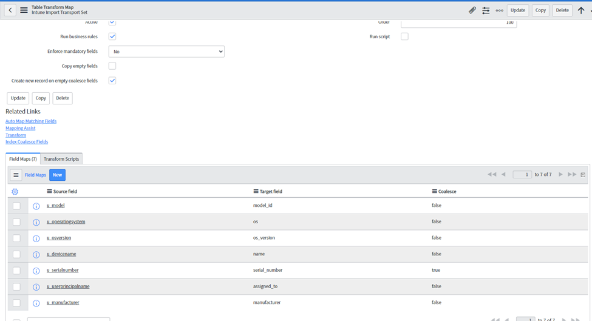

Hopefully some of this made sense and you were able to piece together a working solution to grab these assets. This is my first entry so forgive me if anything was missing. Always feel free to reach out on the WinAdmins discord (https://discord.gg/winadmins)or you can PM me directly on Discord (Deemer#1337)

## Credit:

* [Integrating Microsoft Intune with ServiceNow | (mavembry.info)](https://mavembry.info/post/intune-servicenow-integration/)
* [How to use Azure AD to access Intune APIs in Microsoft Graph – Microsoft Intune | Microsoft Docs](https://docs.microsoft.com/en-us/mem/intune/developer/intune-graph-apis)
