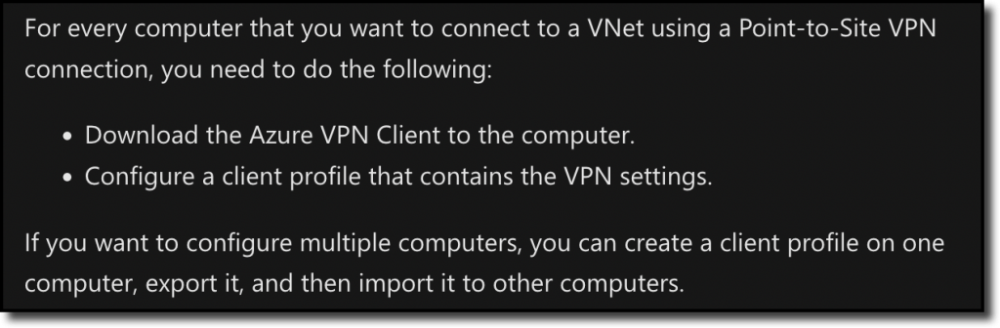
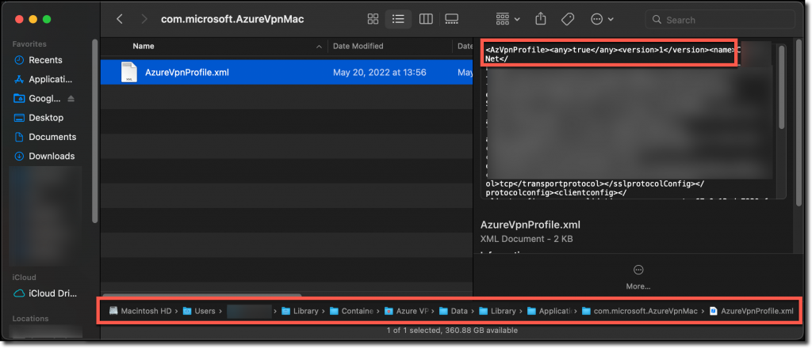
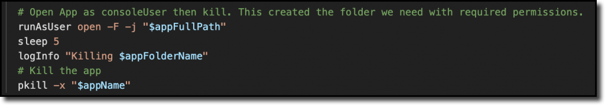
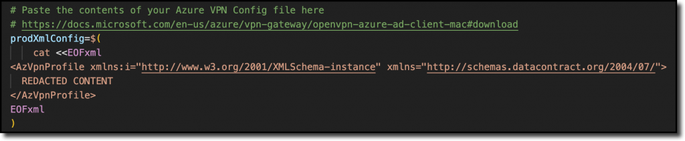

App deployment for any computer, Windows or Mac, can be challenging. Widely used apps like Google Chrome are well-developed with options to automate and configure using scripts, MDM config profiles, or even back one-liner terminal commands.

When you encounter an app that has little-to-no documented parameters or configurations, it can be frustrating. I choose to look at it as a challenge. Using any tools or ideas available, it’s easy for me to become engrossed in finding an automatable solution.

Enter Azure VPN Client for macOS.

## Azure VPN Client for Mac

We recently had a requirement to quickly switch our VPN client and the easiest option to setup was an Azure VPN Gateway for Point-to-Site (P2S) connections. Once the gateway was built and tested, it was my turn to automated it for deployment via our MDM, Mosyle. This process should be easily incorporated into any modern MDM (like Jamf, Kandji, Addigy, JumpCloud) that can deploy scripts or custom PKGs.

Diving in to Microsoft’s documentation, they make it pretty clear that when using the Azure VPN connection with Azure AD Authentication that only Windows devices enrolled in Intune can use the configuration without the Azure VPN Client app:

> Azure AD authentication is supported only for OpenVPN® protocol connections and requires the Azure VPN Client.
> 
> [Configure an Azure VPN Client – Azure AD authentication – macOS](https://docs.microsoft.com/en-us/azure/vpn-gateway/openvpn-azure-ad-client-mac)

Additionally, this little note was quite disconcerting:

Reading that, it’s clear that Microsoft did not develop a method for mass deployment of the VPN configuration to users, so I was in for a challenge.

## Guess and Check

I really hope I’m not the only one, but when I encounter situations like this with limited-to-no documentation or outright statements saying automation isn’t supported, I go straight for the guess-and-check model.

Given my relative inexperience with the more in-depth macOS concepts, I assumed the only way to configure the VPN settings would be an undocumented `.plist` (similar to a .config or .ini file with some Windows apps). I hunted around in the usual locations:

* `/Library/Preferences`
* `~/Library/Preferences (/Users/$userName/Library/Preferences)`

No such luck. There were no `.plist` files for anything Azure VPN related. But I was not out of options.

## Possible Solution

My coworker, [Dustin](https://twitter.com/dustinmcn), found that Azure VPN Client modifies, but stores, the XML config file!

* `~/Library/Containers/com.microsoft.AzureVpnMac/Data/Library/Application Support/com.microsoft.AzureVpnMac/`

By poking around with `grep -r` he found a log file for the client (`~/Library/Group Containers/UBF8T346G9.group.com.microsoft.AzureVpnMac.shared/LogFiles/AzureVpnClient.log`) which led to the folder where the XML is stored:

`~/Library/Containers/com.microsoft.AzureVpnMac/Data/Library/Application Support/com.microsoft.AzureVpnMac/`

## Testing It Out

Starting with a clean slate, I installed the [Azure VPN Client](https://apps.apple.com/us/app/azure-vpn-client/id1553936137?mt=12) to a test machine using Mosyle MDM.

Before launching the app, I checked to see if the folder Dustin found was created upon install, but it wasn’t. Next, I launched the App and the folder was created. So I can either pre-create the folder at install or launch the app and allow it to create the folder.

Being a novice with Bash and POSIX-anything, I started with a simple `mkdir ~/Library/Containers/com.microsoft.AzureVpnMac/Data/Library/Application Support/com.microsoft.AzureVpnMac/`, copied the XML manually to that folder, then launched Azure VPN Client. No profile showed up. I assume it’s a permission issue, so again with Dustin’s help, checked folder permissions and found nothing unusual (`ls -l $folder`), but did discover special attributes (`xattr -l $folder`):

Unfortunately, pre-creating the folder with matching permissions and custom `xattr` still didn’t work.

Some quick Googling brought me to this [Scripting OSX article for executing commands as the logged-on user](https://scriptingosx.com/2020/08/running-a-command-as-another-user/). We can now use the `open` command in that function and briefly launch the app, hide it, and then kill it:

A few quick tests shows that this works!

The last step I wanted is for the script to be self-contained to avoid needing a separate file uploaded or packaged. To accomplish that, we use a combination of `cat` with a here-string to echo the contents of the VPN config .xml file into a variable so it can be written to the destination folder:

Now to put it all together.

## Assembling the Script

Borrowing some nifty logging functions from Brock Walters ([LinkedIn](https://www.linkedin.com/in/brock-walters-247a2990) or [JamfNation](https://community.jamf.com/t5/user/viewprofilepage/user-id/46638)), I put together a script that does several things:

1. Logs the script actions
2. Echos the log actions to the pipeline
   1. This is specific to my MDM, Mosyle, which captures the output to the console for easy remote troubleshooting.
3. Holds .xml file contents in the script itself
4. Check that Azure VPN Client is installed
5. Check that the folder is created when launching the client
6. Remove any previous profiles in the folder
7. Write the file to the folder

[Azure VPN Client configuration script | @hykstar35](https://github.com/hkystar35/MDM/blob/main/Apple/Scripts/Set-AzVpnConfig.sh)

It’s entirely possible to package this up in a PKG, though I don’t know that I’d advise that since Microsoft only officially publishes the Mac app in the App Store, meaning installs and updates are handled there but require either an Apple ID signed into each Mac or the app pushed from your MDM via Apple Business Manager’s VPP token connection.

## Conclusion

We’ve all been asked to automate, script, or do things that initially seem impossible or impractical, but it’s important try. Not just because your boss asks you to, but to continue to hone and build your skills and further your career prospects. If you also remember to Under Promise and Over Deliver, you’re more likely to benefit when it comes to performance reviews, bonuses, or even new job opportunities.
