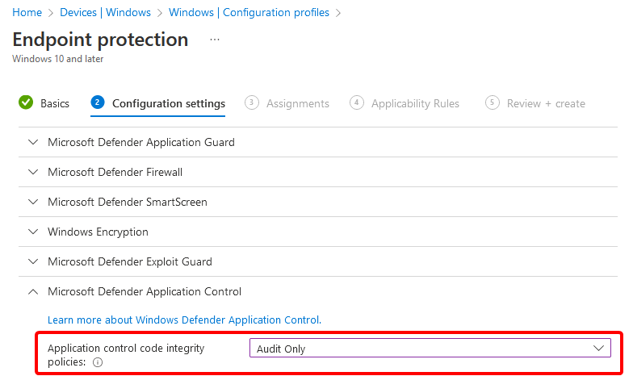

Businesses pay tens of thousands of $currency for Microsoft Partner consultants to come in, "_modernise_" their EUC estate, and leave behind a plethora of bugs and issues that shouldn't exist because said partners are supposed to be "industry experts".

Completely unrelated, an issue I was working on at a client was with their Autopilot setup left behind from an MS partner that was causing a forced reboot mid-ESP.
Shortly after entering company credentials, there would be a 10 minute reboot warning and no way to cancel - other than Shift+F10 and running `shutdown -a` which a normal end user wouldn't know and shouldn't need to know.  
Unfortunately, if the reboot continued, it often left the device in a boot-loop. The build engineer at the time didn't know any other way to break out of it other than rebuild from vanilla Windows media.

This was the first time I'd ever come across the issue, but didn't take long to find other people with the same issue online.  
The reboot was caused by a Configuration Profile for Endpoint Protection that turned on WDAC in Audit Mode.


There are various notes on [Microsoft Learn: Deploy WDAC policies with MDM](https://learn.microsoft.com/en-us/windows/security/threat-protection/windows-defender-application-control/deployment/deploy-windows-defender-application-control-policies-using-intune#use-intunes-built-in-policies) about issues and caveats with WDAC policies. One specifically about forced reboots:

> Intune currently uses the AppLocker CSP to deploy its built-in policies. The AppLocker CSP will always request a reboot when applying WDAC policies. You can use Intune's custom OMA-URI feature with the ApplicationControl CSP to deploy your own WDAC policies rebootlessly.


I have since fixed the issue now with a custom OMA. But a few weeks later, a colleague shared a [twitter post](https://nitter.net/BruceSaaaa/status/1632851267968983041) where the guy was having reboots mid-autopilot also.

[Paul Winstanley](https://nitter.net/SCCMentor "Paul Winstanley - MVP") and [Mattias Melkersen](https://nitter.net/MMelkersen "Mattias Melkersen {MVP}") both pointed out in the thread that there is a nice list of OMA-URIs which will always cause reboots when applied, and it's available in the registry for all to see:
`HKEY_LOCAL_MACHINE\SOFTWARE\Microsoft\Provisioning\SyncML\RebootRequiredURIs`

```
RebootRequiredURIs

./Device/Vendor/MSFT/Accounts/Domain/ComputerName
./Device/Vendor/MSFT/Policy/Config/Connectivity/AllowUSBConnection
./Device/Vendor/MSFT/Policy/Config/DeviceGuard/ConfigureSystemGuardLaunch
./Device/Vendor/MSFT/Policy/Config/DeviceGuard/EnableVirtualizationBasedSecurity
./Device/Vendor/MSFT/Policy/Config/DeviceGuard/LsaCfgFlags
./Device/Vendor/MSFT/Policy/Config/DeviceGuard/RequirePlatformSecurityFeatures
./Device/Vendor/MSFT/Policy/Config/DmaGuard/DeviceEnumerationPolicy
./Device/Vendor/MSFT/Policy/Config/ExploitGuard/ExploitProtectionSettings
./Device/Vendor/MSFT/Policy/Config/MixedReality/HeadTrackingMode
./Device/Vendor/MSFT/Policy/Config/Notifications/DisallowCloudNotification
./Device/Vendor/MSFT/Policy/Config/Notifications/DisallowTileNotification
./Device/Vendor/MSFT/Policy/Config/Notifications/WnsEndpoint
./Device/Vendor/MSFT/Policy/Config/ServiceControlManager/SvchostProcessMitigation
./Device/Vendor/MSFT/Policy/Config/Start/HideChangeAccountSettings
./Device/Vendor/MSFT/Policy/Config/Start/HideHibernate
./Device/Vendor/MSFT/Policy/Config/Start/HideLock
./Device/Vendor/MSFT/Policy/Config/Start/HidePowerButton
./Device/Vendor/MSFT/Policy/Config/Start/HideRestart
./Device/Vendor/MSFT/Policy/Config/Start/HideShutDown
./Device/Vendor/MSFT/Policy/Config/Start/HideSignOut
./Device/Vendor/MSFT/Policy/Config/Start/HideSleep
./Device/Vendor/MSFT/Policy/Config/Start/HideSwitchAccount
./Device/Vendor/MSFT/Policy/Config/Start/HideUserTile
./Device/Vendor/MSFT/Policy/Config/Start/ImportEdgeAssets
./Device/Vendor/MSFT/Policy/Config/Update/ManagePreviewBuilds
./Device/Vendor/MSFT/Uefi/Identity/Apply
./Device/Vendor/MSFT/Uefi/Identity2/Apply
./Device/Vendor/MSFT/Uefi/Permissions/Apply
./Device/Vendor/MSFT/Uefi/Permissions2/Apply
./Device/Vendor/MSFT/Uefi/Settings/Apply
./Device/Vendor/MSFT/Uefi/Settings2/Apply
./Device/Vendor/MSFT/WindowsDefenderApplicationGuard/InstallWindowsDefenderApplicationGuard
```

Obviously, in my case, the offending reboot would have been caused by: `./Device/Vendor/MSFT/WindowsDefenderApplicationGuard/InstallWindowsDefenderApplicationGuard`

Mystery solved!
