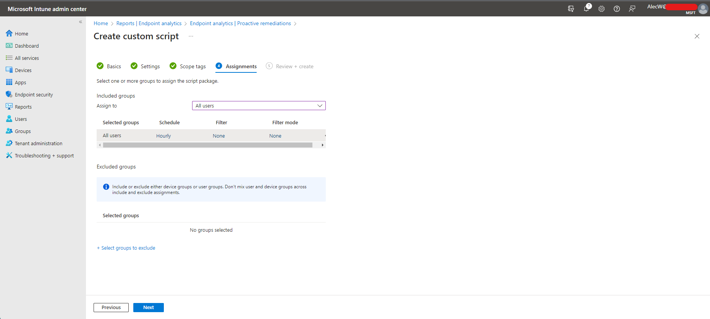

OneDrive is an amazing product. It allows you to separate what's important, the data, from the tools used to transform the data,the computer. 
Your CEOs laptop got dropped in a bathtub? No Problem. Hand them a laptop with Intune & Autopilot and they'll be back up and running within an hour or so WITH all of their files. Despite it's integral part to modern device management it has a few quirks that can make it a difficult product to administrate at times. Today I will be talking about 1 of them.
&nbsp;&nbsp;  
&nbsp;&nbsp;  
&nbsp;&nbsp;  
&nbsp;&nbsp;  

## The Problem Defined

1. You have frontline workers who you want to use OneDrive to ease the pain of computer transfers, and perform pseudo backup functionality.
2. These frontline may have stretches of limited connectivity.
3. Organizationally or otherwise it's not possible to deal with the consequences of a user not having access to files in their desktop or documents folder. 
4. You can't disable Files on Demand because they need to sync or create a shortcuts to internal Sharepoint sites. Without Files on Demand the whole Sharepoint library will be downloaded
5. Training users to pin ("Always keep on this device") their files, while the best solution, is not good enough due to #3.

&nbsp;&nbsp;  
&nbsp;&nbsp;  
&nbsp;&nbsp;  
&nbsp;&nbsp;  

## With that Said how do we fix that?

As a starting point I came across Florian Salzmann's solution which is to check the Pinned and Unpinned file attributes on all files using attrib.exe and set them if needed.
You can read more about his solution [here](https://scloud.work/en/onedrive-desktop-offline). While this is a perfectly fine solution I've never been a big fan of wrapping binaries in regex for powershell scripts unless absolutely necessary. 
Can we do this in native PowerShell?

### The Dive 🤿

⚠️ This section is going to be about the discovery process of working with extended attributes, and writing the Proactive Remediation. if all you want is the completed PR skip to the bottom. 

I sought out more or less the same solution but to use native methods to achieve the needed functionality. If setting an attribute threw an error I wanted to be able to make a note of that without having to do additional text processing.
We know that OneDrive pinning is controlled by the Pinned and Unpinned attributes let's explore how to set attributes using PowerShell.
[A bit of background research](https://devblogs.microsoft.com/scripting/use-a-powershell-cmdlet-to-work-with-file-attributes/) shows us that file attributes are simply a property on file([FileInfo](https://learn.microsoft.com/en-us/dotnet/api/system.io.fileinfo?view=netframework-4.8))/Folder([DirectoryInfo](https://learn.microsoft.com/en-us/dotnet/api/system.io.directoryinfo?view=netframework-4.8)) objects that can be returned using [Get-Item](https://learn.microsoft.com/en-us/powershell/module/microsoft.powershell.management/get-item?view=powershell-5.1).

Knowing that, let's create a test environment with a file that is pinned (always keep on this device), a file that is unpinned (free up space) and a file that is neither.

Let's now try to get the attributes.

Well that's a bit unexpected.
Looking back at our [previous research](https://devblogs.microsoft.com/scripting/use-a-powershell-cmdlet-to-work-with-file-attributes/) the file attributes are contained in the [FileAttributes Enum](https://learn.microsoft.com/en-us/dotnet/api/system.io.fileattributes?view=netframework-4.8)

There is No Pinned or Unpinned attribute defined. What's going on here?  
Let's take a step back. What are file attributes anyway?
File attributes are essentially metadata flags that are represented in a bitmask format. You can think of a bitmask as a virtual DIP switch  
Where each switch is represented as a power of 2 (2,4,16) (AKA a binary BIT) and as such the entire state can be represented by a single number that is the addition of all switches


```Archive (32) + ReparsePoint (1024) = 1056``` or ```000000000000000000010000100000``` .
Yet the attributes Pinned or Unpinned are not defined in our FileAttributes Enum. Only some of our virtual DIP switch settings are defined in this class.
After way too much time spent googling, I found some documentation to help us reach our goal.
- [Our Extended Attribute Definitions](https://learn.microsoft.com/en-us/windows/win32/fileio/file-attribute-constants)
- [Enumeration types as bit flags](https://learn.microsoft.com/en-us/dotnet/csharp/language-reference/builtin-types/enum#enumeration-types-as-bit-flags)
- [Some powershell examples of attribute manipulation from ss64](https://ss64.com/ps/syntax-attrib.html)
 
Following the enum types documentation, we can create an enum with the [flags] argument. 
Let's define our own enum containing all possible attributes and enter this into our PS console:
```powershell
[Flags()]
enum FileAttributesEX {
    ReadOnly = 0x00000001
    Hidden = 0x00000002
    System = 0x00000004
    Directory = 0x00000010
    Archive = 0x00000020
    Device = 0x00000040
    Normal = 0x00000080
    Temporary = 0x00000100
    SparseFile = 0x00000200
    ReparsePoint = 0x00000400
    Compressed = 0x00000800
    Offline = 0x00001000
    NotContentIndexed = 0x00002000
    Encrypted = 0x00004000
    IntegrityStream = 0x00008000
    Virtual = 0x00010000
    NoScrubData = 0x00020000
    EA = 0x00040000
    Pinned = 0x00080000
    Unpinned = 0x00100000
    RecallOnOpen = 0x00040000
    RecallOnDataAccess = 0x00400000
}
```
Now when we get our file attributes, let's recast them to our custom enum

Great!, but why does the Unpinned file have so many attributes? Well to cut to the chase most of these other attributes are attributes OneDrive manages, such as Offline notates the file is off of disk, RecallOnDataAccess notates that there is a time penalty to opening this file... After OneDrive picks up on the Pinned/Unpinned it will set/unset these flags as it moves them on or off the disk. These details might be interesting to examine at another time but it's not what we are here for. We just need to Set the Pinned and Unpinned attributes and the OneDrive client will take care of the rest.

How can we do that?

We can do that by manipulating the bitmask through bitwise operations.
 
- Bitwise AND or `-band`: Our comparison operator. By itself on a bitmask of powers of 2, comparison against a power of 2 will always be 0 ( is unset) or the same power ( is set).
- Bitwise OR  or `-bor`: Our on toggle. If an attribute isn't set this will set it. It won't turn an attribute off if it is on
- Bitwise XOR or `-bxor`: Our Flip flop operator. If an attribute is on this will turn it off and if it is off it will turn it on
- Bitwise NOT or `-band` : Invert our bits, combined with bitwise and this can be a off toggle.

If your unfamiliar with bitwise operators and would like to learn *how* they work. I recommend checking out this [video](https://www.youtube.com/watch?v=igIjGxF2J-w) by Alex Hyett,
Or Watching Ben Eater's [Series](https://www.youtube.com/watch?v=HyznrdDSSGM&list=PLowKtXNTBypGqImE405J2565dvjafglHU) On building an 8-bit computer from scratch to learn more about low level programming in general.

You may be wondering *why* windows uses bitmasks for file system attributes and it's a matter of efficiency. Bitmask are very efficient in speed and size and this matters when this applies to every single file and folder on the system.


As you can see from our examples `-band` and `-bnot` together *only* unset an attribute.

Let's now use `-bor` to set the Pinned attribute.


As you can see from the example bitwise OR always sets an unset attribute and has no effect on a set attribute.
This is pretty convenient as `-band`,`-bnot` and `-band` are the operators that we need. We can completely ignore the more troublesome `-bxor` which would toggle attributes expectantly if we were not careful to check the state ahead of time.

## Writing the Remediation

Let's first start with our detection script.

**Step 1:**  
Get the location of the Desktop & Documents folder and make sure KFM is on. If KFM is not on then nothing to do, exit cleanly

```powershell
    $ErrorActionPreference = 'Stop'
    # Get Folder Paths
    $Desktop = Get-Item ([System.Environment]::GetFolderPath('Desktop'))
    $Documents = Get-Item ([System.Environment]::GetFolderPath('MyDocuments'))
    if (($null -eq $Desktop) -OR ($null -eq $Documents)) {
        Write-Error "Could Not Find Desktop Or Documents Folder"
        exit 99
    }
# Verify KFM is On
# If Documents or Desktop are not in OneDrive then we don't need to pin them
if (($Desktop.FullName -notmatch "OneDrive") -OR ($Documents.FullName -notmatch "Onedrive")) {
    Write-Output "NOKFM"
    exit 0
} 
```

**Step 2:**  
The Preconditions have been met so let's define our attribute Enum

```powershell
[Flags()]
 enum FileAttributesEX {
     ReadOnly                  = 0x00000001
     Hidden                    = 0x00000002
     System                    = 0x00000004
     Directory                 = 0x00000010
     Archive                   = 0x00000020
     Device                    = 0x00000040
     Normal                    = 0x00000080
     Temporary                 = 0x00000100
     SparseFile                = 0x00000200
     ReparsePoint              = 0x00000400
     Compressed                = 0x00000800
     Offline                   = 0x00001000
     NotContentIndexed         = 0x00002000
     Encrypted                 = 0x00004000
     IntegrityStream           = 0x00008000
     Virtual                   = 0x00010000
     NoScrubData               = 0x00020000
     EA                        = 0x00040000
     Pinned                    = 0x00080000
     Unpinned                  = 0x00100000
     RecallOnOpen              = 0x00040000
     RecallOnDataAccess        = 0x00400000
 }
```
**Step 3:**  
Let's check if Desktop & Documents are unpinned

```powershell
$DesktopIsPinned = ($Desktop.Attributes -band [FileAttributesEX]::Pinned) -eq [FileAttributesEX]::Pinned.Value__
$DesktopIsUnPinned = ($Desktop.Attributes -band [FileAttributesEX]::Unpinned) -eq [FileAttributesEX]::Unpinned.Value__
$DocumentsIsPinned = ($Documents.Attributes -band [FileAttributesEX]::Pinned) -eq [FileAttributesEX]::Pinned.Value__
$DocumentsUnIsPinned = ($Documents.Attributes -band [FileAttributesEX]::Unpinned) -eq [FileAttributesEX]::Unpinned.Value__
```

**Step 4:**  
If Desktop and Documents are not pinned/unpinned exit for remediation.
  else check for each subfolder/file. If there are any folders/files not pinned/unpinned, exit for remediation

```powershell

if ($DesktopIsPinned -and $DocumentsIsPinned -and (-not ($DesktopIsUnPinned -or $DocumentsUnIsPinned))) {
    #Desktop and Documents are pinned check if Desktop subfolders and files are
    Get-ChildItem $Desktop,$Documents -Recurse | ForEach-Object {
        # Check if the item is Pinned and/or Unpinned
        $isPinned = [bool](($_.Attributes -band [FileAttributesEX]::Pinned) -eq [FileAttributesEX]::Pinned.Value__)
        $isUnpinned = [bool](($_.Attributes -band [FileAttributesEX]::Unpinned) -eq [FileAttributesEX]::Unpinned.Value__)
        if ((-not $isPinned) -or ($isUnpinned)) {
            Write-Output "SubFoldersUnpinned"
            exit 1
        }
    }
            # Got through the gauntlet everything is pinned
            Write-Output "FoldersPinned"
            exit 0 
}
else {
    Write-Output  "FoldersUnpinned"
    exit 1
}
```

Now our Remediation Script:
**Step 1:**  
So Like in our Detection Script  We will Check for KFM and Set our Attributes
```powershell
$ErrorActionPreference = 'Stop'
# Get Folder Paths
$Desktop = Get-Item ([System.Environment]::GetFolderPath('Desktop'))
$Documents = Get-Item ([System.Environment]::GetFolderPath('MyDocuments'))
if (($null -eq $Desktop) -OR ($null -eq $Documents)) {
    Write-Error "Could Not Find Desktop Or Documents Folder"
    exit 99
}
#Define Attributes
[Flags()]
enum FileAttributesEX {
    ReadOnly = 0x00000001
    Hidden = 0x00000002
    System = 0x00000004
    Directory = 0x00000010
    Archive = 0x00000020
    Device = 0x00000040
    Normal = 0x00000080
    Temporary = 0x00000100
    SparseFile = 0x00000200
    ReparsePoint = 0x00000400
    Compressed = 0x00000800
    Offline = 0x00001000
    NotContentIndexed = 0x00002000
    Encrypted = 0x00004000
    IntegrityStream = 0x00008000
    Virtual = 0x00010000
    NoScrubData = 0x00020000
    EA = 0x00040000
    Pinned = 0x00080000
    Unpinned = 0x00100000
    RecallOnOpen = 0x00040000
    RecallOnDataAccess = 0x00400000
}
```

**Step 2:**  
Then for Each Folder: Desktop, Documents. We hold the Current Folder object in a temporary variable. This is so if we throw an exception we can act on it. The `$psitem` or `$_` pipe variable gets overwritten by the exception in a try/catch statement.
We then unset the Unpinned attribute, then set the Pinned attribute. 
```powershell
# Set the Pinned attribute on the Desktop and Documents folders. Unpin if unpinned. Pinned if not Pinned
$Desktop, $Documents | ForEach-Object {
    try {
        #When an exception occurs the Current Pipe Gets overwritten. We need details of the error in our report.
        $CurrentItem = $_ 
        $CurrentItem.Attributes = ($CurrentItem.Attributes -band (-bnot [FileAttributesEX]::Unpinned)) -bor [FileAttributesEX]::Pinned
    }
    Catch {
        Write-Error "Could Not pin $($CurrentItem.Name) root...`n$_"
        exit 99
    }
}
```

**Step 3:**
Since new subfiles and folders will inherit the attributes but existing files won't we need to iterate through each subfolder/file and set them individually
We want to continue on an error, but throw an error on each file we couldn't process at the end

```powershell
 # Iterate through all items in the Desktop & Documents folder and its subfolders. Files created before the Root folder is pinned will not inherit the PINNED attribute. Hence the need.
$ErrorFiles = New-Object System.Collections.ArrayList
Get-ChildItem $Desktop.FullName, $Documents.FullName -Recurse | ForEach-Object {
    try {
        $CurrentItem = $_ 
        $CurrentItem.Attributes = ($CurrentItem.Attributes -band (-bnot [FileAttributesEX]::Unpinned)) -bor [FileAttributesEX]::Pinned
    }
    catch {
        $ErrorFiles.add($CurrentItem.FullName)
    }
}
if ($ErrorFiles.Count -ne 0) {
    $ErrorString = foreach ($File in $ErrorFiles) {
        "$($File.substring(($env:OneDrive).Length))`n"
    }
    Write-Error "These files could not be Processed: $ErrorString)"  
    exit 98
}
else {
    Write-Output "Files Pinned Successfully"
    exit 0
}
```

&nbsp;&nbsp;  
&nbsp;&nbsp;  
&nbsp;&nbsp;  
&nbsp;&nbsp;  

## Setting up the PR

You can get the completed PR from my github [here](https://github.com/awebie/Intune/tree/main/Proactive%20Remediations/OnedriveDDPinning)
Let's set it up shall we?

**Step 1:**   
In the Intune Admin Center Navigate to Reports > Endpoint Analytics > Proactive Remediations


**Step 2:**  
Name your PR


**Step 3:**  
Upload the detection and remediation scripts. Be sure to set "Run this script using the logged-on credentials"


**Step 4:**  
Setup your assignments. When your setting up your assignments you have a few choices. You could apply this to all users or just your frontline workers, you could apply the PR only once as a gentle suggestion or you can set it hourly and force it.


That's It! 🙂 
