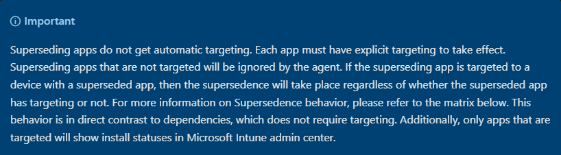
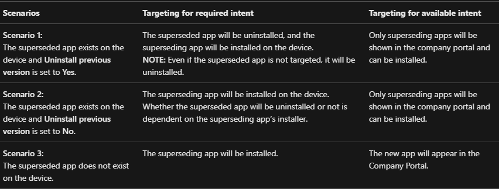
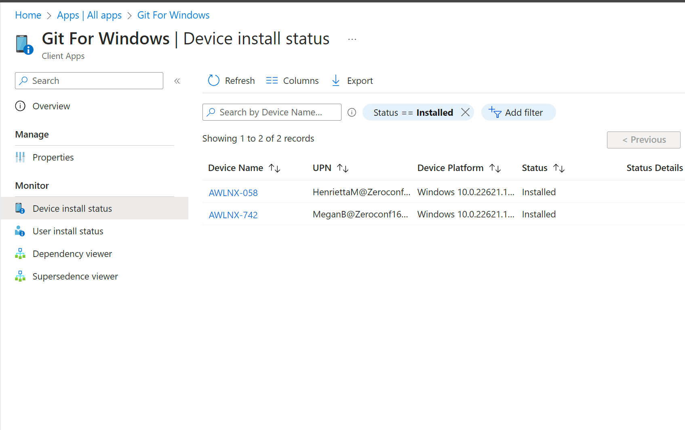
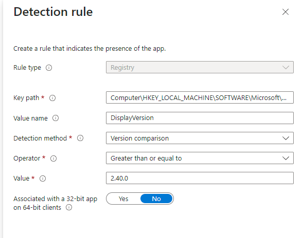
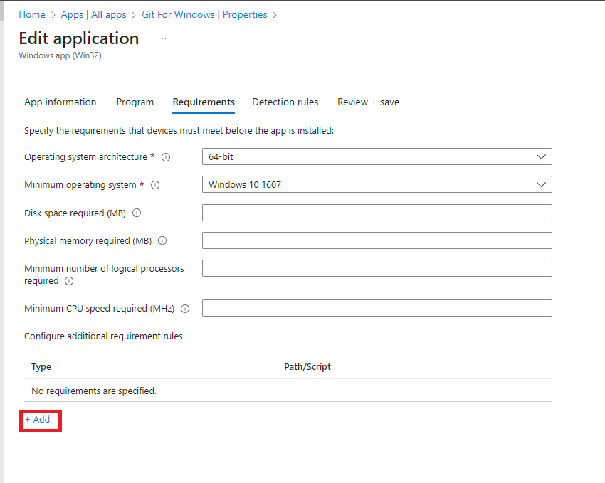
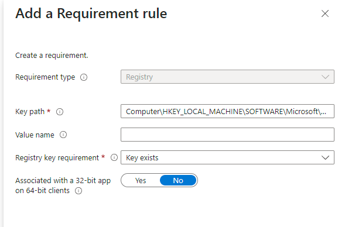
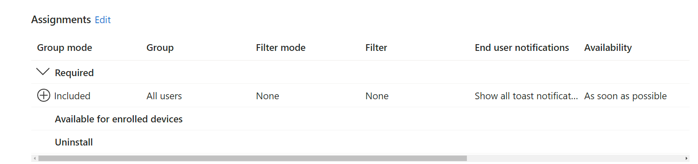
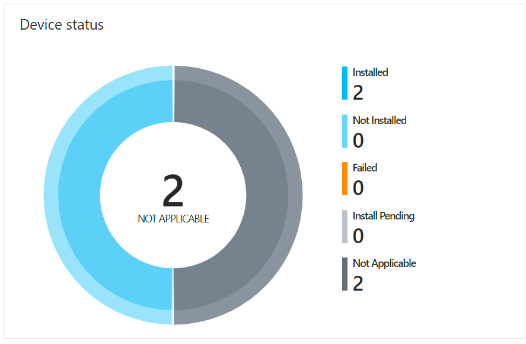
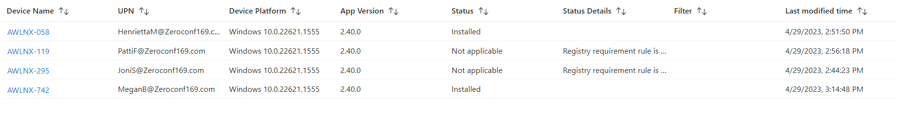
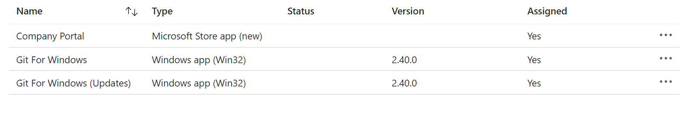

Intune is a really great software management system, but there are a few issues caused by a lack of flexibility that can give you some headaches if your just starting your Intune journey. 
Today I am going to be highlighting an issue with targeting application updates and how we can work around it.

# The Problem Defined

1. You have an application assigned to users as an available app. That means it shows up in the company portal for self service.
2. This application needs to be kept up to date for security and compliance reasons.
3. you want to maintain a self service model for initial deployment but handle any updates automatically.

&nbsp;  

How can we publish a new version of our application and force everyone who has it installed to update?  
Let's explore this.

This seems like an easy problem. Supersedence should take care of this right?  **No.**  
If your coming from MCM it might be important to note that Intune supersedence does not automatically target like MCM supersedence does.
|
|:---:|
|&nbsp;

|
|:--:|
|[source](https://learn.microsoft.com/en-us/mem/intune/apps/apps-win32-supersedence)

If we targeted all users every single user and device would get the software. That is obviously not what we want.

Supersedence is still useful if we need to uninstall the prior version before installing the new version but it otherwise does not help us. 

If supersedence is not the solution, how else can we solve the problem?

We could use Intune's device install status page to try and figure out who has it installed and make our own required app targeting to force update apps... 
|
|:--:|

However, that has its own problems.  

  1. It's difficult to manage the assignments. 
  2. This process would only handle updates once. If an older version of an app got installed, the app install would be unknown and left un-updated. 
  3. It's going to conflict with upcoming features such as the ability to uninstall apps from the company portal.

In my opinion the amount of attention and overhead this requires alone makes it not a viable solution.

The best way I've found to solve this problem is by making use of requirement rules.
Let's say we need to update any version of Git for Windows to 2.40.0.

Our detection rule for Git 2.40.0 might look like this

|
|:--|
| KeyPath : Computer\HKEY_LOCAL_MACHINE\SOFTWARE\Microsoft\Windows\CurrentVersion\Uninstall\Git_is1
| Value Name : DisplayVersion
| Detection Method :  Version Comparison
| Value : 2.40.0
| Associated with a 32-bit app on 64-bit clients : No (if 64bit OS add WOW6432Node to the keypath. Most of the time you should ignore this)

so let's add a requirement rule that will detect any version of git

|
|:---|
|
| KeyPath : Computer\HKEY_LOCAL_MACHINE\SOFTWARE\Microsoft\Windows\CurrentVersion\Uninstall\Git_is1
| Value Name : 
| Registry key requirement : Key Exists
| Associated with a 32-bit app on 64-bit client : No

Now let's assign the app to all users

|
|:---:|

and wait for the application to deploy.

|
|:--:|

|
|:--:|

Great! We've created our own method of automatic targeting. However, you might notice this breaks self service / initial deployment. Git has to already be installed for this new version to be installed. To fix this we need to upload the application again and assign it as an available app. Then for clarity I would put (updates) in the name of our forced updater app.

|
|:--:|

Is this an ideal process?
No, what we really need is automatic assignment for supersedence like MCM has. This is the best method that _I_ know of. If you think you've solved this in a better way, comment down below! Otherwise double it and give it to the next admin. 😉  