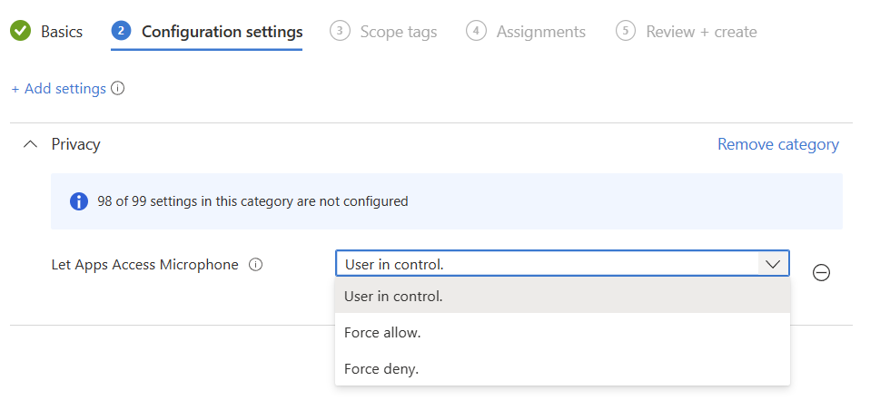
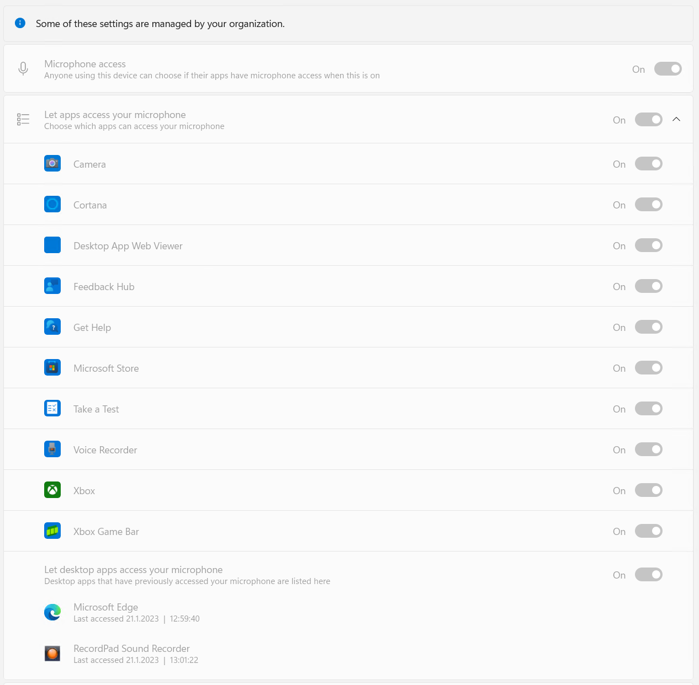

# Where is mike?

User reports that voice calls in teams no longer worked.
The user claimed that he hadn't changed anything. Leaving us to figure this out ourselves, so we did the usual troubleshooting, trying a new headset, trying to use the browser based teams client.

eventually we stumbled upon the culprit, we looked at the microphone settings under the "Security & Privacy" section in the Windows 11 settings app:

the user had some how flipped the switch for "Let desktop apps access your microphone" to off, effectively disabling all microphone access for all win32 based apps on the system (which is why teams app and teams in browser stopped working)

This was easy enough to fix, but i wanted to prevent this issue from happening again.

# Googling
Like all of us, i started by googling the issue, and sure enough i found a few blogs mentioning how to change this in the registry
This specific path is for the microphone, you can find the camera and location settings there as well.

`"Computer\HKEY_CURRENT_USER\Software\Microsoft\Windows\CurrentVersion\CapabilityAccessManager\ConsentStore\microphone"`
Just flip this to allow and all is well again

# The Settings Catalog
Writing scripts to change the registry has its place, but surely the settings catalog in intune has some solutions to this problem?
### All Apps

in the privacy category in the settings catalog you will find "Let Apps Access Microphone"

The options mostly explain themselves, but keep in mind that the force allow or deny applies to all apps, win32 and store alike, and you simply might not want that for some reason

"Force allow" results in this:

### Specific Apps
But what if you want to control the microphone access for specific apps?

there is a setting for that!

but what are you supposed to add to that list? The official documentation didn't seem to offer much help, but perhaps we can try that app list we found in the registry

pretty easy, just copy the store app name to the list
but take note of the "NonPackaged" app, that is to allow all the win32 apps on the system, there is no granular control for those, its all or nothing.

Once the policy applies we can see this on our devices:

a lot easier to control than deploying scripts that set the registry don't you think?